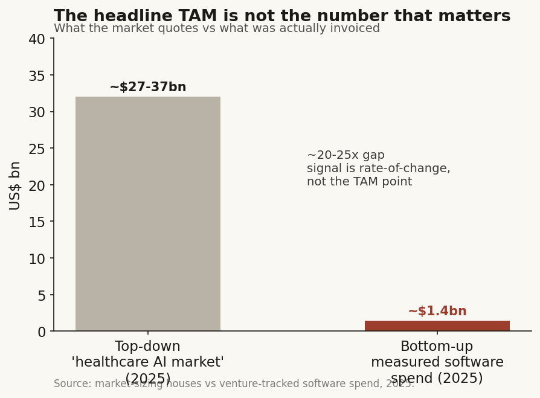
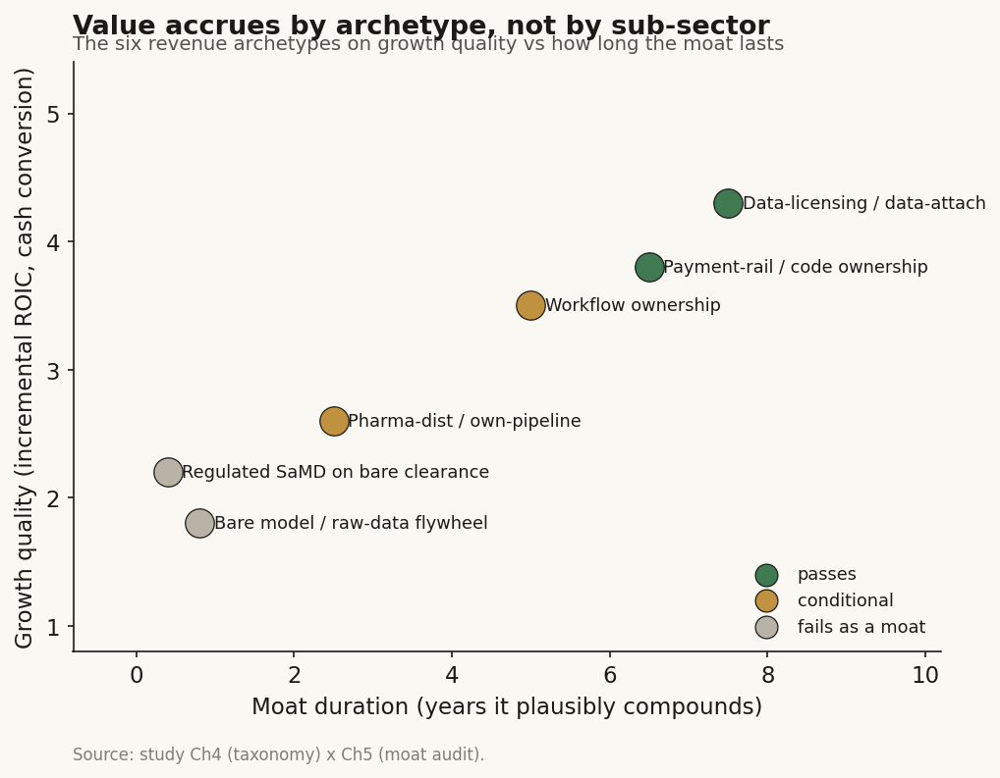

# Healthcare AI research: how the field actually works (US and Taiwan)

**What this is.** I spent a while trying to understand healthcare AI from one end to the other, and this is my write-up of what I found. Not a single application, the whole field: the global trend, the companies and what they actually do day to day, how they make money, who the players are and how they connect to each other, what protects the good ones from being copied, the rules they have to live under, and the size of the thing. I looked hardest at two markets, the US and Taiwan.

**The question I used to hold it together.** Trying to understand a whole field can turn into a shapeless list of company names. So I hung the whole thing on one question, sharp enough to force real answers: out of every player I could find, which ones own something that lasts, and which ones just have a good demo? That question turned out to teach me most of what I now understand about how the field works.

**Why bother.** "AI is transforming medicine" is true and it tells you almost nothing. I wanted to actually walk the field instead of nodding at the headline. So I looked at 61 companies and profiled 58 of them in real depth, and this document is me explaining what that walk taught me.

*By Hsin Cheng Yeh.*

---

## The short version, if you read nothing else

I went in assuming the value in this field would sit with whoever had the smartest AI models. It does not, and figuring out why became the core of what I learned. Here is the field in a handful of lines, before any of the longer reasoning below.

- The thing that actually matters in healthcare AI is not the model. It is whether a company owns some scarce input that cannot easily be copied. A permanent code that guarantees an insurer will pay them. A physical clinical asset they own outright. A licensed pile of data they can resell. Own one of those and you have a real business. Own a clever model and you have a head start that lasts about a year.
- The thing that gates everything is payment, not technology. In the US, roughly **1,451** AI medical devices have been cleared by the FDA, meaning regulators have said they are safe to sell. But only **3** of those hold a permanent, nationally-paid billing code, meaning an insurer is actually obligated to pay for them. Getting the device approved is easy now. Getting anyone to pay for it is the wall.
- In drug discovery, AI got good at chemistry and is still stuck on biology. AI-designed molecules pass the first clinical stage, the safety test, at **80-90%**. But they pass the second stage, the first real test of whether the drug works, at only about **40%**, the same rate the industry has had for thirty years. As of 2026, zero AI-discovered drugs have been approved.
- I took the four things people usually call a "moat" in this field and tried to break each one. Only one type survived: owning the workflow itself, which in practice means owning the payment rail, the physical asset, or the data plumbing that everything else plugs into. The rest have a shelf life of about a year.
- Taiwan runs a smaller copy of the whole US picture, on under NT$600m of combined revenue from its listed pure-plays. It also has the strongest data moat of anyone, a single national insurer sitting on everyone's health records, but that moat belongs to the government, not to any company you could invest in.
- I broke my one big question into nine smaller yes-or-no questions and graded each against the evidence. I ended at **2 Yes, 3 No, 3 Conditional, 1 mostly-No**. The honest summary is: healthcare AI is real, but the part of it that is a durable business is narrow, and it mostly belongs to whoever owns a scarce input rather than to the AI companies the headlines talk about.

Everything after this is me showing my work so you can push back on any single line of it.

---

## How I went about this

I want to be plain about the method up front, because someone whose opinion I trust asked me to make it visible instead of burying it. I approached this the way an investor sizes up an industry, not the way a technology reviewer rates gadgets. Six choices shaped the whole thing.

**I built the framework before I touched the data.** For each part of the field, the first question I asked was not "what is the number" but "what is the essential thing this kind of business does, and what would I even need to know to judge whether it is any good." Get that foundation wrong at the start and even a very thorough-looking analysis is just sitting on the wrong ground.

**I drew the whole map instead of digging one deep hole.** The classic mistake in healthcare research is to pick one application, say AI reading X-rays, drill into it forever, and call that a view of the sector. So I forced myself to put every sub-sector on one page and connect them, because the interesting value often hides in the seam between two of them. That paid off: it turned out the diagnostics-data business quietly feeds the drug-discovery business through exactly one connection, and I would have missed it if I had only dug one hole.

**I treated "how big is this market" as a real question, not a slide.** People throw around enormous market-size numbers. I sized each piece from the ground up, adding up what is actually being spent, and then threw away the top-down headline number whenever the two disagreed. They disagreed by 20-25 times. Instead of hiding that, I made the gap itself one of the findings.

**In drug discovery, I looked at picking, not making.** The exciting story is "AI can design a new molecule." But the harder and more valuable question is "can AI pick the one molecule out of many that will actually survive human trials." I organized that whole section around picking rather than making, and it changed the answer.

**I tested every claimed moat by trying to kill it.** For each thing a company claimed protected it, I made a genuine attempt to argue it away, then gave it a verdict (holds up, holds up under conditions, or does not hold up) and an estimate of how many years the advantage really lasts. A moat you have not tried to break is a moat you do not actually understand.

**I watched the direction of the payment rules, not the size of the prize.** In a market where an insurer decides whether you get paid, the signal that matters is which way the coverage rules are moving, not how big the theoretical market could be. And I tried to state every claim so that a specific, watchable number could later prove me wrong. A conclusion that can never be wrong is not research.

One housekeeping note so you know what you are reading. This is a method-and-findings write-up. I read a large stack of company filings, analyst notes, and regulatory records privately, and in the text I refer to them in general terms ("a filing", "an analyst note", "disclosed") rather than by name. I tag each load-bearing number so you know how solid it is: **[disclosed]** means it came from a company or primary source, **[sell-side]** means an analyst or market-research note, **[estimate]** means I derived it, **[reported]** means press, and **[unverified]** means it was cited somewhere but I could not confirm it against a primary source. Where that last case happened, I say so and use the corrected figure.

The universe is **61 companies** across the US and Taiwan, picked so that every layer of the value-chain map has at least one company sitting in it. That is the widest coverage the sources would honestly support, and where the evidence on a name is thin I flag it right there rather than quietly leaving it out.

---

## What I found

I organized the middle of this around a simple sequence. Size the field. Find the real gate. Map who sits where. Take apart the one sub-sector everyone is excited about. Try to break the moats. Check the rules in each market. Each finding below carries its own reasoning so you can watch it earn its place rather than taking my word for it.

### Finding 1 - The headline market is 20-25x bigger than the money actually being spent, so the number to watch is the rate of change

*What I expected.* I assumed the market-sizing firms and I would roughly agree on how big healthcare AI is, give or take.

*What I found.* The top-down estimates put the "healthcare AI market" at roughly **$27-37bn** for 2025 [sell-side]. But when I added up from the bottom what was actually spent on healthcare-specific AI software in 2025, I got about **$1.4bn**, up roughly 3x on the year before [sell-side]. That is a 20-25x gap between the headline and the money that actually changed hands.

*Why it matters.* A gap that big means the headline number is a "count everything AI touches" construct, basically decorative. The useful thing to watch is not the size of the pie, it is how fast adoption and payment are actually moving. Money is clearly flowing in through an AI lens (AI took **54%** of 2025 US digital-health funding dollars, up from 37% in 2024 [sell-side]). But I made myself argue the other side. Strip out the nine biggest fundraisers and 2025 actually falls below 2024, and total healthcare investment was down 12% [sell-side]. So part of what looks like a boom is money rotating inside a shrinking pool, not fresh money arriving.

*How I would know I was wrong.* If the bottom-up spend I measured had come within, say, 3x of the headline number, I would size the field on the headline and drop the whole rate-of-change idea. It is nowhere near that close.

*Verdict.* **Confirmed.** From here on, every sub-sector I look at is judged on whether payment and adoption are moving, not on a single big market-size number. That one choice falls straight out of this gap.

There is a picture that carries this, in the house palette (cream background, near-black ink, one clay-red accent, no clutter): a running count of FDA clearances from 1995 to 2025 that bends sharply upward around 2023, with the accent marking the turn. It looks like an explosion. The very next finding is the chart that stops you from over-reading it.

### Finding 2 - Getting FDA clearance is easy and common; getting an insurer to pay is the real wall

*What I expected.* On the face of it, "FDA-cleared" sounds like a serious barrier that keeps competitors out.

*How I measured it.* I counted the AI devices that have been cleared to sell against the ones that also have a permanent national code guaranteeing payment. For the clearances I used the FDA's own list of AI-enabled devices, by authorization date, across all device classes, so the curve is consistent with itself.

*What the data shows.* The running count of cleared AI devices reached **1,451** by the end of 2025, adding a record **295** in 2025 alone, and the pace is still speeding up. The yearly count stepped from 91 (2022) to 221 (2023) to 253 (2024) to 295 (2025), and the time it takes to double has shrunk from about four years to about two [sell-side]. Around **97%** of these went through a fast-track path (called 510(k)) where the company's whole argument is "this is basically the same as something already on the market." That is the opposite of owning something defensible. The typical review in 2025 took **142 days** [sell-side].

Now look at the bar right next to it. Of those roughly 1,451 cleared devices, exactly **3** hold a permanent billing code with a national payment rate attached [disclosed]. Across billions of insurance claims from 2018 to mid-2023, only **two** AI tools were ever billed more than 10,000 times total [sell-side].

*Why this happens.* Clearance gets you onto the shelf. Payment gets you revenue. A device nobody is obligated to pay for earns almost nothing. And even a permanent payment code is not safe. The one permanent code for a fully-autonomous AI (a tool that screens for diabetic eye disease) has been priced down every single year: **$47.06 in 2022, $45.74 in 2023, $40.28 in 2024**, roughly -14% over two years, because it sits inside a fixed budget where paying one tool more means paying another less [disclosed]. The one AI tool getting paid at real scale, a heart test that uses a CT scan to estimate blood flow, only got there by slowly graduating four temporary codes into one permanent one (effective 2024, roughly **$997 rising to $1,017**). In the year before that switch, that single tool drove about 14,000 Medicare claims and $12.7m, dwarfing every other paid AI tool [disclosed].

*What I checked.* The obvious counter-argument is "the clearance count IS the adoption story, it just shows the field growing." It is not, for two reasons. The clearances are held mostly by the big imaging incumbents, not startups (one large equipment maker holds 120 radiology-AI clearances, the next 89, then 50, then 45 [disclosed]). And clearance does not touch the payment gate at all. So the count actually overstates how defensible the young companies are.

*Verdict.* **Confirmed, and this is the single most important thing in the whole study.** If you take one idea from this document, take this: "FDA-cleared" tells you almost nothing about whether a healthcare-AI company has a real business. The chart here is just two bars, roughly 1,451 cleared against 3 permanently paid, and it is the cure for the exploding curve in Finding 1.

### Finding 3 - The field splits into five sub-sectors, but the type of business, not the sub-sector, decides how good the growth is

*What I expected.* I assumed labels like "precision oncology" or "ambient scribe" were meaningful economic categories, that knowing the sub-sector told you something about the business.

*What I found.* They mostly are not. Two companies sitting in the same sub-sector can run businesses 35 gross-margin points apart. What actually decides the quality of the growth is what I think of as the revenue physics of the business: who pays, whether the person paying is also the person who benefits, whether some payment or effectiveness wall stands between doing the work and collecting the money, and how much cash the next sale eats up. Six patterns cover the whole universe.

| Business pattern | Who pays / the catch | Gross-margin band | Cash needed | Durability |
|---|---|---|---|---|
| Per-test / per-scan fee | insurer pays, clinician orders, patient benefits (three different people); needs a payment code | ~40-62% [disclosed] | heavy (physical lab, reagents) | conditional; the code can be priced down |
| Software subscription | provider pays per seat, and the buyer is the one who benefits, no code needed | ~70-80% | light | high, unless a platform bundles in a free substitute |
| Data-licensing to pharma | a drug company buys de-identified data; needs a contract | ~71-80% [disclosed] | light | high, an annuity that scales with data |
| Milestone + royalty (drug discovery) | a drug company pays upfront plus milestones; gated by biology | n/a (pre-revenue) | very hungry once in the clinic | weak / binary; capped by the ~40% wall at the second trial stage |
| Shared savings | insurer pays out of money saved, and the buyer benefits; gated by outcomes | ~60-75% | medium | conditional; the lock-in is the workflow, not the AI |
| Infrastructure toll | everyone above pays to use it; gated by usage, and it does not care about payment codes | bimodal | bimodal | splits internally; model IP gets copied, silicon does not |

*Why it matters.* The two durable patterns (subscription software and data-licensing) share three traits: the person paying is the person who benefits, there is no payment gate in the way, and the next sale is nearly free. The two weak patterns (per-test and drug-discovery milestones) have the opposite: a payment or effectiveness wall stands between the work and the money, and the next unit costs real cash. That pairing predicts how durable a business is far better than how good its technology is.

The cleanest proof is one single company measured two ways. The largest multi-data-type diagnostics platform runs a per-test lab at about **62%** gross margin, and it has bolted a data-licensing annuity on top running at about **73%** [disclosed]. Same company, two business patterns, an 11-point gap set purely by the revenue physics and not by the sub-sector. The chart is just those two bars.

*The honest caveat I had to add.* Gross margin is a stand-in for growth quality, not growth quality itself. A 73%-margin data annuity whose new bookings are slowing is a worse business than a 55%-margin per-test lab that is mid-takeoff. The business pattern sets the ceiling. The rate of change decides whether the company is anywhere near that ceiling. Hold onto that, because it is the hinge of the bear case on the very idea above.

*Verdict.* **Confirmed.** I read every single company through this lens, and it kept the analysis honest.

### Finding 4 - Drug discovery is a picking problem, not a making problem, and AI's edge shows up in the wrong stage

This is the sub-sector people are most excited about, so I gave it the roughest treatment.

*What the market believes.* That because AI can now predict protein structures and generate new chemistry, "AI can design drugs now," and that this is a step-change in the odds of getting an approved medicine.

*Where I differ, and the proof.* The advance is real, but it lands in the wrong stage for how drug economics actually work. Split the clinical funnel by where AI-designed molecules actually do well and the picture is clear. A quick vocabulary note first: a new drug goes through Phase I (does it hurt people, the safety test), then Phase II (does it actually work, the first real efficacy test), then Phase III (a big confirmatory trial), then approval.

| Stage | Historic pass rate | AI-designed molecules | What it tells you |
|---|---|---|---|
| Phase I (safety) | ~52% advance [sell-side] | **80-90%** (21 of 24 in one sample) [estimate] | AI solved "make a well-behaved molecule" |
| Phase II (does it work) | ~29% advance / ~39% success [sell-side] | **~40%**, same as history [estimate] | the AI edge vanishes once the question is efficacy |
| First-in-human to approval | ~8% [disclosed] | zero approved as of 2026 [estimate] | the ~90% failure rate has not budged |

Phase I is high precisely because it is not testing whether the drug works, only whether it is safe, which is exactly the "make a well-behaved molecule" problem AI is genuinely good at. Phase II is the low point in every disease area because it is the first time the biology gets tested for real, and biology is where AI is still weak. Now overlay the money. The out-of-pocket cost of these stages runs roughly $25m for Phase I, $59m for Phase II, and $255m for Phase III [estimate]. About **93% of the clinical spend happens after the point where you pick which molecule to push forward.** So the real lever is picking the right target and candidate and killing the losers before the expensive stages, in other words picking well and failing fast, not generating more molecules.

*The mechanism, spelled out.* When a drug company announces a headline "$3bn" deal for an AI platform, look at what actually changes hands. In the cleanest set of five deals over four years, the money paid upfront was a tight **1.2-3.0%** of the headline number, and the rest is contingent on milestones that mostly never trigger [disclosed components, percentages computed]. One prominent up-to-$12bn deal has actually paid out on the order of a single ~$7m milestone [estimate]. The drug company is buying a bundle of cheap staged bets on an unproven platform, not writing a conviction check. That is the tell. The experienced buyers are already treating this as a lottery ticket, not a sure thing.

*What I checked.* The strongest counter-argument is "the proprietary lab-data flywheel will compound into a real edge over time." Two facts break it. Open, commercially-licensed copies of the frontier structure-prediction models caught up within about a year, at over 1000x lower cost, so owning more proprietary data buys you almost no model advantage exactly where the moat was supposed to be. And the company with the biggest automated-lab flywheel has the field's worst clinical record and cut its three lead programs in 2025 [estimate/disclosed]. The one genuine human proof-of-concept, a single ~71-patient trial in one country from an AI-derived target and molecule, is enough to refute the too-strong claim that "nothing works," but it is nowhere near enough to prove that AI raises the base success rate.

*Verdict.* **Confirmed: AI solved the cheap half of the problem.** The only defensible position here is owning the drug asset yourself plus having a real drug company to distribute it, and even that runs into the same ~40% wall at Phase II as everyone else. The chart is a funnel: the AI spike at Phase I collapsing flat onto the historic ~40% line at Phase II, with two points pinned to the wall, "0 AI drugs approved (2026)" and "1 genuine human proof-of-concept."

### Finding 5 - Run four moats through a break-it test, and only owning the workflow survives

*What I did.* I took the four moats the market keeps paying up for and tried to kill each one, giving each a verdict and an estimate of how long the advantage actually compounds.

- **Regulatory clearance. Does not hold up, ~0 years once granted.** A "barrier" that 1,451 firms have already cleared, with ~295 more crossing every year and a 142-day median review, is a commodity checkpoint. What does survive in its place is a different thing entirely: owning the payment code and the insurance coverage, which is worth maybe 5-8 years, and even that can get priced down.
- **Workflow embedding / distribution. Holds up under conditions.** The moat belongs to the platform, not to the app running on top of it. In February 2026 the dominant medical-records system (used by 42% of acute hospitals, covering 55% of beds) shipped its own built-in AI note-writing straight into the chart and the orders, at a rumored ~$80 per provider per month against incumbents charging several hundred [sell-side]. The leading note-writing startups' only real advantage was how deeply they plugged into that records system, and they were renting that depth from the platform. The landlord just became the competitor. It is a textbook case of a platform swallowing the apps on top of it, playing out live. This moat only survives where the app owns some scarce input the platform cannot cheaply reproduce.
- **Pharma distribution / owning your own pipeline. Holds up under conditions.** This is genuinely the only drug-discovery moat where value can accrue to a company. But it is a binary bet gated by the unchanged Phase II wall, not something that compounds. The model gets you in the door; it is not the moat.
- **Data flywheel. Holds up under conditions (breaks for discovery, survives for licensing).** The loop "more data makes a better model makes a better drug" is empirically broken, because the public copies caught the frontier. But the data-licensing flywheel survives just fine, because there the data itself is the product and the drug-company buyer carries the risk of whether it works. The strongest version of all, a single national insurer's dataset covering an entire population, is real but owned by the state, so no company you could invest in captures it.

*The one line that carries this section:* the durable value is in owning the payment rail, the physical asset, or the data plumbing, and never in the model, the raw-data flywheel, or the clearance certificate.

*Verdict.* **The only moat type that survives is owning a scarce input that refuses to become a commodity.** Everything else has a shelf life: a model about a year, a rented slot in someone's records system one to three years, a bare clearance basically zero once it is granted.

### Finding 6 - The rules act as a filter, and the US and Taiwan gates are shaped in opposite ways

*What I did.* I treated regulation not as a compliance checklist but as a filter that sorts the businesses: for each market, which rule binds which type of company, and which number that rule actually moves.

*What I found.* There are two gates, not one, and the binding gate is not the one you would guess. In the US, the FDA controls whether you can enter the market at all, and that gate is wide open. A separate body, Medicare (CMS), controls the size of the market by deciding what gets paid, and that gate is nearly shut. The US payment gate is a fragmented, climbable curve: win the national payer first, then sign up commercial insurers one at a time, and even a device that gets rejected can still be sold directly to patients for cash. The single event that would rewrite the entire per-test column at a stroke is a bill (introduced in 2025) that would create a defined payment category for "algorithm-based healthcare services" and guarantee at least five years of separate payment. The fact that such a bill needs to exist at all is the tell: there is no durable AI payment path today.

Taiwan flips the shape of the gate. It runs a single national insurer, so one committee decision is all-or-nothing: covered nationwide, or effectively impossible to sell at scale. And it all sits inside a budget fixed at about 7% of GDP, which makes every new AI payment zero-sum, because paying for one thing means not paying for another. The bar is set deliberately higher than in the US: to get paid, you have to prove through a randomized trial that your tool actually saves the insurer money, not merely that it is accurate. A standing AI payment does exist (a tool that predicts dangerous drops in blood pressure, paid since mid-2023 as a per-use point value, roughly NT$22.8m a year), which kills any assumption that "Taiwan is 100% pilots." But it took about two years and nine months to get there, and it is paid as a bundled medical material, not as a software service. So a pure documentation or triage AI, which is a perfectly good subscription business in the US, fails the Taiwan savings test unless it is tied to a specific downstream treatment whose cost you can point to.

*Verdict.* **Confirmed and consistent.** I re-checked every company's declared core variable against these rules and found no contradictions, and in three places the rules sharpened the case. The number that matters flips by market: in the US it is which way coverage is moving; in Taiwan it is whether the one gate cleared, and through which vehicle.

---

## The company universe, placed on the map

The 61 names are placed so that every layer of the value-chain map has someone standing in it. (A value chain just means the sequence of steps from raw inputs to the final customer, with a different set of companies at each step.) The diagnostics chain runs from reagents and sequencing machines, up through the lab, then the AI that interprets the results, then the clinical workflow, then the resale of de-identified data to drug companies, and finally the insurer who pays. The drug-discovery chain runs in parallel, from identifying a biological target, through generating candidate molecules, picking the best ones, translating them toward humans, and running the clinical trials, with a spine of computing power and AI models underneath the whole thing. The two chains touch at exactly one point worth drawing: selling diagnostics data to drug companies feeds directly into the target-identification step of drug discovery. That is the single connection where a diagnostics company quietly becomes a supplier to drug discovery.

Three things the map makes obvious. The crowd is bunched up at generating molecules and at clinical workflow, while the thinnest real occupancy is at pre-clinical translation, which is exactly the unsolved, value-bearing step, and tellingly nobody sells it as a standalone product. I flag that empty spot rather than paper over it. Nineteen names touch the drug-discovery ladder but only one has a genuine human proof-of-concept. And Taiwan is solid across the diagnostics chain but almost entirely missing from every layer of drug discovery. Its one load-bearing node there is computing silicon, which belongs to the semiconductor world, not to any healthcare-AI stock.

The per-company deep profiles live in **[`companies/`](companies/)**, one file per name. Each one reads the company through four lenses (its business model, where it sits in the value chain, who it competes with, and the handful of numbers that actually drive it), plus a verdict on its moat, a bear case, and a read on what the market is expecting. A verdict-at-a-glance table across all 58 is in **[`companies/INDEX.md`](companies/INDEX.md)**. The depth scales to the evidence: the public companies carry real financials, the private ones carry funding and moat-thesis, the Taiwan ones carry whatever the local filings disclose, and I flag where that is thin. The table below is the compact placement, and each row links into the detail.

*Key to the shorthand: DO = drug-owner, P&S = picks-and-shovels (sells tools to everyone else), WF = workflow-software, DP = data-platform, AIS = AI-services, SaMD = regulated software treated as a medical device, INF = infrastructure. Q = how good my evidence is on that specific name, which is not the same as how good the company is.*

| # | Company | Ticker | Region | Pub/Priv | Primary layer | Pattern | Q |
|---|---|---|---|---|---|---|---|
| 1 | Tempus AI | TEM | US | Pub | interpretive AI (+lab/workflow/data) | DP/AIS | high |
| 2 | Caris Life Sciences | CAI | US | Pub | interpretive AI (+lab/data) | DP/SaMD | high |
| 3 | Natera | NTRA | US | Pub | assay-lab-AI | SaMD/DP | high |
| 4 | Guardant Health | GH | US | Pub | assay-lab-AI | SaMD/DP | high |
| 5 | Exact Sciences | EXAS | US | Pub | assay-lab-AI | SaMD/WF | med |
| 6 | Personalis | PSNL | US | Pub | assay-lab-AI | SaMD/DP | high |
| 7 | Veracyte | VCYT | US | Pub | assay-lab-AI | SaMD/AIS | med |
| 8 | Invitae / Labcorp Genetics | NVTA (delisted) | US | Pub | assay-lab | SaMD | high |
| 9 | GE HealthCare | GEHC | US | Pub | imaging instrument/AI/workflow | INF/SaMD | high |
| 10 | Butterfly Network | BFLY | US | Pub | imaging instrument/AI | P&S/SaMD | med |
| 11 | Aidoc | private | US | Priv | imaging AI/workflow | WF/SaMD | med |
| 12 | Viz.ai | private | US | Priv | imaging AI/workflow/payment | WF/SaMD | high |
| 13 | Absci | ABSI | US | Pub | generation-to-clinical | DO | high |
| 14 | Recursion | RXRX | US | Pub | target-ID/selection-to-clinical | DO | high |
| 15 | Schrodinger | SDGR | US | Pub | generation/selection/clinical | P&S/DO | med |
| 16 | CRISPR Therapeutics | CRSP | US | Pub | edit-selection-to-clinical | DO | med |
| 17 | Beam Therapeutics | BEAM | US | Pub | edit-selection-to-clinical | DO | med |
| 18 | Intellia | NTLA | US | Pub | selection-to-clinical | DO | med |
| 19 | Prime Medicine | PRME | US | Pub | edit-selection | DO | med |
| 20 | Generate:Biomedicines | GBIO | US | Pub | generation-to-clinical | DO | med |
| 21 | Insilico Medicine | ISM | HK | Pub | target-to-clinical | DO | high |
| 22 | Isomorphic Labs | private | US | Priv | generation-to-clinical | DO | high |
| 23 | Xaira Therapeutics | private | US | Priv | target-to-translation | DO | med |
| 24 | Iambic Therapeutics | private | US | Priv | generation-to-clinical | DO | med |
| 25 | Genesis Therapeutics | private | US | Priv | generation-to-translation | DO | low |
| 26 | Retro Biosciences | private | US | Priv | target/selection | DO | low |
| 27 | Chai Discovery | private | US | Priv | generation/compute | P&S | high |
| 28 | EvolutionaryScale | private | US | Priv | generation/compute | P&S | med |
| 29 | OpenAI (life-sci) | private | US | Priv | compute/generation | INF | med |
| 30 | NVIDIA BioNeMo | NVDA | US | Pub | compute spine | INF | high |
| 31 | Anthropic (Claude for Life Sci) | private | US | Priv | compute/tooling | AIS | med |
| 32 | Latent Labs | private | US | Priv | generation | P&S | low |
| 33 | Abridge | private | US | Priv | clinical workflow | WF | high |
| 34 | Ambience Healthcare | private | US | Priv | workflow (+coding) | WF | high |
| 35 | Suki | private | US | Priv | clinical workflow | WF | high |
| 36 | Nuance / Dragon Copilot | MSFT | US | Pub | infra (+workflow) | INF | high |
| 37 | Commure (+Athelas) | private | US | Priv | workflow / RCM | WF | high |
| 38 | Waystar | WAY | US | Pub | revenue-cycle / payment | WF | high |
| 39 | Cohere Health | private | US | Priv | payer-side prior-auth | AIS | high |
| 40 | Anterior | private | US | Priv | payer-side reasoning | AIS | med |
| 41 | OpenEvidence | private | US | Priv | clinical decision support | AIS | high |
| 42 | Hippocratic AI | private | US | Priv | patient-facing agent | AIS | high |
| 43 | Doximity | DOCS | US | Pub | physician workflow | WF | high |
| 44 | Veeva Systems | VEEV | US | Pub | pharma data-platform | DP | high |
| 45 | Microsoft | MSFT | US | Pub | infra | INF | high |
| 46 | Alphabet | GOOGL | US | Pub | infra | INF | med |
| 47 | Amazon | AMZN | US | Pub | infra | INF | med |
| 48 | Oracle Health / Cerner | ORCL | US | Pub | EHR rail (+workflow) | INF | high |
| 49 | Epic Systems | private | US | Priv | EHR rail (+workflow) | INF | high |
| 50 | NVIDIA (Clara/BioNeMo) | NVDA | US | Pub | silicon toll | P&S | high |
| 51 | Ever Fortune AI 長佳智能 | 6841 TT | TW | Pub | diagnostics/imaging AI | SaMD | high |
| 52 | aetherAI 雲象科技 | 7803 TT | TW | Pub | digital-pathology AI | WF/SaMD | high |
| 53 | Acer Medical 宏碁智醫 | 6857 TT | TW | Pub | imaging-triage AI | SaMD | med |
| 54 | Amcad Biomed 安克生醫 | 4188 TT | TW | Pub | ultrasound CAD AI | SaMD | med |
| 55 | EBM Technologies 商之器 | 8409 TT | TW | Pub | imaging infra | WF/INF | med |
| 56 | Health2Sync 慧康 | 7851 TT | TW | Pub | chronic-disease monitoring | WF/DP | med |
| 57 | ASUS AICS 華碩 | 2357 TT | TW | Pub | documentation / coding | AIS/WF | low |
| 58 | Quanta QOCA 廣達 | 2382 TT | TW | Pub | medical-cloud platform | DP/INF | low |
| 59 | Wistron Medical 緯創醫學 | 3231 TT | TW | Pub | medtech ODM / smart-care | P&S/AIS | low |
| 60 | Foxconn CoDocator 鴻海 | 2317 TT | TW | Pub | medical foundation model | AIS/INF | low |
| 61 | Hospital AI centres (NTUH / VGHTPE / CGMH) | n/a | TW | Priv | data source / model-build | AIS | med |

A few names I would not treat as clean healthcare-AI plays, flagged here so nobody mistakes them for one: Genesis Therapeutics, Retro Biosciences, and Latent Labs (all private, thin disclosure), and the four large Taiwan parents (ASUS AICS, Quanta QOCA, Wistron Medical, Foxconn CoDocator) whose healthcare-AI economics are buried inside a much larger business.

---

## The answer, in the data

I broke the driving question into nine smaller ones and graded each Yes / No / Conditional against the evidence above.

| # | Question | Verdict | Basis |
|---|---|---|---|
| 1 | Is healthcare AI a real durable business today | **Conditional** | Yes for narrow patterns (data-licensing, code-owners); no for pure-play model or clearance plays |
| 2 | Is AI drug discovery a *generation* revolution | **No** | It is a *picking* edge; Phase II success ~40%, unmoved; zero AI drugs approved by 2026 |
| 3 | Is the data flywheel a durable moat | **No (discovery) / Conditional (licensing)** | Broken where public data suffices; survives where the data itself is the product |
| 4 | Is FDA clearance a moat | **No** | ~1,451 cleared, ~97% fast-track; a commodity |
| 5 | Is payment (CMS / NHI) the binding constraint | **Yes** | 3 permanent codes vs 1,451 clearances; a single-payer chokepoint in Taiwan |
| 6 | Do the big pharma-AI deals signal conviction | **No** | Upfront is 1.2-3.0% of headline; cheap staged bets |
| 7 | Does the note-writing AI have a durable moat | **Conditional** | The product gets commoditized; only owning the workflow/records-system persists; the platform is now the competitor |
| 8 | Is Taiwan healthcare AI a durable business | **Mostly No** | Real activity, weak listed equity; the data moat belongs to the state; thin public names |
| 9 | Do the incumbents (equipment makers / records systems / pharma) capture the AI value | **Yes (tendency)** | They own the clearances, the workflow, and the milestone gates |

**Tally: 2 Yes, 3 No, 3 Conditional, 1 mostly-No.**

The one-line summary of the whole field: the disruption is real, but the durable value tends to accrue to whoever owns the payment rail or the scarce data or asset. And that is often the incumbent, not the AI startup the headlines get excited about. The equipment makers own the radiology clearances, the records systems own the workflow, and the drug companies own the milestone gates.

---

## Where I could be wrong, and which way it bends

- **The AI Phase-II numbers come from a small sample** (roughly two dozen molecules) [estimate]. If a bigger dataset showed AI molecules clearing Phase II above ~45-50%, Finding 4 is wrong, and drug discovery becomes a compounding business rather than a lottery. Which way I lean: my "no" is the cautious call on thin data, and I would rather be caught under-claiming here.
- **The payment wall is one law away from moving.** If the US passes a general permanent payment path for AI, the "narrow" picture in Finding 2 widens to "broad." Which way I lean: my skepticism is anchored to today's rules, which could change on a single vote.
- **Taiwan is my thinnest evidence.** There is no credible Taiwan-specific market size. I triangulated from two listed pure-plays that combine to under NT$600m, and one core count (cumulative device approvals, ~104) sits inside a document I could not fully extract. Treat the Taiwan section as directionally right and numerically soft.
- **Several load-bearing numbers came from analyst notes I could not always confirm against a primary source.** Where an analyst number was contradicted by a filing, I used the corrected value and flagged the original. For example, two cancer tests I had been told carried different Medicare rates turn out to both sit at the same $3,500, which erases a premium some comparison tables still show.
- **A model edge could revive the moat I broke.** If open models stall on the hardest brand-new-target cases while one proprietary lab pulls durably ahead, the model moat I refuted comes back. I do not think it will, but it is worth watching.

Every one of those is a specific, dated number I can be checked against, which is the point. A study you cannot lose is not research.

**Where this goes next.** The obvious extension is the computing floor sitting under both chains, the silicon toll that every training run and every inference pays whether or not any drug works or any code gets covered. I left it out here on purpose, because it is really a semiconductor story, not a healthcare-AI one, and it deserves its own study rather than a healthcare label pinned onto it.

---

## How this was built

- **Universe:** 61 companies across the US and Taiwan, public and private, picked so every layer of the value-chain map has at least one company in it. Thin-evidence names are flagged inline rather than dropped.
- **Sizing method:** each sub-sector sized from the bottom up as a first-pass valuation; the top-down market number is reported only to show the ~20-25x gap against measured spend, then set aside in favor of a rate-of-change number.
- **Clearance vs payment count:** cleared-device counts use the public regulator's device list, by authorization date, across all classes, for internal consistency; permanent-payment counts come from a public policy analysis of billing codes.
- **Drug-discovery funnel:** stage-transition base rates from public industry data; AI-molecule transition rates from a published small-sample study; per-stage cost from a published clinical-cost study; deal upfront-percentages computed from disclosed upfront and headline figures.
- **Moat test:** each candidate moat stated as a claim, given a real attempt to break it, a verdict (holds up / holds up under conditions / does not hold up), and an estimate of how long the advantage compounds.
- **Rules filter:** for each market, the statutory anchors come from primary regulatory, payer, and legislative records, mapped to which business pattern each rule binds and which core number it moves.
- **Provenance and cross-checks:** every load-bearing number carries a tag, [disclosed], [sell-side], [estimate], [reported], or [unverified]. Where an analyst figure was contradicted by a primary source, the corrected value is used and the original flagged. Sources were read privately, so this write-up is method-and-findings only.
- No fabricated figures; everything is reproduced from source materials. Byline: Hsin Cheng Yeh.
