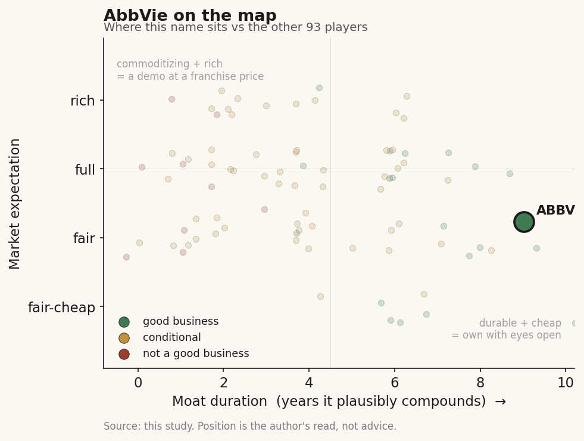

# AbbVie (ABBV / NYSE)

> **The read.** A diversified big-pharma incumbent that survived the largest patent cliff in drug history (Humira) by building two new immunology blockbusters, and is now a buyer - not a builder - of AI. AI matters here as a cheap efficiency lever and a few small staged-option deals, not as a driver of the ~$460bn valuation. The stock is an immunology-franchise bet with an AI footnote; the study's point holds - the incumbent funds the AI, bears none of the discovery risk, and keeps every asset that works.

**Snapshot**

| | |
|---|---|
| Listing | ABBV / NYSE |
| Region | US |
| Value-chain role | pharma incumbent - funder / value-keeper of the drug-discovery AI chain |
| Archetype | diversified big-pharma; buys AI as tool + cheap option, owns the assets |
| Size | ~$459.5bn market cap (3-Jul-26); stock ~$261 [reported] |
| Revenue (latest) | FY25 $61.16bn, +8.6% YoY [disclosed] |
| AI relevance | small to the P&L; internal efficiency + a handful of option-sized deals |
| Moat verdict | strong, but the moat is franchise/scale/distribution - not AI |
| Expectation | full - priced on immunology, not on AI |
| Evidence quality | high |

## What it is
A top-tier diversified pharmaceutical company, spun out of Abbott in 2013, best known for Humira - once the world's best-selling drug. Humira lost US exclusivity in 2023, and AbbVie is the industry's cleanest example of an incumbent absorbing a mega patent cliff: Humira fell to $4.54bn in FY25 (-25.9% YoY) while two successor immunology drugs, Skyrizi ($17.56bn) and Rinvoq ($8.30bn), grew into a combined $25.87bn and cleared the company's own prior 2027 target years early [disclosed]. AbbVie matters to this study not because AI moves its P&L - it does not - but because it is a textbook incumbent: it writes small checks to AI shops, licenses data and antibody-design platforms, uses AI internally to trim discovery cost, and keeps the drugs, the trials, and the distribution for itself.

## Business model - how it makes money
AbbVie sells patented biologics and small molecules it discovers, develops through its own trials, manufactures, and sells through its own global commercial machine, across immunology (the core), oncology, neuroscience, and aesthetics (Botox). It captures value at every layer a pure-play AI lab never touches: the ~40% Phase II efficacy wall (it runs the trials), regulatory approval, manufacturing scale, payer contracting, and a worldwide salesforce.

That is the study's key point. When AbbVie engages AI, it does so two ways, both structured to keep the risk outside:
- **AI-discovery deals as staged options.** It signs AI-native shops on a small upfront + contingent milestones + royalties, and keeps global rights to whatever advances. The AI partner bears discovery risk and is paid in options; AbbVie keeps the asset.
- **AI as an internal tool, not a product.** AbbVie does not sell AI. It uses machine learning to make its own antibody design, target selection, and trial enrollment cheaper and faster, and buys external AI capacity as cheap options rather than betting the pipeline on a model.

Capital-heavy where it counts - trials, manufacturing, commercial, and, above all, business development (it buys pipeline via M&A rather than growing all of it in-house). Capital-light where AI sits: the AI commitments are rounding errors against a $61bn revenue base.

## Financial summary
Top-line scale first, with the AI/deal figures kept in proportion so the reader sees how small they are.

| Item | Figure |
|---|---|
| FY25 revenue | $61.16bn, +8.6% YoY [disclosed] |
| FY25 R&D expense (GAAP) | $9.096bn, ~14.9% of revenue; adjusted $8.985bn [disclosed] |
| FY25 GAAP diluted EPS | $2.36 (depressed by acquisition/IPR&D charges); adjusted $10.00 [disclosed] |
| FY26 guidance | adjusted diluted EPS $14.37-14.57 [disclosed] |
| Immunology franchise | $30.41bn, +14.0%; Skyrizi $17.56bn, Rinvoq $8.30bn, Humira $4.54bn (-25.9%) [disclosed] |
| Market cap | ~$459.5bn (3-Jul-26) [reported] |
| **AI deal figures (kept in scale)** | |
| BigHat Biosciences (AI antibody design) | $30m upfront, up to ~$325m R&D milestones + commercial milestones + royalties (Dec-2023) [disclosed] |
| ConcertAI / Caris Life Sciences (AI + real-world oncology data) | multi-year precision-oncology R&D + trial-optimization deal (Jan-2024); financial terms undisclosed [disclosed] |
| **Pipeline M&A (for scale contrast)** | ImmunoGen ~$10.1bn, Cerevel ~$8.7bn (incl. a $3.5bn emraclidine impairment), Apogee (immunology) ~$10.9bn (Jun-2026) [disclosed] |

Scale check: the entire BigHat milestone ceiling (~$325m, most of it contingent and years away) is ~0.5% of one year's revenue; the upfront cash actually committed ($30m) is ~0.05%. AbbVie routinely spends 30-40x that on a single pipeline acquisition (ImmunoGen, Cerevel, Apogee are each ~$9-11bn). Where AbbVie buys future drugs, it buys companies, not compute. AI is financed out of pocket change.

## Value-chain position and competition
AbbVie sits at the top of the drug-discovery chain as a **funder and value-keeper**. Map the flows:
- **Money flows out** to AI shops (BigHat for antibody design; ConcertAI/Caris for AI-plus-real-world-data in oncology) as small upfronts + contingent milestones, and - far larger - to biotech targets via outright acquisition.
- **AI capacity flows in** two ways: (1) **licensed design/data platforms** - it rents BigHat's Milliner antibody-design engine and taps Caris/ConcertAI clinico-genomic data to guide precision-oncology development and enrichment; (2) **internal ML** - applied to molecule design, target triage, and trial enrollment. Unlike Lilly, AbbVie has not publicised owned frontier compute or a proprietary AI data-platform product - its AI posture is quieter and more tool-like.
- **Finished drugs, trials, manufacturing, and distribution stay inside AbbVie.**

Competition for the *AI-funder* role is every cash-rich incumbent doing the same thing (Lilly, Novartis, J&J, Merck, Pfizer), and AbbVie is a follower rather than a leader on AI spend and disclosure. The competitive fight that actually sets AbbVie's value is not AI - it is immunology share: Skyrizi and Rinvoq against J&J's Tremfya/Stelara franchise, next-gen oral IL-23 and TYK2 entrants, and the biosimilar erosion still working through Humira. AI is a shared industry tool; the moat is the franchise.

## Moat
AbbVie's moat is real and wide - but it is **not** an AI moat, and that distinction is the whole point.
- **Franchise + scale + distribution - STRONG (~7-12 yr).** Skyrizi/Rinvoq patent runway, entrenched dermatology/rheumatology/gastroenterology prescriber and payer relationships, aesthetics (Botox) durability, and a balance sheet that can fund any trial or buy any target. This is what a ~$460bn valuation rests on. The moat is somewhat shorter-dated than Lilly's because AbbVie has already shown how fast a flagship (Humira) can erode, and Skyrizi/Rinvoq face their own LOE clock next decade.
- **AI as a moat - WEAK / not the point.** Its AI is licensed antibody design and third-party oncology data - both commoditizing. AbbVie's real edge is proprietary immunology data plus the ability to run the trials and commercial machine AI cannot touch - i.e. incumbency, not algorithms. There is no disclosed federated-data or owned-supercomputer asset that would make AI itself defensible.

Net: durable ~7-12-year franchise moat; AI widens the funnel and buys cheap options but does not compound value. As with every incumbent in this study, the moat is the part of the chain the AI labs cannot reach.

## Core variables
1. **[CORE] Immunology franchise trajectory (Skyrizi + Rinvoq vs peers + orals + LOE).** This is ~everything. Combined $25.9bn already; the debate is durability - share against J&J and next-gen oral entrants, indication expansion, and the eventual patent cliff. AI does not move this needle in the forecast window.
2. **[CORE] R&D + BD productivity - does AI (or M&A) actually lower cost-per-approved-drug?** AbbVie replaces pipeline mostly by acquisition (ImmunoGen, Cerevel, Apogee), and Cerevel's $3.5bn emraclidine impairment shows how expensive a miss is. Whether internal AI and the BigHat/Caris deals measurably improve hit-rate or trial efficiency is unproven at the P&L level [unverified] - the incumbent-AI thesis in miniature.
3. **[CORE] Milestone conversion, not headline biobucks.** The "up to ~$325m" BigHat number is an option ceiling. What matters is cash actually paid as molecules advance - and, for AbbVie the payer, whether that cash buys approved assets or lapses cheaply. Either way the downside is capped and the assets are AbbVie's.

Below the line as noise: which specific AI vendor "wins," internal-AI press releases, and the AI-narrative framing generally. For a $61bn-revenue company these are strategy line-items, not valuation drivers.

## Bear case / key risks
The bear case has almost nothing to do with AI. It is franchise concentration and the replacement treadmill: a ~$460bn company leaning on two immunology drugs faces J&J and oral/TYK2 competition, US drug-pricing politics and Medicare negotiation, the residual Humira bleed, and - most sharply - the risk that expensive M&A does not replace the next cliff (Cerevel's emraclidine already failed and was impaired $3.5bn). Any immunology disappointment dwarfs anything AI could add or subtract.

On AI specifically the risk is the opposite of the pure-plays': not that AbbVie's AI fails, but that a licensed molecule hits the same ~40% Phase II wall everyone hits - in which case AbbVie simply stops paying milestones and loses only a small upfront. AbbVie is arguably *under*-invested in AI relative to Lilly, so the real AI risk is competitive lag, not stranded spend. The AI budget is not where an AbbVie investor loses money.

Falsification watch: (1) Skyrizi/Rinvoq share erosion or an oral-entrant setback - the actual thesis breaks here, AI irrelevant; (2) a serial-acquisition miss (another Cerevel) leaves a pipeline gap into the next LOE - the replacement engine, not AI, is the risk; (3) an AI-sourced AbbVie molecule reaches pivotal-stage success and materially de-risks a franchise - the one path where AI stops being a footnote.

## The expectation read
At ~$261 and ~$459.5bn (3-Jul-26), the market is pricing a durable, high-margin immunology franchise that has visibly out-run its Humira cliff and is guiding adjusted EPS to $14.37-14.57 for 2026 - a premium large-cap-pharma multiple on a growth-again story. **Essentially none of that price is AI.** The BigHat and Caris/ConcertAI deals together commit a fraction of a percent of annual revenue; they are financed out of free cash flow and structured so AbbVie's downside is a couple of small upfronts. The expectation embedded in the stock is that Skyrizi/Rinvoq keep compounding and that BD keeps refilling the pipeline ahead of the next cliff - not that AI discovers the next blockbuster.

So the AI read is asymmetric and cheap: AbbVie pays option premiums, keeps every asset that works, and owes nothing if they do not. Whether AI "moves" a ~$460bn company: not in the numbers today, and not in the price. If it ever does, it shows up as *lower cost-per-approved-drug* over a decade - a slow margin tailwind, not a re-rating - and AbbVie is currently a follower on that curve, not a leader.

## Verdict
Good business, wide moat - but the moat is the immunology franchise, scale, distribution, and a serial-acquisition engine, not AI. AbbVie is a clean, slightly quieter version of the study's thesis: the incumbent uses AI as a cheap tool, signs a few option-sized deals, bears none of the discovery risk, and keeps the drugs, the trials, and the value. AI is immaterial to the P&L and to the ~$460bn valuation today - and AbbVie invests in it more cautiously than the AI-forward incumbents. Confidence: HIGH on the facts (revenue, R&D, franchise splits, deal terms all disclosed and current); HIGH on the framing (AI is a tool/option here, immunology is the story); the genuinely open questions are variable 2 (whether AI/BD ever measurably lowers cost-per-approved-drug) and the durability of the Skyrizi/Rinvoq franchise into its own eventual cliff.
