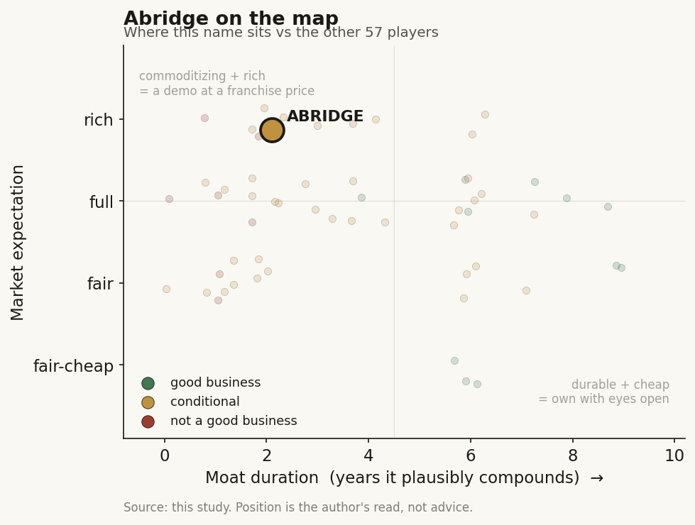

# Abridge (private)

> **The read.** A capital-light category leader (~30% ambient-scribe share) running a real escape route up-stack, but graded B- conditional - a feature today, a franchise only if the coding/CDI/RCM + licensed-CDS attach converts to owned workflow that survives Epic at price.

**Snapshot**

| | |
|---|---|
| Listing | private |
| Region | US |
| Value-chain layer | L6 - clinical-workflow |
| Archetype | workflow (SaaS per-provider subscription; extending into revenue-cycle savings-share and licensed-corpus CDS) |
| Size | ~$5.3bn last private valuation (Jun 2025 Series E) |
| Revenue (latest) | ~$100m ARR (May 2025), up from ~$60m end-2024 (~67% growth); contracted ARR ~$117m Q1'25 |
| Moat verdict | conditional - durable IF the up-stack sticks, commoditizing IF it stays a scribe |
| Expectation | rich (~$5.3bn / ~50x ARR venture mark) |
| Evidence quality | med |

## What it is
Ambient clinical-documentation platform: records the patient-clinician encounter and drafts the structured note back into the EHR in real time. The category leader by share, and the deepest Epic-embedded of the cohort. It sits at L6, the clinical-workflow layer, perched on top of the L0 EHR/cloud rails (Epic, Oracle, Azure).

## Business model - how it makes money
Enterprise per-provider-per-month SaaS (some encounter/PMPM deals), land-and-expand from a pilot department to system-wide rollout. List pricing roughly $300-600/provider/mo enterprise tier (~$2,500/clinician/yr). The buyer is the beneficiary, no reimbursement code is needed, and the model is capital-LIGHT (no wet lab, no inventory) - the high-durability quadrant on paper.

But realized ROIC is squeezed at both ends: per-encounter LLM inference is a real variable COGS (not zero-marginal software), and enterprise sales + Epic integration + clinical change-management are heavy to land a system. Growth to date is seat-count, not price - and price is the pressure point. The strategically important move is the up-stack into coding / CDI / orders / prior-auth / revenue-cycle (against the ~$250bn RCM pool) plus licensed-corpus CDS (NEJM/JAMA partnerships, Apr 2026). That is not incidental - it is the deliberate attempt to convert a rented scribe slot into an owned workflow.

## Financial summary
Private; funding and traction table (provenance tagged - [disclosed] company/primary · [reported] press/secondary · [estimate] derived).

| Round / metric | Figure | Note |
|---|---|---|
| Series D | $250m at ~$2.75bn (Feb 2025) | [reported] |
| Series E | $300m at ~$5.3bn (Jun 2025) | led by Andreessen Horowitz, w/ Khosla, NVIDIA NVentures, Lightspeed, Bessemer [reported/disclosed]; doubled the D mark in four months |
| Series E extension | ~$316m, held at ~$5.3bn (Apr 2026) | a16z lead again; strategic investment from Eli Lilly + payer/research push [reported; secondary-market sourced, not a confirmed primary close] |
| Total raised | >$750m across ~8 rounds | [reported] |
| Revenue | ~$100m ARR (May 2025) | up from ~$60m end-2024 (~67% growth); contracted ARR ~$117m Q1'25 [estimate: Sacra] |
| Implied multiple | ~50x ARR | a venture mark, not a cash-flow-proven multiple |
| Traction | >150 health systems deployed | up ~50% since the Series D [reported]; anchors Kaiser Permanente (~24,600 physicians), Mayo (2,000+), Duke [reported] |

## Value-chain position and competition
Sits at L6, the clinical-workflow layer, on top of the L0 EHR/cloud rails. What flows IN: raw encounter audio + the frontier LLM's transcription capability (rented from L0/below). What flows OUT: a structured note written back into the EHR, and - increasingly - coded/CDI-validated orders and billing artifacts pushed into the L8 payment/RCM rail. The app captures no reimbursement dollar directly in its core function; value is gated by system adoption and by access to the clinician inside the EHR - access it does not natively own. Named-patient liability stays with the ordering clinician (assistive tier), so the scribe carries little of the liability that would justify a defensive moat on its own.

Share snapshot 2026 [estimate: Becker's]: Abridge ~30%, Ambience ~13%, Suki ~10%, plus Microsoft/Nuance DAX-Dragon Copilot (600+ systems), Nabla, Commure, Amazon HealthScribe (arms-dealer API), and a budget tail (Freed/Heidi at ~$99/mo to small practices). Best in KLAS for Ambient AI, two years running (Feb 2026) [reported]. Abridge's actual edge is distribution DEPTH, not transcription quality: an equity + revenue-share tie to Epic and default-scribe status inside Epic-anchored systems (Mayo, Kaiser, Duke), keeping it ~3-6 months ahead on integration depth [estimate]. Transcription-to-note itself commoditizes toward the underlying LLM every vendor rents.

## Moat
Maps to Ch5 Moat 2 (workflow embedding / distribution): CONDITIONAL. The default placement of the pure L6 scribe is on the fragile/refuted side - "rents a slot," ~1-3yr duration - because the layer owns neither the model below (commoditizing LLM transcription) nor the distribution above (rented from Epic). The 4 Feb 2026 Epic native AI Charting launch (~$80/provider/mo vs several-hundred, pushed into orders/diagnoses, 42% acute-EHR share) is textbook platform envelopment: the landlord became the competitor.

But Abridge is running the exact escape route the survivor test names. The Ch5 test is one question - does the vendor own a scarce input the platform cannot cheaply replicate? Abridge is building three: (i) coding/CDI/RCM attach against the payer, whom Epic does not own (prior-auth via Highmark/Availity); (ii) a licensed CDS corpus (NEJM/JAMA) the generalist EHR agent cannot cheaply clone; (iii) an equity + rev-share alignment with Epic itself - a contractual position inside the enveloping platform rather than purely on top of it. If these hold, the moat migrates from the ~1-3yr rented-slot band toward the ~5-7yr owned-workflow band.

Is the moat real for a private at this stage? Not yet provable. The decisive number - NRR at price post-Epic - is unobservable while private; the ~$5.3bn mark is a venture mark struck around the month the platform owner entered, and growth is seat-count not price. The survivor mechanisms are in-flight, not yet demonstrated to hold retention at price through a renewal cycle. Verdict: durable IF the up-stack sticks; commoditizing IF it stays a scribe.

## Core variables
- **CORE 1 - NRR at price post-Epic.** Does the ~30%-share leader hold NRR >110-120% once Epic's ~$80 native option resets the anchor and hands CIOs a bundled default? Retention/renewal at price, not new logos, is the whole thesis. The first ambient-AI IPO S-1 is the referendum.
- **CORE 2 - does the coding/CDI/RCM + CDS up-stack convert to owned workflow?** The moat hinge. Real switching cost and payer-side ownership come only if the RCM/coding attach and the licensed-corpus CDS become the system-of-record for the claims-to-cash step - not if they stay a scribe add-on. Watch attach rate and per-system contract value (ACV) expansion beyond the note.
- **CORE 3 - pricing power vs inference COGS.** The gap between incumbent price (~$300-600) and Epic-native (~$80) against a real, usage-scaling inference COGS. If price compresses toward Epic's anchor while inference stays variable, capital-light does NOT translate to high realized ROIC.

Second-order (excluded as noise): Epic Toolbox access terms - privilege vs throttle; VC crowding / peak-mark risk; DAX share trend inside Microsoft; the Lilly strategic tie as a pharma-research channel option.

## Bear case / key risks
A feature, not a company - absorbed by the two layers that sandwich it. From below: transcription-to-note is a frontier-LLM capability every vendor rents; no durable model IP, so the core function trends to cost-of-inference and undifferentiated output. From above (decisive): Epic shipped native AI Charting on 4 Feb 2026 at ~$80 vs several-hundred and pushed it into orders/diagnoses; the only real moat was Epic-integration depth, which is distribution rented from Epic. No reimbursement anchor to hide behind - nothing gates a switch except integration friction Epic controls. Result: price compresses toward the Epic anchor while inference stays a real COGS, so the "capital-light, high-ROIC" story is squeezed from both ends, and the ~$5.3bn / ~50x-ARR mark reads like peak-hype struck the month before the platform owner entered. The up-stack (coding/CDS/RCM) is the answer to this bear - but it is unproven, and Epic can extend natively into the same adjacencies.

## The expectation read
The ~$5.3bn mark on ~$100m ARR implies ~50x ARR - a venture mark, not a cash-flow-proven multiple, and one struck around the month the platform owner (Epic) entered the category natively. That multiple embeds the belief that the ~30% share and Epic-integration depth translate into durable, priced retention. Where the belief looks soft: growth is seat-count not price, the decisive NRR-at-price number is unobservable while private, and the Epic-native ~$80 anchor sits against an incumbent ~$300-600 price with a real inference COGS underneath. The mark is priced for the up-stack succeeding before it has demonstrably held retention through a renewal cycle.

## Verdict
Conditional durable value-capturer - grade B-, "feature today, franchise only if the coding/CDI/RCM + CDS up-stack converts to owned workflow that survives Epic at price." The pure L6 scribe is a demo-plus-distribution head-start (~1-3yr, rented slot); the escape route is real and being executed, but the decisive proof - NRR-at-price and attach conversion post-Epic - is unobservable while private, at a rich (~50x ARR) pre-envelopment venture mark. Confidence: medium (facts on funding/share/Epic-launch are well-sourced; the moat outcome is genuinely undecided).
