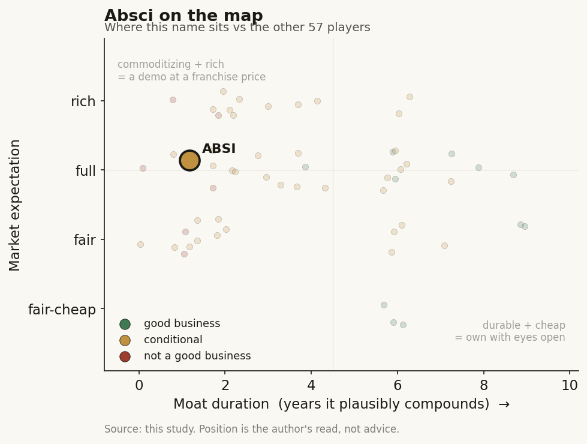

# Absci (ABSI)

> **The read.** A real, well-funded AI-antibody call option - but not a good business yet, priced on an analyst-assumed 35% coin-flip the data has not earned, and the "AI-selection moat" the multiple credits is refuted (data flywheel) and untested by the flagship.

**Snapshot**

| | |
|---|---|
| Listing | ABSI / Nasdaq (Russell 2000) |
| Region | US |
| Value-chain layer | L9b-L9e (antibody design -> lead candidate -> IND -> early clinical) |
| Archetype | drug-owner (milestone + own-pipeline) |
| Size | ~$450-453M market cap |
| Revenue (latest) | FY25 $2.8M; pre-material - valued on the pipeline, not collaboration cash |
| Moat verdict | commoditizing (data flywheel refuted; own-pipeline optionality conditional) |
| Expectation | full |
| Evidence quality | high |

## What it is
Generative-AI antibody-design company (HQ Vancouver, WA) that designs full-length antibodies computationally, validates them in an integrated wet lab ("lab-in-the-loop"), and - unlike a pure tool vendor - walks a small number of its OWN designed assets into the clinic. A single-asset-driven, clinical-stage micro-cap: valuation is driven primarily by the success of ABS-201. The cleanest listed, liquid proxy for the AI candidate-selection thesis - the public counterpart to private Isomorphic.

## Business model - how it makes money
Milestone + own-pipeline, and the mix shifted hard toward owning the asset in Nov 2025.
- **Own pipeline (now the priority).** ABS-201 (anti-PRLR antibody) in androgenetic alopecia (AGA, lead) + endometriosis. Strategy: develop first-/best-in-class assets from discovery to clinical POC, then out-license before late-stage cost - capture the value inflection at POC, not carry Phase 3. AGA is the exception it may keep (cash-pay, fast-recruiting, low cost-to-register).
- **Partnerships (optionality).** ABS-101 / ABS-301 / ABS-501 (oncology) all up for a partner. The chief business officer's own capital-allocation tell: asset-deal value is "significantly higher ... and you can risk adjust that, and it's still a multiple" vs a platform deal - the own-the-asset end of the axis winning inside the company.

Growth quality: this archetype has no meaningful margin line yet; it is a cash-and-runway business, incremental ROIC undefined pre-product. The cost/speed claim is AI design -> IND in ~2 years at ~$15M/program vs an industry ~4-6 years and ~$50M+. Capital-hungry at the clinic; cash conversion not a base-case variable yet.

## Financial summary

| Metric | FY24 | FY25 | FY26E |
|---|---|---|---|
| Revenue | - | $2.8M (all technology-development collaboration) | - |
| Q4 revenue (underlying) | - | $0.65M (reported $5.75M inflated by a $5.1M contingent-consideration settlement gain) | - |
| Net loss | - | ~$120M | - |
| Q4 R&D | $18.4M | $25.3M | - |
| Q4 SG&A | - | $8.6M | - |
| Op-ex run-rate | - | ~$128M | ~$129M |
| Cash + marketable securities | $152.5M (30 Sep 2025) | $144.3M (31 Dec 2025) | runway guided into 1H 2028 |

Share/market data: cap ~$450-453M; $3.01 (24 Mar 2026); ~150M shares out; 52-wk $2.01-$5.23; float ~90%. Revenue is pre-material - valued on the pipeline, not collaboration cash. Runway extends past both the AGA and endometriosis POC readouts.

## Value-chain position and competition
Core engine sits **target -> antibody design (Origin-1) -> lead candidate -> IND** (L9b-L9c, the contested-but-valuable upstream slice). What flows: a validated, functional antibody against novel/undruggable epitopes from **<100 designs per target**, "up to 90% target occupancy" - a design-quality claim, not a raw-throughput one. Unlike a pure platform, ABSI pushed its lead asset one notch right INTO Phase 1/2a (L9e), and intends to carry AGA toward registration + self-pay commercialization. Same upstream slice as Isomorphic, reaching further into early clinic.

Competition is a crowded field with no proven lead: Recursion, Generate Bio, BigHat, Nabla, Isomorphic, Xaira, Alchemab; no guarantee Absci leads the market. On the flagship target specifically there is DIRECT competition - Hope Medicines' anti-PRLR (HMI-115) and a competitor anti-PRLR already in Phase 2 endometriosis. Edge is asserted as design quality + smart indication selection (extended half-life, "3-4x longer half-life than the competitor antibody," 2-3 doses / 6 months) - i.e. a **fast-follow on validated PRLR biology, engineered for a better product profile**, not a novel AI-nominated target that survived efficacy. The Jun-2026 interim Phase 1 backs the product-profile half of that: an estimated half-life of at least 65 days [reported] is what underwrites the 2-3-doses-per-6-months differentiator versus incumbents. The AI edge lives on the Phase-I (chemistry) side the sector has largely solved, not the unsolved Phase-II side. Note the mechanism itself is competitor-validated, not AI-nominated: the Dec-2025 human ex vivo scalp data attribute ABS-201's effect to prolonging anagen (blocking catagen), driving hair-matrix keratinocyte proliferation, and raising IGF1/FGF7 - PRLR-blockade biology, engineered for a longer-half-life product, not a novel target the AI found and de-risked on efficacy.

## Moat
Applies the data-flywheel moat (**refuted for drug discovery**) and the own-pipeline-vs-risk-bearing-pharma moat (**conditional**).
- ABSI's pitch is the integrated wet-lab + generative-AI data flywheel ("quality, proprietary wet-lab data at scale provides differentiation"). This loop is refuted for drug discovery: open clones (Boltz/Chai/Protenix/OpenFold) matched the frontier in ~1 year at >1000x lower cost, and the flywheel compounds L9b generation (already-solved half), NOT the ~40% Phase-II efficacy wall. Model IP is a ~12-month moat.
- What could survive is the **owned asset against a risk-bearing pharma counterparty** - but that is binary optionality gated on the unchanged ~40% Phase-II wall, "more shots on goal, not better odds per shot." Not durable compounding.
- **Verdict: commoditizing, not durable.** Estimated durable-edge duration ~0-1 year on the model/flywheel; the only real value is a self-asserted, still-unproven owned-asset call option that stands or falls on one POC print.

## Core variables
1. **ABS-201 AGA POC vs the 30-40 hairs/cm2 bar** - 13-wk directional readout 2H26, 26-wk topline early 2027. Management called 35-40 hairs/cm2 a "home-run"; PI benchmarks: finasteride ~20, oral minoxidil ~30-40, transplant ~25-30. The one number that validates or breaks the equity.
2. **SAD/MAD safety + follicle target-engagement (PK/PD)** - the Jun-2026 interim Phase 1 cleared the safety/PK checkpoint: 32 SAD participants, no serious adverse events, treatment-related events mild (headache most common), half-life at least 65 days [reported]. That answers tolerability and dosing cadence but NOT the live mechanistic bear - whether the antibody actually reaches and engages the hair follicle in humans - which the subcutaneous MAD-in-AGA phase (300/600/1,200 mg) is now testing, with target-engagement/PK-PD read-through due at the 2H26 interim POC.
3. **A large-pharma platform deal and/or asset out-license (101/301/501)** - the market test of the platform's external validation and non-dilutive funding; watch deal STRUCTURE (asset-deal economics vs thin platform upfronts).

(Noise discarded: reported-revenue optics, the $5.1M one-off gain, management's self-reported >$25B TAM on a hypothetical profile, quarterly opex line-items.)

## Bear case / key risks
A single-asset, pre-POC micro-cap ($450M, one drug driving the whole valuation, ~35% assumed POS in the sell-side bull case). (1) The thesis rests on raising Phase-II efficacy PoS, but ABS-201 does NOT test that - it is a fast-follow on competitor-validated PRLR biology, engineered for product profile, aimed at a self-pay hair-count endpoint; a win reads as good protein engineering, not "AI beat efficacy attrition." (2) The AI edge is on the already-solved Phase-I half; the data-flywheel moat is refuted (open clones caught the frontier in ~1yr). (3) Direct competition on PRLR (Hope Medicines/HMI-115). (4) A single failed readout can strand the asset AND close the financing window at once - the binary. (5) FY25 revenue $2.8M against ~$120M burn: it lives on optionality, not economics.

## The expectation read
The sell-side frames a large single-asset upside: one house Overweight, no PT (DCF-SOTP on ABS-201/PRLR in AGA, 11-12% WACC, Stelara/Botox pricing anchors); another Buy, PT **$7.00** vs $3.01 - a blend of probability-adjusted DCF (13% discount, **35% assumed POS**) and SOTP (5x AGA sales = $747M at 35% POS; $400M pipeline; +$67M options +$78M YE26 cash ~ $1.3B equity). So at ~$450M cap the market is paying for roughly a coin-flip on one drug clearing a hair-count POC, plus free pipeline/platform optionality. **Where the belief looks soft:** the entire case is a single pre-POC asset with a 35% POS that is analyst-assumed, not data-earned; the platform/data-flywheel "moat" is refuted; and the flagship does not actually test the AI-selection claim the multiple implicitly credits. The market is pricing an AI-selection option on biology that is a competitor-validated fast-follow.

## Recent developments (2025-2026)
The gap between the "priced on an analyst-assumed coin-flip" read above and the tape has widened sharply. Three de-risking prints landed on the safety/PK (already-solved Phase-I) side, and the stock re-rated ~4x while the one number that decides the equity - a human hair-count POC - is still not in.

- **[reported] Positive interim Phase 1 SAD data, 24 Jun 2026.** In the HEADLINE trial, all four IV single-ascending-dose cohorts (150 / 450 / 900 / 1,800 mg; 32 healthy participants, 3:1 drug:placebo, data cutoff 8 Jun 2026) were well tolerated: no serious adverse events, 5 participants with treatment-related events all mild, most common headache (4). Estimated half-life at least 65 days, consistent with the 2-3 doses per 6 months product-profile claim. No efficacy or hair-count data at this stage.
- **[reported] Trial advanced into the subcutaneous MAD phase in AGA patients** (300 / 600 / 1,200 mg). Interim proof-of-concept data guided 2H26, full POC early 2027 - the timeline in "Core variables" is intact.
- **[disclosed] Q1 2026 (quarter ended 31 Mar 2026).** Revenue $0.2M (vs $1.2M Q1 2025; partner revenue thin as expected). R&D $19.3M, SG&A $9.1M, net loss $29.6M. Cash + marketable securities $125.7M at 31 Mar 2026 (down from $144.3M at 31 Dec 2025). Runway reaffirmed into 1H 2028 - past both POC readouts.
- **[disclosed] Pipeline widened on the same PRLR target.** New internal asset **ABS-202** (anti-PRLR, undisclosed inflammation and immunology indication) added in preclinical - deepening the PRLR franchise rather than a new AI-nominated target. Management reiterated it "anticipates signing one or more partnerships, including with a Large Pharma company, in 2026"; ABS-101 remains positioned for out-license/partnership.
- **[reported] Human ex vivo scalp mechanism data, 11 Dec 2025.** In translational human ex vivo scalp models ABS-201 stimulated hair growth and expanded/protected the stem-cell niche - prolonging anagen by blocking catagen, driving hair-matrix keratinocyte proliferation, and raising IGF1 and FGF7 - framed as potentially reversing follicle miniaturization, not just slowing loss. Pre-clinical mechanism support, not human efficacy.
- **[disclosed] The re-rating.** ABSI ~$11.54, market cap ~$1.95B (6 Jul 2026), ~169M shares out, 52-wk $2.24-$12.06 - versus $3.01 / ~$450M cap at the March snapshot above, roughly a 4x move. The market has now priced the clean Phase-I safety/PK read as a meaningful de-risk, ahead of any human hair-count. Note this cuts directly against the earlier "$450M cap = coin-flip on one drug" framing: at ~$1.95B the market is paying a full multiple of that on the same unresolved Phase-II-equivalent efficacy question, with a larger air-pocket if the 2H26 POC disappoints.

**Net:** the interim data resolved the risks the sector had largely solved (tolerability, half-life, dosing cadence) and left the one that decides the thesis - does the antibody actually grow terminal hair in humans against the ~30-40 hairs/cm2 bar - unanswered until 2H26-early-2027. The binary is unchanged; only the entry price moved.

## Verdict
**Conditional / speculative - a real, well-funded AI-antibody call option, but NOT a good business yet and priced on an analyst-assumed 35% coin-flip that the data has not earned; the "AI-selection moat" the multiple credits is refuted (data flywheel) and the flagship doesn't even test it.** Confidence: HIGH on the framing and financials (five primary/sell-side docs read in full, Mar 2026; refreshed with the Jun-2026 interim Phase 1 and Q1 2026 prints). The valuation verdict is inherently binary and resolves on the 2H26-early-2027 ABS-201 POC. Update: the Jun-2026 interim data de-risked only the already-solved Phase-I (safety/PK) half and the stock re-rated ~4x to ~$1.95B, so the risk/reward is now worse per dollar - more premium riding on the same unresolved human hair-count POC.
