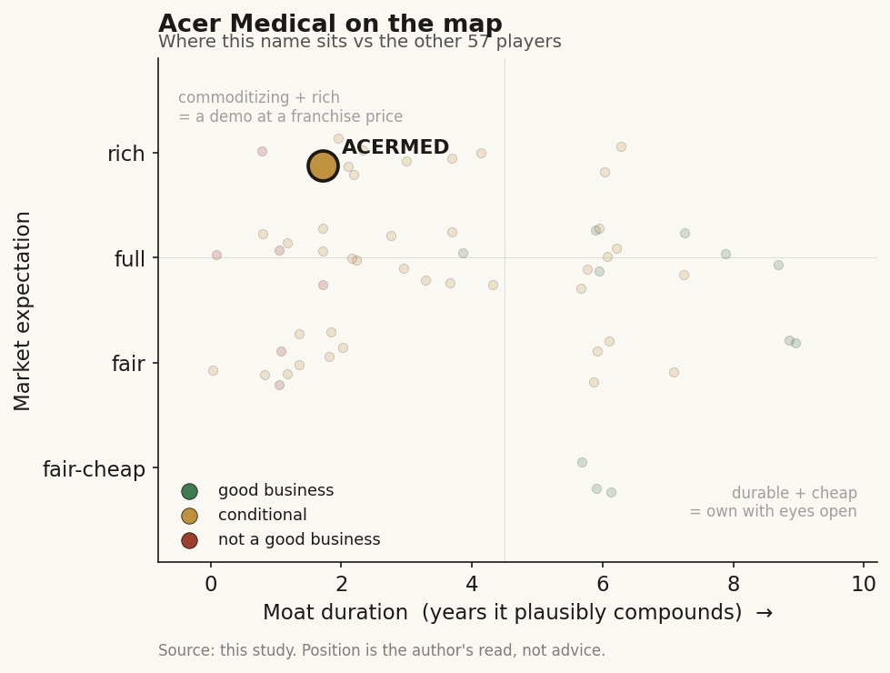

# Acer Medical (6857 TT)

> **The read.** A genuine first-mover imaging-triage product with a strong parent, stranded one value-chain layer short of the payment dollar - a good clinical asset but not yet an investable equity, held back by a shut NHI gate, at a rich brand-and-optionality expectation.

**Snapshot**

| | |
|---|---|
| Listing | 6857 TT · Taiwan 興櫃 emerging-stock board |
| Region | Taiwan |
| Value-chain layer | L3-L4 (assay/algorithm design + interpretive-processing step; imaging-triage SaMD) |
| Archetype | SaMD (regulated per-scan, screen-and-refer triage) |
| Size | ~NT$1.44bn market cap (~NT$94.5/sh, 2026-07-03) |
| Revenue (latest) | NT$60.05m FY2025, grown off a ~NT$1m FY2020 base; net loss NT$29.69m |
| Moat verdict | Commoditizing - real-but-not-investable |
| Expectation | Rich |
| Evidence quality | Med-low |

## What it is
宏碁智醫股份有限公司 (Acer Medical Inc.), a 2018-founded subsidiary of Acer (2353 TT), sells AI-assisted diagnostic-imaging screening software (SaMD). Flagship VeriSee DR was Taiwan's first TFDA-cleared ophthalmology AI - diabetic-retinopathy grading off a fundus image, trained on NTUH ophthalmologists' reads, cleared Sept 2020. A textbook "screen-and-refer" triage product: a Class-II decision aid, not an autonomous diagnosis.

## Business model - how it makes money
Licence/subscription sale of SaMD to hospitals and clinics, plus overseas device-cert-gated software sales and a bundled hardware leg (non-mydriatic fundus camera ARC-1000, tele-med TeleMed). The binding constraint is who pays: **there is no NHI software-service payment code for DR-screening AI.** Diabetic-retinopathy AI is NOT NHI-reimbursed as of 2025 - Taiwan's single standing AI payment is Edwards' Acumen HPI (功能改善型特材, since 2023-07-01), a per-use special-material point value, not a software code. So Acer Medical is effectively selling into hospital opex/self-pay/grant budgets ("健康台灣深耕計畫" pilots, Taipei City Hospital 忠孝院區 Sept-2024 rollout), not into a reimbursed unit economic. Who pays today = the hospital's own budget; who needs to pay tomorrow = NHI, and that vote has not happened. Cash conversion is negative and structural: net margin −48.58%, and the top line is nowhere near covering opex.

## Financial summary

| Metric | FY2020 | H1 FY2022 | FY2025 |
|---|---|---|---|
| Revenue | ~NT$1m | NT$5.85m | NT$60.05m |
| Net income | - | −NT$29.4m | −NT$29.69m |
| EPS | - | −2.45 | −1.95 |
| Gross margin | - | - | 62.45% |
| Net margin | - | - | −48.58% |

Other disclosed/reported figures: capital NT$152.26m; 15.226m shares issued. Market cap ~NT$1.44bn at ~NT$94.5/sh (2026-07-03); 52-wk range NT$92.0-158.5. P/B ~10.5x (net asset value NT$13.77/sh, 2Q24) - a story/pre-scale valuation, not an earnings multiple. Implied EV/Sales ~24x on a loss-making ~NT$60m line: the market is paying for the parent brand + optionality, not the P&L. Listing on 興櫃 since 2021-10-27; NOT yet 上櫃/上市. 419 registered holders; top-10 hold 68.69% - thin float, thin secondary-market liquidity (daily volume in the low thousands of shares). VeriSee DR reported installed at 80+ Taiwan care sites of all tiers - a distribution/reference footprint, not a revenue line; adoption ≠ NHI payment.

## Value-chain position and competition
Occupies **L3 (assay/algorithm design)** and **L4 (the interpretive-processing step)** of the imaging-analog axis: fundus/DXA image in → AI grade/flag out → refer decision. What flows in: the image + the model. What flows out: a triage recommendation to the ordering (often non-ophthalmologist) physician, where liability sits. It does NOT own L1 patient intake (that is the hospital / NTUH data), does NOT own L2 (rides third-party fundus cameras + its own ARC-1000), and cannot reach L8 payment because the NHI gate is shut for this archetype. Value is stranded one layer short of the dollar.

Competition:
- **vs TW pure-plays:** Ever Fortune AI (6841 TT) is the larger, profit-inflecting, licence-accumulation pure-play (FY25 rev ~NT$374m vs Acer Medical ~NT$60m) with a broader FDA/TFDA stack; aetherAI (7803 TT) owns digital pathology, an adjacent not overlapping niche; Amcad (4188 TT) is the ultrasound-CAD analog. Acer Medical is the smallest-revenue of the SaMD cohort but the only one with a top-tier consumer-brand parent.
- **vs US players into TW:** the DR-AI category globally is defined by IDx/Digital Diagnostics (LumineticsCore, the autonomous US template) and Google/Verily's ARDA; these carry deeper clinical evidence but face the same TW NHI wall and TFDA re-registration friction. No US name has a reimbursed TW DR-AI position either - the gate is archetype-level, not vendor-level.
- **Regional angle:** the differentiator is SE-Asia device-cert accumulation (13 certs, landed in 11 countries/regions; Thailand the only market cited with "meaningful" revenue contribution; VeriOsteo OP into Indonesia/Thailand; Malaysia via an Intel AI-PC partnership). Export is the growth story precisely because home reimbursement is blocked.

## Moat
Thin, and honestly so - the Ch5 verdict is commoditizing / real-but-not-investable. Testing the four candidate moats:
- **Hospital-data access:** the NTUH-lineage training data gave VeriSee DR its first-mover cert, but the underlying data is STATE-adjacent, not company-captured. No proprietary data annuity accrues to the equity.
- **NHI relationship:** none that pays. Being a pilot vendor is not a moat; the 共同擬訂會議 has not voted DR-AI in. A moat here would require clearing the "must-save-the-payer-money" RCT gate, which pure diagnostic-triage AI structurally struggles to pass (diagnosis alone doesn't qualify).
- **Regulatory:** first-mover TFDA cert is table stakes - it confers entry, not defensibility; TFDA lacks statutory PCCP, so model updates carry re-registration friction.
- **Brand/distribution:** the Acer parent is the realest edge - capital, channel, an AI-PC hardware tie-in, and staying power a sub-NT$600m pure-play lacks. That is a going-concern advantage, not a pricing moat.

The asset (data lineage, first cert, 80-site footprint) is genuine; none of it converts to durable equity value until an NHI vote or a scaled export annuity exists.

## Core variables
The three a reader underwrites (noise excluded):
1. **NHI reimbursement decision for DR-screening AI** - the binary single-payer gate; today a NO. This is the entire domestic re-rate.
2. **Export ability beyond TW** - SE-Asia cert-to-revenue conversion (Thailand is the proof-of-concept); the only near-term growth not blocked by the NHI wall.
3. **Hospital contract wins that actually PAY** - pilot-to-paid conversion under 深耕計畫/self-pay, i.e. revenue that survives when grant money ends.

## Bear case / key risks
A ~NT$1.44bn market cap on ~NT$60m of loss-making, low-margin-at-net revenue is a brand-and-optionality valuation with no reimbursement catalyst dated. The binding archetype fact is unfavourable: pure diagnostic-triage AI is the hardest SaMD to get NHI to pay for (no software code, savings-RCT gate, global-budget zero-sum). Absent NHI, the equity rests on SE-Asia exports - a slow, cert-by-cert, small-ticket grind against the same wall in each market. Thin float + 興櫃 status means price is not a clean read on fundamentals. Downside is a permanent pilot-vendor: clinically adopted, financially subscale, diluting or leaning on the parent to fund the loss.

## The expectation read
At ~NT$1.44bn, P/B ~10.5x and EV/Sales ~24x on a loss-making ~NT$60m line, the multiple implies the market is underwriting the parent brand plus a re-rate optionality - not the P&L. The soft spot: no NHI reimbursement catalyst is dated, and the export annuity is a slow cert-by-cert grind, so the belief embedded in the price (that domestic reimbursement or scaled exports arrive) rests on a binary that has not fired. Thin float and 興櫃 status mean the quoted price is not a clean read on fundamentals either.

## Verdict
Real-but-not-investable moat on a genuine first-mover triage product with a strong parent, stranded one value-chain layer short of the payment dollar; the domestic thesis is a binary (the NHI DR-AI reimbursement vote) that has not fired, and the current expectation is rich against a loss-making top line. A good clinical asset, not yet a good standalone equity. Confidence: MED-LOW - financials and cert facts are reported-grade from TW secondary sources; Acer's exact stake %, VeriSee unit-economics, and export revenue split remain unverified. The thin data is itself the finding: this is a small 興櫃 name where the reimbursement gate, not the disclosure, is the reason to stay out.
