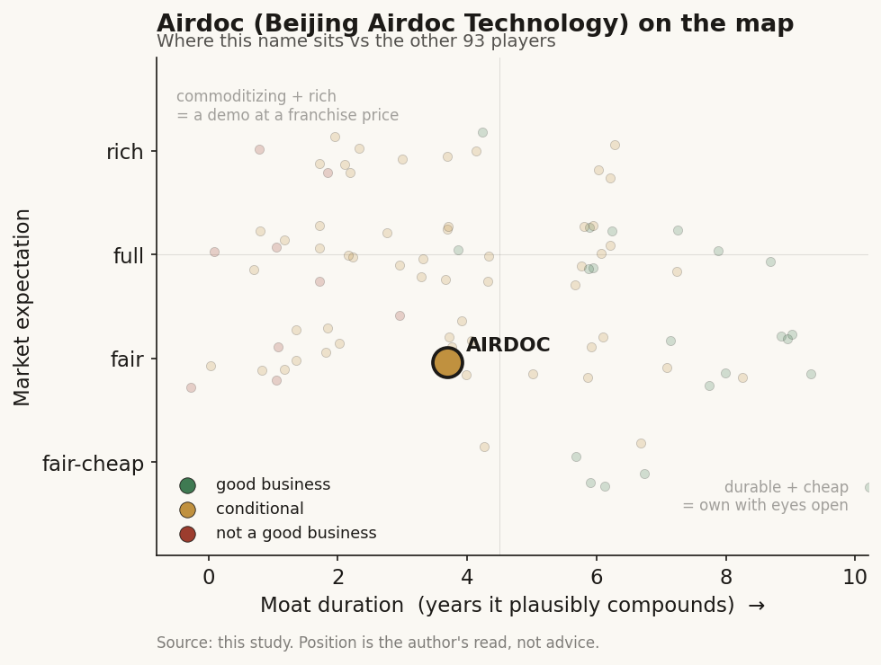

# Airdoc (2251 / HKEX (China))

> **The read.** The clearest listed pure-play on retinal-image AI screening in China - real regulatory firsts, a genuine software-grade ~73% gross margin, and a 2025 loss cut of ~90% - but a tiny business (~RMB173m revenue, ~US$145m market cap) whose whole re-rate rests on turning millions of low-price checkup screens into a durable, reimbursed clinical annuity before a crowded field of NMPA-cleared rivals commoditizes the screen. Conditional value-capturer, evidence thinner than a US filer.

**Snapshot**

| | |
|---|---|
| Listing | 2251 / HKEX (Hong Kong-listed, Beijing HQ; the "-B" pre-profit designation was removed after H1'25 turned positive) |
| Region | China (ex-US, ex-Taiwan) |
| Value-chain layer | Imaging L5a/L6 - interpretive screening (retinal SaMD) + the checkup/health-management workflow around it |
| Archetype | SaMD / screening - per-screen software fees + hardware/service bundles, migrating toward a diagnostic-therapeutic ("诊疗一体化") loop |
| Size | ~HK$1.14bn market cap (~US$145m), share ~HK$11.00 [reported, mid-2026] |
| Revenue (latest) | FY2025 RMB173.3m, +10.8% YoY; H1'25 turned to a small net profit |
| Moat verdict | conditional - regulatory-first + data breadth are real, but the screen itself is commoditizing |
| Expectation | fair-to-full |
| Evidence quality | med-low (HKEX-filed IFRS numbers are clean; segment unit economics and reimbursement detail are thinner than a US filer, and some figures are self-reported) |

## What it is
A Chinese medical-AI company built on one idea: a photograph of the retina is a cheap, non-invasive window into the whole body, so software that reads a fundus image can screen for eye disease and flag systemic risk (diabetes, hypertension, vascular disease). Its flagship, Airdoc-AIFUNDUS, is a software-as-a-medical-device (SaMD) product sold in versions for diabetic retinopathy (v1.0), broader fundus disease (v2.0), and pathological myopia / retinal detachment (v3.0). Founded 2015 by Zhang Dalei (张大磊); IPO'd on the HKEX in November 2021 as one of China's first listed medical-AI pure-plays [disclosed]. It sits one layer up from the camera - the interpretive screening layer (L5a) plus the checkup/health-management workflow around it (L6), not the hardware.

## Business model - how it makes money
Two engines, tilting from screening toward a diagnostic-therapeutic loop:

- **Health-risk / screening AI (the core).** Per-screen software revenue: a fundus image is captured at a health-checkup center, hospital, optical store, pharmacy, insurer, or community clinic, run through Airdoc's model, and returned as a report. Retinal-AI revenue was RMB120.8m in FY2025, +7.2% YoY [reported]. H1'25 ran ~3.3m retinal screens (+11.4% YoY) across ~7,180 active service locations (+20.7%), of which ~346 were hospital-grade sites (+41.8%) [reported]. This is a high-volume, low-price-per-screen annuity - closer to a metered software service than a reimbursement-gated lab.
- **Diagnostic-therapeutic ("诊疗一体化") - the intended second leg.** Myopia intervention (a PBM/LED red-light therapy device plus AI monitoring) and AI visual training for strabismus/amblyopia. Myopia-prevention AI ran ~2.81m screens in H1'25 (+68.1%) serving ~58,000 users; visual-training AI ~1.03m sessions (+11.6%) [reported]. Treatment/therapeutic revenue reached ~31.6% of total in H1'25 - the mix-shift that turned the company briefly profitable.

**Growth quality - the whole debate.** Headline FY2025 growth was only +10.8%, and the core retinal screen grew just +7.2% - modest, and slower than the myopia/therapy leg carrying the mix. Gross margin is genuinely software-like at ~73.5% (TTM) [reported], because the customer owns the camera and Airdoc sells the read. The re-rate case is that the therapeutic leg and the April-2025 Class III clearance convert a low-price screen into a higher-value clinical product; the bear case is that the screen is already near-commoditized (see Competition) and volume growth of ~11% is too slow to matter.

**Incremental economics / cash.** Capital-light by design - no lab, no reagent toll, no payer receivables. Not yet durably profitable: FY2025 narrowed the net loss ~90.2% to roughly RMB25m (from a loss of roughly RMB255m in FY2024), and H1'25 flipped to a small net profit (~RMB0.4m) versus an ~RMB81.5m loss in H1'24 [reported]. The loss cut is attributed to channel-management optimization, better gross margin, and its self-developed "Wanyu" large model cutting operating cost [reported]. Cash-shaped resources (other financial assets) were ~RMB345.5m at YE2025 [disclosed] - real runway against a small burn, but the profit is thin and not yet proven across a full year.

## Financial summary

| | FY2024 | H1'2025 | FY2025 |
|---|---|---|---|
| Revenue | RMB156.4m | (interim) | RMB173.3m |
| Revenue growth | - | - | +10.8% |
| - Retinal-AI revenue | - | - | RMB120.8m, +7.2% |
| - Therapeutic share of revenue | - | ~31.6% | - |
| Gross margin | - | - | ~73.5% (TTM) [reported] |
| Net profit / (loss) | ~-RMB255m [reported] | ~+RMB0.4m | ~-RMB25m (loss -90.2% YoY) |
| Other financial assets (cash-like) | - | - | ~RMB345.5m |
| Retinal screens | - | ~3.3m (+11.4%) | - |
| Active service locations | - | ~7,180 (+20.7%) | - |

Reports on IFRS in RMB. Some figures are company-reported; market cap/price as of mid-2026 [reported]. FY2024 loss figure varies by source (headline vs adjusted) - treat as approximate [unverified].

## Value-chain position and competition
Airdoc sits at L5a interpretive screening (the model that reads the fundus image and raises the flag) and L6 workflow (delivering that read inside a checkup, optical, insurance, or hospital setting). Flow: a fundus camera (hardware Airdoc does not need to own) captures an image -> the image enters Airdoc's model -> a screening/risk report comes back -> de-identified signal pools back into a training corpus that management cites as one of the largest labeled real-world fundus datasets in China (cumulative screens in the tens of millions since inception; 283 patents at H1'25) [reported, self-reported]. It is "software one level above the camera" - the same picks-and-shovels logic as a diagnostics platform, with the capital-heavy imaging hardware deliberately left to the customer.

Competition, split by where they sit:
- **Domestic NMPA Class III retinal-AI rivals - Vistel (EyeWisdom), Silicon Intelligence (硅基智能), Baidu Intelligent Healthcare, and others.** Multiple Chinese vendors now hold NMPA Class III diabetic-retinopathy clearances; the autonomous-DR screen is a contested, increasingly crowded category, not a solo franchise. Airdoc's claim is being first and broadest (v2.0 covering multiple fundus diseases), not being alone.
- **The camera/OEM and hospital-IT stacks** that own the modality and can bundle a screen into hardware or PACS the site already bought - the same envelopment risk that squeezes Western triage-AI apps.
- **Global reference points** (not direct competitors): US/EU autonomous-DR players and the broader imaging-AI field - useful for pricing precedent, where an autonomous-DR read has repriced down over time.

Edge: the earliest and (per the company) broadest NMPA Class III retinal clearances in China, a wide multi-channel install base (checkup + optical + insurance + hospital), a large real-world labeled fundus dataset, and CE-marking for overseas expansion (~12.3% of H1'25 revenue was overseas) [reported]. Its disadvantage is small absolute scale and a core screen that rivals can match on the clearance itself.

## Moat
- **Regulatory-first clearance - REAL but eroding as a moat (~1-3 yr edge, not permanent).** Airdoc was among the first to obtain NMPA Class III approval for autonomous retinal screening, and April-2025 Class III clearance of AIFUNDUS v2.0 opened nationwide multi-disease commercialization [disclosed]. That is a genuine head start, but clearance gates the shelf, not the revenue - and multiple domestic rivals now hold Class III DR clearances too. The barrier is being repriced from "scarce license" toward "table stakes."
- **Data-network / dataset breadth - CONDITIONAL, real but not yet decisively compounding.** Tens of millions of cumulative real-world fundus images plus outcome labels make the next model better, and the multi-channel footprint feeds it - a genuine flywheel in principle. The problem is magnitude and monetization: screen volume is growing only ~11%, price per screen is low, and a better model does not automatically command a higher price when the clearance is commoditizing. Widens only if the therapeutic loop turns data breadth into a higher-value, stickier clinical product.
- **Channel / workflow embedding - PARTIAL.** Being installed across ~7,180 checkup, optical, insurance, and hospital sites raises switching friction and is hard to rebuild - but a low-price screen embedded in a checkup is easier to displace than a reimbursed clinical assay, and the channels themselves (checkup chains, insurers) hold the customer relationship.

Net: the durable asset is regulatory-first breadth plus a large domestic fundus dataset - genuinely differentiated in China today - but the core screen is commoditizing and the higher-value therapeutic loop is early. Estimated durable-compounding duration is a conditional ~3-5 years, contingent on the diagnostic-therapeutic mix growing faster than the screen commoditizes.

## Core variables
1. **[CORE] Diagnostic-therapeutic mix-shift.** Can the myopia-therapy and visual-training leg (~31.6% of H1'25 revenue, growing far faster than the core screen) keep climbing and carry both growth and margin? This is the entire re-rate: a per-screen software fee is low-value and contested; a diagnostic-therapeutic loop is higher-value and stickier. If this stalls, Airdoc is a slow-growing screen vendor.
2. **[CORE] Screen volume growth vs commoditization.** Retinal-AI revenue grew just +7.2% and screens ~+11% while multiple rivals now hold the same Class III clearance. Does volume reaccelerate and price hold, or does a crowded, cleared field push per-screen economics down - the pattern autonomous-DR has shown elsewhere?
3. **[CORE] Sustained profitability vs a thin, first-year turn.** FY2025 cut the loss ~90% and H1'25 posted a tiny profit off cost cuts (channel optimization + the "Wanyu" model). Is that a durable full-year profit trajectory funded by mix and scale, or a one-off cost-cut that reverses if growth investment resumes? ~RMB345m of cash-like assets buys time, but breakeven is only just proven.

Below the line as noise: individual channel/logo announcements; the exact overseas revenue point; patent count; the "largest fundus dataset in China" framing (self-reported); short-run HK share-price moves on a thin float.

## Bear case / key risks
A very small company selling a commoditizing screen. The core retinal read grew only ~7% and multiple domestic rivals (Vistel, Silicon Intelligence, Baidu) now hold the same NMPA Class III clearance that was once Airdoc's differentiator - clearance is drifting from moat to table stakes, and autonomous-DR reads have a track record of pricing down once cleared and crowded. Revenue is tiny (~RMB173m) and grew only +10.8%; the 2025 "turnaround" is a ~RMB0.4m H1 profit and a still-negative full year, driven more by cost cuts than by demand. Reimbursement and unit-economics disclosure are thinner than a US filer, and some headline figures (dataset size, historical loss) are self-reported or vary by source. The higher-value therapeutic loop is early and unproven at scale. If the screen commoditizes faster than the therapy leg scales, Airdoc is a sub-scale software vendor with a good gross margin and no durable pricing power.

Falsification watch: (1) retinal-screen volume growth stays sub-10% while a rival wins share on price - the core commoditizes; (2) the therapeutic/diagnostic mix stops climbing above ~30% of revenue - the re-rate thesis stalls; (3) the company slips back to a full-year loss in FY2026 - the turnaround was a cost-cut, not a model; (4) an NMPA reimbursement or pricing setback strands the screen below viable per-unit economics.

## The expectation read
At ~HK$1.14bn (~US$145m) market cap on ~RMB173m (~US$24m) revenue, the stock trades around ~6x sales - not the double-digit multiple of a proven SaaS compounder, but far from cheap for a company growing revenue ~11% with a first-year, cost-cut-driven turn to profit. The price appears to assume the asset-light model works: that ~73% gross margin plus a broadening diagnostic-therapeutic loop and China's structural push for AI-enabled primary screening carry Airdoc from a low-price screen vendor toward a durably profitable clinical-AI platform, and that regulatory-first status stays a real edge rather than commoditizing.

Where the belief looks soft: the core screen grew only ~7%, rivals hold the same clearance, the profit is thin and one-year-old, and disclosure is thinner than a US-listed peer. The multiple is more defensible than a cash-burning pre-revenue name precisely because the model is genuinely asset-light and gross-margin-rich - but it still prices a mix-shift and a durable moat the company has only begun to demonstrate.

## Verdict
Conditional value-capturer - the clearest listed pure-play on retinal-image AI screening in China, with real regulatory firsts, software-grade ~73% gross margins, and a ~90% 2025 loss cut, but a sub-scale (~RMB173m) business whose core screen is commoditizing as rivals win the same NMPA Class III clearance, and whose re-rate rests entirely on an early diagnostic-therapeutic loop and a thin, cost-cut-driven first-year profit. Good, capital-light business model at a fair-to-full expectation; not yet a proven compounder. Confidence: MEDIUM on the facts (HKEX-filed revenue, margin, loss trajectory, and screen volumes are current, though some figures are self-reported and non-US disclosure is thinner); MEDIUM-LOW on the verdict, which hinges on two unresolved rate-of-change variables (therapeutic mix-shift and screen commoditization) that could break either way.
