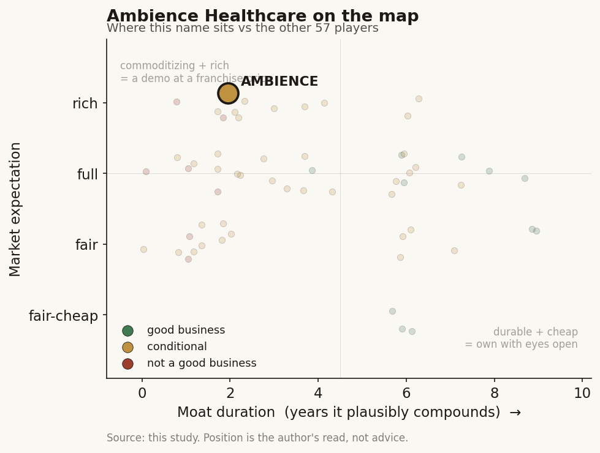

# Ambience Healthcare (private)

> **The read.** A conditional value-capturer: the scribe leg is a rented slot (a feature), while the coding/CDI attach is the one leg with a durable shape - real but unproven at price and under-capitalized against both Epic and Abridge. Grade C+, confidence medium.

**Snapshot**

| | |
|---|---|
| Listing | private |
| Region | US |
| Value-chain layer | L6 (clinical-workflow) |
| Archetype | workflow (SaaS) with a partial reach into savings-share via coding/CDI |
| Size | ~$1.25bn post-money (Series C, July 2025) |
| Revenue (latest) | ARR ~$30m (May 2025), from ~$19m end-2024 - private, unaudited |
| Moat verdict | conditional (scribe leg commoditizing, coding/CDI leg durable) |
| Expectation | rich (~40x ARR) |
| Evidence quality | med |

## What it is
Enterprise ambient-AI documentation platform for health systems: it listens to the clinician-patient encounter and drafts the structured note back into the EHR, then extends into point-of-care medical coding and clinical-documentation-integrity (CDI). It is the coding-attach scribe - the one L6 name whose product deliberately reaches toward the reimbursement dollar, not just the note.

## Business model - how it makes money
Per-seat / per-provider-per-month enterprise SaaS sold to health systems, land-and-expand from a pilot department to enterprise rollout. The buyer (the health system) is the beneficiary and no reimbursement code is needed to get paid - the two traits that make workflow-SaaS durability structurally high. Capital-light in the classic sense (no wet lab, no reagents, no inventory), but not zero-marginal-cost: per-encounter LLM inference is a real usage-scaling COGS, and enterprise sales + Epic integration + clinical change-management are heavy to land a system. The distinctive leg is the coding/CDI attach - surfacing ICD-10/CPT codes and E/M-complexity capture at the point of care - which shades the model toward savings/revenue-share: third-party-validated ROI of ~$13,000 additional revenue per clinician/yr and ~$1,907/clinician/yr of incremental E/M coding complexity captured. This is the higher-value, less-commoditizable step - the one place an L6 scribe touches the money rail.

## Financial summary
No public financials exist. This is a funding / valuation / backer table plus the revenue physics, not an income statement.

| Round | Date | Amount | Valuation | Lead / notes |
|---|---|---|---|---|
| Series A | Apr 2022 | ~$30m | - | - |
| Series B | Feb 2024 | $70m | ~$300m | - |
| Series C | July 2025 | $243m | ~$1.25bn post-money | Co-led by sell-side venture (Oak HC/FT and a16z) |
| Total raised | since 2020 | ~$373m | - | - |

Existing backers rolling into Series C: OpenAI Startup Fund, Kleiner Perkins, Optum Ventures. New: Frist Cressey Ventures, Town Hall Ventures, Smash Capital, Georgian, Founders Circle Capital.

Revenue (private, unaudited): ARR ~$19m end-2024 rising to ~$30m May 2025. At a $1.25bn mark on ~$30m ARR that is ~40x ARR - a venture mark struck ~6 months before Epic entered the category natively (4 Feb 2026), the same peak-mark timing flagged for Abridge ($5.3bn / June 2025).

## Value-chain position and competition
Sits at the L6 clinical-workflow layer, on top of the L0 EHR/cloud rails (Epic, Oracle Health/Cerner, Azure). What flows in: the encounter audio + the patient chart context; what flows out: a structured note into the EHR, plus a coded, CDI-checked documentation artifact that feeds the L8 revenue-cycle / claims-to-cash layer. The scribe leg captures no reimbursement dollar directly and rents its distribution through Epic's integration surface (Toolbox / Haiku / Ambient Module - Ambience is an admitted Toolbox participant, i.e. a tenant of the rail). The coding/CDI leg is the one that reaches down the value chain toward the payer dollar - the input Epic's generalist tool does not natively own as cleanly.

Share snapshot 2026 (treat as estimate): Abridge ~30%, Ambience ~13%, Suki ~10%, plus Microsoft DAX/Dragon Copilot (600+ systems), Nabla, Commure, Amazon HealthScribe (arms-dealer API), a budget tail. The change agent: Epic launched native AI Charting on 4 Feb 2026 (42% acute-EHR share, 55% of beds) into notes AND orders/diagnoses at a rumored ~$80/provider/mo vs incumbents' several-hundred - the distribution owner became the competitor. Ambience's edge is not transcription quality (that commoditizes toward the underlying LLM every vendor rents); it is (i) specialty depth - validated across 80+ specialties/subspecialties in the Cleveland Clinic pilot; (ii) the coding/CDI/RCM attach with CFO-approved, KLAS-validated ROI (St. Luke's: burnout −25%, patient face-time +23%; expanding to all clinicians across 370 clinics / 8 medical centers); and (iii) enterprise wins as the deep-integration pick - Cleveland Clinic selected Ambience as a five-year choice over four other scribes.

## Moat
The applicable verdict is workflow embedding / distribution - conditional, and the condition splits Ambience's two legs to opposite sides of the same line:
- **Scribe leg → refuted (fragile, ~1-3yr rented slot).** It owns neither the model below (commoditizing LLM transcription) nor the distribution beside/above (rented from Epic via Toolbox). Epic's 4 Feb 2026 native launch is textbook platform envelopment made live.
- **Coding/CDI leg → the survivor side (~5-7yr owned workflow).** It re-plumbs the claims-to-cash / documentation-integrity rail and sits against the payer, whom Epic does not own. This is workflow ownership of a scarce input.
- **Is the moat real for a private at this stage? Conditionally, and unproven.** The single decisive number - audited NRR-at-price >110-120% through a renewal cycle despite Epic - is unobservable while private; the $1.25bn mark is seat-count growth, not price-durability, struck pre-envelopment. The moat is a hypothesis with the right shape (coding-attach = payer-side, harder to bundle away), not a demonstrated one. The first ambient-AI IPO S-1 is the referendum.

## Core variables
1. **NRR-at-price post-Epic (the single decisive number).** Does Ambience hold NRR >110-120% at price once Epic's ~$80 native option resets the anchor? Everything - the ~40x mark, the moat verdict, the IPO - rests here. Currently unobservable (private).
2. **Coding/CDI monetization depth vs the scribe commodity.** How much of revenue migrates to the payer-facing coding/CDI/RCM attach (the survivor leg) vs the enveloped transcription leg. The $13k + $1,907/clinician ROI is the differentiator - is it a durable revenue-share the platform can't clone, or a feature Epic adds next?
3. **Enterprise switching cost / renewal at the flagship logos.** Do Cleveland Clinic / St. Luke's / Memorial Hermann / UCSF renew at price on multi-year deep-integration deals, or reassess against the Epic bundle on cost + security + one-vendor simplicity?

Second-order (noise excluded from the thesis): inference-COGS trajectory; VC crowding / peak-mark risk (~$1.6bn poured into the sub-sector through Sep '25); Epic Toolbox terms - privilege vs throttle; specialty-breadth defensibility.

## Bear case / key risks
A feature, not a company, sandwiched by the two layers it does not own - the commoditizing LLM below and the Epic rail above - with the landlord now the competitor (4 Feb 2026, ~$80 vs several-hundred, pushed into orders/diagnoses). At ~$30m ARR and a $1.25bn mark (~40x), the valuation is a peak-hype venture multiple struck the quarter before platform envelopment went live; it trails Abridge ~30% vs ~13% on share and is out-capitalized (Abridge ~$773m raised / $5.3bn vs Ambience ~$373m / $1.25bn), so it fights the envelopment war from the smaller balance sheet. Growth to date is seat-count, not price, and there is no CPT/coverage anchor to hide behind - nothing gates a switch except integration friction Epic controls. Even the coding/CDI survivor thesis is unproven at price and is the exact leg Epic (which owns the chart) is best positioned to bundle next. Break the bear: an IPO S-1 (or credible disclosure) showing NRR durably >110-120% at price through 2026-27 because the coding-attach created switching costs Epic's generalist tool cannot match.

## The expectation read
The ~40x ARR mark ($1.25bn on ~$30m ARR) implies the market is pricing Ambience as a durable enterprise-workflow franchise with pricing power that survives the platform owner - i.e. it is paying for the coding/CDI survivor thesis as if it were already demonstrated. That belief looks soft on three counts: the mark was struck ~6 months before Epic's native 4 Feb 2026 launch reset the price anchor to ~$80; growth to date is seat-count, not price-durability; and the one number that would validate the thesis (NRR >110-120% at price through a post-Epic renewal cycle) is unobservable while private. The expectation is rich for a value-capture case that is still an option, not a proven annuity.

## Verdict
Conditional value-capturer - leaning demo-on-the-scribe-leg, real-only-on-the-coding-leg. Grade C+, confidence medium. The scribe is a rented slot (feature); the coding/CDI attach is the one leg with a durable shape, but it is unproven at price and under-capitalized against both Epic and Abridge - a real option on the survivor leg at a rich (~40x) expectation, not yet a demonstrated durable franchise.
