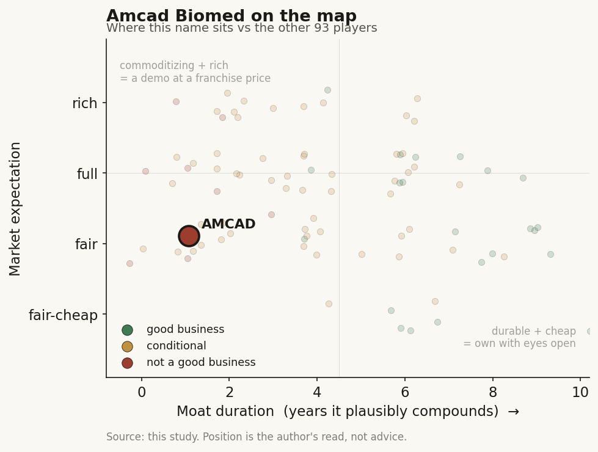

# Amcad Biomed (4188 TT)

> **The read.** A genuine world-first ultrasound-CAD franchise with real clearances but shrinking NT$30m revenue and no company-captured moat - a survivable micro-cap that is a positioning marker, not an investable long, gated on a single binary NHI reimbursement vote.

**Snapshot**

| | |
|---|---|
| Listing | 4188 TT / TPEx (Taiwan) |
| Region | Taiwan |
| Value-chain layer | L3-L4 (interpretive / assay-design layer - ultrasound CAD) |
| Archetype | SaMD (regulated software-as-a-medical-device, per-scan/per-test economics) |
| Size | ~NT$700m market cap (2026-07-03) |
| Revenue (latest) | FY2025 NT$30.44m; 8M2026 NT$31.53m, -9.82% YoY (shrinking) |
| Moat verdict | commoditizing - no durable, company-captured moat |
| Expectation | fair |
| Evidence quality | low-med |

## What it is

Ultrasound computer-aided-diagnosis (CAD) software pure-play - AI that reads ultrasound images to detect and quantify lesions (thyroid nodules, breast, upper-airway for sleep apnea). Chinese name 安克生醫; part of the 美吾華懷特安克生技集團 (Maywufa / PhytoHealth / Amcad group), chaired by 李伊俐 [reported]. It is a vendor selling SaMD into hospitals, not an operator of imaging centres.

## Business model - how it makes money

Sells/licenses SaMD modules that bolt onto third-party ultrasound machines. Six product lines - 甲狀偵 (AmCAD-UT, thyroid), 呼止偵 (AmCAD-UO, sleep apnea), 細偵, 乳安偵 (breast), 彩優, and a backscatter tissue-imaging platform - of which 4 carry US FDA 510(k) plus CE and TFDA [disclosed]. Newest push is AmCAD-UT LIVE, a handheld POCUS bundling the thyroid AI onto a probe [reported].

Who pays today: hospitals/clinics pay directly for the software/licence - a self-pay B2B model, because there is no NHI code yet. Gross margin is ~33% [disclosed via statementdog] and the model is loss-making, so the incremental economics only turn attractive if a per-scan reimbursement code converts self-pay pilots into recurring volume. Roughly 80% of revenue currently comes from 甲狀偵 (thyroid), with 呼止偵 (sleep apnea) positioned by management as the next growth leg [reported]. The whole equity story hinges on flipping thyroid CAD from self-pay to reimbursed: 甲狀偵 was submitted to 健保署 (NHIA) in March [2025] and made the 「擬新增給付項目」 (proposed-new-reimbursement) list, awaiting the year-end 共擬會議 (共同擬訂會議) vote [disclosed]. In 2025 the product formally entered the NHI 健保沙盒 (reimbursement-sandbox) program, with management guiding a year-end 共擬會議 review and possible coverage inclusion by end-2025 [reported]. As of this writing that decision is not confirmed passed - treat it as pending. [unverified whether it cleared]

## Financial summary

| Metric | FY2025 | 8M2026 (Jan-Aug) | Latest monthly |
|---|---|---|---|
| Revenue | NT$30.44m [disclosed] | NT$31.53m, -9.82% YoY [disclosed via Genet] | May-2026 NT$2.18m, -8.7% YoY |
| EPS | -NT$0.88 [disclosed] | Q1'26 -NT$0.21 (Q4'25 -NT$0.22) | - |
| Gross margin | ~33% [disclosed via statementdog] | - | - |
| Dividend / P/E | none / no meaningful P/E | - | - |

Balance sheet: paid-in capital NT$633m; ~63.3m shares out; book value ~NT$8.23/share, P/B ~1.4x [disclosed]. Cash on hand reported >NT$500m [reported/unverified] - a multi-year runway on the current burn, which is the one balance-sheet comfort. Context: the base is not just tiny, it is shrinking, not inflecting. Sister TW SaMD name Ever Fortune AI (6841) at ~NT$374m FY25 revenue is ~12x this revenue.

## Value-chain position and competition

Sits at L3-L4 of the imaging-AI analog axis: it does not own the L2 instrument (that's the ultrasound OEM) and it does not own the L1 patient/data source (that's the hospital). Amcad occupies the interpretive/assay-design layer - the "detect-and-quantify" selection product that turns a raw ultrasound sweep into a structured lesion call. What flows in: ultrasound images from OEM machines inside hospitals. What flows out: a CAD read/score to the ordering clinician (endocrinology, breast, sleep, health-screening depts). It captures value only if that read commands a per-scan payment - which in Taiwan means the NHI 特材/service gate.

Competition:
- **vs other TW SaMD names:** distinct modality (ultrasound) from the listed peers - Acer Medical (6857) is retinal/fundus, aetherAI (7803) is digital pathology, Ever Fortune (6841) is broad imaging/CT-MR early-cancer. So Amcad is not head-to-head with them on the same scan; its differentiation is genuine (world-first FDA-cleared ultrasound CAD [disclosed/company claim]). But it is also the smallest and only shrinking of the group.
- **vs US/global players selling into TW:** ultrasound AI is a crowded global field (Koios, See-Mode, and the OEM in-box AI from GE/Philips/Samsung Medison/Canon). The strategic risk is OEM absorption - if GE/Philips embed "good-enough" thyroid/breast AI in the machine, a standalone CAD licence loses its reason to exist. Amcad's counter is to partner with an OEM on the POCUS bundle rather than fight the box - a tacit admission the standalone-software lane is narrow.
- **where the differentiation is genuine, not just first-mover:** the sleep-apnea line (呼止偵) is the clearest example of a category, not just a CAD skin. It is a no-overnight, ~10-minute ultrasound screen [reported] positioned against the incumbent alternative - an overnight in-lab polysomnography (PSG) sleep study. That is a different competitive set from thyroid CAD: the rival is a slow, capacity-constrained procedure, not an in-box AI feature, which is why the sleep line has drawn independent clinical validation (NTU Hospital health-management center: ~95% accuracy for severe cases; Stanford Sleep Center: >90% accuracy, published in JAMA Otolaryngology) and a Taipei self-pay billing code [reported]. It remains a smaller revenue contributor than thyroid today, but it is the one product where the moat argument rests on modality economics rather than on a regulatory clearance that peers can also obtain.

## Moat

Thin, and the honest read (Ch5) is that the durable moats here are real-but-not-investable-by-this-equity:
- **Regulatory stack** (4x FDA 510(k) + CE + TFDA) is genuine and non-trivial to replicate - but per Ch6, clearance is table-stakes, not a moat; it confers entry, not pricing power.
- **Hospital-data access:** Amcad trains on hospital images but does not own the data - the NHI image set (>3bn images since 2018) is a state-captured asset (Ch6 TW rule 5). No TW-listed name can build a proprietary imaging-data annuity off it. The data-flywheel that would be the moat sits with the state, not the company.
- **NHI relationship:** being on the 擬新增給付 list is a foot in the door, but the single-payer gate cuts both ways - one committee decides the whole TAM, and Amcad has no leverage over that vote. A "yes" is a step-change; a "no" leaves it self-pay-only at scale.
- **Distribution/installed base:** ~130 institutions across ~22 countries, ~30 in TW [reported] - real reach but shallow monetization (NT$30m rev proves the reach is not converting to dollars).

Net: the assets that look like moats (clearances, hospital footprint, single-payer data) are either table-stakes or owned by someone else. **Ch5 verdict: no durable, company-captured moat visible - commoditizing.**

## Core variables

1. **[CORE] NHI reimbursement decision on 甲狀偵** - the binary 共擬會議 vote (Ch6 TW rule 1). This is the single largest swing factor; a covered thyroid-CAD code converts self-pay pilots into recurring per-scan volume. Watch: did it clear year-end, and via which vehicle (特材 points vs service code), and - per Ch6 rule 2 - did it survive the "must-save-the-payer-money" RCT gate, which a diagnosis-only tool structurally struggles to pass.
2. **[CORE] Export ability beyond TW** - the Jordan royal-medical-system POCUS order + the plan to list on three international AI-marketplace platforms in 2026 [reported]. Because the TW TAM is capped and single-payer-gated, the upside case is overseas per-device/licence sales, not NHI points. Watch order-to-revenue conversion (so far the Jordan deal is "trial/採購試用," not booked scale).
3. **[secondary] OEM partnership terms on AmCAD-UT LIVE** - whether the POCUS bundle is Amcad-branded recurring revenue or a one-off OEM component sale; determines whether the software captures the value or the box does.

## Bear case / key risks

Revenue is ~NT$30m and declining YoY after a decade public - the product has not found a paying market at scale. The NHI thyroid decision could go "no" (or clear but be priced at a token 特材 point value, or fail the savings-RCT gate for a diagnosis-only tool), leaving the model self-pay-only. Ultrasound AI is commoditizing inside the OEM box, so the standalone CAD licence faces structural margin compression. The overseas "orders" are trials, not booked revenue. The one thing keeping the lights on is a large cash balance relative to burn - this is a survivable micro-cap, but "survivable" is not "investable." No analyst coverage means no independent check on management's roadmap.

## The expectation read

At ~NT$700m market cap on ~NT$30m of shrinking revenue and a P/B ~1.4x against ~NT$8.23/share book, the price sits close to book with a modest premium - the market is paying roughly for the cash and clearances, not for a reimbursement win. That reads as a fair expectation: the multiple is not pricing in a passed NHI thyroid code (which would be a step-change), but it is also not pricing the name for distress, because the >NT$500m cash balance gives multi-year runway. Where the belief looks soft: any premium above book is implicitly underwriting the export/NHI optionality, and both load-bearing catalysts (the reimbursement vote and export-order conversion) are currently unbooked and undecided. NO buy/sell advice.

## Recent developments (2025-2026)

The 2025-2026 flow does not change the core read - revenue is still sub-NT$35m and the NHI thyroid vote is still the one binary that matters - but it fills in the pipeline and the export path, and it is worth logging what moved.

- **NHI reimbursement track (甲狀偵), 2025:** the thyroid product formally entered the NHI 健保沙盒 (reimbursement-sandbox) program in 2025, with management guiding a year-end 共擬會議 (共同擬訂會議) review and possible inclusion in NHI coverage by end-2025 [reported, Sep-2025]. The actual committee outcome is not confirmed in public sources as of this writing - treat the coverage decision as still [unverified], exactly as the core-variables section frames it. This remains the single load-bearing catalyst.

- **Sleep-apnea line (呼止偵) gained real clinical and billing traction:** it holds a Taipei self-pay code (北市自費碼) and has been adopted by the NTU Hospital (台大) health-management center plus several private clinics [reported, 2024-2025]. An NTU study reported ~95% accuracy for severe patients, and the Stanford Sleep Center collaboration reported >90% accuracy and was published in JAMA Otolaryngology [reported]. Amcad also disclosed a new US patent and an insurance-reimbursement application tied to the Stanford deployment [reported, Sep-2025]. This is the most-validated product in the book, though still a minority of revenue.

- **Overseas / platform push, 2026:** management set a 2026 goal to list on three international AI-marketplace platforms ("app-store for healthcare" model), and disclosed an NDA plus API integration with Germany's DeepC platform and a 100-case clinical trial at Brazil's Einstein Hospital [reported, Jan-2026]. The company planned a HIMSS exhibit in March-2026 to push system-integration commercialization [reported]. The handheld POCUS (AmCAD-UT LIVE) drew a Jordan government procurement order, still described as trial/installation rather than booked scale [reported].

- **New module in the pipeline:** the breast product (乳安偵) integrated with ultrasound and is guided to enter its certification phase in 2026 [reported], alongside the thyroid ultrasound-integration certification step. No approval or revenue attached yet.

- **Financials stayed tiny and lumpy:** FY2025 revenue was NT$30.44m [disclosed]. Early-2026 monthly prints swung - Jan-2026 revenue rose ~26.5% YoY off a small base, but Mar-2026 fell ~13.1% YoY and 1Q26 cumulative revenue was down ~5.83% YoY [disclosed via revenue trackers]. The pattern confirms the profile's read: the base is small and not yet inflecting, and no single 2025-2026 datapoint changes the "shrinking, cash-cushioned micro-cap" characterization.

Net: the pipeline is broader and better-validated than the headline NT$30m suggests (sleep-apnea peer-reviewed accuracy, an export/platform lane, a breast module), but every 2025-2026 item is either pre-revenue, a self-pay/trial order, or an [unverified] reimbursement decision - none of it has yet converted to booked scale. Coverage remains thin: still effectively zero sell-side coverage to triangulate against.

## Verdict

**PASS as an investable long - positioning marker only.** A genuine world-first ultrasound-CAD franchise, but not a good business at this scale: revenue is shrinking, the apparent moats are table-stakes (clearances) or state-owned (data), and the thesis is a single binary NHI vote. Conditional-watch on exactly one catalyst: a paid NHI thyroid-CAD code that clears the savings gate. **Data-confidence: LOW-MED** - financials are audited and clean, but forward reimbursement is undecided, export orders are unbooked trials, and there is effectively zero sell-side coverage to triangulate against; the reimbursement-outcome and export-conversion claims are the load-bearing unknowns and both are currently [unverified].
