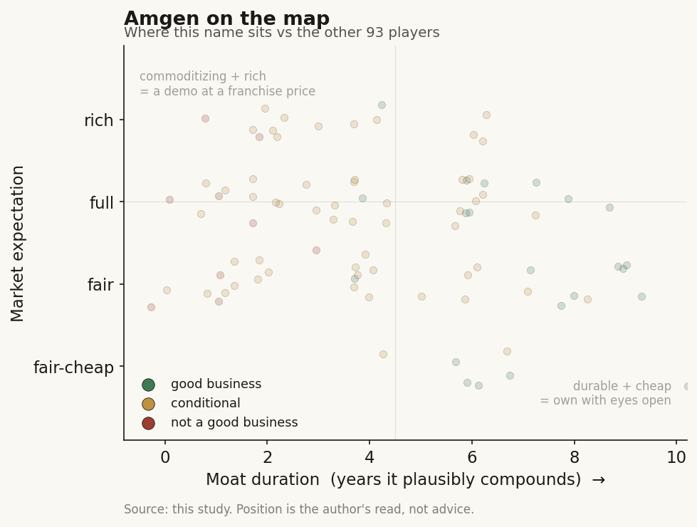

# Amgen (AMGN / NASDAQ)

> **The read.** A ~$200bn biotech incumbent that is the study's key point with a twist - it does not just FUND external AI, it OWNS the scarce input (deCODE's human-genetics data) and runs the AI in-house, and it still keeps the value because it - not any model - bears the Phase-II risk and owns the reimbursed molecule. AI here is a cost-and-cycle-time lever inside a $7.2bn R&D line; the equity is a MariTide-obesity and patent-durability question, and the AI content is a rounding error inside it.

**Snapshot**

| | |
|---|---|
| Listing | AMGN / NASDAQ |
| Region | US |
| Value-chain layer | L9 incumbent (owns targets, trials, approval, distribution - AND generates its own discovery data) |
| Archetype | pharma-incumbent (a risk-bearing drug owner that builds AI internally rather than only buying it) |
| Size | ~$200bn market cap (~$370/sh, 6-Jul-26) [reported] |
| Revenue (latest) | FY25 $36.8bn (+10%); product sales $35.1bn (+10%) [disclosed] |
| Moat verdict | durable at the franchise/regulatory level; the data asset is a real edge, the AI itself is not the moat |
| Expectation | fair-to-full - priced on obesity optionality and pipeline, not on AI |
| Evidence quality | high (large-cap, fully disclosed) |

## What it is
One of the world's largest biotechnology companies - discovery, development, manufacturing, and global commercial supply of biologics and small molecules across bone health, cardiovascular, inflammation, oncology, rare disease, and now obesity. For this study it is an INCUMBENT that AI-discovery labs sell into - but a distinctive one. Amgen does not only rent frontier models; it generates its own discovery-grade data (it has owned deCODE genetics since 2012) and runs heavy internal AI/ML across discovery and manufacturing. It owns the expensive, value-capturing end of the chain: it picks targets, runs trials, wins approvals, and controls manufacturing and distribution. AI sits upstream of all of that as an internal efficiency tool. The reason Amgen matters to a healthcare-AI reader is that it is the cleanest example of the study's frame turned up one notch - the incumbent funds AND builds the AI, and still keeps the value.

## Business model - how it makes money
Sell patented biologics and small molecules at high gross margin, defend them with IP + regulatory approval + payer reimbursement + a global salesforce + hard-to-copy biologics manufacturing, and replace them as patents and exclusivity roll off. FY25 non-GAAP operating margin was 46% [disclosed] - the value is captured at the branded-monopoly stage, not in discovery. Two structural facts frame the equity:

- **Broad, no-single-drug concentration (unlike Merck's Keytruda).** 14 products cleared $1bn in FY25; the largest, Prolia, was $4.4bn (~12% of revenue) [disclosed]. That diversification is a strength - but it also means no single new asset re-rates the stock except one: obesity.
- **The obesity bet (MariTide).** A monthly GIPR/GLP-1 injection now in nine Phase-3 obesity studies, positioned as the "best monthly or less-frequently-dosed" agent versus Lilly's and Novo's weekly shots [reported]. Phase-2 showed up to ~20% weight loss at 52 weeks [disclosed], below Lilly retatrutide's ~28% late-stage figure [reported]. This is the one variable that can move a ~$200bn cap.

Where AI fits: on the COST side, not the revenue side. Internal AI is meant to raise hit-rate and speed in early research and manufacturing so the pipeline arrives sooner and cheaper. It does not change the archetype - Amgen still bears the ~40% Phase-II efficacy risk no AI lab has moved, and still pays the trial and manufacturing bill. That is exactly why the incumbent keeps the value: it takes the risk the AI does not.

## Financial summary
Top-line scale, kept tight - the AI figures are immaterial next to it.

| Metric | Figure |
|---|---|
| Market cap | ~$200bn (~$370/sh, 6-Jul-26) [reported] |
| FY25 total revenue | $36.8bn, +10% YoY [disclosed] |
| FY25 product sales | $35.1bn, +10% (13% volume, -3% price) [disclosed] |
| FY25 non-GAAP R&D | $7.183bn, +22% YoY (a record) [disclosed] |
| FY25 GAAP EPS | $14.23 (+88%); non-GAAP EPS $21.84 (+10%) [disclosed] |
| FY25 GAAP net income | ~$7.7bn [reported] |
| FY25 non-GAAP operating margin | 46% [disclosed] |
| Shares outstanding | ~538m; avg diluted ~542m (FY25) [disclosed] |
| FY26 guidance | revenue $37.0-38.4bn; non-GAAP EPS $21.60-23.00 [disclosed] |

AI figures, for scale contrast (all internal/partner infrastructure, not a revenue line):
- **deCODE genetics (owned since 2012, ~$415m acquisition) [reported]** - a proprietary human-genetics dataset: >200 petabytes of de-identified data on nearly 3m individuals [disclosed]. This is the scarce input; most incumbents rent it, Amgen owns it.
- **NVIDIA "Freyja" SuperPOD (announced Jan-2024)** - 31 DGX H100 nodes / 248 GPUs installed at deCODE in Reykjavik to build a human-diversity atlas for target and biomarker discovery [disclosed]. No dollar figure disclosed.
- **AMPLIFY protein language model (co-developed with Mila)** plus a generative-biology platform Amgen says tripled protein-engineering speed and roughly halved discovery timelines [reported - company claim, not audited].
- **OpenAI (ChatGPT Enterprise, scaled company-wide) and an expanded AWS pact** for generative-AI in clinical trials, regulatory filings, and manufacturing throughput [disclosed].

Read the contrast directly: R&D is $7.2bn/yr; the AI is a cluster of ~248 GPUs plus enterprise software licenses folded inside that R&D and SG&A. There is no separate disclosed "AI capex" line - which is the point. For an incumbent, AI is opex inside the research budget, not a standalone build.

## Value-chain position and competition
Amgen sits at the far-downstream L9 incumbent node: it owns targets, trials, approvals, biologics manufacturing, and global distribution/pricing. What is unusual is that it also sits partly UPSTREAM of its own AI - deCODE generates the human-genetics data that its internal models train on, so Amgen is its own L9b/L9c data supplier. External AI-discovery labs (Isomorphic, Recursion, Xaira, Iambic, and the tool vendors) still sit upstream at structure/generation/selection and could sell candidates INTO Amgen - but Amgen buys less of that than a Pfizer or Merck because it grows more of the input itself. The value in a drug forms one layer down from any model - in the owned, de-risked, approved asset the incumbent carries through the clinic and sells behind exclusivity. That is where Amgen lives.

What flows in: proprietary genetics/omics data (deCODE), designed candidates, and target hypotheses. What flows out: approved branded biologics, priced and distributed globally. The AI (internal or vendor) captures no franchise; Amgen captures the franchise.

Competition is at two levels:
- **As a pharma/biotech incumbent:** the same large-caps running the identical playbook - Lilly, Novo Nordisk, Merck, Pfizer, J&J, AstraZeneca, Novartis. In obesity specifically the real fight is Lilly (Zepbound/retatrutide) and Novo (Wegovy), who own the market and show higher weight-loss numbers. This is the competitive set for the equity.
- **As an AI-discovery buyer/builder:** the AI labs are suppliers or targets, not competitors, to a company at Amgen's layer. Its structural edge over them is permanent - capital, regulatory relationships, the trial machine, biologics manufacturing, and a proprietary data asset the labs will never cheaply build.

## Moat
Two moats, and only the old one is real for the equity:
- **Franchise + IP + biologics manufacturing + distribution - DURABLE (staggered, ~10-15+ yr per asset).** Patent + approval + reimbursement + hard-to-copy biologics supply + a balance sheet that absorbed the ~$28bn Horizon acquisition. None of this is AI-erodable. A startup with a better model still has to run the trials, win approval, manufacture the biologic, and get paid by payers - or sell the asset to a company like Amgen.
- **The proprietary DATA asset (deCODE) - a REAL but narrow edge (not a compounding moat).** Owning >200 PB on ~3m people is a genuine advantage most incumbents lack, and it feeds better target selection. But it improves the odds at the CHEAP front of the funnel (target/biomarker discovery), not the ~40% Phase-II efficacy wall where value and failure concentrate. It widens the cost gap versus a data-poor rival; it does not create new drug exclusivity by itself.
- **The AI models themselves - NOT a moat (~0 yr).** AMPLIFY, generative-biology tooling, and licensed OpenAI/AWS capability are commoditizing inputs available to every large-cap; the open frontier catches them within ~a year. The defensible layer is the DATA the model trains on and the assets it feeds - not the model.

Net: the durable moat is the biotech franchise (IP + biologics manufacturing + distribution); the deCODE data is a real secondary edge; AI is a shared efficiency tool. The study's thesis holds - value pools at the party that owns the reimbursed molecule, the data, and the capital, not the party that owns the model.

## Core variables
1. **[CORE] MariTide obesity outcome.** Whether the monthly GIPR/GLP-1 hits Phase-3 efficacy, tolerability, and dosing-convenience good enough to take share from Lilly/Novo. Phase-2 ~20% weight loss trails retatrutide's ~28% [reported]; the whole obesity re-rate rests here. This single variable dominates the equity; AI is downstream noise beside it.
2. **[CORE] Base-franchise durability + Horizon integration.** Whether the diversified base (Prolia/Evenity bone, Repatha cardio, Tezspire/Otezla inflammation, oncology, plus the rare-disease assets bought with Horizon) holds against biosimilar and patent erosion and services the acquisition debt. Steady, unglamorous, and the reason the stock is not a pure obesity option.
3. **[CORE] Does AI/deCODE actually bend R&D productivity?** The falsifiable claim is that owning the data + internal models shows up as lower R&D-per-approval or faster cycle time. If it only saves scientist-hours inside a rising $7.2bn R&D line while the Phase-II wall is unmoved, AI is a rounding-error efficiency story, not a re-rating catalyst.

Below the line as noise for the equity: any single AI headline (Freyja GPUs, AMPLIFY, the OpenAI/AWS pacts); "tripled protein-engineering speed" productivity claims with no approved-drug proof; biosimilar and animal-adjacent quarter-to-quarter.

## Bear case / key risks
The bear case has almost nothing to do with AI. It is (1) obesity: MariTide is late to a market Lilly and Novo already own, with weight-loss data (~20%) below the leading next-gen competitor (~28%), so it may win a niche rather than the market the ~$200bn cap partly prices; (2) the base: a diversified franchise facing normal biosimilar/patent erosion, carrying meaningful post-Horizon debt, where several $1bn products are maturing. On AI specifically the risk is the opposite of the hype: the internal AI and the deCODE data touch the CHEAP front of the funnel, not the Phase-II biology that governs approvals - so if management or the market ever prices AI/genetics as a growth driver rather than a cost-and-selection lever, that expectation is unsupported by the base rate (zero AI-discovered drugs approved industry-wide as of 2026).

Falsification watch: (1) MariTide Phase-3 efficacy/tolerability disappoints or dosing convenience fails to offset lower weight loss - the obesity leg of the thesis breaks; (2) base-franchise erosion outruns new launches while debt service bites - the "diversified safety" case weakens; (3) conversely, if deCODE-fed internal AI is shown to lift Amgen's Phase-II success rate on a real sample, the "AI is only front-of-funnel" frame - and this profile's core claim - would need revisiting.

## The expectation read
At ~$370 and ~$200bn cap on ~$37bn revenue and ~$21.84 non-GAAP EPS (FY25), Amgen trades around a market-typical earnings multiple - the tape is pricing a durable, diversified biotech with an obesity call option, NOT an AI story. The price appears to assume the diversified base holds and MariTide wins a real slice of obesity; almost none of the multiple is AI. That is the study's point in one company: the incumbent that both funds AND builds the healthcare AI - owns deCODE, runs Freyja, ships internal generative biology - gets essentially zero AI premium, because the value the AI creates flows into the drug, and the drug's value is set by Phase-II biology, reimbursement, and the obesity race, not by the model. The belief embedded in the price is "diversified compounder plus an obesity lottery ticket" - so the asymmetry is MariTide, and AI is upside the market is not paying for and, on the current evidence, should not.

Where the belief looks soft: the obesity leg has to clear a higher bar than Phase-2 showed, against two entrenched leaders, for the option to pay.

## Verdict
**Good, durable, diversified biotech franchise - fairly-to-fully priced on pipeline and an obesity option, not on AI. Amgen is the study's incumbent case with a twist: it does not merely rent commoditizing models, it OWNS the scarce input (deCODE's >200 PB genetics data) and builds AI in-house across discovery and manufacturing - and it still keeps all the value at L9 because it, not any model, bears the Phase-II risk and owns the reimbursed molecule, the manufacturing, and the distribution. The proprietary data is a real secondary edge; the AI itself is a shared cost-and-selection lever that touches the cheap front of the funnel, never the binding constraint. The equity is governed by MariTide and base durability, not by GPUs. Confidence: HIGH on the framing (incumbent captures value, data is the edge not the model, ~market multiple = pipeline pricing not AI pricing) and on the disclosed FY25 financials; MEDIUM on the verdict, which hinges on the MariTide obesity readout and base-franchise durability, not on anything AI resolves.**
