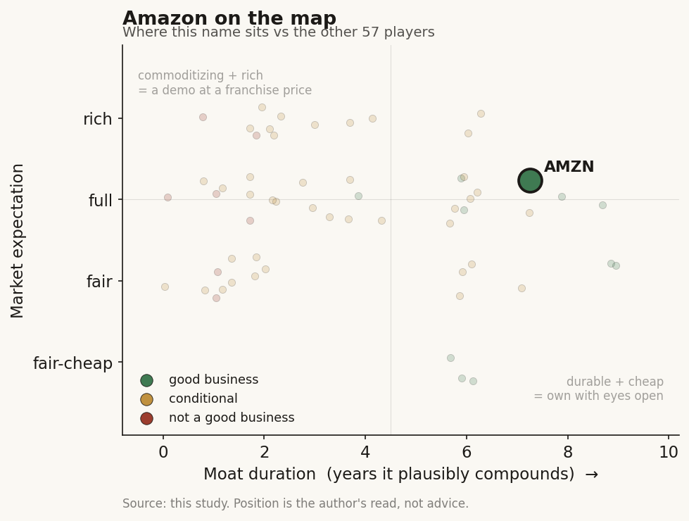

# Amazon (AMZN)

> **The read.** A genuine, durable L0 compute toll (AWS) trading at a full expectation that has quietly shifted the risk from "will it grow" to "will the $200bn AI build earn its cost of capital before depreciation catches the margin" - the One Medical/HealthScribe healthcare angle is a strategic wedge, not a value driver.

**Snapshot**

| | |
|---|---|
| Listing | AMZN / Nasdaq |
| Region | US |
| Value-chain layer | L0 - infrastructure spine (compute/storage/inference rails) |
| Archetype | infra (infrastructure toll) |
| Size | ~$2tn+ market cap |
| Revenue (latest) | FY25 net sales $716.9bn, +12% YoY |
| Moat verdict | durable (AWS toll ~5-10yr); healthcare-specific moat ≈ 0 |
| Expectation | full |
| Evidence quality | high |

## What it is
A ~$720bn-revenue retail + cloud + advertising conglomerate whose healthcare footprint is two small, non-broken-out lines: One Medical (owned membership primary-care clinics, bought for $3.9bn in Feb 2023) and AWS HealthScribe (a pay-as-you-go generative-AI clinical-documentation API, i.e. an arms-dealer, not an app). Neither moves the AMZN P&L; both are strategic wedges into a healthcare TAM.

## Business model - how it makes money
The consolidated business - what you actually own - posted FY25 net sales of $716.9bn (+12% YoY) and FY25 operating cash flow of $139.5bn (+20%). Q1'26 net sales were $181.5bn (+17%) with operating income of $23.9bn at a record 13.1% margin. The profit engine is AWS: Q1'26 revenue $37.6bn (+28% YoY, the fastest in 15 quarters, ~$150bn run-rate), operating income $14.2bn at a 37.7% margin. AWS is ~21% of revenue but the large majority of operating income - that is the real infrastructure toll (every layer above pays for compute; usage-gated, reimbursement-independent).

Growth quality - capital just went from light to hungry. FY25 property-and-equipment purchases ran $128.3bn TTM (+65%), almost all AI infra; FY25 free cash flow collapsed to ~$11bn from ~$38bn, and a quarterly FCF print fell to ~$1.2bn. Management guides ~$200bn 2026 capex. So the toll business is compounding at a high margin but is being force-fed a balance sheet: AWS segment margin already slipped -140bp (39.1%→37.7%) on early AI-infra depreciation. Cash conversion (OCF/sales ~19.5%) is strong; free-cash conversion is temporarily wrecked by the capex cycle. Incremental ROIC on the AI build is the open question - it is being underwritten by named commitments (a reported >$100bn OpenAI agreement), not proven yet.

The healthcare lines, in real figures: One Medical entered Amazon with ~815k members, 200+ offices in 27 markets, FY22 revenue ~$1.05bn (+68%) but a $398m net loss / -14% adj-EBITDA margin - a loss-making owned-clinic business (closer to a services/at-risk model than a toll). HealthScribe is priced $0.001667/audio-second (~$0.10/min; a 15-min visit ≈ $1.50) - pure usage-billed API COGS-plus, immaterial revenue.

## Financial summary

| Metric | FY22 (One Medical standalone) | FY25 (consolidated) | Q1'26 (consolidated) |
|---|---|---|---|
| Net sales | - | $716.9bn (+12% YoY) | $181.5bn (+17%) |
| AWS revenue | - | - | $37.6bn (+28% YoY, ~$150bn run-rate) |
| AWS operating margin | - | - | 37.7% ($14.2bn op income); -140bp from 39.1% |
| Consolidated op margin | - | - | 13.1% ($23.9bn op income), record |
| Operating cash flow | - | $139.5bn (+20%) | - |
| Capex (PP&E) | - | $128.3bn TTM (+65%); ~$200bn 2026 guide | - |
| Free cash flow | - | ~$11bn (from ~$38bn prior) | ~$1.2bn quarterly print |
| One Medical revenue | ~$1.05bn (+68%) | - (not broken out) | - |
| One Medical net loss | -$398m (-14% adj-EBITDA margin) | - | - |

## Value-chain position and competition
AMZN sits at L0, the infrastructure spine. AWS supplies the compute/storage/inference rails on which the L4-L9 healthcare-AI stack runs; HealthScribe is the L0 rail sold one layer up - the ambient-scribe apps (Abridge, Ambience, Nabla) and any EHR vendor can build on HealthScribe rather than compete with it. Dollars flow up to AWS from every layer that trains/serves a model; HealthScribe converts a healthcare-specific inference workload into metered AWS consumption. One Medical is the anomaly - Amazon back-integrated down to the clinic itself, buying named-patient liability and a physician cost base, the opposite of a capital-light toll.

Competition splits by business:
- **AWS (the real business):** vs Microsoft Azure and Google Cloud - a stable oligopoly. Edge = installed base, breadth, and now custom silicon (Trainium/Inferentia) to defend margin against the compute-supplier toll. Genuine, durable, but not a healthcare story.
- **HealthScribe / Connect Health (arms dealer):** competes with Microsoft/Nuance DAX (Dragon Copilot on Azure) and Google MedLM at the platform layer, and is sold to the scribe apps (Abridge, Ambience, Nabla) that sit above it. Its edge is being the neutral rail; it captures the commoditizing transcription-to-note capability as metered inference rather than fighting the app war. The March 2026 packaging of this into Amazon Connect Health (five named agents - see Recent developments) hardens the arms-dealer position: ambient documentation and ICD-10/CPT coding sold as HIPAA-eligible AWS building blocks, not an app. [reported]
- **Health AI consumer assistant (new front door):** Amazon's Jan 2026 Health AI agent puts AMZN into a newly crowded consumer-health-assistant race against OpenAI (ChatGPT Health, launched Jan 7 2026) and Anthropic (Claude for Healthcare, Jan 2026). Amazon's differentiator is that it does not require users to upload documents - it reads One Medical records directly and can take action (book a One Medical visit, route a prescription to Amazon Pharmacy). Edge = owning the fulfillment tail (clinic + pharmacy + Prime), which the pure-model competitors lack; the risk is that the underlying answer quality is a commoditizing LLM capability. [reported]
- **One Medical (owned clinics):** competes with primary-care and value-based-care operators, health-system-owned primary care, and telehealth. Edge = Prime distribution ($9/mo or $99/yr membership, $199 non-Prime; 10,000+ employer sponsors), ~200 clinic locations nationwide, and consumer brand - real reach, but into a structurally low-margin, loss-making delivery business Amazon does not obviously run better than incumbents. It is still expanding the physical footprint (Hackensack Meridian Health partnership, Amazon Pharmacy Kiosks - see Recent developments), which deepens rather than reduces the named-patient cost base. [reported]

## Moat
Two different verdicts, because two different businesses.

AWS/HealthScribe is the surviving infra-toll moat - the "become the platform" case: AWS owns the compute rail the app layer rents. But the toll splits inside: model IP and the transcription capability commoditize in ~1 year; the durable slice is the scale + custom silicon + switching costs, ~5-10 years. HealthScribe itself is a thin metered pass-through, not a defensible franchise - its durability is inherited from AWS, not from anything healthcare-specific.

One Medical has no durable moat. It owns neither a reimbursement code/coverage rail nor a claims-to-cash plumbing asset; it rents the patient relationship the way ambient scribes rent the EHR slot. Prime distribution is a real customer-acquisition edge but not a compounding moat, and the clinic P&L is a services tail with named-patient liability. Verdict: clearance/commodity-side - the delivery layer does not clear the "owns a scarce input the platform can't replicate" bar.

Estimated durable duration: AWS toll ~5-10yr; healthcare-specific moat ≈ 0 (a distribution wedge riding the AWS moat, not its own).

## Core variables
Noise excluded (One Medical clinic count, HealthScribe price, retail GMV, ad growth - none are decision-relevant to the equity).
1. **AWS growth durability AND incremental ROIC on the $200bn capex cycle** - the master variable. Does 28% growth hold, and does the AI build earn its cost of capital before depreciation compresses the 37.7% margin further?
2. **Free-cash-flow trajectory through the capex peak** - FY25 FCF ~$11bn vs ~$38bn prior; whether OCF (~$140bn) outruns the spend or the balance sheet keeps absorbing it.
3. **AWS operating-margin path under early AI-infra depreciation** (already -140bp) - the tell for whether the toll stays high-margin or the silicon build dilutes it.

Held below the line: the entire healthcare footprint. For AMZN the healthcare businesses are strategically interesting but financially a rounding error - treating them as a core variable would be the "paying a healthcare-AI multiple for a compute toll" mispricing trap.

## Bear case / key risks
The healthcare bear is that neither wedge is a business: One Medical is a loss-making owned-clinic operation (-$398m FY22 net loss) in a low-margin delivery layer Amazon has not shown it can turn, and HealthScribe is a commoditizing metered API whose value accrues to AWS regardless of the healthcare label. The consolidated bear is sharper and is the one that matters: the AI capex supercycle has flipped AMZN from a cash machine to a cash furnace - capex +65% to $128bn TTM, ~$200bn guided for 2026, FCF collapsed ~70%, AWS margin already eroding on depreciation - and the returns are underwritten by forward commitments, not delivered ROIC. If AWS growth decelerates OR the AI build's utilization/ROIC disappoints, the market is holding a high-multiple name whose free cash flow has been mortgaged to a bet that has to pay off on schedule.

## The expectation read
The market prices AMZN as a re-accelerating AWS + AI-infra winner: 28% AWS growth, record 13.1% consolidated margin, and the belief that the $200bn capex converts to durable high-ROIC compute demand (the OpenAI-scale commitments are the evidence bulls point to). The multiple therefore implies the FCF collapse is a transient investment phase, not a structural return-erosion. Where the belief looks soft: (a) the -140bp AWS margin slip says depreciation is already biting; (b) FCF of ~$11bn against a ~$2tn+ cap means today's price is discounting AI monetization that is committed but not yet earned; (c) the healthcare optionality embedded in some bull cases is not yet a P&L contributor and should not carry weight. The soft spot is squarely incremental ROIC on the AI build, not the healthcare wedges.

## Recent developments (2025-2026)
The healthcare footprint got materially more active in 2025-2026, but the thesis is unchanged: these are strategic wedges, still not P&L drivers. Concrete, dated updates:

- **Health AI consumer agent launched (Jan 21, 2026).** Amazon rolled out "Health AI," an agentic assistant built on AWS Bedrock large language models, first inside the One Medical app for members. It reads a patient's own records (medical history, labs, medications, clinical notes via the Health Information Exchange), explains results, answers symptom questions, manages prescription renewals through Amazon Pharmacy, and books One Medical visits. It is explicitly not for diagnosis/treatment and is programmed with escalation protocols. [reported]
- **Health AI opened to all US customers (Mar 2026).** In mid-March 2026 Amazon expanded Health AI beyond One Medical members to any US customer on Amazon.com and the Amazon app - no One Medical or Prime requirement to use the assistant itself. [reported] Introductory Prime offer: up to five free direct-message care consultations with a One Medical provider for 30+ common conditions (cold/flu, allergies, UTIs, ED, hair loss, etc.), stated as up to $145 in value. [disclosed] Outside the offer, direct-message care is $29 per pay-per-visit; One Medical membership is $99/yr for Prime members vs $199 standard (50% off), with add-on family members at $66/yr. [disclosed]
- **This lands Amazon in the consumer-health-AI race with OpenAI and Anthropic.** OpenAI launched ChatGPT Health on Jan 7, 2026 and Anthropic released Claude for Healthcare shortly after; Amazon's Health AI arrived Jan 21, 2026. Amazon's stated edge is not needing document uploads (it reads records directly) and being "more actionable" via its clinic/pharmacy tail. [reported]
- **Amazon Connect Health reached general availability (Mar 2026).** AWS packaged healthcare-AI into a productized suite of five agents sold to healthcare organizations: Patient verification (GA), Appointment management (Preview), Patient insights (Preview), Ambient documentation (GA), and Medical coding (Preview, auto-generates ICD-10 and CPT codes with audit trails). It is HIPAA-eligible, integrates with Amazon Connect contact-center and via an SDK into EHR/clinician apps, and launched in US East (N. Virginia) and US West (Oregon). [disclosed] This is the L0 arms-dealer angle formalized - metered AWS consumption for healthcare workflow, not an owned-clinic bet.
- **HealthScribe added real-time streaming (Jan 29, 2025).** AWS HealthScribe gained streaming support to transcribe medical conversations in real time, extending the pay-as-you-go clinical-documentation API. [disclosed] Still immaterial revenue and still a metered pass-through to AWS.
- **One Medical kept expanding the physical/fulfillment footprint.** ~200 clinic locations nationwide as of the 2025-2026 reporting. Amazon Pharmacy Kiosks began rolling out at One Medical offices in greater Los Angeles from December (automated fill after a visit, virtual pharmacist by video/phone). [reported] One Medical also expanded via health-system partnerships - a Hackensack Meridian Health tie-up opened two New Jersey offices in early 2026 (a third in Englewood, NJ followed), and One Medical reportedly held specialty-referral agreements with 19 health systems as of 2024. [reported]

Read-through for the equity: none of this changes the placement. Health AI and Connect Health deepen the AWS-metered-inference and Prime-distribution wedges (mildly positive, still immaterial to a ~$720bn-revenue P&L), while the One Medical clinic/kiosk expansion deepens the named-patient cost base in a structurally low-margin delivery layer. The developments are real product motion, but the master variables remain AWS growth durability and incremental ROIC on the ~$200bn capex cycle, not the healthcare label.

## Verdict
Good business - AWS is a genuine, durable L0 toll with the surviving infra moat - at a full expectation that has quietly shifted the risk from "will it grow" to "will the $200bn AI build earn its cost of capital before depreciation catches the margin." The One Medical/HealthScribe healthcare angle is a strategic wedge, not a value driver, and should not be paid for as healthcare-AI. Confidence: high on the framework placement and on healthcare-immateriality; medium on the ROIC verdict - the capex cycle is mid-flight and the returns are committed but unproven.
