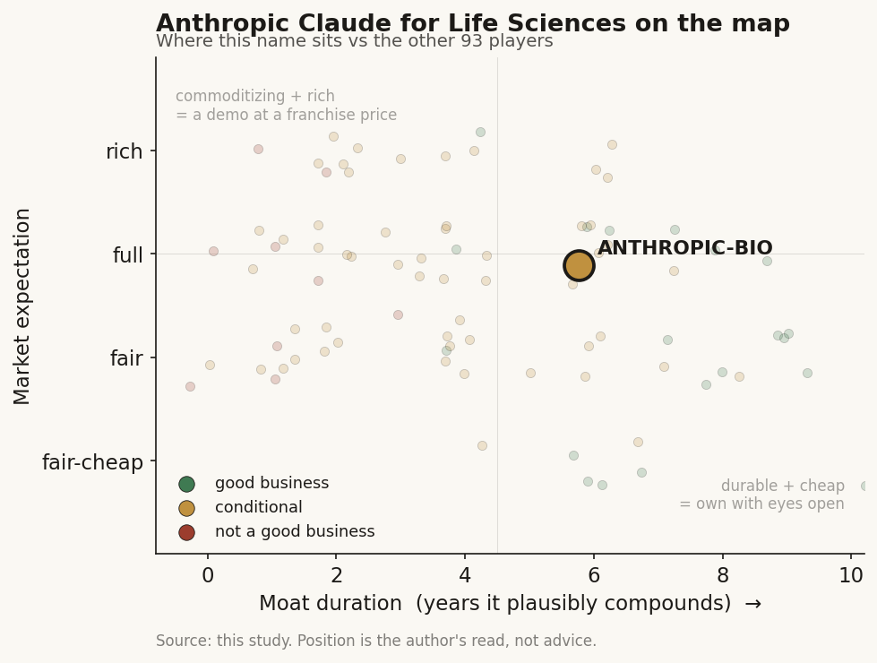

# Anthropic - Claude for Life Sciences (private)

> **The read.** A durable picks-and-shovels compute toll at the parent level, wearing a life-sciences costume that is today a feature-not-a-franchise, with an unproven, customer-conflicting drift toward drug-owner - good business, but a healthcare-AI expectation priced onto a frontier-model multiple.

**Snapshot**

| | |
|---|---|
| Listing | private (confidential IPO filing Jun 1, 2026) |
| Region | US |
| Value-chain layer | L9x / L0 compute-and-model spine |
| Archetype | infra (toll) - with an early drift toward drug-owner |
| Size | ~$965bn post-money (Series H, May 2026) |
| Revenue (latest) | ~$47bn run-rate annualized (May 2026), up from ~$9bn end-2025 |
| Moat verdict | conditional (durable for the parent, largely absent for the "Bio" story) |
| Expectation | full |
| Evidence quality | med |

## What it is
Claude for Life Sciences (launched Oct 20, 2025) is a vertical packaging of Anthropic's general Claude models for biopharma R&D - the same models everyone else runs, wrapped in domain connectors, agent skills, and (June 30 - July 1, 2026) the Claude Science workbench that acts as an "operating layer" for computational research the way Claude Code does for software. The surface widened through 2026: a Jan 11, 2026 release added a sibling "Claude for Healthcare" product (on Opus 4.5) plus reimbursement/clinical connectors (CMS Coverage Database, ICD-10, National Provider Identifier registry, ClinicalTrials.gov, Medidata, Open Targets, ChEMBL) and healthcare-specific evals (MedCalc, MedAgentBench, SpatialBench) [disclosed]. It remains a picks-and-shovels overlay on the frontier LLM, not a new biology model. There is no separately-funded "Bio" entity; the life-sciences push is funded off the parent's balance sheet.

## Business model - how it makes money
Primarily the infrastructure toll: usage-based API tokens (Opus 4.8 $5/$25 per MTok; Sonnet 4.6 $3/$15) plus an Enterprise seat (~$20/seat/mo base, April 2026) that layers context/audit/HIPAA-readiness on top of metered usage. Claude Science ships inside existing Pro/Max/Team/Enterprise plans - no premium SKU, no gating. The model is capital-light at the application margin (software) and capital-hungry at the substrate (compute/training is the real cost center, carried by the parent). The revenue physics tell the story: reimbursement-independent and usage-gated - it gets paid whether or not any customer drug ever clears Phase II.

## Financial summary
Private company, no income statement - funding / valuation / backers below, real figures only.

| Item | Figure |
|---|---|
| Latest round | $65bn Series H (May 2026) |
| Post-money valuation | ~$965bn |
| Round co-leads | Altimeter, Dragoneer, Greenoaks, Sequoia |
| Other participants | Capital Group, Coatue, D1, GIC, ICONIQ, XN; later-stage: Fidelity, T. Rowe, Baillie Gifford, Jane Street, MGX, Temasek |
| Run-rate revenue | ~$47bn annualized (May 2026), from ~$9bn end-2025 |
| IPO status | Confidential filing Jun 1, 2026 |
| Notable spend | ~$400m acquisition of Coefficient Bio (<10 staff, ~April 2026) |

## Value-chain position and competition
Sits at the L9x / L0 compute-and-model spine - the toll layer every drug-discovery layer above (L9a target-ID through L9e development) pays to run. What flows through: prompts and scientific context in (via 60+ connected databases - Benchling ELN, 10x Genomics single-cell, PubMed, Wiley Scholar Gateway, Synapse.org, BioRender, Databricks/Snowflake), tokens and drafted analysis out. It does not own an assay, a reimbursement code, a payer relationship, or (until recently) a clinical asset - it owns the model and the integration surface.

The frontier race is three-way, differentiated by go-to-market not capability: Anthropic = broad subscription access; OpenAI = domain-model + enterprise-gated; Google DeepMind = owns the foundational science models (AlphaFold) plus Gemini for Science with 30+ databases. Anthropic's stated edge is workflow depth and distribution - enterprise land-and-expand already proven (Sanofi ~60,000 employees on the Claude-based "Concierge"; BMS strategic deal across 30,000+ staff, May 2026 [reported]) - plus benchmark parity on domain QA (Sonnet 4.5 Protocol-QA 0.83 vs 0.79 human, 0.74 Sonnet 4 [disclosed]). The edge is real on distribution, thin on anything proprietary to biology.

OpenAI's answer sharpened the contest in 2026: it shipped GPT-Rosalind, a domain-specific model for biochemistry/genomics/protein engineering, on Apr 16, 2026, with named early partners (Amgen, Moderna, Thermo Fisher, the Allen Institute, Dyno Therapeutics), and separately signed Novo Nordisk (Apr 2026) across R&D/manufacturing/commercial [reported]. The competitive tell is customer overlap, not exclusivity: Sanofi runs the Claude-based Concierge and had a 2024 OpenAI/Formation Bio drug-discovery tie-up; Novo Nordisk appears as an Anthropic life-sciences customer and an OpenAI R&D partner [reported]. Pharma is multi-homing across frontier labs, which is exactly what a commoditizing-model, distribution-only edge predicts - the anchor logos are shared, not locked.

## Moat
Moat 2 (workflow embedding / distribution), conditional - and on the Ch5 test it lands on the fragile side for the science layer specifically. The scarce-input question: does Anthropic own something the layer above/below cannot cheaply replicate? The model commoditizes in ~1 year (open clones caught the AF3 frontier at >1000x lower cost) and Anthropic explicitly runs "the same Claude models available to everyone" - so the connectors/workbench are a convenience layer a well-capitalized rival (Google owning AlphaFold; OpenAI) can match. The one durable asset is the general enterprise foothold (Sanofi/BMS org-wide seats = real switching cost on the horizontal-productivity use case, ~5-7yr owned-workflow duration) - but that moat belongs to Anthropic-the-platform, not specifically to life sciences, and it is a per-seat productivity annuity, not a claim on drug value. The moat is real for the parent, largely absent for the "Bio" story.

The posture pivot to watch: the ~$400m acquisition of stealth biotech Coefficient Bio (<10 staff, absorbed into the healthcare team, ~April 2026) and the June 30, 2026 launch of an internal drug-discovery program on neglected diseases move Anthropic one toe from toll toward own-asset. If that deepens, it inherits the ~40% Phase-II wall that caps every own-pipeline name - more shots on goal, unchanged odds per shot - and it starts competing with the Sanofi/BMS customers it just signed.

## Core variables
- **Enterprise NRR-at-price on the horizontal seat.** The whole durable value is land-and-expand retention (Sanofi 60k, BMS 30k+) surviving as OpenAI/Google discount. Private, so unobservable until the IPO S-1 - that disclosure is the referendum.
- **Toll or drug-owner?** Coefficient plus the neglected-disease program is the fork: toll (durable, capital-light, customer-aligned) vs own-asset (capital-hungry, Phase-II-gated, customer-competing).
- **Model commoditization pace vs Google's owned-model edge.** If frontier parity is a ~12-month commodity and Google owns AlphaFold-class science models, Anthropic's science edge is distribution only - durable only as long as the enterprise relationship holds.
- *(Second-order, excluded as noise: connector breadth, token-price deflation, whether pharma standardizes on one LLM.)*

## Bear case / key risks
The "Bio" franchise is a feature of a general LLM, not a healthcare-AI value-capturer. It owns no assay, no code, no payer rail, no proprietary biology data, and runs a model that commoditizes in ~12 months against a rival (Google) that owns the actual science models. Revenue attributable to life sciences is unbroken-out inside a $47bn run-rate - plausibly a rounding error dressed as a vertical. The own-drug pivot, if pursued, walks Anthropic into the ~40% Phase-II wall and into competition with its Sanofi/BMS anchor customers - worst-of-both.

## The expectation read
The ~$965bn valuation prices frontier-model dominance broadly. A buyer paying for "healthcare AI" here is paying a compute/model multiple and calling it a therapeutics story - mispricing the infra toll as the vertical. The belief looks softest exactly where it is unobservable: enterprise retention at price is private until the S-1, and the life-sciences contribution is not broken out at all. The expectation reads full for what it actually is (a frontier-model toll), and stretched for anyone underwriting a distinct life-sciences franchise.

## Recent developments (2025-2026)
- **Jun 30 - Jul 1, 2026 - Claude Science ships (beta), and Anthropic starts its own drugs.** The workbench launched in beta with 60+ built-in functions across genomics, structural biology, proteomics, and cheminformatics (CRISPR-screen design, single-cell RNA-seq analysis, 3D protein-structure rendering, figure generation) [disclosed]. Distribution is the tell: it is open to all paid subscribers (Pro/Max/Team/Enterprise) with no enterprise vetting and no premium SKU [disclosed] - consistent with the toll read, not a gated therapeutics product. Alongside it, head of life sciences Eric Kauderer-Abrams said Anthropic will run its own preclinical drug-discovery programs on neglected/rare diseases, framing it as a feedback loop (do the science to build better tools), preclinical-stage only, with whether it carries candidates to commercialization left explicitly open [reported].
- **Jan 11, 2026 - Claude for Healthcare + expanded Life Sciences.** Added a healthcare-provider product on Opus 4.5 with reimbursement/clinical connectors (CMS Coverage Database, ICD-10, NPI registry, ClinicalTrials.gov, Medidata, Open Targets, ChEMBL) and new evals (MedCalc, MedAgentBench, SpatialBench: 146 verifiable spatial-biology problems) [disclosed]. Widens the customer roster on the record: Novo Nordisk, Genmab, Banner Health, Broad Institute, Komodo Health, Schrodinger, Flatiron Health, Veeva AI, alongside the earlier Sanofi anchor [disclosed].
- **~Apr 2026 - Coefficient Bio tuck-in.** ~$400m acquisition of a stealth biotech (<10 staff), absorbed into the healthcare team [reported] - the first concrete step from toll toward own-asset (see Moat).
- **Revenue ramp through H1 2026.** Run-rate revenue tracked ~$9bn (end-2025) -> ~$14bn (Feb) -> ~$19bn (Mar) -> ~$30bn (Apr) -> ~$47bn (May 2026) [reported]; Claude Code alone was ~$2.5bn run-rate by Feb 2026 [disclosed]. Life-sciences contribution is not broken out inside this total.
- **Funding / IPO.** Series G $30bn at ~$380bn post-money (Feb 12, 2026) [disclosed]; Series H $65bn at ~$965bn post-money (May 2026) [disclosed]; confidential S-1 filed Jun 1, 2026 with no price, share count, or date set [disclosed].
- **Competitive - OpenAI pushed a domain model.** GPT-Rosalind (biochemistry/genomics/protein engineering) shipped Apr 16, 2026 with named early partners (Amgen, Moderna, Thermo Fisher, Allen Institute, Dyno), and OpenAI signed Novo Nordisk and holds a 2024 Sanofi tie-up [reported] - both names Anthropic also counts as customers, evidence pharma is multi-homing rather than standardizing on one lab.
- *Coverage caveat: the life-sciences P&L is unobservable (private, not broken out) and the internal drug program is pre-clinical and days old as of this write-up; the toll/commoditization read is well-evidenced, the own-drug outcome is not yet judgeable.*

## Verdict
Good business - a durable picks-and-shovels toll, but at the parent level, wearing a life-sciences costume that is today a demo/feature rather than a standalone value-capturer, with an unproven, customer-conflicting drift toward drug-owner. Grade: B- as a vertical; the durable long is Anthropic-the-platform, not "Claude Bio." Confidence: medium-high on the toll/commoditization read, low on the own-drug outcome (too early, private).
