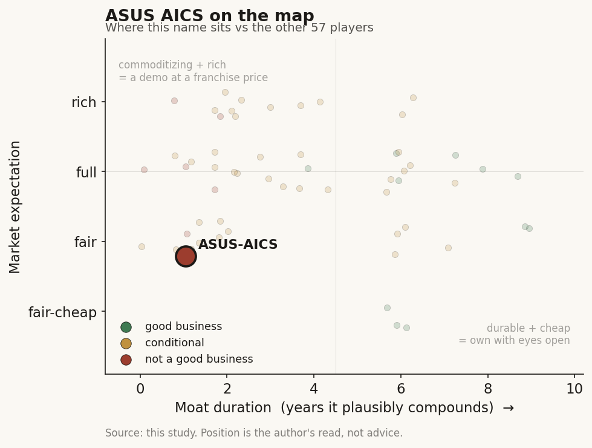

# ASUS AICS (華碩智慧雲服務, 2357 TT)

> **The read.** A genuine L7-L8 coding/HIS-admin node with real Taiwan hospital deployments and a >NT$10bn parent-funded platform push - but with zero standalone disclosed economics buried inside a NT$180bn/quarter PC-server parent, a state-captured (not company-captured) data moat, and its one international proof point dead: not underwriteable as a healthcare-AI position.

**Snapshot**

| | |
|---|---|
| Listing | 2357 TT (華碩電腦 / ASUSTeK, Taiwan) - AICS is an internal arm, no standalone listco |
| Region | Taiwan |
| Value-chain layer | L7-L8 (enterprise health-data + RCM/payor-coverage coding); L2-adjacent (imaging) |
| Archetype | workflow / SaMD-adjacent (documentation + coding SaaS, archetype-02-adjacent) |
| Size | parent 2357 is a multi-hundred-billion-NT$ PC/AI-server cap; healthcare contributes no visible number |
| Revenue (latest) | no standalone AICS revenue disclosed; parent Q2'25 revenue NT$188.0bn |
| Moat verdict | real-but-not-investable - state-captured, not company-captured |
| Expectation | fair (parent priced on servers; healthcare an unquantifiable call option) |
| Evidence quality | low |

## What it is
華碩智慧雲服務 / ASUS Intelligent Cloud Services (AICS) is the healthcare-AI software arm of ASUSTeK, selling hospital SaaS: ICD-10 auto-coding (Miraico), a next-gen hospital information system (xHIS), clinical-documentation and blood-film AI, wrapped into a group "digital health platform" (DHP) push. It is **not a standalone listco** - the equity wrapper is the parent PC/server maker 華碩電腦 (2357 TT), inside which AICS is an immaterial line item. It is the *supplier* into the MOHW 3-centre 落地→取證→健保支付 architecture, not one of the R&D centres.

## Business model - how it makes money
Enterprise health SaaS/licence + implementation, sold to hospitals:
- **Miraico** - ICD-10 auto-coding from unstructured records; deployed in ~18-19 Taiwan hospitals/centres; vendor claims coder accuracy 99.4%, AI-recommendation recall >80%. This is an **L8 RCM-coding** product: it improves DRG classification and RW-value calculation - it makes the hospital's *billing to NHI* faster/cleaner. It does not itself earn an NHI code; the hospital pays for the software, and its ROI is the hospital's own NHI reimbursement accuracy/throughput.
- **xHIS + DHP** - a modular, FHIR/SNOMED-standards hospital information system + digital-health platform; the group targets **300 hospitals**, starting mid-sized ones. Sold as licence + integration.
- **Who pays and growth quality:** the **hospital**, out of its own operating budget - not the NHI directly. AICS's demand is a *derived* function of hospital IT spend and the MOHW/NHI digitisation mandate, one step removed from the NHI reimbursement decision. A pure documentation/workflow SaaS (archetype 02) has no software-service payment vehicle in Taiwan and cannot clear the "must-save-the-payer-money" RCT gate; AICS sidesteps that by billing the hospital - but that caps pricing power to hospital IT budgets, not to an NHI point value. Payback is long and unquantified against a slow-adopting domestic market.

## Financial summary
No standalone AICS P&L exists in any primary filing; the table below is parent-level context (~99%+ non-healthcare) plus the one stated healthcare-capex marker.

| Metric | Figure | Note |
|---|---|---|
| Standalone AICS revenue / margin / headcount | undisclosed | absence in MOPS segment reporting |
| Parent Q2'25 revenue | NT$188.0bn | quarterly run-rate ~NT$180bn+ |
| Parent Q2'25 net income | NT$10.45bn | |
| Parent Nov-2025 monthly revenue | NT$66.9bn (+20.6% YoY) | |
| Parent Q1'26 EPS | NT$13.19 | TTM EPS ~NT$55.96 |
| Group smart-medical platform investment since 2020 | >NT$10bn (百億) | stated cumulative capex, not AICS P&L |
| Standalone valuation / growth | undisclosed | |

Hospital-centre role (not financials): partner/vendor to NTUH and others; MOU with 國衛院 (NHRI) June 2024 to co-build a biomedical big-data research/service centre.

## Value-chain position and competition
**Position.** L8 payor-coverage/RCM-coding is the primary node (Miraico); xHIS/DHP is the L7-L8 enterprise health-data + admin rail feeding coding/claims; blood-film (Blade) and organ-scan/surgical-planning AI sit L2-adjacent near the imaging-platform node. What flows in: unstructured EMR/clinical text. What flows out: structured ICD-10/DRG codes and a cleaner claim into NHI adjudication. AICS is the admin/coding-accuracy plumbing under the reimbursement gate, not a diagnostic-SaMD owner earning a per-test code.

**The L2 imaging leg is now the harder-edged proof point.** By late 2025 the most tangible real-world traction is not the coding rail but EndoAim, a colonoscopy/endoscopy AI (real-time polyp detection, classification, one-click size measurement). Vendor-stated: deployed at "over 35 leading hospitals" (May 2025) rising to "nearly 60 medical institutions" in Taiwan (December 2025), including National Taiwan University Hospital, Far Eastern Memorial Hospital, China Medical University Hospital, and Kaohsiung Veterans General Hospital [reported]; "highest market share" in Taiwan endoscopy AI [unverified]; clinical studies cited for a >=14% adenoma-detection-rate uplift [reported]; 2024 MedTech Breakthrough "Best AI-Assisted Software Solution" award [reported]; and a registered prospective trial (NCT06656312, colorectal polyp diagnosis, started October 2024) [disclosed]. This is a genuine SaMD-shaped node with clinician-facing evidence and a regulatory paper trail - materially better substantiated than the coding/HIS leg - but it is still an imaging-workflow tool sold to hospitals, not a per-test reimbursed franchise, and its economics remain buried in the same undisclosed parent line.

**Competition.**
- **TW imaging-IT/HIS incumbents:** 商之器 EBM (8409, PACS/imaging-IT, ~3,500 hospitals) owns the imaging-infra last mile; the legacy HIS market is held by entrenched local vendors - xHIS is a late-entrant challenger, which is why ASUS targets mid-sized hospitals first and concedes large centres keep proprietary HIS.
- **TW large-cap infra siblings:** 廣達 QOCA (2382), 鴻海 CoDocator (2317), 緯創醫學 (3231) - same "ICT parent bolts on medical AI, economics buried" archetype. AICS is differentiated by the coding/HIS admin leg plus the endoscopy-AI (EndoAim) imaging leg, rather than pure compute/ODM.
- **Endoscopy-AI (EndoAim node):** the global reference set is Medtronic GI Genius, Olympus, Fujifilm, and NEC/Cybernet's CAD EYE - all with regulatory clearances and installed bases far larger than AICS outside Taiwan. AICS's edge is domestic (No.1 Taiwan share [unverified], entrenched hospital relationships); internationally it is a small challenger against imaging-platform incumbents that also control the scope hardware EndoAim must attach to.
- **US players into TW:** scribe/coding leaders (Ambience, Commure, Nuance/Dragon) and RCM (Waystar) do not meaningfully sell into TW - the Chinese-language clinical text + NHI-specific ICD-10/DRG rules are a local-language, local-rules barrier that protects AICS domestically. That same localisation is why its US export leg failed.

## Moat
Real-but-not-investable at the AICS level - the recurring TW-data-moat pattern.
- **Hospital-data access** is real but not proprietary to AICS - it processes the hospital's data under the hospital's custody. The NHI claim set is a state-captured moat (opt-out-encumbered since the 2025-12-02 Data Management Act); no listed name can build a private NHI-data annuity. AICS gets *workflow* access, not *data ownership*.
- **NHI relationship** is indirect: no standing 特材/暫時性支付 code is attached to an AICS product.
- **State-rail erosion (key read):** MOHW's mandated FHIR/SMART-on-FHIR interoperability is a state-run distribution rail that erodes any single vendor's integration-depth moat. "FHIR/SNOMED standards-compliant" is table stakes - standardisation deliberately makes vendors swappable.
- What is real is a distribution/relationship edge: incumbency + parent balance-sheet + the >NT$10bn head start + government-partnership positioning (NHRI MOU) - not a data or IP monopoly. A TW-data moat you cannot separate from a NT$180bn/quarter hardware print, and cannot capture as data equity, is not underwriteable.

## Core variables
The three that would actually move an AICS thesis (noise excluded):
1. **Standalone disclosure event** - does ASUS ever segment-report AICS/healthcare revenue and margin? Until it does, nothing here is underwriteable. This is the binding gate.
2. **DHP/xHIS hospital-contract wins vs the 300-hospital target** - the one observable scale proxy; watch signed mid-sized-hospital HIS conversions and whether the MOHW state DHP mandate pulls AICS in or commoditises it via FHIR.
3. **Export ability beyond TW** - whether AICS can re-establish a non-TW coding/HIS channel after the Olive collapse; TW alone is a <NT$600m-class combined pure-play TAM, so growth quality is offshore.

## Bear case / key risks
- **No disclosure = no thesis:** you are buying a large-cap PC/AI-server company (2357) and getting healthcare as an unquantifiable call option. The equity is priced on servers, not on AICS.
- **US export leg collapsed; the new export path is unproven:** the flagship 775-US-hospital Miraico rollout ran through Olive AI, which shut down in Nov 2023 (once ~$4bn valuation; core assets sold to Waystar/Humata). The single most-cited international coding proof point is dead. The 2025 replacement signal is EndoAim into Thailand/SE-Asia (Thai FDA clearance 2024, a Sep-2025 hospital trial invitation) - real but early-stage, single-country, and not yet signed deployments; a Middle-East (Octopian) coding MOU is likewise early-stage.
- **State rail commoditises the product:** MOHW's mandated FHIR/SMART rail is designed to make HIS vendors interoperable and swappable - eroding exactly the integration lock-in xHIS would need.
- **No NHI payment vehicle for the software:** archetype-02-adjacent, the structurally disadvantaged TW archetype; pricing capped to hospital IT budgets inside a ~7%-of-GDP global-budget system.
- **Capital-intensive, slow-payback:** >NT$10bn invested since 2020 against a slow-adopting domestic hospital market paying from constrained budgets; payback horizon long and unquantified.

## The expectation read
The market prices 2357 on PC/AI-server economics - a multi-hundred-billion-NT$ hardware story with a NT$188.0bn quarter and TTM EPS ~NT$55.96 - and assigns the healthcare arm effectively zero. That is a fair, not soft, read: with no standalone P&L, no NHI payment code, and a dead export proof point, there is no basis to price AICS as a healthcare-AI franchise. The one place the market's near-zero belief could be wrong is a future segment disclosure that reveals real scale behind the >NT$10bn spend - but until that disclosure exists, the low expectation is warranted, not a mispricing.

## Recent developments (2025-2026)
The 2025 cadence broadened the healthcare portfolio and added the first credible post-Olive export signal, but it did not close the binding gap: still no standalone AICS economics.

- **2025-05-20 (Computex 2025):** ASUS showcased the widened healthcare-AI line - xHIS DHP, Miraico, Clinical AI Assistant, plus VivoWatch (HealthAI Genie), LU800 handheld ultrasound, EndoAim, and the Lumos health-data platform. Stated ambition: become "one of the top five smart health and medical solution brands in Asia-Pacific" [reported]. No revenue figures disclosed [disclosed].
- **2025-09 (Medical Fair Thailand, Sep 10-12; release Sep 8):** first tangible Southeast-Asia export push. ASUS stated EndoAim was "approved by the Thai FDA in 2024" and opened a Thai-hospital trial program, framing Thailand/SE-Asia as the expansion beachhead [reported]. This is the first partly-substantiated non-Taiwan channel since the 2023 Olive collapse - but it is a trial invitation and a single-country clearance, not signed deployments.
- **2025-Q4 (New Taipei City Hospital):** first live xHIS deployment, described as "the first hospital in Taiwan to adopt next-generation HIS standards" [reported]. The 300-hospital DHP target now has one flagship reference site - concrete, but a fraction of a percent of the goal.
- **2025-12-04..07 (Healthcare+ Expo Taiwan):** launched ASUS Maestro, an orchestration hub coordinating service robots (Zenbo Jr. II, Kairo) and a virtual agent across HIS/NIS. Clinical AI Assistant (LLM medical-note drafting) reported live at Taipei Veterans General Hospital [reported]. EndoAim reported at "nearly 60 medical institutions" in Taiwan [reported]. New MA2482A 8MP medical display flagged for FDA/TFDA/EU MDR approval "by end of 2026" - i.e. not yet cleared [disclosed].
- **Parent context (unchanged read):** 2357 continues to print on PC/AI-server economics; Nov-2025 monthly revenue NT$66.9bn (+20.6% YoY) [reported]. Healthcare remains an unquantified line inside it.

Net: the imaging leg (EndoAim) got materially more substantiated (deployment count roughly doubled, a foreign clearance, an award, a registered trial), and there is now one live xHIS site and a real SE-Asia toehold. None of it produces a disclosed AICS P&L, an NHI payment code, or a signed export deployment at scale - so the underwriting verdict does not change. Coverage of standalone economics remains thin.

## Verdict
Not underwriteable as a healthcare-AI investment (positioning marker only). AICS occupies a genuine L7-L8 coding/HIS-admin node with real TW deployments and a serious parent-funded (>NT$10bn) DHP push aligned to the MOHW state platform - but it has zero standalone disclosed economics inside PC-server-cap 2357, its data/NHI moat is real-but-state-captured rather than company-captured, and its one international proof point died with Olive. There is no way to size, price, or isolate the healthcare exposure. Not a good standalone business to own for the healthcare thesis, at a fair (correctly near-zero) expectation. Confidence: low - every load-bearing scale figure is parent-level or a group-capex marker.
