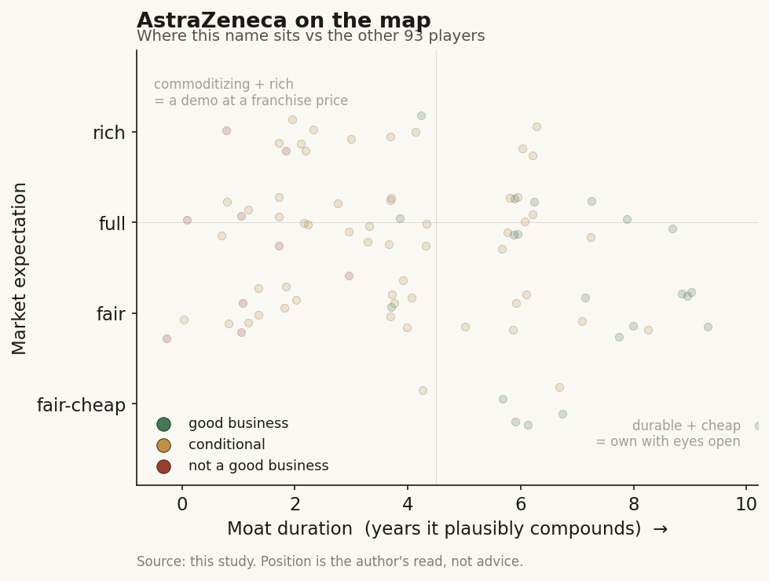

# AstraZeneca (AZN / NASDAQ (UK))

> **The read.** The other mega-cap incumbent that funds the AI-drug-discovery chain and keeps the value - and, more than most peers, is buying its way to owning the AI in-house (Modella acquisition) rather than renting it. AI is a real efficiency lever and a smart option-buy across a deep oncology pipeline, but against a $58.7bn revenue base it is a strategy line-item, not the story. The stock is an oncology-plus-rare-disease franchise bet with an AI call option attached.

**Snapshot**

| | |
|---|---|
| Listing | AZN / NASDAQ (UK primary: LSE) |
| Region | UK / EU |
| Value-chain role | pharma incumbent - funder / value-keeper of the drug-discovery AI chain |
| Archetype | diversified big-pharma; buys AI as tool + cheap option, increasingly acquires it, owns the assets |
| Size | ~$292bn market cap (Jun-26) [reported] |
| Revenue (latest) | FY25 $58.7bn, +9% YoY [disclosed] |
| AI relevance | small to the P&L today; strategic optionality + internal efficiency; oncology-data edge |
| Moat verdict | strong, but the moat is franchise / scale / distribution / oncology-data - not AI algorithms |
| Expectation | full - priced on the oncology pipeline, not on AI |
| Evidence quality | high |

## What it is
A UK-headquartered, US-listed (Nasdaq) global pharmaceutical company, and one of the more aggressive incumbent adopters of AI in discovery and oncology. Its actual business is medicines: oncology (the largest engine), cardiovascular-renal-metabolic (CVRM), respiratory and immunology (R&I), and rare disease. AI matters to this study not because it moves the P&L - it does not, yet - but because AstraZeneca is a clean second illustration of the case study's thesis: the incumbent writes the checks to the AI labs, licenses the platforms, buys the AI companies outright, and keeps the finished drugs, the trials, the biomarkers, and the distribution for itself.

## Business model - how it makes money
AstraZeneca sells patented small molecules and biologics it discovers, develops through its own clinical trials, manufactures, and distributes through its own global commercial machine. It captures value at every layer a pure-play AI lab does not touch: the ~40% Phase II efficacy wall (it runs the trials), regulatory approval, manufacturing scale-up, payer contracting, and a worldwide salesforce.

That is the key point of the case study. When AstraZeneca signs an AI-discovery deal, it structures it as **option + milestone + royalty**: a small upfront, large payments only if a molecule advances, and AstraZeneca holds the option to an exclusive worldwide license on whatever comes out. The AI partner bears the discovery risk and is paid in options; AstraZeneca keeps the asset. The incumbent funds the AI and keeps the value.

- **AI as a tool, not a product.** AstraZeneca does not sell AI. It uses AI to make its own discovery, trial design, and biomarker/patient-stratification work cheaper and faster, and buys external AI capacity as staged options.
- **Increasingly, AI as an owned capability.** The 2026 Modella AI acquisition converts a partnership into ownership - AstraZeneca is pulling the models, data, and staff inside the research organisation rather than renting them. This is the incumbent-keeps-the-value thesis taken one step further: own the AI, not just the drug.
- **Capital-heavy where it counts.** The spend is trials, manufacturing, commercial, and now a $2.5bn Beijing R&D hub - not compute. Even the largest AI commitments are small next to that.

## Financial summary
Top-line scale, with the AI/deal figures kept in proportion so the reader sees how small they are.

| Item | Figure |
|---|---|
| FY25 revenue | $58.7bn, +9% YoY [disclosed] |
| FY25 R&D spend | $13.58bn, ~24% of revenue, +24% YoY [disclosed] |
| FY25 core EPS | $9.16, +11% [disclosed] |
| Market cap | ~$292bn (Jun-26) [reported] |
| 2030 ambition | $80bn total revenue; 20 new medicines by 2030 (~half already delivered) [disclosed] |
| Growth driver | oncology + rare disease + CVRM pipeline - the whole story [disclosed] |
| **AI deal / capex figures (kept in scale)** | |
| BenevolentAI | discovery collaboration since 2019, expanded 2022 (CKD, IPF, heart failure, SLE targets); AI-generated targets entered AZ portfolio - milestone-based, no equity given up [disclosed] |
| Tempus / Pathos oncology foundation model | AZ joined a $200m data-license + model-development pact (2025); each party keeps a copy of the model - AZ pays into data, keeps the IP use [disclosed] |
| CSPC Pharmaceutical (China) | $110m upfront, up to $1.62bn development + $3.6bn sales milestones (~$5.3bn ceiling) + single-digit royalties; AI-led oral-drug discovery (Jun-2025) [disclosed] |
| Algen Biotechnologies | up to $555m; CRISPR + AI immunology target discovery [disclosed] |
| Modella AI | full acquisition (announced sell-side, Jan-2026); digital-pathology / multimodal foundation models brought in-house; terms not fully disclosed [disclosed] |

Scale check: the CSPC ceiling ($5.3bn, almost all contingent and years away) is ~9% of one year's revenue; the upfront cash actually committed ($110m) is ~0.2%. The Tempus/Pathos $200m data pool is ~0.3% of revenue. Even the entire external-AI deal stack committed as real cash is a small fraction of the $13.6bn annual R&D line. AI is a strategic bet financed out of pocket change.

## Value-chain position and competition
AstraZeneca sits at the top of the drug-discovery chain as a **funder and value-keeper**, and - via Modella - is moving to become an **owner-operator** of the AI layer. Map the flows:

- **Money flows out** to AI labs (BenevolentAI, CSPC, Algen, Tempus/Pathos, and others) as small upfronts + large contingent milestones + data-license fees.
- **AI capacity flows in** three ways: (1) **licensed / partnered discovery** - target generation from BenevolentAI, oral small-molecule discovery from CSPC's platform, immunology targets from Algen; (2) **a shared oncology foundation model** - the Tempus/Pathos multimodal model built on a >7m-record oncology dataset, of which AstraZeneca keeps a copy for target discovery, biomarker work, and patient stratification; (3) **owned capability** - the Modella acquisition plus internal AI for trial design and digital pathology, so the model and the people sit inside AZ.
- **Finished drugs, trials, manufacturing, biomarkers, and distribution stay inside AstraZeneca.**

Competition for the *AI-funder / owner* role is the other cash-rich incumbents doing the identical thing: Lilly (Isomorphic, Insilico, TuneLab, owned compute), Novartis, J&J, Pfizer, Merck, Roche - all licensing platforms, funding labs, and increasingly building or buying internal AI. AstraZeneca's differentiator inside this pack is (a) an oncology-data position (Tempus tie-up, Modella pathology) that feeds a therapeutic area it already leads, and (b) a willingness to acquire rather than only rent. The competitive fight that actually decides AstraZeneca's value, though, is not AI - it is oncology and rare-disease pipeline execution against the same peer set. AI is a shared industry tool; the moat is the franchise.

## Moat
AstraZeneca's moat is real and wide - but it is **not** an AI moat, and that distinction is the whole point.
- **Franchise + scale + distribution - STRONG (~10-15 yr).** A broad, patent-protected oncology and rare-disease portfolio, global trial and manufacturing capacity, entrenched payer/prescriber relationships, and the balance sheet to fund any Phase III. This is what a ~$292bn valuation rests on.
- **Oncology data + owned AI - the most defensible AI-specific asset, but still a productivity aid.** The Tempus/Pathos oncology model and the Modella pathology platform, fed by AZ's own trial and biomarker data, are harder for a pure-play to replicate than a generic discovery model - and owning the AI (Modella) rather than renting it is the one place AZ builds something proprietary. But even this compounds *efficiency and stratification*, not a standalone profit engine.
- **AI algorithms as a moat - WEAK / not the point.** Discovery models commoditise (open clones caught the AlphaFold frontier within ~a year at far lower cost). AZ's edge, to the extent it has one, is proprietary oncology data + owned compute + the ability to run the trials AI cannot - i.e. incumbency, not algorithms.

Net: durable ~10-15-year franchise moat; AI widens the funnel, sharpens patient selection, and buys cheap options, but does not itself compound value. The incumbent's real moat is the part of the chain the AI labs cannot reach.

## Core variables
1. **[CORE] Oncology + rare-disease pipeline trajectory (the $80bn-by-2030 path).** This is ~everything: launches, Phase III readouts, peak-sales ramps, and patent timing across the portfolio. AI does not move this needle in the forecast window; execution does.
2. **[CORE] R&D productivity - does AI actually lower cost-per-approved-drug?** The whole incumbent-AI thesis. Watch whether AI-sourced targets (BenevolentAI, CSPC, Algen) convert into real INDs and Phase progress, and whether the Tempus/Pathos model + Modella measurably shorten discovery or sharpen trial success. Today this is unproven at the P&L level [unverified].
3. **[CORE] Milestone conversion + China execution, not headline biobucks.** The "up to $5.3bn / $555m" numbers are option ceilings. What matters is cash actually paid as molecules advance - and, for AZ the payer, whether that cash buys approved assets or lapses cheaply. The CSPC deal also carries China-specific regulatory and geopolitical execution risk on top of the usual milestone risk.

Below the line as noise: which specific AI lab or model "wins," GPU counts, digital-pathology demos, and the AI-narrative framing generally. For a $58.7bn-revenue company, these are strategy line-items, not valuation drivers.

## Bear case / key risks
The bear case has almost nothing to do with AI. It is pipeline and patent concentration: a ~$292bn company betting on an $80bn-by-2030 ramp faces Phase III disappointments, patent cliffs on today's blockbusters, US drug-pricing politics (Medicare negotiation, tariffs on pharma), and China exposure (the CSPC deal, the Beijing hub, and a share of revenue in a market with its own regulatory and pricing risk). Any pipeline or China setback dwarfs anything AI could add or subtract.

On AI specifically the risk is the opposite of the pure-plays': not that AZ's AI fails, but that it *over-invests in a commoditising tool for narrative reasons*, or over-pays to acquire AI capability (Modella) that a rented platform could have delivered - or that a licensed molecule hits the same ~40% Phase II wall everyone hits, in which case AZ simply stops paying milestones and loses only a small upfront. The AI spend is not where an AstraZeneca investor loses money.

Falsification watch: (1) a pipeline or patent-cliff setback derails the 2030 ambition - the actual thesis breaks here, AI irrelevant; (2) an AI-sourced AZ molecule reaches pivotal-stage success and materially de-risks a franchise - the one path where AI stops being a rounding error; (3) the oncology foundation model + Modella pathology compound into a genuine, hard-to-copy data/stratification advantage - the only AI-specific moat worth watching.

## The expectation read
At ~$292bn (Jun-26), the market is pricing a durable, high-margin oncology and rare-disease franchise executing toward the $80bn-by-2030 ambition - roughly a premium large-cap-pharma multiple on a broad, de-risking pipeline. **Essentially none of that price is AI.** The AI deals, the data-license pools, and even the Modella acquisition together commit a small fraction of annual revenue; they are financed out of free cash flow and structured (deals) or sized (acquisition) so AZ's downside is capped. The expectation embedded in the stock is that the oncology pipeline delivers and margins hold - not that AI discovers the next blockbuster.

So the AI read is asymmetric and cheap: AstraZeneca pays option premiums (and, selectively, buys the AI outright where it wants the data and people), keeps every asset that works, and owes little if they do not. Whether AI "moves" a ~$292bn company: not in the numbers today, and not in the price. If it ever does, it shows up as *lower cost-per-approved-drug* and *higher trial success via better patient selection* over a decade - a slow margin-and-hit-rate tailwind, not a re-rating.

## Verdict
Good business, wide moat - but the moat is the oncology/rare-disease franchise, scale, and distribution, not AI. AstraZeneca is the case study's clearest example of the incumbent taking the thesis one step further: it funds the AI, structures partnerships as cheap staged options, licenses shared oncology models, and now *buys the AI company* (Modella) to keep the capability in-house - while keeping the drugs, the trials, the biomarkers, and the value. AI is a sensible, low-cost efficiency-and-optionality bet (with a genuine oncology-data angle) that is immaterial to the P&L and to the ~$292bn valuation today. Confidence: HIGH on the facts (revenue, R&D, deal terms, market cap all disclosed and current); HIGH on the framing (AI is a tool/option/owned-capability here, the pipeline is the story); the only genuinely open question is variable 2 - whether AI ever measurably lowers cost-per-approved-drug or raises trial hit-rate, which is unobservable for years.
