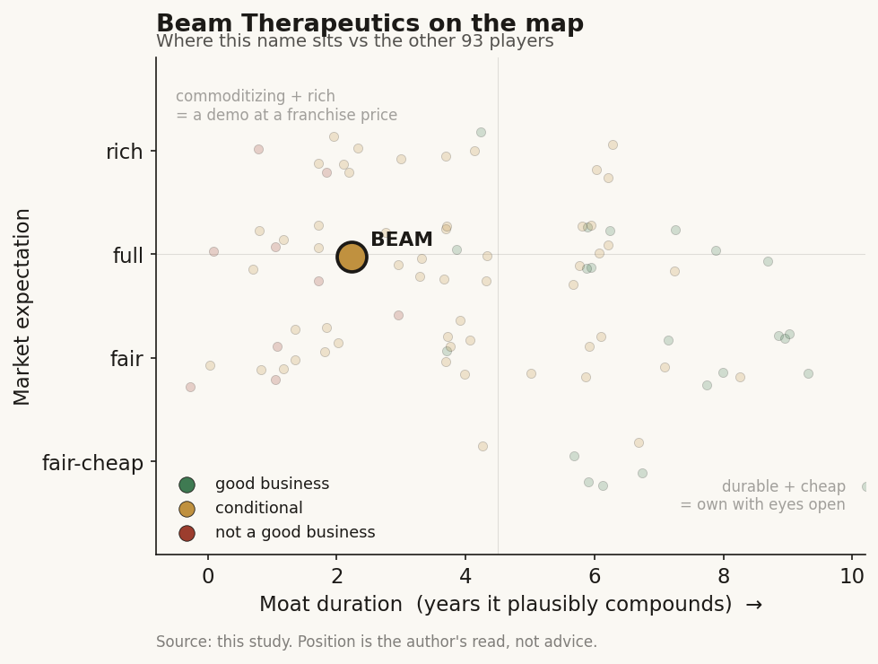

# Beam Therapeutics (BEAM)

> **The read.** A genuine cohort leader - the best AATD human dataset plus funding into mid-2029 - trading at a fair-to-slightly-rich binary-option price: good asset optionality, not yet a good business, and the easy AATD de-risk is partly already in the tape.

**Snapshot**

| | |
|---|---|
| Listing | BEAM / Nasdaq |
| Region | US |
| Value-chain layer | L9a-L9e (target-ID to clinical development), base-editing drug-owner |
| Archetype | Drug-owner (milestone + royalty / owned-pipeline optionality) |
| Size | ~$3.4bn cap, ~103m shares, ~$33/sh |
| Revenue (latest) | FY25 $139.7m (+120% YoY); Q1'26 $31.7m (+322% YoY) - lumpy partner cash, not a franchise |
| Moat verdict | Conditional (own-pipeline vs risk-bearing pharma; binary optionality) |
| Expectation | Fair-to-slightly-rich |
| Evidence quality | High on financials/clinical facts; med on the expectation read |

## What it is
A US clinical-stage genetic-medicine company built on base editing - precise single-base rewrites of DNA that correct a disease-causing mutation without cutting the double strand. It develops one-time base-editing therapies for genetic disease, led by BEAM-302 (AATD, in-vivo liver) and risto-cel / BEAM-101 (sickle cell, ex-vivo). It sells no approved product yet; value is a probability-weighted string of clinical readouts plus, for winners, a one-time-cure annuity.

## Business model - how it makes money
Revenue today is almost entirely collaboration/milestone cash, not product. FY25 revenue $139.7m (+120% YoY vs $63.5m); Q1'26 revenue $31.7m (+322% YoY vs $7.5m), of which $25.0m was a single Eli Lilly collaboration milestone. This "revenue" is lumpy partner cash, not a recurring franchise - the true value is pre-revenue optionality on owned assets.

Growth quality is capital-hungry and cash-burning: the P&L is an R&D-plus-burn line. FY25 R&D $409.6m (up from $367.6m), G&A $113.8m; net loss $80.0m (flattered by collaboration revenue and one-offs). Q1'26: R&D $104.5m, net loss $94.3m ($0.91/sh). Underlying operating burn runs ~$400-450m/yr.

Incremental ROIC is undefined pre-product - the biotech rule applies: look at cash and runway, not margins. $1.2bn cash/equivalents/marketable securities at Q1'26, plus a sell-side senior-secured facility of up to $500m (Feb 2026) - $100m drawn at close, $200m minimum expected, tied to risto-cel milestones, non-dilutive and asset-secured. Combined runway into mid-2029 - through the risto-cel SCD launch, the BEAM-302 pivotal plan, and BEAM-304 PKU POC. Cash conversion is negative; funded by prior equity, partner biobucks, and now structured debt. The secured facility is the standout move - buying ~3 years of runway without printing shares at a depressed quote.

## Financial summary

| Metric | FY25 | Q1'26 |
|---|---|---|
| Revenue | $139.7m (+120% YoY vs $63.5m) | $31.7m (+322% YoY vs $7.5m; $25.0m single Lilly milestone) |
| R&D | $409.6m (from $367.6m) | $104.5m |
| G&A | $113.8m | - |
| Net loss | $80.0m | $94.3m ($0.91/sh) |
| Cash / equivalents / marketable securities | - | $1.2bn |
| Structured debt facility | up to $500m (Feb 2026); $100m drawn, $200m min expected, risto-cel-milestone-gated, non-dilutive | |
| Operating burn | ~$400-450m/yr | |
| Runway | into mid-2029 | |

## Value-chain position and competition
Beam sits on the base-editing modality (the enzyme toolbox - a commoditizing input; academic labs seeded base + prime editing and the science diffuses). Value forms one layer down in the owned clinical asset the edit enables: L9a target-ID to L9c candidate-selection to L9e clinical development. It is a vertically-integrated developer, not a tool/reagent vendor. The genuine choke point is delivery, not the edit: Beam has crowded the two solved routes - liver (LNP) for BEAM-302/301/304 and ex-vivo blood for risto-cel. Partners supply the pharma-distribution layer and non-dilutive cash.

- **AATD (BEAM-302, in-vivo liver):** Beam holds the clear clinical lead - first-ever in-human genetic correction of the PiZ mutation, ~91-94% corrected M-AAT at steady state across 60/75mg cohorts, robust dataset (29 patients), advancing to pivotal. The March 2026 update locked 60mg as the optimal biological dose: mean steady-state total AAT 16.1 uM with every treated patient durably above the ~11 uM protective threshold out to 12 months, 84% mutant Z-AAT reduction, and 94% corrected M-AAT. A structural differentiator versus protein-replacement augmentation surfaced in one patient whose corrected AAT rose physiologically from 15.9 to 29.5 uM during a respiratory infection while holding 95% M-AAT composition - the edited native gene still responds to inflammation, which infused-protein therapy cannot do. CRISPR (CTX460) is ~18 months behind, mouse-stage; Prime Medicine (PRME) is preclinical with a "wild-type protein / no bystander edits" mechanistic pitch but POC only ~2027. Beam won on execution and timing, not editor elegance.
- **Sickle cell (risto-cel / BEAM-101, ex-vivo):** competes head-on with the incumbent Vertex / CRISPR Casgevy (approved, ~$2.2m list, ex-vivo) and bluebird's lovo-cel. Beam's differentiation is a base-edit that directly boosts fetal hemoglobin with a cleaner manufacturing/engraftment profile (BEACON Phase 1/2 in NEJM; no severe VOCs reported post-treatment; median one collection cycle). BLA targeted as early as YE2026.
- **Cross-cohort:** NTLA leads gene-editing on de-risking (in-vivo HAE Phase 3 hit); Beam is second on the de-risking ladder via BEAM-302 human POC. It also competes against incumbent chronic therapies (a one-time cure displaces repeat-dose franchises - but has no refill revenue).

## Moat
Ch5 verdict: Moat 3 (own-pipeline vs risk-bearing pharma), conditional. The base-editing platform itself is the door, not the moat - the enzyme is a commoditizing input. What survives is the owned clinical asset against a risk-bearing pharma partner, and only where delivery is solved. This is not durable compounding - it is binary optionality gated by the ~40% Phase-II biology wall that AI/editing has not moved. Duration: ~2-3yr binary watch, sized for asymmetry, not a decade-long compounder. Refuted forms: any "data flywheel" or "editor superiority" moat (Moat 4, refuted for discovery). Where Beam is genuinely better positioned than the cohort: it owns two shots on solved-delivery tissues (liver + blood) with the deepest human dataset in AATD - real optionality breadth, still capped by per-asset odds.

## Core variables
1. **BEAM-302 AATD pivotal execution + durability/safety.** The master value driver - human POC is in hand (~91-94% correction); the re-rate rests on whether pivotal confirms durable Z-AAT reduction and clean safety (off-target/indel/immunogenicity from a permanent edit). Everything else is second-order.
2. **Risto-cel SCD approval + commercial ramp (BLA YE2026).** Tests the cure-economics thesis directly - against a $2.2m Casgevy incumbent whose own ramp has been slow (manufacturing/conditioning/access friction). Is Beam's cleaner-manufacturing claim worth share in a slow-adopting market?
3. **Cash runway vs value-inflection cadence.** Mid-2029 cushion is real (a cohort strength - PRME had cash only to 2027), but ~$400m+/yr burn against a debt facility whose later tranches are milestone-gated means a single failed readout can strand a program and tighten financing at once.

(Second-order, held below the line: BEAM-301 GSDIa and BEAM-304 PKU early data - additional liver shots but smaller markets; partner milestone timing; editor-precision differentiation vs PRME; SBC/dilution.)

## Bear case / key risks
Selectable edits do not make the biology work - the wall moved from "design the molecule" to "deliver it safely and get a durable, safe benefit." Beam's value is concentrated in two binary readouts; a single disappointing pivotal (AATD durability/safety) or a slow SCD launch strands a large fraction of the equity. Cure economics are a paradox: a successful one-time edit is an annuity with no refill revenue, and the first approved editing product (Casgevy) generated modest sales despite years of hype - access/manufacturing throttle the ramp. Burn is ~$400m+/yr; the later structured-debt tranches are risto-cel-milestone-gated, so funding is not fully unconditional. And the de-risking on the leaders (BEAM-302 POC) is partly already in the tape - the easy re-rate may be spent. Falsification that breaks the bear: durable, safe, approvable data - ideally proof that delivery generalizes beyond liver/blood, or a risto-cel launch that visibly takes share from Casgevy.

## The expectation read
At ~$3.4bn enterprise value on zero product revenue and ~$400m+/yr burn, the multiple is a sum-of-binary-options price, not an earnings multiple. It implies the market believes: (i) BEAM-302 converts human POC into an approvable, durable AATD franchise (a large chronic market where Beam is the clear leader) and (ii) risto-cel reaches market and carves meaningful SCD share against a $2.2m incumbent. Where the belief looks soft: it prices Beam as the second-most-de-risked editor, yet still leans on two un-run pivotals whose per-shot odds sit against the unchanged ~40% Phase-II wall; the cure-annuity ramp (Casgevy read-through) is assumed smoother than the incumbent's actual experience; and the runway that looks comfortable (mid-2029) is partly milestone-gated debt, so a single miss re-rates both the pipeline and the balance sheet. The AATD lead is real and under-appreciated relative to the cohort tail - but it is one readout, not an annuity.

## Recent developments (2025-2026)
The 2026 year-to-date run has been execution, not surprise - each dated milestone tightens the two binary bets rather than adding a new one. Sequenced:

- **Jan 11, 2026 [disclosed]:** FDA alignment on a potential accelerated-approval pathway for BEAM-302, keyed to AAT biomarkers measured over 12 months. To support a BLA, Beam plans to enroll ~50 additional patients at the selected optimal dose in an expansion of the ongoing Phase 1/2. This is the single most important de-risk of the year: it converts "un-run pivotal" into a defined, biomarker-gated registration path on a program where Beam already holds the human data. YE2025 cash was ~$1.25bn [disclosed], boosted by $255.1m of closing cash [disclosed] from the sale of Orbital Therapeutics to Bristol-Myers Squibb (plus up to ~$26.3m of contingent escrow [disclosed]).

- **Feb 24, 2026 [disclosed]:** FY25 results, plus a new liver program, BEAM-304 for phenylketonuria (PKU, ~20,000 US patients [disclosed]) - built as a platform that advances multiple mutation-specific base editors inside one clinical program, starting with the R408W variant. Runway reiterated into mid-2029. Note the optics on the FY25 net loss of $80.0m: Q4'25 alone booked net income of +$244.3m [disclosed] ($2.37/basic sh) from the Orbital/BMS sale, so the full-year loss is flattered by a one-off - the underlying ~$400m+/yr burn is unchanged. Separately, in Dec 2025 [disclosed] Pfizer opted in at the end of a four-year collaboration to an exclusive worldwide license on a Beam liver-targeted development candidate; Beam keeps milestone eligibility and an option, at end of Phase 1/2, to co-develop/co-commercialize on a 35/65 (Beam/partner) profit-and-cost split.

- **Mar 25, 2026 [disclosed]:** The pivotal-defining BEAM-302 readout. 60mg fixed as the optimal biological dose (16.1 uM steady-state total AAT, all patients durably above 11 uM to 12 months, 84% Z-AAT reduction, 94% M-AAT); single doses to 75mg well-tolerated with no serious AEs or dose-limiting toxicities. Honest caveat: the small multi-dose (2x 60mg) cohort saw more liver-enzyme signal - one patient had a Grade 4 ALT / Grade 3 AST elevation, asymptomatic and untreated, no bilirubin rise - so the clean profile is a single-dose statement, and permanent-edit safety is still a pivotal-scale open question. Global pivotal cohort to initiate 2H 2026.

- **Apr 1, 2026 [disclosed]:** BEACON Phase 1/2 risto-cel data published in the New England Journal of Medicine (31 patients; mean HbF above 60% and HbS below 40%; no investigator-reported severe VOCs post-engraftment; median one cell-collection cycle; ~2.9 months collection-to-release, ~4.5 months collection-to-dosing). Manufacturing of all clinical doses complete; RMAT + orphan designations plus acceptance into the FDA CMC readiness pilot. BLA still targeted as early as year-end 2026.

- **May 7, 2026 [disclosed]:** Q1'26 results confirm the figures already in this profile - cash $1.2bn ($1,211.7m), revenue $31.7m, R&D $104.5m, net loss $94.3m ($0.91/sh) - with runway reiterated into mid-2029 (inclusive of $100m drawn at facility close plus an anticipated additional $100m). BEAM-302 data also presented at the ATS 2026 pulmonary conference (May 18).

- **Jun 18, 2026 [disclosed]:** FDA cleared the BEAM-304 PKU IND - a fifth clinical program - explicitly leveraging the FDA's Jun 2, 2026 [reported] draft guidance to accelerate genome-editing therapies. First cohort targets the R408W mutation with the goal of establishing clinical POC for base editing in PKU.

- **Late Jun 2026 [reported]:** shares touched a new one-year high (~+21% over the prior three months), consistent with the market rewarding the AATD accelerated-approval alignment and the string of on-time milestones. This is the tape confirming the point already made in the read - the easy AATD de-risk is now visibly in the price, which raises, not lowers, the bar for the next leg.

Net: the year removed regulatory-path ambiguity on BEAM-302 (accelerated approval, dose locked, pivotal starting 2H 2026) and put risto-cel into its pre-BLA window, while adding a fifth shot (BEAM-304 PKU) and a fresh partner opt-in (Pfizer) - all inside an unchanged burn and a mid-2029 runway. What it did not do is retire the core uncertainty: the two value-driving pivotals are still un-run, and durable permanent-edit safety at pivotal scale remains the open question.

## Verdict
A genuine cohort leader (best AATD human dataset + funded to mid-2029) trading at a fair-to-slightly-rich binary-option price - good asset optionality, not yet a good business, and the easy AATD de-risk is partly priced in. Confidence: medium-high on the financials and clinical facts (all company-disclosed); medium on the expectation read - the whole thesis hinges on two un-run pivotals whose odds are irreducibly uncertain.
