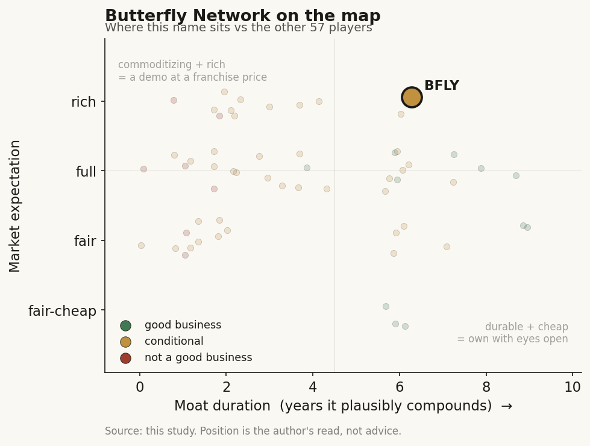

# Butterfly Network (BFLY)

> **The read.** A genuinely differentiated hardware asset - the ultrasound-on-chip is real and hard to copy - bolted to an unproven, one-deal-deep licensing story and priced as if that licensing platform is already built: good technology at a rich expectation.

**Snapshot**

| | |
|---|---|
| Listing | BFLY / NYSE |
| Region | US |
| Value-chain layer | Imaging L2 (ultrasound-on-chip semiconductor) + L5a (SaMD / AI apps) |
| Archetype | picks-and-shovels (chip toll + software attach) |
| Size | ~$2.0bn market cap (~$1.89bn EV, early Jul'26) |
| Revenue (latest) | Q1'26 $26.5m, +25% YoY; FY2025 $97.6m, +19% |
| Moat verdict | conditional - durable on the chip (L2), commoditizing on the clearance/app layer (L5a) |
| Expectation | rich |
| Evidence quality | med |

## What it is
A handheld point-of-care ultrasound (POCUS) maker whose differentiator is a proprietary **ultrasound-on-chip** - it replaced the piezoelectric crystal with a CMOS semiconductor (capacitive micromachined transducers on silicon), so one $2-3k probe replaces a cart-based scanner. It sells the probe, a per-seat software subscription (Compass AI / cloud), a third-party AI-app marketplace (Butterfly Garden), and - the new leg - **licenses the chip itself** to partners (Butterfly Embedded).

## Business model - how it makes money
Three revenue lines fused. **(a) Product** (probe hardware, ~65% of FY25 revenue) - a one-time device sale, ASP ~$2-3k, semiconductor-fab COGS; **(b) Software & other services** (~35% of FY25) - per-seat SaaS (Compass AI), Garden rev-share, education; **(c) Embedded** - chip licensing: one-time NRE, annual license fees, SOW dev work, and chip sales to partners.

Capital profile is **bimodal**, not capital-light: the probe leg is a fab-dependent hardware business (real BOM, inventory, the FY25 write-down proves the working-capital tail), while the Embedded/software legs are capital-light and drop ~90%+ incremental margin. Growth today is **mix-shift, not price** on hardware (iQ3 units +39% while cheap iQ+ -43% drove ASP +11%) plus a **licensing spike** (Embedded +147%). Incremental ROIC is not yet definable - the company is pre-profit and has never earned its cost of capital; the bull case is that the software + chip-license mix lifts blended GM toward ~70%+ and turns EBITDA. Cash conversion is **negative** (still burning), but improving at the margin.

## Financial summary

| Metric | FY2025 | Q1'26 | FY2026 guide |
|---|---|---|---|
| Revenue | $97.6m (+19%) | $26.5m (+25% YoY) | $117-121m (+20-24%) |
| Gross margin | 46.9% reported (one-off inventory charge; clean run-rate ~63-69%) | 69% (up ~600bps YoY) | - |
| Net loss | -$77.1m | -$12.7m (narrowest Q1 since IPO) | - |
| Adj. EBITDA | - | -$6.1m (+32% YoY) | -$21m to -$25m |
| Cash | - | $138m (no meaningful debt) | - |

Q1'26 core revenue $20.8m (+10%); **Embedded $5.7m, +147%** - the jump is the Midjourney partnership. Use of cash ~$12.5m/qtr (≈$50m/yr run-rate) → ~2.5-3yr runway at current burn, no near-term financing gun to the head.

## Value-chain position and competition
Two layers under one roof. At **L2** it owns the *scarce physical input* - the ultrasound-on-chip - and now sells it as a component to others (Midjourney's whole-body scanner is built on BFLY silicon). At **L5a** it is a SaMD/app platform: it holds FDA clearances (including the first-ever "blind sweep" AI gestational-age tool, trained on 21m images) and hosts 30 third-party Garden partners whose apps run on its probes, pushed via cloud like a phone update. What flows: **silicon + a distribution surface downstream to app developers; a device + AI library to clinicians; a licensable chip to OEMs.**

- **Handheld POCUS competitors:** GE HealthCare (Vscan), Philips (Lumify), Fujifilm Sonosite, Mindray, Clarius, EchoNous - deep-pocketed imaging OEMs. BFLY's edge is the **single-probe whole-body chip** (piezo rivals need multiple crystal probes) and a lower price point - a genuine hardware differentiation, not a marketing one.
- **The edge that matters is the chip, not the probe.** BFLY is the one POCUS name that can *license its transducer as a semiconductor IP block* - no crystal competitor can. That is the Embedded thesis and the Midjourney tell. As of mid-2026 the Embedded roster is two names deep: Midjourney's full-body scanner (40 chip modules per system [reported]) and Aleph Neuro's non-invasive brain-imaging lab [reported] - but only the Midjourney deal has disclosed economics ($74m headline over 5 years), so the "diversified license book" is still one paying partner plus one unpriced research participant.
- **The edge that does NOT matter: the FDA clearances themselves.** A bare 510(k) is table stakes (1,451 cleared AI devices; ~97% predicate-based). BFLY's clearances gate the shelf, not the revenue.

## Moat
**Two moats, opposite verdicts.**
- **On the clearance/SaMD layer (L5a): refuted** - bare FDA clearance is ~0-year moat on grant; the Garden apps commoditize toward the underlying models; the per-seat scribe-style SaaS has no reimbursement code behind it (BFLY earns no CPT dollar directly - it is efficiency SaaS).
- **On the chip layer (L2): the strongest claim, and it is NOT a healthcare-AI moat - it is a semiconductor moat.** The defensible asset is the ultrasound-on-chip design + fab process + patent estate + years of embodied engineering, now on its **4th-generation chip**. That is real and hard to replicate (**~5-8yr durability**), but a buyer paying a healthcare-AI multiple for it is mispricing a semis IP toll as a med-tech growth story.
- **Data-flywheel? Weak.** The 21m-image GA model is real training data, but it is not a compounding licensing annuity (no de-identified-RWE-to-pharma sale); it improves the product, it is not the product. Do not credit a Tempus-style data moat here.
- **Net:** durable where it owns the *chip*, commoditizing where it owns only a *clearance or an app slot*. The moat is a semiconductor moat wearing a healthcare-AI costume.

## Core variables
1. **Embedded/chip-licensing ramp and durability.** Is Embedded a real recurring IP-toll business or a handful of lumpy NRE/SOW contracts? Q1'26 was +147% but off a small base and concentration-heavy (Midjourney = the swing factor; the deal is up to **$74m over 5 years**, much of it milestone/consumption-contingent, not booked). A second Embedded participant surfaced in June'26 (Aleph Neuro, brain imaging), but with **no disclosed economics** - it widens the *validation* of the platform (a very different clinical use than a body scanner) without yet widening the *revenue* base. This one line still carries the re-rate.
2. **Blended gross margin × path to EBITDA breakeven.** GM has moved 63%→69% on mix; the thesis needs software + chip-license to carry blended GM into the ~70s while the burn (~$50m/yr) converges to zero **before** the $138m cash forces a raise. The rate-of-change here, not the level, is the hinge.
3. **Core POCUS unit economics - share gain or just ASP mix?** Probe units +5% is slow; the +25% headline leans on ASP mix and Embedded. Durable core demand (enterprise Compass AI TCV, med-school 1:1 adoption, Home/Community Care) must show the installed base is compounding, because that is what pulls software seats and probe utilization.

*(Noise held below the line: the RoHS EU lead-exemption campaign; individual Garden partner clearances; quarter-to-quarter tariff/macro commentary; the GA-tool PR halo.)*

## Bear case / key risks
BFLY has burned money every year since its 2021 SPAC, cumulative losses are large, and the core probe business grows units at only ~5% - a slow hardware franchise against GE/Philips/Fujifilm. The FY25 inventory write-down is a reminder this is a working-capital-heavy device maker, not a software company. The re-rate to a ~$2.0bn cap rests almost entirely on **Embedded optionality that is one partner deep (Midjourney)** and structured as milestone-heavy licensing that may convert to a fraction of the $74m headline (headline TCV overstates recognized cash). The software leg has **no reimbursement anchor** - it is per-seat efficiency SaaS an EHR/imaging incumbent could bundle against. Strip Embedded and you have a ~$110m, ~15%-grower, still-lossmaking POCUS device company that the market is valuing at **~16x forward EV/sales**. If Embedded stays lumpy and no second marquee licensee appears, the multiple has nothing to stand on.

## The expectation read
At ~**$7.68 / ~$2.0bn market cap / ~$1.89bn EV** (early Jul'26) on **$117-121m FY26 guide**, BFLY trades at **~16x forward EV/sales** - a *software/semiconductor* multiple on a business that is ~65% one-time hardware and still EBITDA-negative. The stock ran to a 52-week high of **$8.01** on the June Midjourney reveal (+56% on the week). **What the market believes:** that Butterfly Embedded turns the ultrasound-on-chip into a broad, recurring semiconductor IP-licensing platform (many Midjourney-like partners), re-rating BFLY from a niche POCUS OEM into an "ARM-of-medical-imaging" toll. **Where that belief looks soft:** (i) Embedded is one deal deep and milestone-contingent - the recurring-toll claim is asserted, not yet proven by a diversified, renewing license book; (ii) ~16x sales already discounts years of successful diversification with zero execution slip and no financing dilution against a ~$50m/yr burn; (iii) the core POCUS engine (units +5%) is not itself worth a software multiple. The multiple prices the *chip-platform outcome* as though it is already de-risked; the evidence is one quarter and one partner.

## Recent developments (2025-2026)
- **Embedded goes from one partner to two (30 Jun'26 read).** On 25 Jun'26 [reported] Butterfly disclosed a second Embedded participant, **Aleph Neuro** - a brain-computer-interface research lab (CEO Marley Xiong) that used BFLY's ultrasound-on-chip to claim the highest-resolution 3D images of the human brain captured from outside the skull ("MRI-level detail" without an MRI). It matters as *platform validation* in a clinical domain far from body scanning, but **no license fees, chip volumes, or milestones were disclosed**, and coverage flagged it as "unlikely to have an immediate financial impact." Shares traded roughly flat on the news [reported] - the market did not re-rate on a second *unpriced* participant, consistent with the read here that Embedded is validation-rich but still one *paying* deal deep.
- **Midjourney deal - the priced anchor (Jun'26).** The June partnership remains the only Embedded contract with economics: up to **$74m over 5 years** [reported], comprising a one-time **$15m** fee plus a **$10m** annual license, milestone-contingent on top; each scanner uses **40 chip modules** with future generations expected to use more. This is the deal the ~16x sales multiple is really underwriting.
- **Q1'26 (reported 30 Apr'26).** Revenue **$26.5m, +25% YoY**; gross margin **69%** (+~600bps); net loss **-$12.7m** (narrowest Q1 since IPO); adj. EBITDA **-$6.1m** (+32% YoY); cash **$138m**, no meaningful debt. Embedded **$5.7m, +147% YoY**.
- **Q2'26 guide: $27-31m** (~+24% YoY at midpoint) [disclosed]; **FY26 kept at $117-121m** (+20-24%) and adj. EBITDA loss **-$21m to -$25m** [disclosed].
- **Software/enterprise traction.** **Compass AI** (next-gen cloud enterprise platform) drove the enterprise pipeline **+50%** since launch, with the first enterprise deal of the year closed [reported]. This is the leg that has to convert to recurring seats to justify the software-multiple thesis.
- **HomeCare enters commercial phase.** Butterfly progressed toward its **first HomeCare commercial agreement in H1'26**, with initial **statewide deployment expected in Q3'26** [reported] - a new distribution channel (home/community care) for the installed base, still pre-revenue-proof.
- **Regulatory (dated).** The blind-sweep **gestational-age AI tool** referenced above received FDA clearance on **30 Mar'26** [reported] - the first FDA-cleared blind-sweep GA tool; per the moat read, it gates the shelf, not the revenue.
- **Tape and coverage.** YTD to early Jul'26 the stock was up roughly **+100%+** [reported] on the Embedded reveal, against a market cap variously reported at **~$2.0-2.1bn**; visible sell-side price targets clustered near **~$5.5-6.0** [reported], *below* the ~$7.68 spot in the snapshot - i.e., the run priced in more Embedded optionality than published targets endorse. Coverage remains thin (few analysts) and consensus is Buy/Hold, not a broad institutional book.

## Verdict
**A genuinely differentiated hardware asset (the chip is real and hard to copy) attached to an unproven, one-deep licensing story, priced as if the licensing platform is already built - good technology, rich expectation.** The durable value is a *semiconductor* moat, not a healthcare-AI one, and the ~16x forward EV/sales bakes in a diversified Embedded toll that today rests on a single $74m-headline Midjourney deal and a still-loss-making, slow-growth core. **Confidence: medium** - Q1'26 financials, mix, cash, and guidance are firm; the Embedded-durability and margin-inflection core variables are the unresolved swing factors and will not be readable until the license book diversifies and renews.
