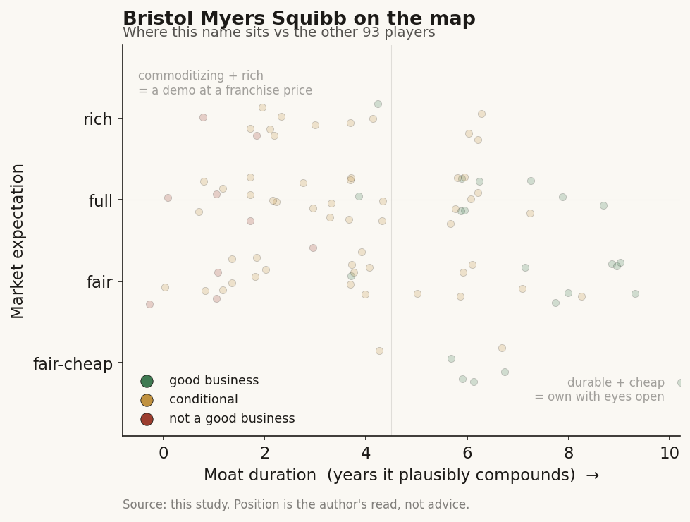

# Bristol Myers Squibb (BMY / NYSE)

> **The read.** A second textbook incumbent case, harder than most: a ~$48bn-revenue diversified pharma that rents AI from the frontier labs and keeps the value, but whose whole stock is governed by a steep near-term patent cliff (Eliquis, Opdivo, and the Revlimid runoff) that AI does not fix. AI here is a cost-and-cycle lever and, newly, an enterprise-wide productivity bet - not the moat and not the growth. Good business, cheaply priced, for cliff reasons AI cannot touch.

**Snapshot**

| | |
|---|---|
| Listing | BMY / NYSE |
| Region | US |
| Value-chain layer | L9 incumbent (owns the full discovery-to-market chain; rents the AI layer) |
| Archetype | pharma-incumbent (diversified drug-owner; funds the AI, captures the drug) |
| Size | ~$118.7bn market cap; stock ~$58 (6-Jul-26) [reported] |
| Revenue (latest) | FY2025 ~$47.5-48.0bn (non-GAAP guide range) [disclosed] |
| Moat verdict | wide on the franchise (reimbursed molecules + distribution + balance sheet); AI is not the moat |
| Expectation | cheap - priced for the patent cliff, not for AI upside |
| Evidence quality | high (large-cap, fully disclosed) |

## What it is
One of the large diversified global pharmaceutical companies - discovery, development, manufacturing, and worldwide commercial distribution of medicines across oncology, hematology, immunology, cardiovascular, and neuroscience. For this study it matters as an **AI buyer, not an AI builder**: BMY sells no AI product and is not trying to become a model company. It funds AI, embeds it inside R&D, clinical development, manufacturing, and commercial operations, and keeps the economics of the drug that comes out the other end. It sits at L9 - the incumbent that owns the entire chain the AI-discovery startups are trying to sell into.

## Business model - how it makes money
Sell patented molecules at high gross margin, defend them with IP + regulatory approval + payer reimbursement + a global salesforce, and replace them as patents expire. The whole model is a race between **new approvals and the patent cliff** - and BMY's cliff is unusually front-loaded. Its two biggest products, Eliquis (~$14.4bn 2025 [reported]) and Opdivo (~$10.0bn 2025 [reported]), together near half of revenue, lose US exclusivity across roughly 2027-2029; Revlimid is already in steep generic runoff (~$3.0bn 2025, down sharply [reported]). This LOE schedule is the single fact that governs the stock.

Where AI fits, and where it does not:
- **AI is a cost-and-speed lever, not a revenue line.** It compresses discovery and content-approval cycles and trims R&D dollars per candidate. It does **not** move the binding constraint - Phase II efficacy, where most clinical failures and most spend sit, and where no AI lab has yet raised the base rate. AI improves the front of the funnel that is already cheap; the expensive back half is untouched.
- **The incumbent funds the AI and keeps the drug.** When BMY partners an AI lab (insitro, Evotec) or licenses a model, the vendor takes fees and milestones and BMY takes the asset, the trial, the approval, and the lifetime revenue. This is the study's central point in one company: value-capture is at L9, not at the model layer.

Capital allocation, not GPU spend, is the real AI-era decision. BMY's growth engine is **M&A** - the ~$14bn Karuna acquisition (closed Mar 2024) delivered Cobenfy, the first new-mechanism schizophrenia drug in decades, plus the ~$4.1bn RayzeBio and ~$4.8bn Mirati deals [disclosed]. The balance sheet is the moat the startups do not have; it is also stretched by that dealmaking.

## Financial summary
Top-line scale only - this is an incumbent, not a growth story to model line by line.

| | FY2025 | Notes |
|---|---|---|
| Revenue | ~$47.5-48.0bn (non-GAAP guide range) [disclosed] | roughly flat-to-down as the cliff bites |
| R&D expense | ~$10bn [reported] | AI spend is folded inside this line, not a separate build |
| Growth Portfolio | ~$16.3bn, +23% [reported] | newer drugs (Opdualag, Reblozyl, Camzyos, Breyanzi, Cobenfy) meant to offset LOE |
| Eliquis / Opdivo | ~$14.4bn / ~$10.0bn [reported] | the two cliff-exposed franchises |
| Dividend yield | ~4.3% at ~$58 (6-Jul-26) [reported] | $0.63/qtr; ~$2.52 annual |
| Market cap | ~$118.7bn (6-Jul-26) [reported] | |

AI/deal figures worth tagging: **insitro** AI-discovery collaboration extended Oct 2025 (~$20m added investment; total potential value >$2bn in discovery/development/commercial milestones) [disclosed]; **Anthropic** strategic agreement (May 2026) deploying Claude to **30,000+ employees** across research, clinical development, manufacturing, commercial, and corporate - used as an agentic layer for trial documentation, clinical study reports, manufacturing-deviation root-cause, and regulatory submissions (no dollar figure disclosed) [disclosed]; **Evinova** AI trial-design platform and **Evotec** protein-degradation/AI-analytics collaboration (CELMoD candidate BMS-986506 into Phase 1) [disclosed]. There is **no disclosed standalone "AI capex" line** - AI is opex inside the ~$10bn R&D and the SG&A budgets, which is itself the point: for an incumbent, AI is a cost lever, not a separate build.

## Value-chain position and competition
BMY occupies **L9 - the full discovery-to-market incumbent** - and deliberately rents the upstream AI layers rather than owning them:
- **L9b-L9c (target biology / candidate generation):** partnered in. insitro (ML-driven target discovery, extended into ALS/neurodegeneration 2025); Evotec (PanOmics/PanHunter AI analytics for protein degradation) [disclosed].
- **L9e (owned clinical development + approval + distribution):** owned outright. This is where value is captured and where the incumbent is unassailable by a model company.
- **Clinical + enterprise operations:** Evinova AI Study Designer for trial design; the Anthropic/Claude enterprise deployment as an agentic layer across research-through-regulatory functions - the places BMY buys productivity because the defensible asset is BMY's own decades of proprietary scientific and manufacturing data, not the model [disclosed].

Competition is other large-pharma incumbents running the identical playbook - Pfizer, Lilly, Novartis, J&J, Merck, AstraZeneca - all buying AI-discovery access and all funding, not becoming, the AI. The AI-drug-discovery startups (Isomorphic, insitro, Recursion, Xaira, Iambic) are **suppliers and targets**, not competitors, to a company at BMY's layer.

## Moat
Split the two moats cleanly:
- **The franchise moat - WIDE (~10-15+ yr per asset, but staggered and near-term-exposed).** Patent + regulatory approval + payer reimbursement + global distribution + a balance sheet that can absorb a $14bn acquisition. None of this is AI-erodable. A startup with a better model still has to run the trials, win approval, build the salesforce, and get paid by payers - or sell the asset to someone like BMY. The caveat specific to BMY: the biggest franchises' clocks are running down soonest.
- **The AI layer - NOT a moat for BMY, and not meant to be (~0 yr of exclusivity).** The models and AI partners BMY uses are largely available to every large-pharma rival, and the open-source frontier commoditizes generic tooling within ~a year. BMY's AI edge is not the model; it is the **proprietary data the model feeds on** - internal chemistry, trial, manufacturing, and regulatory corpora rivals cannot see. The Anthropic deal is framed exactly this way by management: the prize is "value still trapped behind decades of data silos," i.e., BMY's own data, not Claude.

Net: the durable moat is the incumbent franchise; AI is a shared efficiency tool that slightly widens the cost gap versus a startup but creates no new exclusivity. The study's thesis holds in clean form - **value pools at the party that owns the reimbursed molecule and the capital, not the party that owns the model.**

## Core variables
1. **[CORE] Patent-cliff replacement, not AI.** The stock is governed by whether the Growth Portfolio (+23% to ~$16.3bn) plus M&A (Cobenfy, Camzyos, Opdualag, Breyanzi, Reblozyl) replaces the Eliquis/Opdivo/Revlimid LOE wave across 2026-2029. AI changes the cost of getting there at the margin; it does not change this number. This is the master variable.
2. **[CORE] Deal execution and the balance sheet.** Because growth is bought, the variable is whether Karuna-class acquisitions (Cobenfy's new-market schizophrenia launch and its Alzheimer's/bipolar label-expansion readouts) convert clinically and commercially, and whether the ~4.3% dividend stays covered while BMY services deal-driven debt. Capital allocation is the real AI-era lever, not GPU count.
3. **[CORE] Does AI actually bend R&D and ops productivity?** The falsifiable claim is that embedded AI (insitro/Evotec in discovery, Evinova in trials, Claude across 30,000 employees) shows up as lower R&D-per-approval, faster cycle time, or measurable SG&A leverage. If it only saves hours inside a flat ~$10bn R&D line while the Phase II wall is unmoved, AI is a rounding-error efficiency story, not a re-rating catalyst.

Below the line as noise: the specific AI vendor of the quarter; "AI cut discovery to weeks" headlines (front-of-funnel, not the binding constraint); enterprise-productivity claims that never touch the pipeline.

## Bear case / key risks
The bear case has almost nothing to do with AI. It is the cliff: Eliquis and Opdivo together near half of revenue with US exclusivity lapsing across ~2027-2029, Revlimid already eroding, and a Growth Portfolio and a string of acquisitions (Karuna, RayzeBio, Mirati) that must replace all of it on time and on-data. The ~4.3% dividend yield is the market pricing real doubt about forward earnings coverage against that schedule, not generosity. On AI specifically, the risk is the opposite of the hype: AI is **shared, commoditizing, and aimed at the cheap half of the funnel** - it will not rescue the cliff, and if management or the market ever priced AI as a growth driver rather than a cost lever, that expectation would be unsupported by the biology.

Falsification watch: (1) Growth Portfolio + M&A visibly fails to close the LOE gap and 2027-28 revenue steps down hard - the franchise-carries-the-stock thesis weakens; (2) Cobenfy's launch or its label-expansion readouts disappoint, stranding the biggest recent bet; (3) conversely, if AI genuinely lifts BMY's Phase II success rate on a real sample, the "AI is only front-of-funnel" frame - and this profile's core claim - would need revisiting.

## The expectation read
At ~$58 and ~$118.7bn market cap on ~$48bn revenue with a ~4.3% yield (6-Jul-26), the market is **not** paying for AI - it is pricing the patent cliff and a near-flat earnings base, roughly a low double-digit forward earnings multiple typical of a de-rated incumbent facing front-loaded LOE. That is the tell for the study: a large, active funder of healthcare AI (30,000 employees on Claude, a >$2bn AI-discovery pact) gets **effectively no AI premium**, because the value AI creates flows into the drug, and the drug's value is capped by the cliff and the reimbursement system, not unlocked by the model. The belief embedded in the price is "managed transition, adequately funded, prove the replacements" - so the asymmetry is that successful deal-driven replacement (Cobenfy and the Growth Portfolio working) re-rates it on *pharma* fundamentals, while AI is upside the market is not currently paying for and probably should not.

## Verdict
**Good business, cheaply priced - but as a patent-cliff pharma, not as an AI story. BMY is a clean example of the incumbent that funds the AI and keeps the drug: it partners commoditizing AI labs and deploys frontier models as an opex efficiency lever inside a ~$10bn R&D line and across 30,000 employees, and captures all the value at L9 because it owns the reimbursed molecule, the trial, the approval, the distribution, and the balance sheet the startups lack. AI does not move the binding constraint (Phase II biology) or the governing variable (LOE replacement via M&A), and BMY's cliff is steeper and nearer than most peers'. Confidence: HIGH on the framing (incumbent captures value, AI is a shared cost lever, ~4.3% yield = cliff pricing not AI pricing) and on the disclosed financials; MEDIUM on whether deal-driven replacement closes the front-loaded patent-cliff gap on schedule.**
