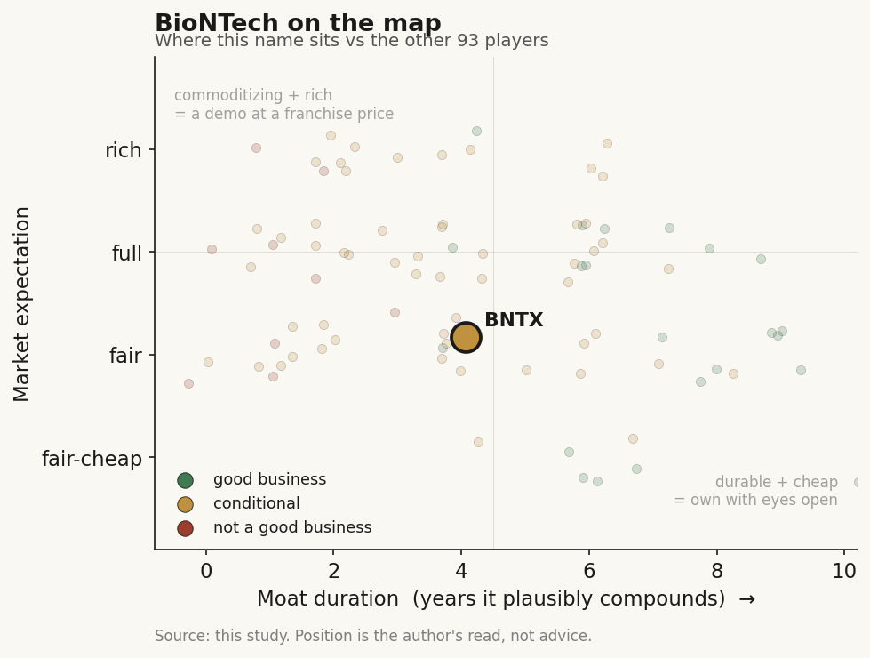

# BioNTech (BNTX / NASDAQ (Germany))

> **The read.** A cash-rich former COVID champion re-tooling into an AI-assisted oncology developer - the clearest EU AI-native drug play (InstaDeep gives it a real in-house model layer most pharma rents) - but the value today rests on a bispecific-antibody pipeline (BNT327, partnered with a large-cap pharma), not on the AI; the market is being asked to underwrite an oncology turnaround while a COVID annuity fades. Own it for the pipeline and the fortress balance sheet, not because the AI is a moat.

**Snapshot**

| | |
|---|---|
| Listing | BNTX / Nasdaq (US ADS); domiciled Mainz, Germany |
| Region | EU |
| Value-chain layer | L9a-L9e (target-ID + AI design through owned clinical development) + a legacy commercial vaccine leg |
| Archetype | drug-owner (pipeline optionality) with a fading product-revenue annuity + in-house AI tooling (InstaDeep) |
| Size | ~$22-24bn market cap (~$97.55, 2-Jul-26); ~251-253m ADS [reported] |
| Revenue (latest) | Q1'26 EUR 118.1m (vs EUR 183m a year earlier); FY26 guide EUR 2.0-2.3bn [disclosed] |
| Moat verdict | conditional - real assets + real cash + real AI tooling, but the AI is not the moat |
| Expectation | fair-to-full (large cash cushion + a big-pharma-validated lead asset carry the price, not the AI) |
| Evidence quality | high on financials/cash/deal terms; med on AI-attributable pipeline value (little is disclosed as AI-designed) |

## What it is
A German biotech that got rich as one of two mRNA-COVID vaccine winners (Comirnaty, partnered with a large-cap US pharma) and is now spending that windfall to become a diversified oncology company. The distinctive feature for this study: in 2023 it bought InstaDeep - a Tunis-born, UK-based AI/ML company - for up to ~$680m (~£562m headline: ~£362m upfront cash+stock plus up to ~£200m milestones) [disclosed], the largest deal in its history at the time. That makes BioNTech the rare drug-owner that owns its AI stack in-house rather than renting it, and the clearest EU-listed "AI-native drug" story. It spans L9a-L9e (target-ID and AI-assisted molecule design through its own clinical trials) and still carries a shrinking commercial vaccine leg.

## Business model - how it makes money
Two very different engines, with a third (the AI) embedded as a tool, not yet a revenue line:

- **Legacy vaccine annuity (fading).** COVID vaccine revenue, largely a profit-share on Comirnaty booked through a large-cap partner. This funded everything but is in structural decline - FY26 guide EUR 2.0-2.3bn is down from prior years, and management flags lower COVID revenue in both Europe and the US [disclosed]. Q1'26 total revenue was only EUR 118.1m (vs EUR 183m a year earlier) - COVID revenue is seasonal (autumn-weighted), so a thin Q1 is mechanical, but the trend is down.
- **Oncology pipeline (the future value).** Pre-product: value is a probability-weighted string of forward trial readouts. The lead asset is **BNT327 / pumitamig**, a next-generation PD-L1 x VEGF-A bispecific antibody, now co-developed and co-commercialized with a large-cap US pharma partner under a deal worth up to $11.1bn [disclosed]: $1.5bn upfront + $2bn non-contingent anniversary payments through 2028, plus up to $7.6bn in milestones, with 50/50 sharing of development costs and global profit/loss. More than 20 BNT327 trials are ongoing or planned, including registrational Phase 3 studies in first-line small-cell lung, non-small-cell lung, and triple-negative breast cancer [disclosed].
- **AI tooling (InstaDeep) - embedded, not monetized separately.** InstaDeep supplies foundation models for proteins (ProtBFN, AbBFN) and DNA (Nucleotide Transformer, SegmentNT), a protein-design platform (DeepChain), and internal lab agents; BioNTech applies these to design mRNA/protein sequences and to its RiboMab / RiboCytokine platforms [disclosed]. It also has an enterprise-AI business of its own. The AI lowers discovery cost and cycle time; it does not, on disclosure, yet carry an identifiable revenue line or a named AI-designed molecule in late-stage trials.

**Cash conversion.** Currently negative by design - this is a pre-product developer burning R&D against a fading annuity. The saving grace is the balance sheet: **cash, equivalents and security investments of ~EUR 16.8bn** at Q1'26 [disclosed], one of the largest cash piles in all of biotech. Q1'26 net loss was EUR 531.9m (adjusted EUR 494.6m). The company also launched a **$1.0bn buyback** over twelve months [disclosed] - a signal it views itself as over-capitalized relative to near-term burn.

## Financial summary

| Item | FY25 (context) | Q1'26 | FY26 guide |
|---|---|---|---|
| Total revenue | higher (COVID-weighted) | EUR 118.1m (vs EUR 183m a year earlier) | EUR 2.0-2.3bn |
| Net loss | - | EUR 531.9m (adj. EUR 494.6m) | - |
| Diluted loss/share | - | EUR 2.10 (~$2.46) | - |
| Cash + equiv. + securities | - | ~EUR 16.8bn | - |
| Buyback | - | up to $1.0bn / 12 months | - |
| BMS deal (BNT327) | - | $1.5bn upfront + $2bn non-contingent through 2028; up to $11.1bn total | 50/50 cost + profit share |

Figures as of the Q1'26 report and ~2-Jul-2026 price/share-count where tagged [reported].

## Value-chain position and competition
BioNTech sits across the owned-drug stack - L9a (target-ID) through L9e (owned clinical development) - with the InstaDeep tech layer (L9b generation/design) genuinely in-house, plus a downstream commercial vaccine leg from the COVID franchise. What flows in: sequences, structures, partner targets, InstaDeep compute (a supercluster, "Kyber," has been outlined) [reported]. What flows out: (i) partnered de-risking cash from the large-cap pharma on BNT327; (ii) the binary NPV of its own programs if they clear efficacy; (iii) a fading Comirnaty profit-share.

Competition splits three ways:
- **On the AI-drug-owner thesis:** the frontier-lab cohort - Isomorphic, Recursion, Xaira, Generate, Insilico. BioNTech's edge over these is real: it is already a commercial, cash-rich company that carries assets into its own Phase 3 trials, not a pre-revenue platform hoping to. Its disadvantage: far less of its pipeline is disclosed as AI-originated, so the "AI-native" label is more about capability owned than value proven.
- **On the lead oncology asset (BNT327 / PD-L1 x VEGF bispecific):** a hot, crowded class - the same mechanism as Summit/Akeso's ivonescimab, plus programs at multiple large-caps. Class competition, not solo optionality.
- **On the legacy franchise:** the COVID/mRNA vaccine duopoly with its former partner and rivals - a declining pool.

Edge: BioNTech is the only name in the AI-drug cohort that pairs (a) an owned, in-house AI stack, (b) a fortress balance sheet (~EUR 16.8bn), and (c) a big-pharma-validated late-stage asset. That combination is scarce. But note the source of the validation: it is the pharma partner's up-front dollars behind BNT327, not the AI, that anchors today's value.

## Moat
Two candidate moats, and they split:

- **Balance sheet + partnered late-stage asset - REAL, but not an AI moat (~3-5 yr of funded optionality).** ~EUR 16.8bn cash buys many shots on goal and removes the financing-cliff risk that defines the rest of the AI-drug cohort; the $1.5bn-upfront BMS deal externally validates BNT327. This is a durable near-term advantage - but it is a capital and pipeline moat, not a data/AI-scale moat, and cash advantages erode as they are spent.
- **AI/data flywheel (InstaDeep) - the study's Ch5 caution applies: not proven as a drug-discovery moat (~0-1 yr of defensible edge).** InstaDeep's models are strong, but the field's frontier structure/design models commoditize fast (open clones caught AlphaFold-class quality within ~a year at far lower cost), and no AI edge has yet been shown to move the ~40% Phase-II efficacy wall where ~90% of clinical failure lives. Owning the AI in-house is cheaper and faster than renting it - a genuine cost/cycle-time advantage - but it does not, on current evidence, raise the odds per shot. Zero AI-designed BioNTech drug is approved.

Net: the durable near-term moat is capital + a validated pipeline; the AI is a real capability that lowers cost, not a compounding moat that changes clinical odds. Estimated durable-compounding duration ~3-5 years, resting on cash and BNT327, not on the model layer.

## Core variables
1. **[CORE] BNT327 Phase 3 readouts (the master value driver).** The multiple oncology data points - the registrational first-line lung and TNBC studies - are what convert BioNTech from "cash + COVID annuity" into "diversified oncology company." This is a binary, class-competitive bet (ivonescimab and other PD-L1 x VEGF programs are direct comparators); a clean win re-rates the name, a miss strands the oncology thesis.
2. **[CORE] Cash deployment discipline vs the fading annuity.** With ~EUR 16.8bn and COVID revenue in structural decline, the swing variable is whether management converts the windfall into approved assets (or shrewd M&A) before the annuity runs out - or burns it. The $1.0bn buyback says "over-capitalized"; the R&D line says "spending fast." Watch net cash trajectory against pipeline progression.
3. **[CORE] AI-attributable value (the honest unknown).** Does InstaDeep produce a *named, disclosed* AI-designed molecule that reaches and clears the clinic - the proof that would turn the AI from a cost-saver into a value-creator? So far the disclosure is capability, not attributable output. This is the variable that would justify the "AI-native" premium; today it is unverified.

Below the line as noise: quarterly COVID revenue seasonality (autumn-weighted; a thin Q1 is mechanical, not a trend break); the InstaDeep enterprise-AI business (small relative to the drug pipeline); FX translation on a euro-reporting, dollar-revenue company.

## Bear case / key risks
A cash-rich company in transition, priced partly on a hope the data has not yet delivered. (i) The revenue base is *shrinking* - COVID vaccine sales fall in both major markets, FY26 guide EUR 2.0-2.3bn is a step down, and there is no product replacement online yet. (ii) The lead asset sits in a crowded PD-L1 x VEGF bispecific class where a rival (ivonescimab) is arguably ahead in some readouts - class risk, not solo upside. (iii) The "AI-native" tag is thinly evidenced: InstaDeep is a real capability, but the study's own finding is that the drug-discovery data flywheel is commoditizing and cannot yet move the Phase-II wall; no AI-designed BioNTech drug is approved, and little of the disclosed pipeline value is explicitly AI-attributable. (iv) The ~EUR 16.8bn cash is both a strength and a temptation - large biotech cash piles invite value-destructive M&A. (v) As a non-US-domiciled name reporting in euros, some data (segment-level AI economics, program-level disclosure) is thinner than for US peers - flagged honestly.

Falsification watch: (1) a BNT327 registrational miss - the oncology re-rating breaks and the name reverts toward cash + annuity value; (2) COVID revenue falls faster than guided with no pipeline offset - the annuity-to-oncology bridge shortens; (3) a named AI-designed candidate fails in the clinic - the "AI-native" premium was air. What breaks the bear: a clean first-line BNT327 Phase 3 win, or a disclosed AI-originated asset clearing efficacy above base.

## The expectation read
Shares ~$97.55, market cap ~$22-24bn on ~251-253m ADS (2-Jul-26) [reported]. Strip out ~EUR 16.8bn (~$18-19bn) of cash and the enterprise value the market assigns to the entire pipeline + InstaDeep + the fading annuity is modest - only a few billion dollars of EV. Read that way, the price is *not* pricing "AI solved drug discovery"; it is pricing "a fortress balance sheet plus a big-pharma-validated oncology asset, with the AI as free-ish optionality." That is a materially more grounded expectation than the pure AI-lab cohort (Isomorphic, Recursion), where the cash cushion is thin and the multiple leans entirely on the model.

Where the belief still looks soft: the small EV is only cheap if the cash is deployed well and BNT327 works - a thin pipeline EV can compress further if a registrational study misses and management spends the cash chasing a replacement. The "AI-native" framing that draws the crowd is the least-proven leg; the value that actually anchors the price is old-fashioned - cash and a partnered late-stage drug.

## Verdict
Conditional-good business: the clearest EU AI-native drug play by capability (in-house InstaDeep stack) and by far the best-capitalized name in the AI-drug cohort (~EUR 16.8bn cash, a $1.5bn-upfront partnered lead asset), but the value today rests on the pipeline and the balance sheet, *not* on the AI - which is a real cost-saver, not a proven clinical moat. Priced net of cash, the pipeline EV is modest and the expectation is fair-to-full rather than stretched, so this is a pipeline-and-capital-allocation bet dressed in AI clothing. Confidence: HIGH on cash, deal terms, and revenue trajectory (all disclosed/current); MEDIUM on the oncology re-rating (binary BNT327 readouts, crowded class); LOW on any AI-attributable value read before a named AI-designed asset clears the clinic.
