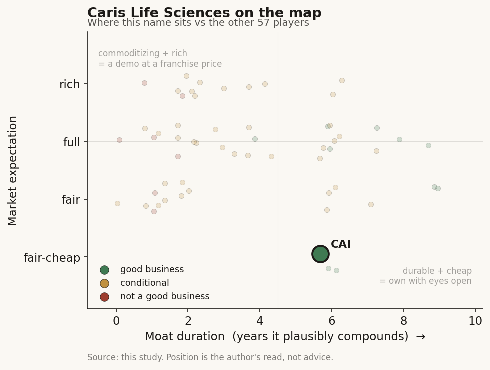

# Caris Life Sciences (CAI)

> **The read.** A genuinely profitable precision-oncology lab (Q1'26 +79%, 65% GM, +$26m adj EBITDA, +$22m FCF, ~+$442m net cash) trading at a Dx-not-software ~5x EV/sales - a good business at a fair-to-cheap expectation, but its entire re-rate hinges on ONE ASP reset holding.

**Snapshot**

| | |
|---|---|
| Listing | CAI / Nasdaq |
| Region | US |
| Value-chain layer | L5 - AI-bioinformatics / interpretive anchor |
| Archetype | data-platform / SaMD (per-test lab + data-licensing leg) |
| Size | ~$5.2bn market cap (June'26) |
| Revenue (latest) | Q1'26 $216.2m, +79% YoY; FY26 guide $1.00-1.02bn, +23-26% |
| Moat verdict | conditional - durable ~5-8yr on code/coverage; data-flywheel unproven |
| Expectation | fair-to-cheap |
| Evidence quality | high |

## What it is
A CLIA/FDA precision-oncology molecular-diagnostics lab whose whole-exome + whole-transcriptome (WES/WTS) assay reads ~23,000 genes per tumor to pick a therapy, monetized per test [disclosed], with a ~1.07m-profile [disclosed] de-identified clinico-genomic dataset licensed to pharma. Same two-engine shape as Tempus - a per-test lab (Archetype 01) with a data-licensing leg (Archetype 03) - but reached self-funding first. This is the profitable version of the Tempus playbook.

## Business model - how it makes money
Two engines. (i) **Molecular Profiling Services** - the per-test clinical lab (Archetype 01): tissue MI Profile / MI Cancer Seek + blood Caris Assure, billed to payers, reimbursement-gated. Q1'26 = $210.8m, +85% YoY [disclosed]. (ii) **Pharma R&D Services** - a data/services annuity (Archetype 03), lumpy: Q1'26 only $5.4m (down from $6.8m; guided ~$8m, historically light in 1H) [disclosed]. Profiling is >97% of revenue - a lab first, a data business second.

Growth quality: a capital-hungry archetype (wet lab, reagents, CLIA, working-capital-heavy payer adjudication), but the ASP inflection turned incremental economics self-funding. **The +79% is ASP-led, not volume-led** - Q1'26 volume grew only ~15% (~52,800 cases) while clinical ASP jumped (Q3'25 ASP +87% YoY to $4,089; FY25 blended ASP +150% to $5,357 [sell-side]). Cash conversion is now genuinely positive - the ROIC story is the reimbursement reset dropping to cash, not organic volume compounding.

## Financial summary

| | FY24 | FY25 | Q1'26 |
|---|---|---|---|
| Revenue | $412m [disclosed] | $812m [sell-side] | $216.2m |
| YoY growth | - | +97% (ASP-reset artifact) | +79% |
| Gross margin (GAAP) | - | ran 68% in Q3'25 on true-ups [sell-side] | 65% (up ~1,800bp from 47% prior yr) |
| Adj EBITDA | - | +$51m in Q3'25 [sell-side] | +$26.2m (vs −$36.2m prior yr) |
| Operating cash flow | - | - | +$32.9m |
| FCF | - | +$55m in Q3'25 [sell-side] | +$22.5m (after $30.5m bonus payments) |
| Net loss | - | - | −$0.5m |

FY26 guide **$1.00-1.02bn, +23-26%** [disclosed], i.e. steady-state ~mid-20s% once the ASP step laps. Structural gross margin ~62-68% - a per-test lab margin, not a software margin (the data leg is too small to lift blended GM the way Tempus Insights does). Balance sheet: cash & short-term securities **$823.4m**; debt ~$381.6m [disclosed] → **net cash ~+$442m**. This is the bar Tempus has not yet cleared.

## Value-chain position and competition
The **L5 AI-bioinformatics / interpretive anchor**, back-integrated to L3/L4 (its own WES/WTS assay + CLIA lab) and forward to a pharma-RWE leg (the Tempus-Insights analogue). What flows in: tumor tissue/blood + sequencer/reagent toll (L1/L2). What flows out downstream: a therapy-selection call to the oncologist (the named-patient interpretive layer where liability concentrates), a payer claim, and - the upstream seam - a de-identified multimodal profile into the pharma dataset. Cash engine sits in the reimbursement-gated lab; any re-rating optionality sits in the capital-light data leg, which today is <3% of revenue.

Competition:
- **Direct twin: Tempus (TEM).** Both ~mid-20s% 2026 guides, both L5 two-engine. CAI's edge is **profitability + a deeper assay** (WES/WTS ~23,000 genes vs targeted panels) and an FDA-approved WES/WTS CDx (MI Cancer Seek, the first) that unlocked the ASP uplift (Medicare $8,455 vs $3,500) [sell-side]. TEM's edge is a **larger, further-monetized data leg** (~25% of revenue vs CAI's <3%) - so CAI is the cleaner lab, TEM the deeper data annuity.
- **Per-assay category leaders:** Foundation Medicine + Guardant (GH) in CGP; **Natera Signatera** in MRD (a franchise CAI does not yet have) [reported]. In blood/tissue CGP, CAI is a credible share gainer (Caris Assure +56-66% YoY volume, ~35-40% tissue-blood attach) [sell-side].
- **Edge, honestly:** a real assay-depth + first-CDx + profitability lead, **not** a reimbursement monopoly and **not** a data-scale annuity at Tempus's scale. Its dataset (~1.07m profiles) is a genuine by-product asset but is early-innings monetized.

## Moat
Two moats, two different verdicts:
- **Data-licensing flywheel (Ch5 Moat 4) - CONDITIONAL, survives-as data-licensing (~5-10yr) but NOT YET REALIZED here.** The archetype that lets "more data → more value" hold (data IS the sold product; pharma bears efficacy risk) is present, but CAI's Pharma R&D leg is <3% of revenue and shrinking QoQ - the flywheel exists structurally, the *equity capture* is nascent. A real but **unproven** annuity, not a Tempus-scale one.
- **Reimbursement-code / coverage ownership (Ch5 Moat 1 survivor) - the real near-term moat, ~5-8yr, CAPPED.** The FDA WES/WTS CDx + Medicare crosswalk to $8,455 is the coverage-build that drove the ASP reset - payment-rail ownership, the durable form. But it is the SAME conditional as everyone: **a permanent code can be repriced DOWN under CMS budget-neutrality** (sector precedent −14%).
- **What does NOT moat it:** bare FDA clearance (Ch5 Moat 1 REFUTED - table stakes) and assay depth alone (a per-test spec competitors can close). **Verdict:** durable for ~5-8yr on the code/coverage leg; the data-flywheel leg is the optionality that has to prove out to earn a software multiple.

## Core variables
1. **ASP durability / reimbursement rate-of-change (the master variable).** The entire +79% is the MI Cancer Seek CDx crosswalk to $8,455 dropping through. Does blended ASP HOLD (contract conversion, MolDX/commercial coverage sticking, true-ups normalizing) or fade under CMS repricing? This lever made CAI FCF-positive; it can also un-make it.
2. **Volume re-acceleration (the growth engine once ASP laps).** ASP is a one-time reset; from FY27 the rate is volume - tissue ~low-teens + blood ~high-50s, and the ~300-rep sales expansion [sell-side] must convert. Guide (~20% clinical volume) is the number to track.
3. **Pipeline optionality - MRD + MCED (Caris Detect / ACHIEVE-1).** Early cancer detection and MRD are 24-36 months out [sell-side], excluded from the top line - the genuine upside CAI has that TEM lacks (an MCED launch), gated by clinical readouts and a coverage path.

*(Second-order, below the line: Pharma R&D lumpiness; opex step-up (FY26 opex guide $590-595m, well above prior ~$510-520m messaging - the IPO-tone change [sell-side]); the ~$381m debt.)*

## Bear case / key risks
It is a **per-test reimbursement-gated lab whose entire 2025-26 re-rate is a single ASP reset**, not durable compounding. Strip the CDx crosswalk and the underlying business grows ~15% on volume at a ~62-68% lab GM with a heavy opex base that management just stepped UP (opex guide $590-595m vs prior ~$510-520m) - a good lab, not a software compounder. The high-margin data leg that would justify a platform multiple is **<3% of revenue and declined QoQ** - the Tempus-style annuity is a slide, not a segment. The ASP itself is the fragility: a permanent code can be repriced DOWN (−14% sector precedent), and a slug of recent revenue is out-of-period true-ups (~$38m in Q3'25 [sell-side]) that do not recur. Profitability is real (unlike TEM's SBC-adjusted crossover) but young - one full quarter of positive FCF is not a track record, and the MRD/MCED optionality is 2+ years out and unfunded in the model.

**Falsification to watch:** (1) blended ASP fades or a CMS/commercial crosswalk step-down; (2) volume growth stays ~15% while opex compounds → FCF slips back negative; (3) MRD/MCED readout disappoints or gets no coverage path.

## The expectation read
At ~$18-19/sh and ~$5.2bn cap (June'26) [reported], on FY26 ~$1.01bn guide CAI trades ~5x EV/sales [estimate] - a Dx-peer-range multiple (peer group ~5-6x [sell-side]), NOT a software multiple, and well off its ~$5.95bn IPO cap and the sell-side ~$31-35 PT [sell-side]. **What the market is pricing:** a profitable diagnostics grower - it is giving CAI credit for the FCF crossover but NOT paying up for the data leg or the MRD/MCED optionality (both excluded from estimates). **Where the belief looks soft on each side:** the multiple implicitly treats the ASP reset as sustainable (bull risk: it repriced down $40→$35 PT into Feb'26 as opex tone shifted [sell-side]) yet gives ~zero for the pipeline that differentiates it from a pure CGP lab (bear-side conservatism). The tension: pay a lab multiple and the ASP durability + opex step are the risk; pay a platform multiple and the data leg is far too small (<3%) to support it today. Consensus is treating it as the *profitable* Tempus - correct on cash, but that profitability rests on one reimbursement lever.

## Verdict
**Good business, fairly-to-cheaply priced** - a genuinely profitable precision-onco lab (Q1'26 +79%, 65% GM, +$26m adj EBITDA, +$22m FCF, ~+$442m net cash) at a Dx-not-software ~5x EV/sales, whose re-rate hinges on ONE ASP reset holding and whose software-multiple optionality (the <3% data leg + 2yr-out MRD/MCED) is unproven. Confidence: MEDIUM-HIGH on the current financials (company-disclosed, cross-checked to the press release), MEDIUM on durability (the ASP-reset dependence and CMS-repricing tail are the swing, and only one quarter of positive FCF is on the tape).
