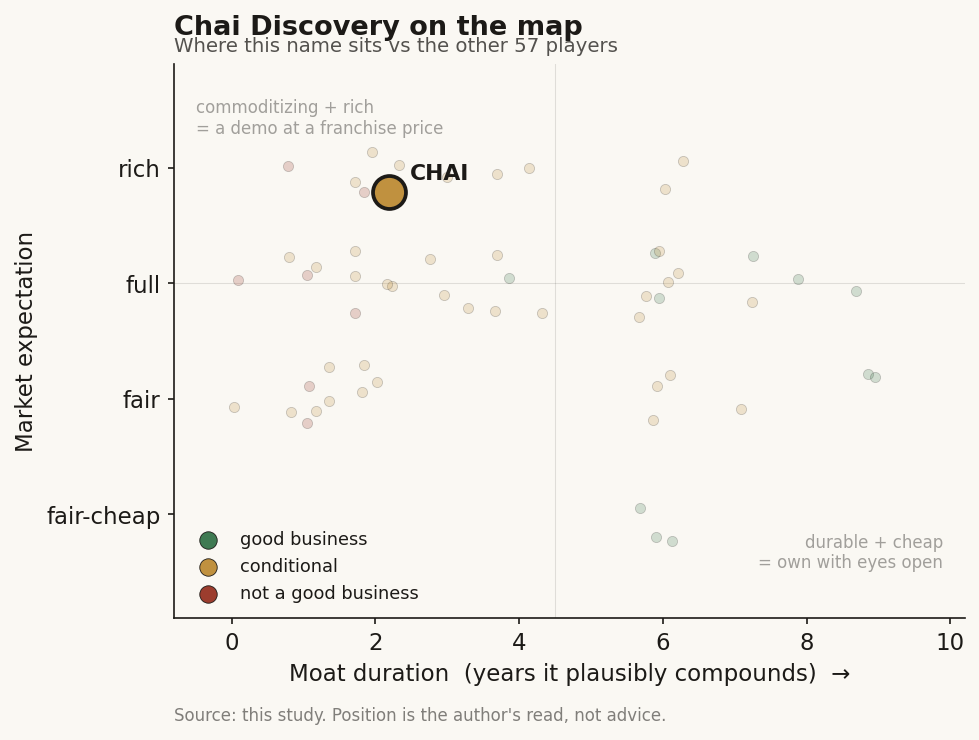

# Chai Discovery (private)

> **The read.** Best-in-class founders and real pharma access sit on a value-chain position the framework grades as commoditizing - its own Chai-1 is the proof - so this is a demo/feature with relationship optionality, not yet a durable value-capturer: good business unproven, at a rich private mark. Grade C+, high confidence on the model-moat refutation.

**Snapshot**

| | |
|---|---|
| Listing | private |
| Region | US |
| Value-chain layer | L9b/L9x (structure/generation + compute/tooling spine of drug discovery) |
| Archetype | picks-and-shovels (Archetype-04 milestone/royalty in the making) |
| Size | $1.3bn post (Series B, Dec 2025); ~$3.4bn in talks (mid-2026) |
| Revenue (latest) | pre-revenue (none disclosed) |
| Moat verdict | commoditizing (~1-2yr compounding on current form) |
| Expectation | rich |
| Evidence quality | med |

## What it is
A San-Francisco AI-bio lab (founded Mar 2024) building foundation models for biomolecular structure prediction and de-novo antibody/molecule design - the "computer-aided-design suite for molecules." The clean case of a frontier/LLM-lab entrant (ex-OpenAI/Meta/Absci founders, OpenAI-backed) walking into structure prediction from the model side.

## Business model - how it makes money
Explicitly picks-and-shovels, NOT own-pipeline. Cofounder: *"people told us the only way to make money is to make your own assets and become a drug company. That's the dogma we had to challenge."* Board member (ex-Pfizer CSO Dolsten): to be the trusted partner *"you cannot at the same time try to have your own little shop."* A deliberate refusal to take the Isomorphic/Absci owned-asset route.

Revenue mechanism: sell model access + design services to pharma via partnership deals. Chai-1 is free bait (open weights, non-commercial; hosted tool free even commercially); Chai-2/Chai-3 are closed, pharma-only - the funnel is open-model marketing to closed-model paid partnership.

The deals are structured to become Archetype-04 (upfront + milestones + royalty). No terms disclosed on Lilly/Pfizer; comparable AI-design deals (Genesis/Incyte, Isomorphic/Lilly) run *"tens of millions upfront, >$1bn potential total"* - but realized value is typically 1.2-3.0% of headline biobucks.

Capital profile: light today (no wet lab, no CLIA, no inventory - pure compute + ML headcount). But the moment it wants durable value it must either co-own assets (turning capital-hungry) or stay a low-take-rate tool vendor. Revenue is zero; value is entirely forward optionality.

## Financial summary
No public financials exist; this is a funding table in place of an income statement. Provenance: [disclosed] company/primary, [reported] press/secondary.

| Round | Amount | Valuation (post) | Date | Lead / backers |
|---|---|---|---|---|
| Seed | $30m | ~$150m | 2024 | Thrive Capital, OpenAI, Dimension [reported] |
| Series A | $70m | not disclosed | - | Menlo Ventures [reported] |
| Series B | $130m | $1.3bn | 14-15 Dec 2025 | General Catalyst + Oak HC/FT (co-lead); OpenAI, Menlo, Dimension, Thrive, Neo, Yosemite, Lachy Groom, SV Angel, Glade Brook, Emerson Collective [disclosed/reported] |
| In talks | ~$400m | ~$3.4bn | mid-2026, no lead selected | [reported] - the number to treat with the most suspicion |

Total raised >$225m [disclosed]. The ~$3.4bn talks mark is a ~2.6x markup in ~6 months on a pre-revenue balance sheet.

Founders: Josh Meier (CEO, 30, ex-OpenAI / Meta generative-biology / Absci), Jack Dent (President, 29, ex-Stripe), Matt McPartlon (ex-Absci), Jacques Boitreaud (ex-Aqemia). On the 2026 Forbes AI 50 [reported].

## Value-chain position and competition
L9b = structure/generation (fold prediction, de-novo design) - the "picks" layer of drug discovery. L9x = the compute/tooling spine feeding the discovery chain. What flows IN: pharma target antigens + partner data; compute (the L0/silicon toll it pays upstream). What flows OUT: designed antibody/molecule candidates + structure predictions handed to the partner, who runs the trials and bears efficacy risk. This is precisely the layer Ch4/Ch5 grade as the commoditizing generation step that carries no NPV - Chai sits where value is created but not captured, and is trying to climb out via closed models + relationships.

Direct model rivals: AlphaFold3 (DeepMind/Isomorphic), Boltz-1/2 (MIT, open), ByteDance Protenix, OpenFold-3, plus generative-antibody peers (Absci, Generate:Biomedicines, Genesis, Xaira, Nabla Bio). Boltz-1 *beat* Chai-1 on CASP15 affinity (LDDT-PLI 65% vs 40%) [disclosed] - Chai is not even the frontier of the open cohort it belongs to.

Its edge (real, narrow): (i) a fast model ladder - Chai-2 hit 16% full-length de-novo antibody success, Chai-3 claims ~2x that and ~100x tighter binding [reported/disclosed, internal]; (ii) pure-picks positioning as trust signal - no competing pipeline, which is what won Eli Lilly (Jan 2026) and Pfizer (2026) partnerships plus "15+" pharma in talks [reported]; (iii) frontier-lab pedigree + OpenAI halo that pulls capital and talent. The edge is relationship + go-to-market posture, not model supremacy - a critical distinction for the moat.

## Moat
Two Ch5 verdicts bite, both against durability at the model layer. Moat-4 (data flywheel, drug-discovery version) and the structure-prediction moat inside Moat-3 are REFUTED: open clones - Chai-1 is named as one of them - matched the AF3 frontier within ~1yr at >1000x lower cost. Chai's own core IP is a ~12-month moat by the brief's own evidence. Model-of-record status is a treadmill, not a wall.

What could survive is Moat-3's surviving mechanism: owned asset against a risk-bearing pharma counterparty - except Chai has chosen not to own the asset. So it deliberately forgoes the one moat the brief says survives, in exchange for trust/access. What it holds instead is the pharma-RELATIONSHIP (Lilly, Pfizer, ex-Pfizer-CSO on the board) - real access most techbios lack, but the brief is explicit: relationship/optionality is not a durable-compounding moat, and the pharma landlord can envelop the supplier (Epic-to-scribe analogue).

Is the moat real for a private at this stage? No - not yet. At seed-to-B stage the "moat" is founder pedigree + an open-model funnel + two logo partnerships with undisclosed (probably 1-3%-of-biobuck) economics. Durable value would require either (a) an owned or co-owned asset clearing the ~40% Phase-II efficacy wall - which it has renounced, or (b) a switching-cost lock via data-attach/workflow it does not have. Duration of compounding on current form: ~1-2 years (model-lead half-life + relationship head-start), not the 5-10 the valuation implies.

## Core variables
1. **Partnership economics realized, not signed.** Do Lilly/Pfizer deals convert past 1-3% upfronts into milestone/royalty cash - i.e. does a Chai-designed molecule *advance*? Logos are free; paid progression is the thesis. Currently unobservable (private, no terms).
2. **Escape velocity from the open cohort.** Can closed Chai-2/3 stay a genuine step ahead of free/open Boltz/Protenix/AF3 long enough that pharma keeps paying - or does the paid model commoditize the way Chai-1 commoditized AF3? The half-life of the model lead IS the moat here.
3. **The own-asset fork.** Does Chai hold the pure-picks line, or (like Isomorphic/Absci) capitulate into owning pipeline to capture value - converting capital-light optionality into capital-hungry Phase-II biology risk? Which side it lands on redefines the entire risk profile.

Second-order, below the line: the $3.4bn round closing at terms; headcount/burn vs runway; OpenAI relationship durability; whether Chai-3's internal success rates replicate on partner targets.

## Bear case / key risks
A commoditizing model layer wearing a $1.3bn (to $3.4bn) valuation, whose own flagship (Chai-1) is the brief's exhibit A for how fast structure-prediction IP evaporates. It sells picks in the one part of the funnel (generation, Phase-I chemistry) that is already ~solved and carries no NPV, while explicitly refusing the only layer that captures durable value (the owned asset). Revenue is zero; "traction" is two undisclosed logo deals and a talks pipeline - the exact demo/headline pattern that priced Exscientia and BenevolentAI before both effectively failed. The pharma partners are the landlords: they can in-source the model (Lilly funds Isomorphic; every big pharma builds internal AF3-class tooling) and envelop the supplier at renewal. The ~2.6x markup in ~6 months, pre-revenue, on a company whose core IP has a demonstrated ~12-month half-life, is a venture mark chasing an OpenAI halo, not proven compounding. Falsification of the bear: a Chai-designed molecule visibly advancing through a partner's clinic on economics that scale (milestones triggering) - until then the weight of evidence is "impressive demo, feature not franchise."

## The expectation read
The ~$3.4bn talks mark implies the market believes Chai can hold a durable model lead and convert two logo partnerships into scaling milestone/royalty economics - pricing the core model IP as a multi-year franchise. That belief looks soft on two counts the evidence already contradicts: Chai-1 is itself the exhibit for a ~12-month IP half-life (and Boltz-1 already beat it on CASP15 affinity, 65% vs 40%), and the company has renounced the owned-asset layer that is the only moat the framework grades as surviving. A ~2.6x markup in ~6 months on zero revenue is a mark set by the OpenAI halo and scarcity of frontier-lab founders, not by proven compounding.

## Verdict
Demo / feature-with-relationship-optionality, not (yet) a durable value-capturer - GRADE C+, confidence HIGH on the model-moat refutation, MODERATE on the partnership-optionality upside. Best-in-class founders and real pharma access sit on top of a value-chain position the framework grades as commoditizing (its own Chai-1 is the proof), and the company has deliberately renounced the one moat that survives. Watch the partnership *economics* and the own-asset fork; price the model IP at a ~12-month half-life, not a franchise. Good business unproven at a rich private expectation.
