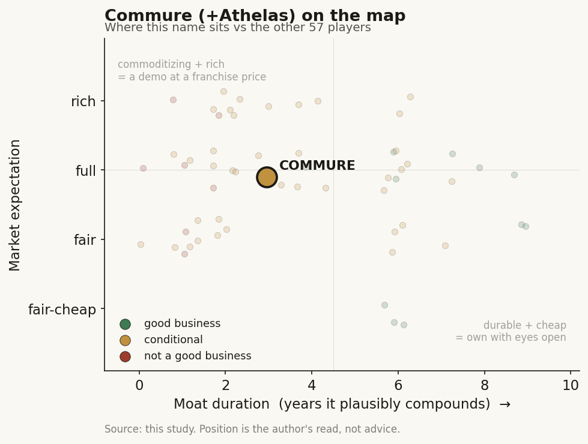

# Commure (+Athelas) (private)

> **The read.** A conditional value-capturer: the L8 claims-to-cash rail is a real durable-moat candidate, but the L6 scribe is already an enveloped feature and the whole entity is an insider-marked, subsidy-flattered roll-up - good business only if the RCM take-rate holds. Grade C+ / speculative.

**Snapshot**

| | |
|---|---|
| Listing | private |
| Region | US |
| Value-chain layer | L6 clinical-workflow / L8 payment-administration |
| Archetype | workflow (02 SaaS + 05 savings-share hybrid) |
| Size | $7bn post-money (May-2026) |
| Revenue (latest) | ARR ~$104-105m (2024), +150% YoY |
| Moat verdict | conditional (L8 durable candidate, L6 commoditizing) |
| Expectation | full |
| Evidence quality | med |

## What it is
An AI healthcare-operations platform ("CommureOS") that bundles revenue-cycle management (RCM), ambient AI scribing/coding, practice-management, patient engagement, remote monitoring and staff-safety into one stack sold to large US health systems. It is a backer-orchestrated roll-up - Commure + Athelas merged, then bolted on the listed scribe Augmedix - stitched into a single administrative-automation layer.

## Business model - how it makes money
Enterprise SaaS + savings-share (Archetypes 02 + 05). Three revenue engines: (i) RCM / claims-to-cash automation (Athelas + CommureOS - "processes tens of billions in annual claims, 85%+ of revenue-cycle work completed without human intervention") - this is the savings-share/take-rate leg that touches the reimbursement dollar; (ii) ambient AI scribe + autonomous coding (Augmedix-derived, 60+ EHR integrations, per-provider-per-month SaaS); (iii) workflow/engagement/RPM/staff-safety point tools (Strongline badges, Engage, Athelas Home). ARR ~$104-105m (2024), +150% YoY, "doubled three consecutive years" to a hundreds-of-millions run-rate by 2025. Capital-light at the software layer, but capital-hungry to assemble: growth is bought (M&A + CVF-funded S&M), not organically compounded - no disclosed profitability, and roll-up integration is a real cost tax.

## Financial summary
Private - funding and marks, not audited financials. Real numbers only, with provenance: [disclosed] company/primary · [reported] press/secondary · [estimate] derived.

| Event | Date | Figure | Detail |
|---|---|---|---|
| Commure + Athelas merger | Oct-2023 | ~$6bn combined entity | fresh $70m General Catalyst check [reported]; combined run-rate >$100m ARR, guided to $125-150m by year-end [disclosed] |
| Equity round | May-2026 | $70m at $7bn post-money | led by General Catalyst; Sequoia, sell-side and Kirkland & Ellis participating [reported] |
| Growth financing (CVF) | Jun-2025 | $200m | General Catalyst Customer Value Fund - non-dilutive S&M pre-fund repaid by a capped share of the customer cohort it acquires [disclosed] |
| Cumulative raised | - | ~$820m-$1.9bn | higher figure includes CVF and debt-like growth capital; treat as soft [reported/estimate] |

Backers: General Catalyst (founder/anchor - Commure was incubated by GC's CEO Hemant Taneja, founded 2017), Founders Fund, 8VC, Sequoia, Human Capital, Definition Capital [reported].

## Value-chain position and competition
Two seams:
- L6 clinical-workflow - the scribe/documentation/practice-management layer that sits ON TOP of the L0 EHR rails (Epic, Oracle Health). Here it OWNS no scarce input: it rents clinician access through the EHR integration surface, and transcription-to-note commoditizes toward the underlying LLM.
- L8 payment/administration - the RCM leg re-plumbs the claims-to-cash rail against the payer, whom the EHR platform does not own. This is the higher-value seam. What flows: encounter audio/notes and structured orders (L6) inbound; claims, coding, prior-auth and cash-collection (L8) outbound - a fixed take-rate or savings-share of the recovered reimbursement dollar.

Competition - RCM/L8: Waystar (listed, ~$314m Q1-2026 rev, +22%, bought Iodine for $1.25bn), R1 RCM, plus the incumbent BPO tail - a $90bn+ US RCM market growing ~27% CAGR into AI. Scribe/L6: Abridge (~30% share, 2025 KLAS leader, $5.3bn mark), Ambience ($1.25bn), Suki, Microsoft/Nuance Dragon Copilot, Nabla - and, decisively, Epic's native AI Charting (launched 4-Feb-2026, ~$80/provider/mo, into orders and diagnoses).

Edge: distribution + breadth, not best-in-class product. 500+ organizations, 3,000+ sites of care, 130+ of the largest US health systems (HCA, Tenet, Providence, Jefferson), anchored by an HCA ambient-AI deployment across 188 hospitals / 2,400 sites [reported]. The real, unusual edge is the backer's owned demand: General Catalyst runs the CVF sales-funding engine AND, via HATCo, now OWNS a hospital operator (Summa Health, $515m, closed 2025) as a captive proving ground - a distribution flywheel no independent app has.

## Moat
Two layers, two verdicts. L6 scribe = Moat 2 (workflow embedding), FRAGILE/REFUTED as applied. Ch5 names "Commure scribe" explicitly in the fragile cohort: it owns neither the model below (commoditizing LLM transcription) nor the distribution above (rented from Epic, which shipped a ~$80 native substitute into the exact workflow). Duration ~1-3yr rented-slot. L8 RCM = Moat 2's SURVIVING form (workflow OWNERSHIP of the claims-to-cash rail against a payer Epic doesn't own) - same family as Waystar/Cohere. This is where a durable ~5-7yr switching-cost moat could form: re-wiring money flow and re-clearing payer adjudication is genuinely sticky.

Is the moat real for a private at this stage? Partly, and unproven. The RCM-rail thesis is structurally the right one, but (a) the decisive number - NRR-at-price through a renewal cycle - is unobservable in a private, and (b) the same agentic-AI wave that powers the pitch is compressing RCM take-rates industry-wide (see bear). The backer-owned distribution (CVF + HATCo) is a real, near-unique moat on the SALES side, but it is a demand subsidy, not a product moat - and it flatters growth optics in a way an outside buyer must discount.

## Core variables
1. RCM take-rate durability (L8). Does the claims-to-cash rail hold its share of the reimbursement dollar as agentic AI commoditizes the automation? The whole durable-moat case lives here.
2. NRR-at-price, not seat-count. Growth to date is ARR-doubling on land-and-expand + M&A; the referendum is retention at price once Epic's native scribe and cheaper agentic RCM reset the anchor.
3. Organic vs. bought/subsidized growth. How much of the 150% / "3x doubling" is real net-new vs. Augmedix/Athelas roll-up + CVF-funded S&M + captive HATCo/Summa deployment? Strip the subsidy and the true rate is the question.

Second-order (excluded from the CORE set): integration execution across 7+ product lines into one "CommureOS"; scribe gross-margin under inference COGS; convertible/CVF repayment drag; General Catalyst conflict-of-interest optics as both owner, funder and customer.

## Bear case / key risks
A backer-orchestrated bundle, not an earned platform - growth is bought (Augmedix + Athelas M&A), sales are subsidized (CVF pre-funds S&M), and a chunk of "distribution" is the backer's own captive hospital (HATCo/Summa) buying its own portfolio company - so the $7bn mark and the "3x doubling" rest partly on related-party demand an outside acquirer cannot underwrite. The L6 scribe leg is already enveloped by Epic's ~$80 native tool. Worse for the crown-jewel L8 leg: the 2026 sell-side read is explicit - "AI kills the RCM star," agentic AI is gutting RCM take-rates [reported], so the very automation Commure sells is deflating the fee pool it monetizes. No disclosed profitability, a seven-product integration tax, and a private mark struck by the same investor who controls the company, its sales funding and one of its customers. The unifying risk: it may be a feature bundle wearing a platform multiple, marked by an insider.

## The expectation read
The $7bn post-money implies the market is underwriting the L8 claims-to-cash rail as a durable, expanding take-rate platform - pricing breadth (500+ organizations, 130+ health systems) and ARR-doubling as if they were earned, compounding net-new. Where that belief looks soft: the mark is struck by the same investor who funds the sales (CVF) and owns a customer (HATCo/Summa), so the demand it capitalizes is partly related-party; and the fee pool it monetizes is being deflated by the same agentic AI it sells. A full expectation on a metric - NRR-at-price through a renewal cycle - that no private disclosure lets an outsider verify.

## Verdict
CONDITIONAL value-capturer - the L8 claims-to-cash rail is a real, durable moat candidate; the L6 scribe is a demo/feature already enveloped; and the whole thing is an insider-marked, subsidy-flattered roll-up at a full expectation. Grade: C+ / speculative. Confidence: medium on the layer split and the take-rate risk (Ch5-consistent, press-confirmed); low on the standalone economics, which no private disclosure lets an outsider verify.
