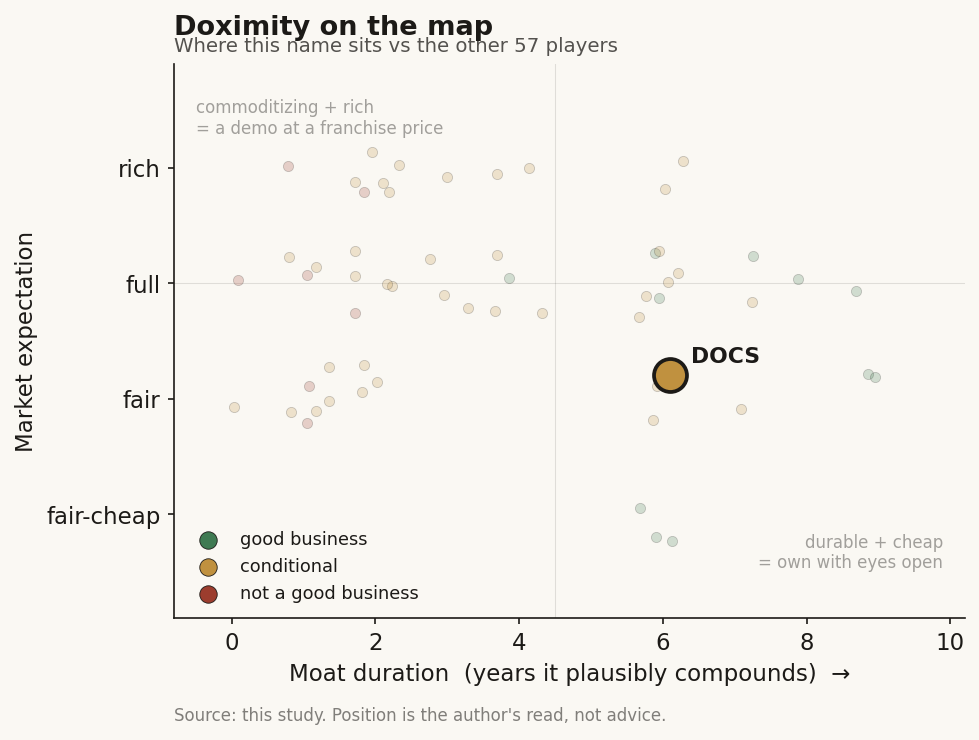

# Doximity (DOCS)

> **The read.** A genuinely good business - >90% gross margin, net-cash, ~49% FCF-conversion, a real verified-physician audience moat - but mis-archetyped as SaaS when it is ad-cyclical, now at a fair-not-cheap expectation that still embeds a re-acceleration the FY27 guide does not yet support.

**Snapshot**

| | |
|---|---|
| Listing | DOCS / NYSE |
| Region | US |
| Value-chain layer | L6 - clinician-workflow / engagement |
| Archetype | workflow SaaS on the label; advertising sold under a subscription contract in fact |
| Size | ~$4.0bn market cap (~$3.26bn EV, net cash ~$0.75bn, 182.9m shares) |
| Revenue (latest) | $644.9m FY2026, +13% YoY |
| Moat verdict | conditional - durable audience moat wrapped around a commoditizing AI layer |
| Expectation | fair |
| Evidence quality | high |

## What it is
The professional network for U.S. physicians - >2m verified members, >80% of U.S. doctors - that monetizes physician attention by selling reach to pharmaceutical brands and health systems. A LinkedIn-for-doctors whose customer is not the doctor. It owns the verified-physician graph and rents that audience to pharma marketers and hospital recruiters. Prices as of 2 Jul 2026: ~$21.9, ~$4.0bn market cap, ~$3.26bn EV.

## Business model - how it makes money
FY2026 (year-end 31 Mar 2026) revenue was $644.9m, +13% YoY (from $570.4m, itself +20%), with GAAP net income $196.1m (30.4% margin), adj EBITDA $357.8m (55.5% margin), FCF $317.5m (+19%), non-GAAP gross margin 91.1% (89.1% GAAP), cash + securities $748.6m, net-cash, ~zero debt. On paper this is a pristine SaaS line: ~90% gross margin, capital-LIGHT (no wet lab, no reimbursement gate, no inventory), FCF-conversion ~49% of revenue, and "Rule of 40" cleared by a mile (13% growth + 55% EBITDA margin = 68). Incremental ROIC is very high - the balance sheet is cash and receivables, not capex.

But the archetype label is the story. The SaaS box requires buyer = beneficiary, per-seat, recurring. Doximity fails the first test: the paying customer is the pharma marketer / hospital recruiter, not the physician who gets the value. Revenue is disclosed as "subscription" (~95% of total) but the underlying product is pharma marketing/advertising reach - the segment that was ~80% of revenue at IPO. That makes the true archetype advertising sold under a subscription contract: growth quality is gated by pharma marketing budgets, which are cyclical, not by seat-count compounding. The FY2027 guide is the tell - revenue $664-676m (~+4% at midpoint), a hard deceleration from +13%/+20%, with EBITDA guided $323-335m (~49% margin, down from 55.5%) as AI-compute COGS, PeerCheck and brand-marketing spend hit. Growth is now customer-expansion, not new logos: NRR 109% (down from 119% a year prior), top-20-customer NRR 114%.

## Financial summary

| Metric | FY2025 | FY2026 | FY2027 guide |
|---|---|---|---|
| Revenue | $570.4m | $644.9m | $664-676m |
| Revenue growth | +20% | +13% | ~+4% (midpoint) |
| Non-GAAP gross margin | - | 91.1% (89.1% GAAP) | - |
| Adj EBITDA | - | $357.8m | $323-335m |
| Adj EBITDA margin | - | 55.5% | ~49% |
| GAAP net income | - | $196.1m (30.4% margin) | - |
| FCF | - | $317.5m (+19%) | - |
| Cash + securities | - | $748.6m (net-cash, ~zero debt) | - |
| Net revenue retention | 119% | 109% | - |

## Value-chain position and competition
L6 clinician-workflow/engagement, sitting ON TOP of the physician's attention and the L0 rails (email, EHR-adjacent, mobile). What flows through it: physician attention downstream → pharma/health-system marketing dollars upstream. It owns the audience (the verified-physician graph), not a reimbursement dollar and not the EHR clinical surface. Newer workflow hooks - Dialer (telehealth calling), the scheduling/fax tools, and now Doximity GPT / clinical-AI assistant (>800k active prescribers in Q4, ~half using the AI) - are engagement levers that deepen the graph, but they are free to the doctor and carry zero direct AI revenue today. They exist to defend the audience that the ad business sells.

Competition comes on two fronts. (i) For pharma marketing dollars: legacy medical-ad/point-of-care (WebMD/Medscape, Sermo, Veeva's Crossix/OpenData on measurement, the endemic-vs-programmatic pull), plus Google/Meta/CTV for the same brand budget. Doximity's edge is real and hard to clone: a verified, deduplicated, NPI-matched physician graph - the closed-loop "reach the actual prescriber and measure the script lift" that open web can't match. (ii) For clinician engagement/AI: the EHR incumbents (Epic native AI, Feb-2026 launch), OpenEvidence (licensed-literature clinical Q&A, ~760k physicians), and every ambient/agent app. Here Doximity has no edge - its AI is a retention feature, not a monetized moat, and it does not own the clinical decision surface Epic/OpenEvidence own.

## Moat
Ch5 Moat 2 (workflow embedding/distribution), CONDITIONAL - and Doximity lands on the FRAGILE side. Ch5 names "Doximity Scribe (a free engagement lever, not a moat)" explicitly. Apply the one test - does it own a scarce input the platform above/beside cannot cheaply replicate? On the AI/clinical layer: NO - it rents the model, owns no reimbursement rail, no licensed corpus, no coding-attach; that layer commoditizes toward the LLM and gets enveloped by Epic. On the advertising layer: PARTIALLY YES - the scarce input is the verified-physician audience + closed-loop script measurement, a genuine data/network asset a new entrant cannot rebuild quickly. That is the durable piece, and it is not a data-flywheel-into-better-model (Moat 4, refuted) - it is an audience-and-measurement annuity closer in kind to Ch5's "owns a scarce input the platform doesn't touch." Verdict: durable audience moat (~5-8yr) wrapped around a commoditizing, non-monetized AI layer. The risk is not displacement of the network; it is de-rating of what the network is worth if pharma ad budgets soften and the AI story fails to become revenue.

## Core variables
1. **Pharma marketing-budget cycle × NRR-at-price.** The single decisive number. NRR fell 119%→109%; FY27 guides ~+4%. Is the slowdown cyclical (pharma pulling brand spend, "softer pharma ad visibility" per mgmt) or structural (share loss / budget rotation to programmatic)? Expansion within the top-125 ($500k+) accounts is the whole model - 125 clients = 83% of revenue.
2. **AI: monetization vs pure cost.** FY27 is an "AI investment year" - compute is now a real, scaling COGS (gross margin already 92%→91%) with $0 AI revenue. Does clinical AI convert to a paid tier / higher engagement that lifts ad yield, or is it permanent margin drag defending a graph that ad-cyclicality is deflating anyway?
3. **Customer concentration.** ~100 clients (large pharma brands + major systems) drive >80% of revenue; loss/budget-cut at a handful moves the P&L. This is the fragility the ~90% GM hides.

(Second-order, held below the line: telehealth/Dialer utilization; hiring-solutions cyclicality; buyback pace off the $748m cash pile; brand-marketing ROI.)

## Bear case / key risks
Doximity carries a software multiple on an advertising revenue stream. Strip the "subscription" label and the buyer is a pharma marketer spending a discretionary, cyclical brand budget - the moment that budget tightens (FY27 guide: ~+4%, EBITDA margin −6pts), the "recurring SaaS" reveals itself as ad-cyclical. The bull's AI narrative is cost, not revenue: >800k AI users, zero AI dollars, and rising compute COGS compressing the very margin that justified the multiple. NRR is decelerating (119%→109%) and revenue is concentrated (~100 clients >80%), so a soft pharma year plus a couple of budget cuts hits harder than a diversified seat-based SaaS. And on the layer the market is excited about - clinical AI - Doximity owns no scarce input Epic/OpenEvidence don't own better; it is spending to defend an audience, not to build a monetizable AI moat. Falsification of the bear: NRR re-accelerates above ~115% AND clinical AI converts to a disclosed paid line (or measurably lifts ad yield) - i.e. the audience moat is being monetized further, not just defended.

## The expectation read
At ~$4.0bn cap / ~$3.26bn EV: ~5.0x EV/sales, ~14x EV/EBITDA (FY26), forward P/E ~15x, trailing ~22x. Note the stock sits ~70% below its 52-week high - the SaaS-premium has already been substantially repriced toward "high-quality but slow." At ~14x EBITDA on a 55%-margin, net-cash, FCF-gushing asset, the market is no longer paying a hyper-growth SaaS multiple - it is pricing a durable, cash-rich, low-single-digit-to-low-teens grower with option value on AI. Where the belief is soft: ~14x EV/EBITDA and forward P/E ~15x still embed a re-acceleration - that FY27's ~+4% is a cyclical trough, that pharma budgets normalize, and that AI eventually monetizes. If instead the deceleration is structural (ad-budget rotation, NRR settling near/under 105%) and AI stays a cost line, then even a "cheap-looking" 14x is pricing a re-acceleration that doesn't come, and fair value is a mid-single-digit grower's multiple on a compressing margin. The multiple is no longer euphoric; the residual optimism is the assumption that +4% is a floor, not a new run-rate.

## Verdict
Genuinely good business (>90% GM, net-cash, ~49% FCF-conversion, a real verified-physician audience moat) - but mis-archetyped as SaaS when it is ad-cyclical, now at a fair-not-cheap expectation that still embeds a re-acceleration the FY27 guide (~+4%, −6pt margin) does not yet support. Confidence: MEDIUM-HIGH on the business quality and the ad-cyclicality read (financials + guide are disclosed and unambiguous); MEDIUM on the expectation call, which hinges on whether FY27 is a cyclical trough or a structural step-down - unresolvable before the pharma budget cycle turns and the AI-monetization question is answered.
