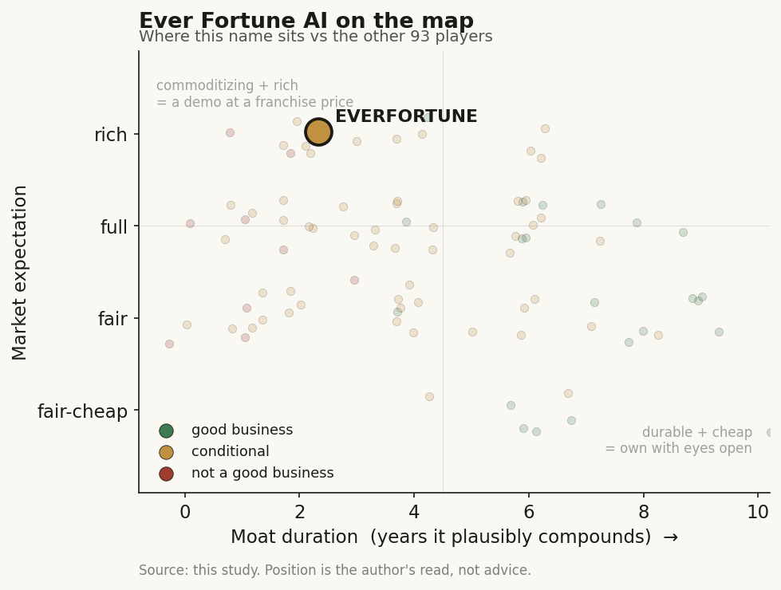

# Ever Fortune AI (6841 TT)

> **The read.** Honestly the best listed TW healthcare-AI pure-play - a genuine loss-to-profit turn off a founder-hospital data pipe and the broadest TW SaMD-licence portfolio - but small, thin-margin, no NHI code, no investable moat yet, and priced richly (~17x sales) on a milestone-gated tech-transfer.

**Snapshot**

| | |
|---|---|
| Listing | 6841, TPEx (櫃買 / 上櫃), listed 2023-03-01 |
| Region | Taiwan |
| Value-chain layer | L1-L4 (patient-data source → imaging/ECG platform → model/assay design → cloud data-processing leg) |
| Archetype | Regulated SaMD (per-license / per-project, with a cloud-service revenue leg) |
| Size | Market cap ~NT$6.63bn (~US$205m) |
| Revenue (latest) | FY2025 NT$374m; grown each year since 2022 |
| Moat verdict | Commoditizing - LOW (~1-3 yr edge; no compounding data-flywheel at the equity) |
| Expectation | Full-to-rich (~17x sales prices the turn + tech-transfer optimism) |
| Evidence quality | Medium |

## What it is
長佳智能 (Ever Fortune AI) is a Taichung-based medical-AI pure-play spun out of China Medical University / its teaching hospital (中國醫藥大學附設醫院, CMUH), building diagnostic-support SaMD (ECG, bone-age, brain DAT-scan CAD, radiotherapy auto-contouring, onco/imaging screening) on top of CMUH's large clinical dataset. It is the clearest listed TW healthcare-AI pure-play, a licence-accumulation model, recently inflected to profit. This is the thinnest-coverage region of the map; provenance is tagged and negatives are stated as findings, not gaps.

## Business model - how it makes money
Three legs: (1) a **cloud biomedical/service platform (~50-60% of revenue)** - hospital SaaS, PACS/AI-integration, medical big-data processing - the largest but lowest-margin leg; (2) **standalone medical-AI software (SaMD licences)**; (3) **medical big-data / project work**, smallest. On top sits lumpy **tech-transfer / co-development milestone income**. Who pays: hospitals and international device partners pay directly today - NOT the NHI. There is no public evidence of a standing NHI reimbursement code for any product (searched NHI 特材/暫時性支付 records, none found). This is the load-bearing negative: the economics currently route AROUND the single-payer gate, selling software/service to providers and a foreign device OEM rather than earning an NHI point value. Value capture is at the licence/project/service step, not a per-test dollar - so cash conversion depends on lumpy milestones and low-margin recurring SaaS, not a reimbursed ASP.

## Financial summary
| Metric | FY2024 | 9M25 / Q1'25 | FY2025 |
|---|---|---|---|
| Revenue | - | Q1'25 NT$72.0m | NT$374m |
| EPS | -NT$0.05 | 9M25 NT$0.81 (Q3'25 NT$0.48) | - |
| Net profit | loss | Q1'25 NT$22.5m (first quarterly net profit) | - |
| Gross margin | - | ~12.4% (9M25) | - |

Additional balance-sheet and capital data: share capital NT$952.0m / 95.198m shares; market cap ~NT$6.63bn (~US$205m). Balance sheet ~NT$2.05bn assets, liabilities ~7.2%, equity ~92.8% - cash-heavy, near-unlevered. IPO reference price NT$57.6 (auction avg NT$73.71). Q1'25 was the first profitable quarter; 9M25 marks a genuine loss-to-profit turn. The ~12.4% 9M25 gross margin is low for "software" because ~50-60% of revenue is the lower-margin cloud-service/platform leg, not standalone SaMD licences. Hospital AI centres are not a financial line: the MOHW hospital AI centres and CMUH are the R&D partner / buyer / evidence engine, not a segment - the company is the vendor.

## Value-chain position and competition
Placed L1-L4: L1 (patient-data source, via the CMUH dataset), L2 (imaging/ECG platform integration), L3 (its own model/assay design per indication), L4 (the cloud data-processing leg). It sits UPSTREAM of the US genomics L5-L8 ladder and does not own a reimbursed diagnostic ASP. What flows: CMUH clinical images/records → labelled training data → cleared SaMD modules → sold as hospital cloud service (recurring) + licences (lumpy) + a co-developed CKD platform for a foreign OEM (milestone).

Competition:
- **vs TW pure-plays**: broadest SaMD-licence portfolio of the listed TW cohort - 53 total device licences (13 US FDA + 22 TFDA + SE-Asia) as of Dec 2025, extended to 55 by Apr 2026 (15 US FDA + 22 TFDA + 6 Thailand + 6 Malaysia + 5 Vietnam + 1 Singapore), used by 70-plus customers globally [reported] - vs aetherAI (雲象, digital-pathology-focused), Acer Medical (宏碁智醫, VeriSee DR single-flagship), Amcad (安克, ultrasound CAD). It competes on breadth-of-clearance and the CMUH data pipe; the 4-country SE-Asia licence stack (Thailand/Malaysia/Vietnam/Singapore) is the one edge the domestic single-flagship peers do not have.
- **vs large-cap TW parents**: Foxconn CoDocator, ASUS AICS, Quanta QOCA can outspend it on compute/distribution; the counter is regulatory breadth + hospital-native provenance.
- **vs US players selling into TW**: GE HealthCare and the imaging OEMs carry comparable (and larger) clearance counts and installed-base gravity; a US name selling into TW still hits the same NHI gate, so the edge is local data + local regulatory familiarity, not a technology monopoly.

## Moat
- **Regulatory clearance = REFUTED as a moat.** 53 licences is table stakes, not a barrier (clearance gates the shelf, not the revenue; TFDA even lacks statutory PCCP, so the licence is a cost, not a compounding asset).
- **Hospital-data access = REAL but NOT company-captured / NOT investable.** The CMUH dataset is a genuine input advantage, but the broader NHI data set is STATE-captured (opt-out + NT$10m fines post-2025-12-02); the edge is a contractual/founder tie to one hospital group, not an ownable national-data annuity. The data moat is real but not investable at the equity line.
- **NHI relationship = ABSENT as a moat** - no standing reimbursement code found, so no payment-code lock-in of the HeartFlow kind.
- **Distribution/embedding = CONDITIONAL, thin** - hospital SaaS embedding gives some switching cost, but distribution increasingly runs through the state FHIR/SMART rail, which erodes any single-vendor integration moat.
- **Estimated durable moat: LOW (~1-3 yr edge on the CMUH pipe + licence breadth); no compounding data-flywheel captured at the equity.**

## Core variables
1. **The US$38.12m (up-to-US$73m) CKD tech-transfer deal - milestone conversion.** Co-development + licence with a Temasek-affiliated wearable-CKD device OEM; US$0.3m signing fee already, remainder is R&D/commercialization milestones. This is the single largest swing factor and the recurring-vs-lumpy question: how much of the headline actually converts, and when. Watch for milestone-recognition disclosures.
2. **Export ability beyond TW.** SE-Asia licences (Thailand/Vietnam/Malaysia/Singapore) + US FDA 510(k)s are the escape hatch from the capped ~7%-of-GDP NHI envelope - the growth case rests MORE on export/OEM licensing than on a TW NHI decision. Track overseas revenue share.
3. **NHI reimbursement decision (or its continued absence).** A pure diagnostic-triage SaMD must clear the "must-save-the-payer-money" RCT gate; there is no code today. Any first NHI 特材/暫時性支付 win would be a discrete re-rate; continued absence keeps it a hospital-SaaS + export story.

Separate from the SaMD thesis (a robotics option, do NOT underwrite the diagnostic case on it): the Phison (群聯, 8299) care-robot JV Everbot (長聯科技) and its generative-AI care robot "愛寶" (Aibao). This has since moved from plan to product - a 3-month CMUH proof-of-concept from Oct 2025, then mass production started Q1 2026 at ~100 units rising toward ~200 by year-end [reported], with Ever Fortune subscribing to Everbot's capital increase. Management frames revenue as ramping from 2026 and becoming meaningful in 2027 [reported] - i.e. still an option, not yet a P&L line. Also excluded: individual single-licence approvals.

## Bear case / key risks
Strip the "medical-AI" label and FY25 is a NT$374m-revenue, ~12% gross-margin business whose largest leg is a low-margin cloud-service line and whose swing to profit leans on lumpy tech-transfer milestone income, not a recurring reimbursed ASP. The 53-licence "moat" is refuted (clearance is table stakes). There is no NHI code, so it is structurally shut out of the one payment mechanism that scales in TW, and its data edge is state-captured and un-ownable at the equity line. The US$73m headline is a POTENTIAL, milestone-gated over years against a foreign OEM's sales execution - if that partner under-delivers, the recurring base is a mid-single-digit-margin hospital SaaS. Falsification of the bull: overseas/OEM revenue durably scales AND gross margin lifts out of the low-teens as SaMD-licence mix rises - neither is yet in the disclosed numbers.

## The expectation read
At ~NT$6.6bn market cap on NT$374m revenue (~17x sales), the multiple already prices the turn and the tech-transfer optimism. What the market appears to believe: that the US$38-73m CKD milestone stream converts durably and that gross margin lifts as SaMD-licence mix rises. Where that belief looks soft: neither the milestone-conversion timing nor a margin lift out of the low-teens is yet in the disclosed numbers, and the largest revenue leg remains a mid-single-digit-to-low-teens-margin hospital SaaS line rather than a reimbursed ASP.

## Recent developments (2025-2026)
The full-year and post-year data confirm the loss-to-profit turn but also make the lumpiness explicit - the thesis's "cash conversion depends on lumpy milestones and low-margin recurring SaaS" holds up in the tape.

- **FY2025 result [reported].** Full-year revenue NT$378.81m (+12.23% YoY); after-tax net profit +174.99%; EPS NT$0.89 (+187.1% YoY); book value NT$17.77/share. This is the first full profitable year and confirms the turn the profile flagged off a Q1'25 first-profit quarter.
- **But Q4'25 shows the lumpiness [reported].** Q4'25 was a record revenue quarter (NT$142.57m, +95.43% QoQ, +34.33% YoY) yet net profit was only NT$7.18m (-83.92% QoQ, ~-79.6% YoY), EPS NT$0.08 - a "strong revenue, weak profit" quarter driven by system-integration project mix/recognition timing. This is the load-bearing caveat: full-year profit is real, but a single quarter can swing on which projects book, exactly the risk in the "lumpy milestone" read.
- **2026 run-rate is flat-ish so far [reported].** H1'26 (Jan-Jun) cumulative revenue NT$167m (+5.25% YoY); June 2026 NT$28m (-24.83% MoM, +6.13% YoY). Growth has cooled from the FY2025 +12% pace. Q1'26 EPS NT$0.26 (+225% QoQ, +44.44% YoY) at a 70.05% gross margin / 30.33% net margin [reported] - a high-margin quarter that reflects a licence/tech-transfer-heavy mix, NOT a durable step-up in the low-teens blended margin (the cloud-service leg still dilutes it over a full year).
- **New US FDA 510(k) clearances [reported].** 2025-12-22: two TFDA approvals (radiotherapy organ auto-contouring; brain DAT-scan CAD platform), the latter also cleared by US FDA. 2026-04-23: EFAI ERSUITE CT Appendicitis Assessment System (contrast-enhanced abdominal-CT triage) cleared by US FDA 510(k), lifting the total to 55 licences. This extends the breadth-of-clearance position but does NOT change the moat read - clearance still gates the shelf, not the revenue.
- **Awards [reported].** National Innovation Award and SNQ national-quality marks (Dec 2025); Business Weekly "AI Innovation 100" (May 2026); "2026 Outstanding Biotech Industry Award - Product Innovation Award" (Jul 2026). Recognition, not reimbursement.
- **Cloud partnerships [reported].** Named a healthcare cloud partner by AWS and Microsoft, with AWS introducing international pharma / healthcare-distributor customers - a distribution-reach positive for the export leg, but management flags it as slow-burn, so treat it as optionality on Core Variable 2 (export), not a booked catalyst.
- **Care robot moved to production [reported].** The Everbot (長聯科技) generative-AI care robot "愛寶" went from a Q4'25 CMUH proof-of-concept to Q1'26 mass production (~100 units, rising toward ~200 by year-end); Ever Fortune subscribed to Everbot's capital increase. Revenue contribution is framed as ramping 2026, meaningful 2027 - still an option outside the SaMD case.
- **Capital return [reported].** FY2025 cash dividend NT$1.00/share (ex-date 2026-05-19, ~1.66% yield); FY2024 NT$1.02 with a ~330% payout ratio - the near-unlevered, cash-heavy balance sheet is funding a dividend that exceeds earnings, consistent with a small-cap returning surplus cash rather than reinvesting into a scaling annuity.
- **Valuation drift [reported].** Market cap ~NT$6.45bn as of 2026-07-07 (vs ~NT$6.63bn in the snapshot above), ~17x FY2025 sales - the full-to-rich expectation is intact; the turn is priced.

Net: the FY2025 turn is confirmed and the licence/award momentum is real, but 2026 growth has cooled, the high-margin quarters are mix-driven not structural, and nothing here converts the thesis's LOW durable-moat / full-to-rich expectation read. Coverage on this micro-cap remains thin; the thinness is itself the finding.

## Verdict
Real, and honestly the best listed TW healthcare-AI pure-play - a genuine loss-to-profit inflection off a founder-hospital data pipe and the broadest TW SaMD-licence portfolio - but small, thin-margin, and NOT yet an investable moat. The growth case rests on export + one milestone-gated OEM deal, not on a TW NHI dollar that does not exist, and it is priced richly (~17x sales) on that optimism. Good business improving, but at a full-to-rich expectation with a LOW durable moat. Data confidence: MEDIUM - company financials (FY25 rev, EPS turn, licence counts, share capital, the tech-transfer headline) are disclosed and cross-checked across TPEx / 財報狗 / press, but the tech-transfer conversion timing, the segment margin split, and the definitive absence of any NHI code are unverified/estimated; coverage on this name is genuinely thin, and that thinness is itself the finding for a TW SaMD micro-cap.
