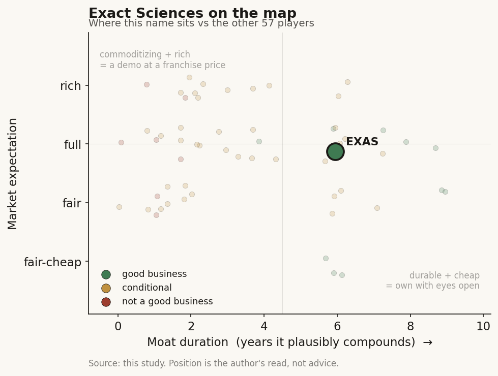

# Exact Sciences (EXAS)

> **The read.** A good business - a real code/coverage screening moat plus rare positive FCF among the cohort - acquired by Abbott at a full but defensible ~7x-sales expectation; the franchise, not the AI, is what got paid for. (EXAS delisted 23 Mar 2026; this is a closed-deal read, not a live-multiple read.)

**Snapshot**

| | |
|---|---|
| Listing | EXAS / delisted (acquired by Abbott, closed 23 Mar 2026) |
| Region | US |
| Value-chain layer | L3-L5 (assay + CLIA lab + interpretive/algorithmic layer) |
| Archetype | Per-test lab (per-test/per-scan fee), SaMD/workflow label but economically a reimbursed screening franchise |
| Size | ~$21bn equity / ~$23bn EV (acquisition) |
| Revenue (latest) | FY25 $3.25bn, +18% |
| Moat verdict | Conditional-durable (code/coverage ownership; NOT clearance, NOT data) |
| Expectation | Full (~7.1x EV/sales at the deal) |
| Evidence quality | High on deal facts + FY25 financials; med on segment-margin granularity |

## What it is
A US molecular-diagnostics company whose cash engine is **Cologuard**, the stool-DNA colorectal-cancer *screening* test, plus the **Oncotype DX** breast-recurrence assay and a newer MRD/MCED stack (Oncodetect, Cancerguard). A per-test clinical lab dressed in "AI/SaMD" language - the value is a reimbursed screening franchise, not software. EXAS was acquired by Abbott and delisted 23 Mar 2026.

## Business model - how it makes money
Makes money **per test billed to payers** (Medicare + commercial), across two reported segments:
- **Screening** (Cologuard + Cologuard Plus + PreventionGenetics): FY25 $2.53bn, +18% - ~78% of revenue.
- **Precision Oncology** (Oncotype DX + therapy-selection + Oncodetect MRD): FY25 $717m, +9-13%.

FY25 group: **revenue $3.25bn, +18%** (FY24 $2.76bn, +10%; FY23 ~$2.50bn - a steady high-teens compounder, decel from screening maturity offset by Cologuard Plus reorder). **GAAP gross margin ~69%, adjusted ~72%** - top of the per-test band (~40-62% typical), because Cologuard is a **branded, high-ASP screening test with an established permanent code + USPSTF grade-A recommendation**, not a commoditizing CGP assay. **Adjusted EBITDA $400m** (~12% margin), **operating CF $491m, FCF $357m** FY25 - a genuine crossover to self-funding, unlike still-crossing peers. **Still GAAP-lossmaking (~-$208m TTM net)** on SBC + amortization. Cash/securities ~$1.0bn (Q3'25); ~$1.8bn net debt (convertibles) absorbed by Abbott in the deal.

**Growth quality.** Capital-HUNGRY on the incremental unit (CLIA wet lab, reagents, sequencer toll upstream L1/L2, payer working-capital lag) - so incremental ROIC is *diluted* vs a SaaS name, but the franchise has crossed into positive FCF, which is the number that separates it from Tempus/most of the cohort. Cash conversion: FCF $357m on $400m adj EBITDA = ~89% conversion - clean for a lab, but flatters over the still-negative GAAP line. The whole quality debate: is this a ~72%-GM screening annuity (durable), or a maturing single-product lab whose growth is reorder + new-launch dependent? Both are true.

## Financial summary

| Metric | FY23 | FY24 | FY25 |
|---|---|---|---|
| Revenue | ~$2.50bn | $2.76bn | $3.25bn |
| Growth | - | +10% | +18% |
| Gross margin | - | - | ~69% GAAP / ~72% adj |
| Adjusted EBITDA | - | - | $400m (~12% margin) |
| Operating CF | - | - | $491m |
| FCF | - | - | $357m |
| GAAP net | - | - | ~-$208m TTM |
| Cash/securities | - | - | ~$1.0bn (Q3'25) |
| Net debt (convertibles) | - | - | ~$1.8bn |

Segment split FY25: Screening $2.53bn (+18%, ~78% of revenue); Precision Oncology $717m (+9-13%).

## Value-chain position and competition
Sits at **L3 assay + L4 CLIA lab** (Cologuard sample-to-answer - owned sample-collection kit, owned centralized lab; the cash engine and capital sink) and a thin **L5 interpretive/algorithmic layer** (the DNA-methylation + FIT classifier that turns raw signal into a positive/negative call - where the "SaMD/workflow" tag lives, but thin relative to the L3/L4 lab beneath it). What flows: patient sample -> owned lab -> algorithmic call -> payer claim. Named-patient interpretive liability concentrates at L5, but Cologuard is a *screening* call with a follow-on colonoscopy safety net, so liability is softer than a treatment-selection assay. Value here is DOWNSTREAM (the reimbursed lab), not the upstream picks - the opposite of where the taxonomy map says value migrates; EXAS captures a franchise ASP, not a toll.

Competition:
- **Screening:** Guardant (Shield blood CRC test - now FDA-approved and Medicare-covered as a first-line average-risk screen [reported], a cheaper/more convenient blood draw that is the live substitution threat), Freenome, and the colonoscopy standard-of-care itself. Cologuard's edge = **installed brand + USPSTF grade + permanent Medicare coverage + ~11yr real-world reorder data** - a coverage/adoption moat, not assay novelty. EXAS did not sit on the blood-based flank: in Q4 2025 it licensed **exclusive US rights to Freenome's blood-based CRC screening tests** (~$75m R&D charge [disclosed]; exclusivity contingent on Freenome winning first-line FDA approval), buying its own blood-draw option rather than ceding the format to Shield.
- **Precision oncology:** Oncotype DX is the **entrenched category leader in early-breast recurrence** (the one place EXAS has a near-monopoly clinical franchise), but faces MammaPrint and is a mature, low-teens grower.
- **MRD / MCED:** Oncodetect (MRD, 2025 launch) and Cancerguard (MCED, launched Sep 2025) enter LATE against Natera Signatera (MRD scale leader), Guardant, Grail - no established edge, small base. Oncodetect did secure **Medicare coverage in colorectal-cancer MRD (Jul 2025 [reported])**, a first reimbursement foothold; Cancerguard is still a self-pay laboratory-developed test at $689 [disclosed] with no Medicare payment yet (see Recent developments for the coverage-pathway legislation).

Edge verdict: real and durable in *screening + early-breast*; absent/late in MRD/MCED. The moat is franchise-and-coverage, not technology.

## Moat
**Reimbursement-code + coverage ownership** - the moat that survives the Ch5 filter (bare clearance and the drug-discovery data-flywheel are refuted). Cologuard is the clean diagnostics example: permanent CPT + national Medicare price + USPSTF grade-A + guideline inclusion, built over a decade of prospective evidence and payer contracting that a new entrant must re-run. That is the HeartFlow-template moat applied to screening. **Durability ~5-8 years**, capped by the same CMS budget-neutrality repricing risk that eroded LumineticsCore's code -14% (Ch5). The data-flywheel claim (reorder data -> better model) is **weak** here - it is the *coverage + brand*, not the algorithm, that compounds. Oncotype DX adds a second, narrower coverage moat in early-breast. **Verdict: CONDITIONAL-durable via code/coverage ownership; NOT a clearance moat, NOT a data moat.** Commoditizing risk = a cheaper blood-based screen (Shield) that payers accept as equivalent, collapsing the ASP advantage.

## Core variables
1. **Cologuard screening ASP + volume durability (the master variable).** ~78% of revenue rests on Cologuard reorder + Cologuard Plus mix-up; the whole franchise moat is coverage/ASP holding against Shield-type blood substitutes. This one line sets the model.
2. **FCF self-funding vs GAAP loss.** FCF turned clearly positive ($357m FY25) while GAAP stays negative - the core quality question is whether the screening annuity funds the MRD/MCED build without dilution. This is the number that already differentiated EXAS from Tempus.
3. **New-launch traction (Cologuard Plus reorder, Oncodetect MRD, Cancerguard MCED).** The growth *rate-of-change* depends on launches landing, since the base franchise is maturing to high-teens.

*(Second-order, held below the line: Oncotype breast volume; PreventionGenetics; SBC drag; convertible leverage - all now moot post-acquisition.)*

## Bear case / key risks
**It is a maturing single-franchise lab, capital-hungry on the margin, with its growth engine (Cologuard) inside the reimbursement blast radius.** Three legs: (1) **ASP/coverage risk** - a permanent code can be repriced DOWN under CMS budget-neutrality (the -14% autonomous-DR precedent), and a cheaper blood-based screen (Shield) that wins payer parity strands Cologuard's ASP premium; screening is a fought category, not a monopoly. (2) **Concentration** - ~78% of revenue is one screening product; the diversifiers (MRD/MCED) are late and sub-scale against Natera/Guardant/Grail, so the "AI pipeline" optionality is thin. (3) **GAAP economics** - despite $357m FCF, the group is still GAAP-lossmaking on SBC/amortization, and the incremental unit carries a real wet-lab/reagent toll - this is not software ROIC. **Falsification that breaks the bear:** Cologuard Plus + MRD/MCED compound the group back toward 20%+ *with* expanding GAAP profitability - proving the franchise funds a genuine multi-product platform, not just a maturing single test.

## The expectation read
EXAS no longer trades on a market-implied multiple. **Abbott acquired it for $105.00/share cash, ~$21bn equity / ~$23bn EV including ~$1.8bn net debt, announced 20 Nov 2025, CLOSED 23 Mar 2026, and EXAS was delisted.** At ~$23bn EV on FY25 $3.25bn revenue that is **~7.1x EV/sales** for a ~72%-adj-GM, +18%-growth, FCF-positive diagnostics franchise. What the *acquisition* price implies the buyer believes: that the durable value is the **coverage/brand screening annuity + Oncotype franchise** (the surviving code/coverage moat) folded into a $12bn+ diagnostics distribution machine - i.e. Abbott is paying for the *rail and the franchise*, not for the "AI/SaMD" or the unproven MRD/MCED optionality. Where that belief looks soft: it capitalizes a ~7x sales multiple on a franchise whose growth is maturing and whose core code sits inside CMS repricing + Shield-substitution risk - the same softness the standalone bear names, now transferred to Abbott's balance sheet. There is **no live public long here anymore**; the read-through is diffuse via ABT.

## Recent developments (2025-2026)
The window from the deal announcement to close confirmed the standalone read: the franchise compounded, the pipeline launched, and the reimbursement rail widened - but none of it changed the $105.00/share cash outcome.

- **Abbott deal CLOSED 23 Mar 2026** [reported]. Abbott announced completion on 23 Mar 2026; the last trading day was 20 Mar 2026, and EXAS became a wholly owned Abbott subsidiary. Abbott framed the buy as leadership in a ~$60bn US cancer-screening + precision-oncology diagnostics segment [reported]. No standalone equity remains; read-through is via ABT only. (Consistent with the closed-deal read above; nothing in the final quarters moved the fixed cash price.)
- **FY25 was a record year** [disclosed, 13 Feb 2026]. Q4 revenue $878m, +23% (Screening $695m, +26%; Precision Oncology $183m, +14%), capping FY25 at $3.25bn, +18%. FY25 reported GAAP gross margin 70% / adjusted 73% (Q4 basis), FCF $357m (+379% YoY), operating CF $491m (+133%), adjusted EBITDA $400m, net loss $208m, cash/securities $965m. The FCF crossover held and improved - the number that separates EXAS from the still-crossing cohort. (Because the merger was pending, management held no Q4 call.)
- **Three new tests launched in 2025** [disclosed]: Cologuard Plus (Q1, Medicare-covered, guideline-included, ~40% fewer false positives claimed), Cancerguard (MCED), and Oncodetect (MRD). This is the "franchise funds a multi-product platform" thesis being tested in real time - launches landed, but revenue from them is still immaterial versus the ~78% Cologuard base.
- **Cancerguard MCED launched 10 Sep 2025** [disclosed] as a self-pay laboratory-developed test at $689. Test-development data: 68% sensitivity across six of the deadliest cancers, ~64% overall sensitivity (ex-breast/prostate), 97.4% specificity; a 25,000-participant real-world registry (Falcon) is enrolling under an FDA-reviewed IDE to support future regulatory and coverage submissions. Still pre-reimbursement and pre-FDA - optionality, not yet a P&L line.
- **MCED Medicare coverage pathway enacted** [reported, 2-3 Feb 2026]. Federal legislation (based on the Nancy Gardner Sewell Medicare Multi-Cancer Early Detection Screening Coverage Act) creates a coverage framework for MCED tests once FDA-approved and CMS-implemented. This is a structural tailwind for Cancerguard's eventual reimbursement - but it is a pathway, not a paid code: it takes effect only after Cancerguard clears FDA and CMS sets a price, both still ahead.
- **Pipeline read-outs** [reported, Q4 2025]: Oncodetect strongly predicted distant recurrence in early triple-negative breast cancer (NSABP B-59 substudy), extending MRD beyond colorectal; and the Oncoguard Liver blood test showed superior early-stage and overall HCC sensitivity versus standard of care in the head-to-head ALTUS study. Both widen the pipeline but remain sub-scale against Signatera/Guardant/Grail.
- **Coverage remains a moving target on the blood-screening flank.** Guardant's Shield is now FDA-approved and Medicare-covered for average-risk CRC screening [reported] - the exact cheaper-blood-substitute the bear case names. EXAS's Freenome license (exclusive US rights to Freenome's blood-based CRC tests, contingent on Freenome FDA approval) is the hedge, but it is optionality contingent on a third party's clearance, not an owned in-market blood screen today.

Net: every 2025-2026 update is directionally positive for the franchise and confirms the "code/coverage annuity + real FCF" read, yet the acquisition economics were fixed in November 2025 and none of it reprices a delisted name. The MRD/MCED optionality is still pre-material - the same open question the bear case flagged, now Abbott's to resolve.

## Verdict
**Good business (real code/coverage moat + rare positive FCF among the cohort), acquired at a full but defensible ~7x-sales expectation - the franchise, not the AI, is what got paid for.** Confidence: HIGH on the deal facts and FY25 financials; MEDIUM on segment-margin granularity and on whether MRD/MCED ever becomes material (it had not, pre-close). No standalone equity read remains - EXAS is now an Abbott subsidiary.
