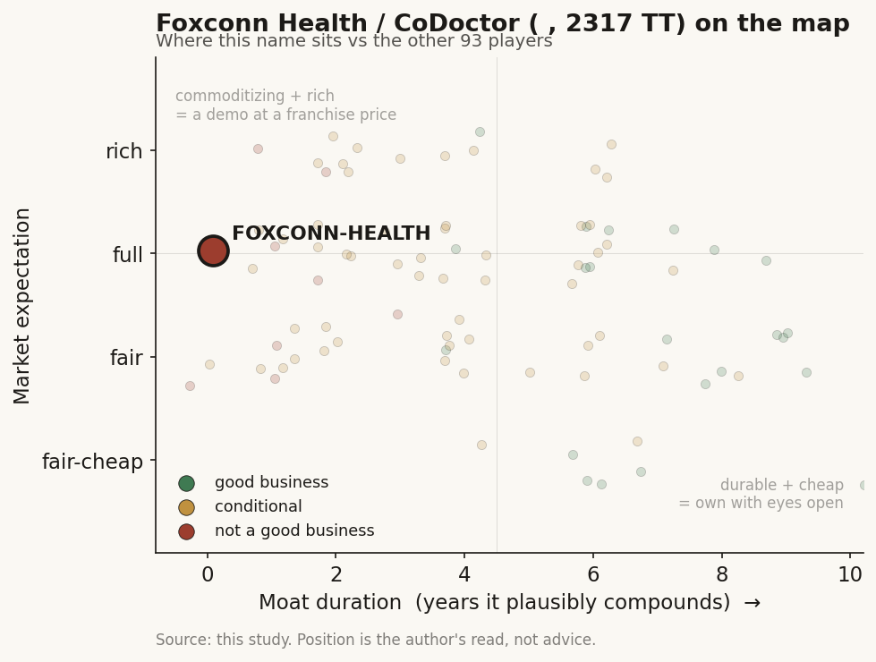

# Foxconn Health / CoDoctor (鴻海醫療, 2317 TT)

> **The read.** A real set of hospital deployments with zero disclosed health economics bolted onto a ~NT$3.4tn ICT parent - a positioning marker, not an investable healthcare-AI thesis; the only durable moat here belongs to the parent's compute, not to a health unit that rounds to zero.

**Snapshot**

| | |
|---|---|
| Listing | 2317 TT, TWSE main board |
| Region | Taiwan |
| Value-chain layer | L1 (patient-data source) + L2-L4 (instrument -> assay/model -> interpretation) |
| Archetype | AI-services / infra |
| Size | Market cap ~NT$3.4tn (~US$115bn) |
| Revenue (latest) | FY25 revenue NT$8.10tn (parent, ICT-driven); CoDoctor / digital-health revenue not separately disclosed |
| Moat verdict | Commoditizing at the health-unit level (the durable moat is the parent's) |
| Expectation | Full (priced as AI-server infra, not healthcare) |
| Evidence quality | Low |

## What it is
Foxconn (鴻海精密, Hon Hai) is the world's largest electronics contract manufacturer; its digital-health arm sells CoDoctor AI (鴻海醫療 / 鴻海數位健康), a multimodal "large medicine model" (巨量醫學模型) and AI-assisted-diagnosis platform running on the parent's own compute. It is an infra-scale-into-diagnostics play, not a dedicated med-device company. This profile is a positioning marker: the healthcare unit is a sub-scale line inside a ~NT$3.4tn ICT parent with no standalone segment disclosure.

## Business model - how it makes money
CoDoctor is sold as (a) certified hardware devices - CoDoctor Pro / Home / Eye (handheld fundus imager) - and (b) an AI-diagnosis software/agent layer (CoDoClaw multi-agent orchestration on NVIDIA Nemotron/NemoClaw) bundled to hospital deployments. Who pays today is hospitals and government programs, not the NHI as a per-use code. Under the ~US$1.5bn "Healthy Taiwan" (健康台灣) push, Foxconn's own framing is "ecosystem integrator" connecting government, hospitals, device makers and software - i.e. project/integration revenue, closer to infra than to a reimbursed clinical service. The value it captures is an integration + compute toll, not a per-test dollar; capital and compute reach come from the parent, so the incremental health economics are invisible against parent scale.

NHI-reimbursement dependence is indirect and unproven: no standing NHI payment for a CoDoctor service is disclosed. Taiwan has no software-service payment code - only a per-use 特材 (special-material) point value - and pure diagnostic-triage AI must clear the "diagnosis + intervention + RCT cost-saving" gate. CoDoctor's ECG/fundus/triage agents sit exactly where that gate bites hardest.

## Financial summary

| Metric | Detail |
|---|---|
| Listing | 2317 TT, TWSE main board (Taiwan's largest listco by revenue) |
| Market cap | ~NT$3.4tn (~US$115bn); ~13.86bn shares x ~NT$245, 2026-07-03 close NT$240.5 |
| FY25 revenue | NT$8.10tn (parent, AI-server / ICT driven) |
| FY25 EPS | NT$13.61 |
| Q1'26 EPS | NT$3.56 (+17% YoY) |
| May'26 revenue | NT$859.4bn (+39.6% YoY) |
| Q2'26 revenue | NT$2.51tn record (+39.8% YoY); June'26 NT$821.8bn (+52.1% YoY); H1'26 NT$4.64tn (+35.0% YoY) |
| CoDoctor / digital-health revenue | Not separately disclosed - no segment line, no unit P&L, no order backlog in consolidated filings |

The central data problem: at parent scale the health economics round to zero and are invisible. Hospital centres (Chang Gung, NTUH, 北榮 VGHTPE, 高醫, 馬偕, 台中榮總, 童綜合) act as deployment / co-development partners and buyers, not consolidated subsidiaries - no financials attach to Foxconn through them.

## Value-chain position and competition
Position on the Taiwan map: L1 sits on hospital and rural/tele-health data intake (Tzu Chi 慈濟 rural program: heart-rate / BP / blood-sugar / ECG capture). L2-L4 spans the CoDoctor Eye handheld imager (L2), the "large medicine model" trained on hospital imaging (L5-analog build), and SaMD diagnostic outputs (L3-L4-analog): single-lead ECG, retinal/fundus, chest CT early-lung-cancer, prostate-tumour localisation, uterine-fibroid detection, plus digital-twin coronary/breast simulation. The SaMD layer is now packaged as named single-purpose agents orchestrated by CoDoClaw: an ECG screening agent, Corovia (coronary/3D-heart reconstruction), Endovia (colonoscopy lesion detection), plus breast-screening and fundus agents - the "large medicine model" is the training substrate, CoDoClaw is the runtime that routes a case to the right agent. What flows: hospital images/signals -> Foxconn model -> triage/detection output back into the clinical workflow, run on the parent's own GPU compute.

Competition: against Taiwan pure-plays it overlaps the listed SaMD names on specific modalities - Acer Medical VeriSee (diabetic-retinopathy fundus), aetherAI (digital pathology), Amcad (ultrasound CAD), Ever Fortune (multi-SaMD screening) - which are smaller but further along on TFDA licence accumulation and are the pure exposure; Foxconn competes on scale/integration, not a deeper regulatory dossier. Against other large-cap parents - Quanta QOCA (medical cloud), ASUS AICS (coding/RCM), Wistron Medical (smart-care/IVD) - it shares the "economics buried in the parent" cohort, differentiated by owning the compute layer and the NVIDIA co-marketing surface. Against US players selling into Taiwan - GE HealthCare (imaging-AI incumbent) and the L0 rails (Alphabet's "AI照護網", Microsoft) - its edge is domestic data-residency compliance and physical presence, not model quality. Where Foxconn genuinely separates from the SaMD pure-plays is physical AI: the Nurabot nursing robot and pipeline surgical/pharmacy robots (scrub-nurse, chemo-compounding) fuse the parent's robotics and compute reach with the clinical deployments - a lane none of the software-only names (aetherAI, Amcad, Acer Medical, Ever Fortune) can enter. That axis is real, but it is a hardware/integration edge, not a reimbursed clinical-service edge, so it does not change the payment-vehicle gate.

## Moat
Hospital-data access is real but shared, not exclusive: co-development with Chang Gung / NTUH / VGHTPE gives training-data reach, but the data is the hospitals' (and ultimately the state's), governed by the NHI Data Management Act (opt-out + NT$10m fines, 三讀 2025-12-02) and EMR data-residency. No proprietary NHI-data annuity is capturable by a listed name. The NHI relationship is not a moat - no standing CoDoctor reimbursement is disclosed. Net: the durable moat is the parent's - compute scale, capital, and system-integration reach - not a healthcare-specific data or regulatory moat. This is the recurring Taiwan pattern: the data moat is real-but-not-investable (state-held), and the company moat here is an infra moat wearing a healthcare label. Thin at the health-business level.

## Core variables
1. NHI / payment path - does any CoDoctor modality secure a Taiwan payment vehicle (特材 point value or 暫時性支付), clearing the savings-RCT gate? None disclosed to date; this is the single gate that would turn deployments into revenue.
2. Export ability beyond Taiwan - whether CoDoctor wins reimbursed/paid deployments outside Taiwan (the parent's global footprint is the only route to a TAM that matters at 2317 scale). No export revenue disclosed.
3. Parent disclosure / carve-out - whether Foxconn ever breaks out digital-health economics or spins/injects the unit; without it, the equity is un-underwritable on this thesis.
Secondary: TFDA licence count (CoDoctor Pro/Home/Eye cleared); hospital-contract / "Healthy Taiwan" deployment breadth (7 medical centres, ~14m encounters/yr).

## Bear case / key risks
The health unit is immaterial to 2317 and has no disclosed revenue, no NHI code, and no exclusive data moat; it competes with better-positioned pure-plays on the modalities that matter while its actual value-add (compute + integration) is already priced as AI-server infra, not healthcare. It is doubly disadvantaged: as a software/agent play it has no Taiwan payment vehicle, and as a data play it is locked out by state capture. A reader buying 2317 is buying AI servers; CoDoctor is a rounding-error optionality with real execution but no visible P&L. Coverage is genuinely thin - that thinness is itself the finding.

## The expectation read
2317's market cap is set entirely by the AI-server / ICT parent (FY25 revenue NT$8.10tn, May'26 +39.6% YoY), so the current multiple embeds essentially nothing for CoDoctor. That is internally consistent: with zero disclosed health economics, no NHI code, and a moat that belongs to the parent, there is no health-unit value to price. The belief looks soft only in the optionality direction - real deployments (7 medical centres, TFDA-cleared devices, ~US$1.5bn "Healthy Taiwan" integrator role) could one day carry economics - but that optionality is un-underwritable until a payment decision or a carve-out makes it visible.

## Recent developments (2025-2026)
The 2025-2026 news flow deepened the deployment footprint but did not move the health-economics needle - the pattern the profile already flags holds, now with more specifics.

- 2024-12-05 [reported]: three CoDoctor devices - CoDoctor Pro, CoDoctor Home, and CoDoctor Eye (handheld fundus/imaging capture) - cleared TFDA marketing approval. Alongside, the HiMEDt digital-health alliance Foxconn convenes grew to roughly 25 member organisations (healthcare, tech, pharma, construction, charity). This is the licence-count progress noted in Core variables, now dated.
- 2026-06-01 [reported]: at NVIDIA GTC Taipei / COMPUTEX 2026, Foxconn and NVIDIA framed CoDoctor AI and the Nurabot nursing robot as having "moved from pilot programs into clinical operations." The umbrella is CoDoClaw, a multi-agent orchestration layer built on NVIDIA NemoClaw / Nemotron that coordinates named single-purpose agents through one clinical interface: an ECG screening agent, Corovia (3D heart / coronary-artery reconstruction), Endovia (colonoscopy lesion detection), plus breast-cancer-screening and fundus-imaging agents.
- 2026-06-01 [reported]: the "Healthy Taiwan" push (~US$1.5bn regional investment [reported]) was quantified as 85 FDA- or TFDA-cleared medical-AI solutions across a medical-centre network handling ~14m patient encounters/yr. Named deployment sites: Chang Gung, Kaohsiung Medical University Chung-Ho, MacKay, NTUH, Taichung VGH, Taipei VGH. Note: the 85 figure is the whole ecosystem's cleared-solution count, not Foxconn's own - Foxconn's contribution inside it is not broken out.
- 2026-06-01 [reported]: Nurabot moved from field validation at Taichung VGH into deployment at Taipei VGH and Tungs' Taichung MetroHarbor Hospital, with vendor claims of 75-80 tasks/day, roughly 30% nursing-workload reduction, and 2-3 hours/day of nurse time freed [unverified - vendor-stated, no independent study]. Foxconn also showed two new physical-AI systems still pre-clinical: a scrub-nurse collaborative robot (with Kawasaki Heavy Industries, Taichung VGH, Yuan High-Tech) and a chemotherapy-compounding line (ChemoRo compounding + FARobot SMR30 transport + Nurabot delivery, with Taipei VGH and Yuyama).
- Parent context, still no health carve-out [reported/disclosed]: Q2'26 was a record NT$2.51tn (+39.8% YoY); June'26 revenue NT$821.8bn (+52.1% YoY); H1'26 cumulative NT$4.64tn (+35.0% YoY), on ~40% global AI-server share. GB300 entered low-volume production. Across all of it, digital-health still has no segment line, no unit P&L, and no order backlog - the invisibility thesis is unchanged.

Net read on the updates: more modalities, more named hospitals, more robots on the floor - and still zero disclosed health-unit revenue and zero standing NHI payment code. The developments confirm real execution and confirm the finding that it rounds to zero against the parent.

## Verdict
Not a healthcare-AI thesis on its own - a positioning marker. Real deployments and a genuine parent moat, but zero disclosed health economics, no standing NHI payment, and a moat that belongs to the ICT parent rather than the health unit. Evidence quality is low: no segment disclosure; profile built from press/partner sources (Chang Gung LMM 2023, Tzu Chi tele-health, NVIDIA "Healthy Taiwan" May 2026), not primary financials. Do not underwrite without a parent carve-out or a disclosed NHI decision.
