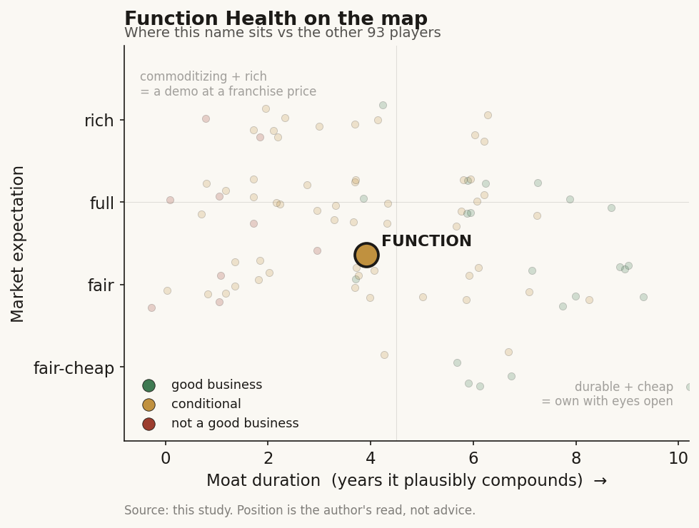

# Function Health (private (US))

> **The read.** A genuinely good consumer subscription brand - fast member growth, an owned relationship, a real data asset accumulating - wearing a "Medical Intelligence" AI story that is still mostly narrative and a lab layer that anyone can rent. Private, so numbers are estimates. Priced at ~$2.5bn on a ~$100m run-rate [estimate] the market is paying for the flywheel, not the current unit economics.

**Snapshot**

| | |
|---|---|
| Listing | private (US), last round Nov-2025 [disclosed] |
| Region | US |
| Value-chain layer | consumer-facing - DTC lab-test + imaging membership |
| Archetype | subscription brand (recurring consumer-health membership) with a data/AI layer accumulating on top |
| Size | ~$2.5bn post-money valuation, Series B (Nov-2025) [disclosed] |
| Revenue (latest) | ~$100m run-rate, Feb-2025 [estimate]; not disclosed |
| Moat verdict | conditional - real brand/data-accretion moat forming; AI and lab layers not yet defensible |
| Expectation | rich - valuation runs ahead of proven unit economics |
| Evidence quality | low-to-medium - private, most financials are third-party estimates |

## What it is
A membership that turns a routine blood draw into a consumer product. A member pays an annual fee, walks into a national lab's draw site, gets a broad panel of biomarkers run (160+ lab tests across blood and urine [disclosed]), and receives a clean app view with plain-language explanations, trend lines over time, and clinician sign-off on the results. The pitch is proactive longevity - "100 healthy years" - rather than sick-care. In 2025 it acquired Ezra to bolt full-body MRI and heart/lung CT onto the same membership, and launched a "Medical Intelligence" effort to unify labs, imaging, wearables, and records into one AI-readable picture of a person. It sits at the consumer-facing layer of the chain: it owns the customer relationship and the interface, and rents the actual testing from upstream.

## Business model - how it makes money
One core engine: recurring annual subscriptions.

- **Membership (the base).** An annual fee - repriced to $365/yr ($1/day), down from $499 [disclosed] - buys two biannual panels of 160+ tests plus the app, tracking, and clinician review. This is the recurring, brand-owned relationship and the whole thesis rests on it.
- **Imaging add-ons (post-Ezra).** Full-body MRI at $499 (from Ezra's pre-deal ~$1,495) and heart/lung CT at $349 [estimate], sold on top of the membership. Higher ticket, episodic rather than recurring.
- **Premium tests and partner deals.** A la carte advanced panels, plus channel deals (e.g. discounted first-year pricing through a fitness-club partner) [estimate].

**The economics that matter.** Function does not run labs. Blood draws and analysis are outsourced to a national lab network (2,000+ draw sites) [reported]; clinicians are contracted telehealth providers, not employed staff [estimate]. That makes it asset-light - but it also means the lab fee is a real cost of goods that the lab partner captures, and the same partner serves every competitor. Gross margin therefore depends on the spread between the membership price and the wholesale lab bill, and on how much a member spends beyond the base fee. Customer-acquisition cost is estimated at $300-600 [estimate] - low for healthcare, but close to a single year's membership, so the model only works if members renew.

**Growth quality - the whole debate.** Members grew from ~40,000 (May-2024) to 200,000+ (May-2025) [estimate], ~450% revenue growth to a ~$100m run-rate [estimate] - genuinely fast. But annual biomarker testing is not an obvious repeat need for a healthy person, so the open question is not growth, it is retention: does year-two renewal hold, or is this an engagement engine that acquires faster than it keeps.

## Financial summary

| | Est. FY24 | Est. run-rate Feb-2025 | Notes |
|---|---|---|---|
| Revenue | - | ~$100m run-rate | third-party [estimate]; not disclosed |
| Revenue growth | - | ~+450% YoY | [estimate] |
| Members | ~40,000 (May-24) | 200,000+ (May-25) | [estimate] |
| Lab tests completed | - | 50m+ cumulative since 2023 | [disclosed] |
| Membership price | $499/yr | $365/yr (repriced) | [disclosed] |
| Est. CAC | - | $300-600 | [estimate] |
| Total funding | - | ~$350m | [disclosed] |
| Post-money valuation | - | ~$2.5bn (Nov-25 Series B, $298m) | [disclosed] |

All figures are third-party estimates or disclosures from press and data trackers; Function is private and reports no audited financials. Treat revenue, members, and CAC as [estimate].

## Value-chain position and competition
Consumer-facing. Function owns the member relationship, the app, and the brand; it rents the two capital-intensive layers - the CLIA lab that runs the assays, and the imaging fleet (partly owned post-Ezra, partly referred). Flow: member pays -> draws blood at a partner site -> partner lab runs the panel -> Function structures and explains the result -> data accumulates per member over time. The re-rating story is that last step - a longitudinal, multimodal dataset (labs + imaging + wearables + records) that no single-test rival holds.

Competition is crowded and converging on the same lab partners:
- **Vertically-integrated telehealth, HIMS:** a profitable DTC subscription brand with 2.5m+ existing subscribers that can bundle testing into an established funnel - the scaled distribution threat.
- **Direct DTC-lab rivals:** Superpower (cut price to $199), Mito Health, Instalab, Everlywell, InsideTracker, Lifeforce, and a wearable-native entrant bundling labs with a band. Most use the same national lab back-ends, so the panels are near-identical.
- **Diagnostics incumbents:** the national labs themselves, who could disintermediate the consumer layer, and adjacent longevity/screening players.

Edge: brand, first-mover scale, celebrity-investor distribution, and the accumulating dataset. It is a brand-and-data edge, not a technology or cost edge - the test itself is a commodity anyone can rent.

## Moat
Two candidate moats, and they split:

- **Brand + data-accretion - FORMING, not yet proven (~3-5 yr if retention holds).** The real asset is 200,000+ members and a growing longitudinal record per member. If members renew, that dataset compounds into something a new entrant cannot buy - the flywheel. But it is contingent on retention, which is unproven for annual biomarker testing, and the dataset only becomes a moat once it demonstrably improves outcomes or personalization enough to justify the price.
- **The lab / testing layer - NOT a moat (~0 yr).** Function rents the labs; so does everyone. Identical partners, similar panels, and active price-cutting (rivals at $199) make this a commoditizing layer heading toward a race to the bottom. Function's own repricing from $499 to $365 is the tell.

Net: the durable moat, if it arrives, is brand plus the compounding member dataset - capped by whether people renew. The testing layer is table stakes and deflationary.

## Core variables
1. **Year-two retention / renewal.** The single number that decides everything. Annual testing is not an obvious repeat need; if renewal is soft, this is a high-CAC acquisition machine, not a subscription annuity. All the valuation rests here and it is the least visible number.
2. **The spread: membership price vs. lab cost of goods, plus attach rate.** Function repriced down while lab fees stay fixed, so gross margin depends on holding price, squeezing wholesale lab cost, and up-selling imaging/premium tests. Competitor price-cutting pressures the top of that spread directly.
3. **Whether "Medical Intelligence" becomes a real capability or stays a wrapper.** Does the AI layer turn the accumulated data into defensible, outcome-improving personalization (the moat), or remain a chat/summary interface over commodity results plus a general-purpose model (marketing)?

Below the line as noise: celebrity investor roster; cumulative-tests headline (a volume vanity metric, not revenue); imaging TAM framing until attach-rate is shown.

## Bear case / key risks
A brand wearing a platform valuation on a commodity service. The core act - a blood panel run by a national lab - is rentable by anyone, competitors already undercut on price (some at $199 vs Function's $365), and the whole category shares the same lab back-ends, so differentiation erodes toward a price war. Unit economics are thin: the lab fee is a hard cost the partner captures, CAC approaches a full year's fee, and retention on discretionary annual testing is unproven - the classic "engagement engine, not economic engine" trap, where growth is real but renewal is not. There is no peer-reviewed evidence yet that the testing improves outcomes enough to justify premium, recurring spend. Cautionary precedents in adjacent DTC-health (well-funded names that raised hundreds of millions and still collapsed) show a big raise and a big valuation are not a moat. And clinicians and academics have publicly questioned whether broad biomarker panels on healthy people generate more anxiety and false-positive follow-up than value.

Falsification watch: (1) year-two renewal comes in soft, or CAC keeps climbing toward the annual fee - the subscription thesis breaks; (2) category price-cutting drags Function's price and margin down further; (3) "Medical Intelligence" ships as a chat wrapper over commodity results with no demonstrated outcome lift - the AI moat was marketing.

## The expectation read
~$2.5bn post-money on a ~$100m run-rate [estimate] is ~25x revenue, and higher on any trailing measure - a multiple that assumes the flywheel, not the current business. At that price the market is paying for: (a) member growth continuing at something near recent pace, (b) retention holding well enough to turn acquisition into an annuity, (c) the accumulating dataset becoming a genuine, defensible personalization moat, and (d) the AI layer earning premium pricing that survives competitor price-cutting. Each is plausible; none is yet proven, and one (retention) is both the most important and the least disclosed.

Where the belief looks soft: the testing layer is a commodity in an active price war, unit economics are thin, retention is unproven, and the "AI" is - on current evidence - a data-unification and chat interface, not yet an FDA-cleared or outcome-validated capability. The valuation is a bet that a fast-growing brand converts into a data platform before the category commoditizes it.

## Verdict
Good business, real brand and a genuinely accumulating data asset - but priced as a data platform when today it is a fast-growing, thin-margin subscription over a commodity lab, so the expectation is rich rather than fair until retention proves out and the "Medical Intelligence" layer becomes a demonstrable capability rather than a wrapper. Confidence: LOW-MEDIUM overall - the strategy and category dynamics are clear, but nearly every financial (revenue, members, CAC, retention) is a third-party estimate because the company is private. Real-AI-vs-marketing: mostly marketing today - the defensible asset is the growing member dataset, but the shipped "AI" is data-unification plus a chat/summary layer over commodity results and a general-purpose model, with no disclosed FDA-cleared algorithm or outcome-validated engine yet.
