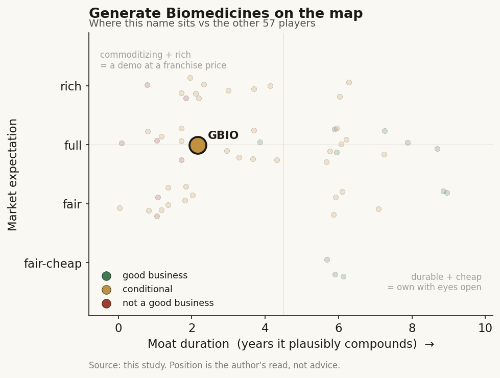

# Generate Biomedicines (GENB)

> **The read.** A genuinely better-positioned techbio than the failed cohort - it owns a differentiated Phase 3 asset on a de-risked target - but priced with a platform-moat premium the moat audit refutes, so the expectation looks full ahead of the one readout that matters.

**Snapshot**

| | |
|---|---|
| Listing | GENB / Nasdaq (Somerville, MA); "GBIO" is the study-index key - do not confuse with Generation Bio, the actual GBIO ticker |
| Region | US |
| Value-chain layer | L9b-L9e (generative protein design through owned clinical development) |
| Archetype | drug-owner (milestone + royalty migrating to owned-asset developer) |
| Size | market cap ~$2.23B on ~128M shares |
| Revenue (latest) | FY25 collaboration revenue $31.89M; TTM ~$30.3M, +56%; pre-product |
| Moat verdict | conditional - asset-specific, binary, not compounding |
| Expectation | full |
| Evidence quality | med |

## What it is
A generative-protein-design techbio that trained an ML platform on ~160,000 protein structures and ~190M sequences to design de-novo therapeutic proteins, then - unlike the pure tool-vendor cohort - walked its own lead antibody into a global Phase 3. It is a clinical-stage biotech wearing an AI-platform story, IPO'd 27-Feb-2026 at $16.00 (25.0M shares, $400M gross, $369.3M net).

## Business model - how it makes money
Revenue today is 100% collaboration (pharma upfront plus milestone recognition), not product. FY25 collaboration revenue $31.89M; net loss $222.97M; accumulated deficit $676.3M. TTM revenue ~$30.3M, +56% - but this is deferred-milestone accounting, not a compounding franchise. Q1'26 collaboration revenue $7.2M (down from $8.8M in Q1'25 - revenue is going backwards), net loss $61.7M, R&D $57.8M, G&A $13.5M. Burn is ~$60M/qtr and rising.

Growth quality and incremental ROIC are undefined and negative pre-product - there is no product revenue ever. The biotech rule applies: ignore margin, ROIC and cash-conversion (all meaningless here) and look only at cash vs burn and the clinical path. This is capital-hungry: the two Phase 3 asthma trials (~1,600 patients) alone are earmarked ~$300M of the IPO.

## Financial summary

| Metric | FY25 | Q1'25 | Q1'26 |
|---|---|---|---|
| Collaboration revenue | $31.89M | $8.8M | $7.2M |
| Net loss | $222.97M | - | $61.7M |
| R&D | - | - | $57.8M |
| G&A | - | - | $13.5M |
| Accumulated deficit | $676.3M | - | - |
| Cash + marketable securities | $221.5M (YE25) | - | $516.6M (31-Mar-26, post-IPO) |

TTM revenue ~$30.3M, +56%. Burn ~$60M/qtr and rising. Runway into 1H 2028 - i.e. it does NOT fully fund the ~$300M twin Phase 3 readout; a raise or partner deal sits between here and pivotal data. IPO 27-Feb-2026 at $16.00 (25.0M shares, $400M gross, $369.3M net).

## Value-chain position and competition
Vertically integrated across the drug-discovery spine (L9b-L9e), NOT a reagent/tool vendor:
- **L9b (structure/generation)** - the generative model designs the protein/antibody. This is the commoditizing layer (open Boltz/Chai/Protenix clones caught the frontier in ~1yr at >1000x lower cost) - the door, not the moat.
- **L9c (selection/optimization)** - affinity/immunogenicity/manufacturability tuning; where GB-0895's ultra-high-affinity TSLP binding and ~89-day half-life were engineered.
- **L9d/L9e (development/clinical)** - the owned assets carried into the clinic. This is where NPV concentrates and where the ~40% efficacy wall lives.

What flows out: designed candidates go to partner programs (Amgen/Novartis, non-dilutive cash plus biobucks) and to owned clinical assets (the real value bet).

On the platform it competes with Isomorphic, Absci (ABSI), Xaira, Recursion - and the whole open-model cohort that commoditizes L9b; no durable model edge. On the lead asset (the part that matters), GB-0895 goes head-to-head with Amgen/AstraZeneca's Tezspire (tezepelumab), the validated first-in-class anti-TSLP - Q4'25 sales $474M, +60% YoY, ~$1.7B annualized run-rate, FY25 +52%. Tezspire doses monthly; GB-0895's differentiation is 6-month dosing (300mg SC q6mo) - a real convenience wedge in a proven mechanism, IF the Phase 3 efficacy holds at the extended interval.

The competitive read on the asset also has to price the second-generation long-acting field, not just monthly Tezspire. AstraZeneca's own longer-interval anti-TSLP work and other long-acting biologics in severe asthma mean the 6-month wedge is a race, not a standing lead: if an incumbent with a validated molecule and a marketed franchise reaches an extended interval first, GB-0895's single differentiator narrows to price and data at a moment when it is still pre-efficacy [unverified, competitor timelines not disclosed]. The platform-vendor peer set (ABSI, Recursion, Isomorphic) remains a poor comp for the equity because none of them own a pivotal-stage asset - the comparison that matters is against other single-asset clinical-stage respiratory/immunology developers, where GB-0895 is judged on Phase 3 execution and the exacerbation endpoint, not on model quality.

The edge is NOT the AI (commoditizes) and NOT a first-in-class mechanism (Tezspire owns that). The edge is a differentiated dosing profile on a de-risked target class, plus a validated partner roster (Amgen ~$1.9B-potential multi-target deal; Novartis Sep-24 deal up-to-$1B+, $65M upfront incl. $15M equity, tiered royalties to low-double-digits) most techbios lack.

## Moat
- **Data-flywheel (Moat 4): refuted for drug discovery, ~0-1yr.** GENB is explicitly named in the refuted cohort - the "more data → better model → better drug" loop is broken (public clones matched the frontier; more data buys zero Phase-II PoS).
- **Model/code-ownership: ~1yr, not a moat** (L9b commoditizes).
- **What could survive → Moat 3 (pharma-distribution / owned asset vs a risk-bearing counterparty): conditional, ~2-3yr binary watch.** The only durable value is the owned clinical asset - and here GENB is genuinely further than Isomorphic/Exscientia: it owns GB-0895 into pivotal Phase 3 rather than selling cheap optionality. But it is still gated by the unchanged efficacy wall.

Duration: the platform moat is ~1yr (discard it); the investable "moat" is asset-specific and binary - a successful Phase 3 buys a ~10-yr product annuity, a failure buys ~0. Not a compounding moat - optionality.

## Core variables
1. **GB-0895 SOLAIRIA-1/-2 Phase 3 readout (the master variable).** 52-week exacerbation-reduction endpoint, ~1,600 patients, 300mg q6mo vs placebo. Does the AI-extended half-life deliver Tezspire-class efficacy at a 6-month interval? This one binary re-rates the entire equity - everything else is second-order.
2. **Cash runway (into 1H'28) vs the Phase 3 spend and readout timing.** ~$517M against ~$60M/qtr burn and a ~$300M two-trial program that runs PAST the runway - a dilution-or-partner race before pivotal data, the classic pre-product survival variable.
3. **Owned-asset vs partner-optionality mix.** Is value being built in the owned pipeline (GB-0895 asthma/COPD, GB-4362 MMAE-neutralizer oncology, GB-5267 MUC16 CAR-T) or leaking out as cheap biobucks upfronts? The whole "own-the-asset beats platform-deal" thesis rests here.

(Second-order, held below the line: platform partnership renewals/opt-ins; GB-4362 (Fast Track, first dose mid-26) and GB-5267 (Phase 1 2H26) early reads; the commoditizing model layer.)

## Bear case / key risks
It is a single-asset Phase-3 binary wearing a $2.2B AI-platform multiple. (1) The platform is the refuted moat - model commoditizes in ~1yr, the data flywheel is empirically broken, so the re-rating narrative rests on IP that does not compound. (2) The value is ~entirely GB-0895, and it faces an entrenched, cost-and-profit-shared Tezspire franchise ($1.7B run-rate, +52%) whose owners (Amgen/AZ) can defend on data, price, and their own long-acting follow-ons; a 6-month dosing wedge is real but unproven at efficacy, and the ~40% Phase-II/III efficacy wall AI has NOT moved sits squarely in front of the pivotal readout. (3) Collaboration revenue is declining ($8.8M → $7.2M Q1 YoY) while burn rises to ~$60M/qtr - the "growth" line is going the wrong way. (4) Runway (1H'28) does not cover the ~$300M twin Phase 3 to readout, so a dilutive raise is structurally likely BEFORE the de-risking event. Falsification / scenario-B: a clean SOLAIRIA win at 6-month dosing with Tezspire-class exacerbation reduction - that converts the story from optionality to a real long-acting-biologic asset and breaks the bear. Absent that, this is one shot on goal at historic odds, financed against a wall.

## The expectation read
At ~$17.4, market cap ~$2.23B on ~128M shares, against ~$517M cash and ~$30M of non-recurring collaboration revenue. Strip cash and the enterprise value (~$1.7B) is being asked to underwrite a pre-efficacy Phase 3 asthma asset plus platform optionality - i.e. the tape is pricing GB-0895 as if pivotal success is meaningfully more-likely-than-not AND as if the platform carries independent, durable value. Where the belief looks soft: (i) it credits the AI platform as a moat that the moat audit refutes (~1yr, commoditizing) - pay for that and you overpay for a door; (ii) it discounts the base-rate ~40% efficacy wall and the ~$1.7B incumbent that shares costs/profits and can defend; (iii) it assumes the 6-month dosing wedge survives to a Tezspire-class endpoint, unproven. The sell-side ~$25 consensus PT (+46%) is a pre-readout, platform-credited mark - it prices the up-case, not the binary. The soft spot is the gap between a $2.2B cap and a business whose entire realizable value is one unproven pivotal readout funded past its own runway.

## Recent developments (2025-2026)

- **07-May-2026 - Q1'26 result confirms the two structural problems.** Collaboration revenue $7.2M vs $8.8M in Q1'25 (down ~18% YoY - the "growth" line went backwards) [reported]. Net loss $61.7M vs $44.3M a year earlier, driven by R&D $57.8M (up from $46.8M) and G&A $13.5M (up from $10.1M) - burn is not just high, it is accelerating YoY [reported]. Cash, equivalents and marketable securities $516.6M at 31-Mar-2026 (up from $221.5M at YE25 on ~$369.3M of IPO net proceeds), runway guided into 1H 2028 [disclosed]. 128.2M shares out at 31-Mar-2026 [disclosed]. Nothing here moves the runway past the ~$300M twin Phase 3 to readout - the dilution-or-partner race stands.
- **Mid-May 2026 - the "NVIDIA investment" headline is a 13F mark, not new money.** NVIDIA's venture arm disclosed 833,325 shares of GENB worth ~$10.4M in a quarterly holdings filing [reported]. This is a pre-existing position originating from the Sep-2023 $273M Series C carried onto a 13F after the IPO, not a fresh primary capital raise or a new compute/collaboration deal [estimate, based on Series C participation and 13F mechanics]. It adds an AI-brand association and zero incremental cash or clinical de-risking; treat it as sentiment, not substance. Read against the moat audit it changes nothing - the platform is still the refuted, commoditizing layer.
- **Pipeline timing reaffirmed, no readout date.** SOLAIRIA-1/-2 Phase 3 in severe asthma (~1,600 patients, 300mg q6mo) are underway with a Phase 1b in COPD; GB-4362 (MMAE neutralizer, FDA Fast Track) has activated sites with first dose guided to mid-2026; GB-5267 (MUC16 armored CAR-T, with Roswell Park) first dose 2H 2026 [disclosed, 07-May-2026]. No SOLAIRIA topline date has been disclosed - the master variable remains unscheduled, so the equity carries binary risk with no near-term catalyst clock.
- **15-Jun-2026 - sell-side reaffirmed Buy** at a Street-consensus ~$25 12-month target (6 analysts, average ~$25.4, "Strong Buy" tilt) [reported]. As flagged below, this is a platform-credited, pre-readout mark that prices the up-case, not the binary.
- **Tape at 06-Jul-2026.** ~$16.92, market cap ~$2.17B on ~128.2M shares, inside a $11.00-$18.18 post-IPO range [reported]. The equity has round-tripped roughly to its $16.00 IPO price - the market has not paid up for the platform beyond issue, consistent with the "full not fair, one readout decides it" read.
- **Coverage note.** As a Feb-2026 IPO, GENB has one public quarter (Q1'26) plus the S-1/prospectus on the record - the multi-year operating history a normal profile would lean on does not exist yet, so the read is anchored on cash-vs-burn, one revenue print, and the pivotal path.

## Verdict
Conditional / not-yet-earned: a genuinely better-positioned techbio than the failed cohort (it owns a differentiated asset into Phase 3, on a de-risked target, with real partners) - but graded on the framework it is a single-asset Phase-3 binary priced with a platform-moat premium the moat audit refutes, so the current expectation looks full, not fair, ahead of the one readout that matters. Confidence: medium - financials and Tezspire comps are firm; the efficacy odds and 6-month-dosing durability are the irreducible unknowns that only SOLAIRIA can settle.
