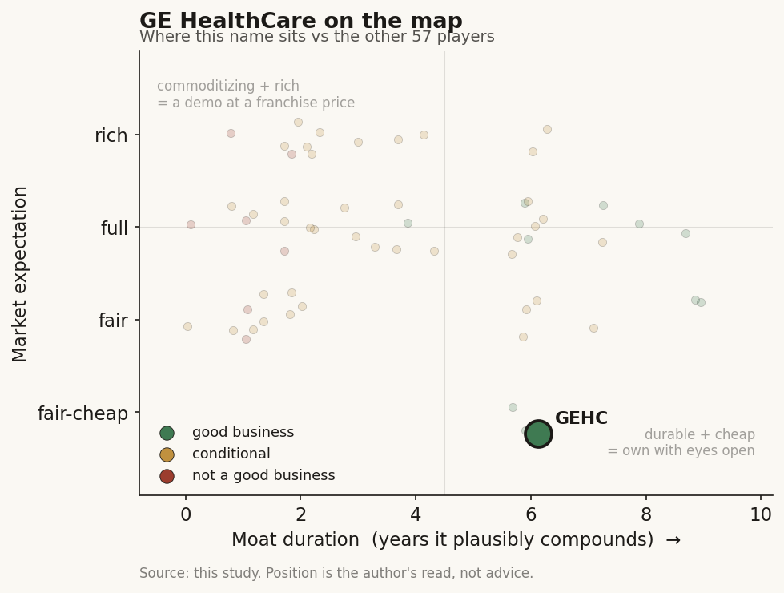

# GE HealthCare (GEHC)

> **The read.** A durable #2 imaging OEM with real installed-base lock-in, priced as a low-growth industrial at ~12-13x forward P/E - a good business at a fair-to-cheap expectation, but only fair, not the healthcare-AI compounder its label implies, and the AI moat is refuted.

**Snapshot**

| | |
|---|---|
| Listing | GEHC / Nasdaq (spun from GE, Jan 2023) |
| Region | US |
| Value-chain layer | Imaging L5a (on-device / interpretive AI) + L6 (workflow) |
| Archetype | infra / SaMD (imaging-hardware toll with an embedded SaMD software layer) |
| Size | ~$29.8bn market cap · ~$38bn EV |
| Revenue (latest) | FY2025 $20.6bn, +4.8% reported / +3.5% organic |
| Moat verdict | conditional (~5-7 yr installed-base + service lock-in; AI layer commoditizing) |
| Expectation | cheap-to-fair (priced as a cyclical industrial, no AI premium) |
| Evidence quality | high (financials + moat verdict); med (segment split + forward margin) |

## What it is
The world's largest diagnostic-imaging OEM (MRI, CT, molecular/PET, X-ray, ultrasound) plus contrast agents (PDx) and patient-monitoring (PCS), now bolting ~120 FDA-cleared AI algorithms onto that installed base. It is a hardware-and-consumables franchise wearing a healthcare-AI label, not a software pure-play. It sits on the hardware rail under the entire imaging chain and has migrated up into on-scanner interpretive AI (L5a) and reading-workflow software (L6).

## Business model - how it makes money
A razor-and-blade capital-equipment toll: big-ticket systems (a reimbursement-independent capex sale) plus a growing recurring tail of service contracts, software subscriptions, and PDx consumables. This is Archetype 06 economics (usage/capex toll, bimodal margin) with an Archetype-02 SaaS aspiration grafted on.

Growth quality is capital-heavy relative to a SaaS name - it manufactures scanners - but capital-light vs a diagnostics lab (no CLIA wet-lab per unit). **ROIC ~12.5%, ROE ~19.5%** [reported] - respectable, well above WACC, but not compounding-machine returns. Cash conversion is real (FCF ≈ 70-80% of adjusted net income), but low-single-digit organic growth caps the compounding. Growth is volume plus mix (services / PDx), not price - a GDP-plus industrial, not a hyperscaler.

## Financial summary

| Metric | FY2025 |
|---|---|
| Revenue | $20.6bn (+4.8% reported / +3.5% organic) |
| Gross margin | ~40% |
| Adjusted EBIT margin | 15.3% (-100bp YoY on ~$100m/qtr tariff drag) |
| Net income margin | ~10.1% |
| Free cash flow | ~$1.4bn+ (Q4 FCF $916m alone) |
| ROIC / ROE | ~12.5% / ~19.5% |
| Net debt | $8.3bn |

Segment detail (FY2025):

| Segment | Revenue | Organic growth | Note |
|---|---|---|---|
| Imaging | ~$11.4bn (~55% of rev) | +5.3% | the core [split = estimate] |
| AVS (ultrasound / interventional) | ~$3.5bn | +4.2% | highest-margin leg (Q1'26 AVS EBIT 22.3%, +120bp) |
| PDx (contrast) | ~$2.9bn | +12.7% | the surprise grower (+15.6% reported) |
| PCS (monitoring) | ~$3.0bn | -1.1% | the drag |

## Value-chain position and competition
GEHC owns the hardware rail under the entire imaging chain (an L1/L2 equivalent for imaging) and has migrated up into L5a (on-scanner / interpretive AI: reconstruction, auto-positioning, lesion flags) and L6 (reading-workflow, its enterprise-imaging and command-center software). It sells the box that generates the image, then the AI that speeds acquisition and reads, then the service contract and (for PDx) the contrast dose per scan. It is the OEM whose installed base every downstream imaging-AI startup must integrate with - GEHC controls the scarce input, the scanner and the DICOM stream at the point of capture.

Competition is a tight OEM oligopoly: **Siemens Healthineers (imaging leader, ~$23bn), Philips, Canon, Samsung/Bruker at the edges**; in ultrasound also Butterfly/handheld; in PDx contrast vs Bracco/Bayer/Guerbet. On radiology-AI clearances GEHC leads the OEM pack (**120 authorizations vs Siemens 89, Philips 50, Canon 45**) [disclosed]. Its edge is scale, a ~4m-unit global installed base, service-contract lock-in, and the deepest AI-clearance count - a genuine distribution and integration advantage. The limit: it is a #2 in imaging behind Siemens Healthineers and does not out-innovate the field on any single modality; the edge is installed-base gravity, not technological monopoly.

## Moat
Two Ch5 moats apply, both conditional and capped, not the durable kind:
- **Regulatory clearance = REFUTED as a moat (~0 yr on grant).** Ch5 names GEHC explicitly: 120 clearances is an OEM installed-base moat wearing a regulatory label, not a barrier - 1,451 AI devices are cleared, ~295/yr added, 97% predicate 510(k). The clearance count gates the shelf, not the revenue.
- **Workflow embedding / installed-base distribution = CONDITIONAL (~5-7 yr).** Unlike a rented Epic scribe slot, GEHC owns the scanner and the DICOM capture point - a scarce input a platform above cannot cheaply replicate - so its embedding is the durable end of the Moat-2 split. But it is defended by switching cost and service lock-in, not by a compounding data flywheel.
- **Data-flywheel = mostly REFUTED for its purpose** - imaging volume does not compound into un-cloneable model IP; open models catch on-device AI, and the value is the box, not the algorithm.
- **No reimbursement-code moat** (it is not HeartFlow; almost none of its 120 algorithms hold a permanent Category-I CPT code - the real barrier it lacks).

Estimated durable moat duration: **~5-7 years** on installed-base plus service lock-in; the AI/software layer itself is a ~1-3 year edge that commoditizes.

## Core variables
1. **Imaging book-to-bill / order growth + China.** ~55% of revenue; hospital capex cyclicality and China (VBP price pressure, stimulus timing) set the whole top line. This is the master variable.
2. **Adjusted EBIT margin path vs tariffs/mix.** FY26 guide cut to **15.4-15.7%** on ~$100m/qtr tariff drag; whether GEHC offsets via price/productivity and PCS recovery decides EPS. Margin, not revenue, is where the 2026 disappointment lives.
3. **Recurring mix shift (services + software + PDx consumables).** The re-rating case rests on the recurring, higher-margin tail growing faster than boxes - PDx (+12.7% organic) and AVS (22%+ EBIT) are the tell; PCS (-1.1%) is the anti-tell.

Noise excluded: individual algorithm clearances, single-product launches (Vivid Pioneer), quarter-to-quarter FX.

## Bear case / key risks
Strip the AI narrative and GEHC is a **~3-4% organic-growth capital-equipment company with ~40% gross margin, ~15% EBIT margin, ~12.5% ROIC, and $8.3bn net debt** - an industrial, not a software compounder. The 120-clearance "AI moat" is refuted by Ch5 (clearance is table stakes; no CPT-code lock). Growth is hostage to hospital capex cycles and China VBP pricing, PCS is shrinking, and tariffs just forced a guidance cut (adj. EPS to **$4.80-5.00**, margin to **15.4-15.7%**) that pushed the stock **-22.7% YTD 2026**. The AI/software layer that would justify a premium is a small, commoditizing slice of a hardware P&L; it does not change the incremental unit economics of selling a scanner. Falsification of the bull: recurring-software/services mix visibly re-rates gross margin toward the mid-40s and organic growth breaks above ~5% durably - neither is in the tape.

## The expectation read
At **~$66, ~$29.8bn market cap, ~$38bn EV** [reported, Jul 2026]: **forward P/E ~12-13x, EV/EBITDA ~10.8x, EV/FCF ~25x**, dividend yield ~0.2%. That is a medical-device multiple trading **~35% below the device-industry median forward P/E (~19.7x)** [reported] - the market is not paying an AI premium; it prices GEHC as a cyclical, low-growth industrial with tariff and China overhangs. The implied belief: ~3-4% organic growth, flat-to-down margins near-term, and no software re-rating.

Where the belief looks soft in GEHC's favor: the discount already bakes in the bear (China, tariffs, PCS), so a PDx/AVS-led mix shift or a margin bounce as tariffs anniversary would be un-priced upside. Where it looks soft against GEHC: the ~25x EV/FCF is not cheap on cash, so the "value" case leans on the EPS multiple, not FCF yield - a re-rate needs the recurring mix to actually lift margin, which the P&L has not yet shown.

## Verdict
**Good business, fairly-to-cheaply priced as an industrial - but only fair, not a healthcare-AI compounder, and the AI moat is refuted.** A durable #2 imaging OEM with real installed-base lock-in (~12.5% ROIC, ~40% GM, FCF-generative) whose ~12-13x forward P/E already discounts the low-single-digit growth and tariff/China drag; the upside is a mix-shift/margin re-rate, not the AI story the label implies. **Confidence: medium-high** on the financials and moat verdict (company-disclosed FY25/Q1'26 plus Ch5 framework); **medium** on the precise Imaging-segment revenue split and the forward margin trajectory (interpolated / guidance-dependent).
