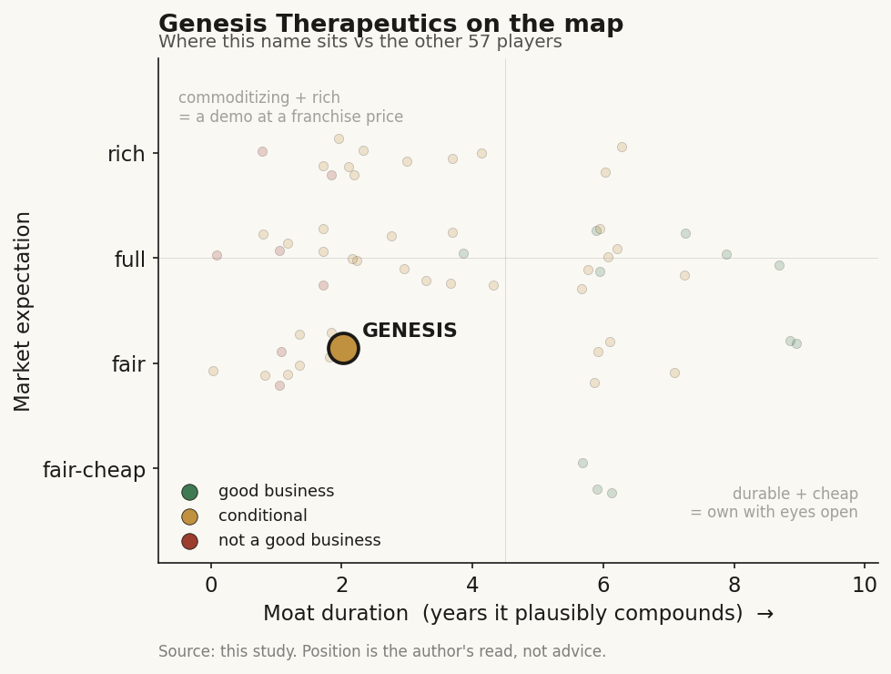

# Genesis Therapeutics (private)

> **The read.** A commercially validated AI drug-discovery platform (four pharma deals, an Incyte re-up with equity, NVIDIA backing) whose model commoditizes in ~1yr and whose value still sits behind the unmoved ~40% Phase-II wall - good access/optionality, not yet a durable value-capturer. Grade C+, conditional.

**Snapshot**

| | |
|---|---|
| Listing | private |
| Region | US (Burlingame, CA) |
| Value-chain layer | L9b-L9d (generation -> optimization -> selection) |
| Archetype | drug-owner (Archetype 04 - milestone + royalty, own-pipeline) |
| Size | ~$304m+ total raised across 5 rounds / ~18 investors; post-money valuation not disclosed at any round |
| Revenue (latest) | pre-revenue on product; platform upfronts landing now (see below) |
| Moat verdict | conditional (relationship/optionality, not compounding) |
| Expectation | fair (no disclosed venture mark to anchor a rich reading) |
| Evidence quality | med |

## What it is
An AI drug-discovery company built around GEMS (Genesis Exploration of Molecular Space) - a generative + predictive small-molecule engine fusing diffusion models, language models and physical ML simulation to design potent, selective molecules for hard/"undruggable" targets. It sells that engine to pharma AND runs its own preclinical pipeline.

## Business model - how it makes money
Archetype 04 (milestone + royalty) with a dual revenue face: (a) platform-partnership biobucks - upfront + per-target nomination + preclinical/clinical/regulatory/sales milestones + tiered royalties, sold to pharma who bear the trial risk; and (b) an owned preclinical pipeline it intends to carry toward the clinic. The partnership leg is capital-light and cash-generative today (real upfronts land now against near-zero COGS); the owned-pipeline leg is capital-hungry and pre-revenue. Net: less cash-burning than a pure own-pipeline techbio because partners fund the platform - but the value that would justify a large mark still sits behind the same efficacy wall. No product revenue; nothing approved.

Disclosed partnership economics (the actual cash, not the biobuck headline):

| Partner | Date | Upfront | Headline ceiling | Structure |
|---|---|---|---|---|
| Genentech (Roche) | Oct 2020 | undisclosed | undisclosed | multi-target, deep-learning discovery |
| Eli Lilly | May 2022 | $20m | up to $670m | 3 initial + 2 optional targets + royalties |
| Gilead | Sep 2024 | $35m | undisclosed | 3 targets + option to expand + royalties |
| Incyte (initial) | Feb 2025 | $30m | - | 2 initial targets + 1 optional |
| Incyte (expanded) | May 2026 | $80m cash + $40m equity | up to $885m (~$295m/target) | multi-target expansion + royalties |

Upfront-as-%-of-ceiling for Lilly is ~3.0% ($20m / $670m) - squarely inside the sector's 1.2-3.0% "cheap staged real option" band. Pharma is the landlord; the biobuck is the call premium, and most of it expires unpaid.

## Financial summary
No disclosed post-money valuation at any round, so the table below is the funding record, not a mark.

| Round | Date | Amount | Notes |
|---|---|---|---|
| Series A | 2020 | $52m | - |
| Series B | Aug 2023 | $200m | oversubscribed; co-led by a16z Bio+Health (prior seed lead) and Rock Springs Capital |
| NVentures follow-on | Nov 2024 | undisclosed equity | alongside an NVIDIA compute collaboration |
| Incyte equity | May 2026 | $40m | primary purchase inside the deal expansion |
| Total raised | - | ~$304m+ | across 5 rounds / ~18 investors |

Series B investor set: a16z, Rock Springs, T. Rowe Price, Fidelity, BlackRock, Radical Ventures, Menlo Ventures, and NVIDIA NVentures. Post-money valuation is NOT disclosed at any round - the tape has no venture mark to anchor on, unlike the ambient-scribe cohort. Treat any headline valuation as unverified.

## Value-chain position and competition
Genesis sits in the generation -> optimization -> candidate-selection span: GEMS generates novel chemistry (L9b), optimizes potency/selectivity/ADMET (L9c), and hands off a nominated development candidate (L9d) to the partner or its own pipeline. What flows OUT: designed molecules / development candidates to Lilly, Gilead, Incyte (and historically Genentech), plus owned preclinical assets (lead: a pan-mutant PIK3CA allosteric inhibitor approaching DC nomination; plus an extrinsic-apoptosis cell-death program and immunology targets). What flows IN: partner capital + target selections, and NVIDIA compute/methods. It is NOT a tool/reagent vendor - it owns the assets its model designs, the same "model is the door, not the moat" structure as Isomorphic and the gene-editing cohort.

Competes with the frontier AI-discovery cohort (Isomorphic, Recursion/Exscientia, Iambic, Xaira, Insilico) AND with pharma's own in-house computational chemistry. Its differentiators (claimed): physics-ML simulation fused with generative models (not pure ligand-based ML), and a partnership scorecard most peers lack - four brand-name pharma deals (Lilly, Genentech, Gilead, Incyte) with Incyte re-upping and buying equity, which is genuine revealed-preference validation of the platform's usefulness. The edge that is real: commercial traction + repeat business (Incyte expansion) + NVIDIA as strategic backer. The edge that is NOT durable: the GEMS model itself - open clones (Boltz-1/2, Chai-1, Protenix) matched the structure/affinity frontier within ~1yr at >1000x lower cost; model IP is a ~12-month moat.

## Moat
Ch5 Moat 3 (pharma distribution / own-pipeline) - verdict CONDITIONAL; and Moat 4 (data flywheel) - REFUTED for drug discovery. For Genesis specifically:
- The model is a ~1yr moat (commoditizing) - refuted.
- The data flywheel is refuted for discovery - public data reproduced the frontier; more data has not bought a point of Phase-II PoS.
- What partially survives is the owned asset against a risk-bearing pharma counterparty - but that is binary optionality gated on the ~40% Phase-II wall unchanged for 30 years, not compounding duration. Zero AI-discovered drugs approved as of 2026.

Is the moat real for a private at this stage? Largely NO as a durable compounding moat. What is real is a softer relationship/optionality asset - repeat pharma demand (Incyte re-up + equity), NVIDIA alignment, and a scorecard of live deals. That is a genuine going-concern signal and it funds the burn, but it is access/optionality, not a widening moat. Duration of compounding: ~2-3yr binary watch, not the 5-10yr of a workflow-ownership moat.

## Core variables
The 2-3 that decide the thesis (noise discarded from the fuller list of partnership cadence, DC nominations, GEMS-vs-clone differentiation, NVIDIA depth, runway, milestone conversion):
1. Realized Phase-II PoS for any GEMS-origin molecule - the master variable. GEMS de-risks the cheap chemistry half; value only forms if a molecule clears the ~40% efficacy wall where ~90% of failure and ~93% of spend live. Unobservable until ~2028-29 at the earliest - no asset is yet in the clinic.
2. Partnership economics: upfront-to-milestone CONVERSION, not headline biobucks. Watch whether milestone/nomination cash actually converts (Lilly target nominations, Incyte target draws) - the Incyte re-up + $40m equity is the one hard datapoint that the platform is worth repeat spend.
3. Owned-pipeline progression to first IND (PIK3CA lead). Does the internal PIK3CA program reach DC nomination then IND on the disclosed timeline - proving Genesis can carry an asset, not just feed partners? This is the option that a large mark would rest on.

## Bear case / key risks
It is a commoditizing model layer valued as if it owned the asset that clears biology. (1) GEMS' technical edge erodes toward open clones (~1yr); the platform is table stakes, not a franchise. (2) The owned pipeline is entirely preclinical - no asset in the clinic, so the ~40% Phase-II wall is unproven and years away; the PIK3CA lead competes in a crowded, well-capitalized target class. (3) Partnership cash is cheap optionality (~3% upfront-to-ceiling) that mostly expires worthless - Lilly/Gilead can walk after nomination fees, and a partner is the landlord who can envelop the supplier. (4) The two most-hyped pure-plays that owned assets without clearing Phase II (Exscientia, BenevolentAI) effectively failed as independents - direct precedent. (5) No disclosed valuation means no venture floor to defend the mark, and no product revenue means the whole thesis is optionality on a wall AI has not moved. Refuting evidence that would break the bear: a GEMS-origin molecule clearing Phase II visibly above ~40%, or continued pharma re-ups converting milestones into material cash - the Incyte expansion is the first thin data point in that direction.

## The expectation read
With no disclosed post-money at any round, there is no venture mark and no product revenue to anchor a multiple - the whole valuation is optionality on a wall AI has not yet moved. The revealed-preference signal that keeps the read at fair rather than cheap is the Incyte re-up plus $40m equity purchase and the four-deal pharma scorecard: repeat spend says the platform earns real cash today. But the market belief that would justify anything richer - that GEMS-origin molecules will clear the ~40% Phase-II wall - is untested and unobservable until ~2028-29, and the model layer itself commoditizes toward open clones within ~1yr. So the soft spot in any full/rich reading is that it prices asset-ownership economics onto a platform whose durable edge is a ~12-month model lead and a set of relationships.

## Verdict
FEATURE-PLUS, not yet a durable value-capturer - grade C+ (conditional), confidence MEDIUM. Good business at the platform-cash level, but only a fair expectation is defensible: the model commoditizes in ~1yr, every owned asset is preclinical behind the unmoved ~40% Phase-II wall, and there is no disclosed valuation to anchor a mark. The partnership scorecard makes it more than a demo - it earns real cash and repeat business - but that is relationship/optionality, not the workflow-ownership moat that compounds. It becomes a durable value-capturer only if a GEMS-origin molecule clears Phase II (unobservable pre-~2028-29); until then, size it as a ~2-3yr binary option, not a compounding franchise.
