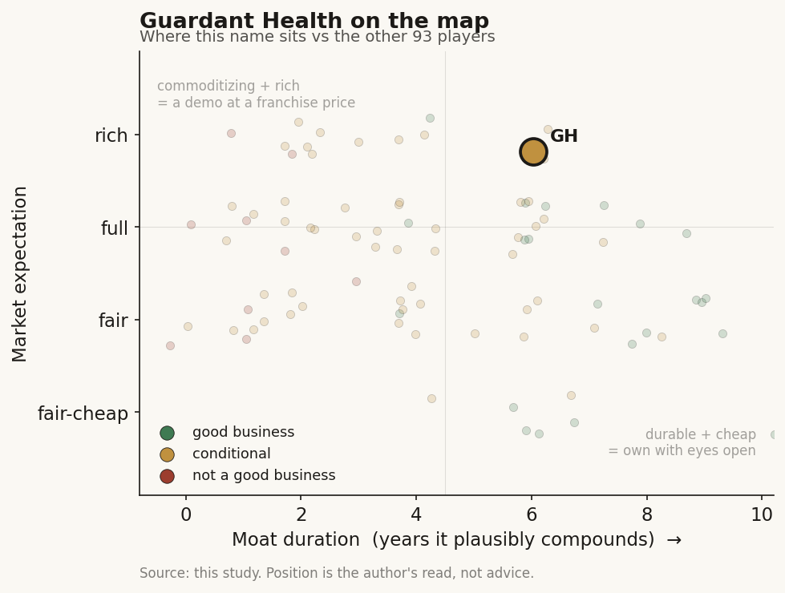

# Guardant Health (GH)

> **The read.** A genuine liquid-biopsy franchise with a real coverage moat, but priced at a software-annuity multiple its per-test margins and reimbursement-gated screening TAM have not yet earned - good business, richly expected.

**Snapshot**

| | |
|---|---|
| Listing | GH / NASDAQ |
| Region | US |
| Value-chain layer | L3-L5 (assay -> CLIA lab -> ctDNA interpretation), + L7 data tail |
| Archetype | per-test lab (01) core + data-licensing RWE (03) bolt-on |
| Size | market cap ~$22.3bn, EV ~$22.9bn |
| Revenue (latest) | FY25 $982m (+33%); Q1'26 $302m (+48%) |
| Moat verdict | conditional - durable while coverage/code holds, commoditizing on clearance |
| Expectation | rich (~21x EV/sales) |
| Evidence quality | high on operating facts, medium on the expectation read |

## What it is
A ctDNA liquid-biopsy platform spanning three clinical uses - advanced-cancer therapy selection, molecular residual disease (MRD) monitoring, and the first FDA-approved blood test for primary colorectal screening - plus a pharma data/RWE business. It reads circulating tumor DNA across the cancer continuum via Guardant360 (therapy selection), Reveal (MRD), and Shield (average-risk colorectal screening), with a de-identified clinico-genomic data leg sold to pharma. It sells conclusions from a blood draw, not a box.

## Business model - how it makes money
Three revenue lines, all reimbursement- or contract-gated:
- **Oncology (per-test, Archetype 01):** Guardant360 (liquid + tissue CGP) and Reveal (MRD). Q1'26 revenue $205m, +36% YoY; oncology volume 86k tests, +47%. FY25 oncology ~$700m+ run-rate; Q4'25 $190m (+30%), 79k tests (+38%). This is the cash core.
- **Screening / Shield (per-test, Archetype 01):** Q1'26 $42m (from $6m a year prior), 44k tests (from 9k). FY25 screening $79.7m on ~87k tests. FY26 guide $186-198m / ~230-245k tests - a ~2.5x volume step. The hyper-growth leg.
- **Biopharma & Data (data-licensing, Archetype 03):** Q1'26 $53m, +17%. The ~73%-GM-type annuity analogue, but here the SLOWEST grower and a shrinking mix share.

**Growth quality.** Non-GAAP gross margin ~66% Q1'26 (65% a year prior), FY26 guide 64-65% - margin guided DOWN as low-ASP Shield/Reveal mix scales, the tell that this is a per-test lab, not software. **Capital-HUNGRY / cash-negative:** Q1'26 adj EBITDA -$59m; FY25 free-cash-flow burn -$233m (narrowed from -$275m in 2024). Incremental ROIC is still negative - growth is bought with reagent COGS, CLIA capacity, and a large screening sales build, not compounded. **Cash conversion:** working-capital-heavy (payer adjudication lag on every test); ~$1.2bn cash vs ~$1.7bn convertible debt, net debt ~$0.6bn. Runway is comfortable; the crossover to self-funding FCF is the open question, and GH is *behind* the profitable diagnostics peers (Caris FCF+, Exact Sciences profitable) on that clock.

## Financial summary

| Metric | FY24 | FY25 | Q1'26 |
|---|---|---|---|
| Revenue | - | $982m (+33%) | $302m (+48%) |
| Oncology | - | ~$700m+ run-rate | $205m (+36%), 86k tests |
| Screening (Shield) | - | $79.7m, ~87k tests | $42m, 44k tests |
| Biopharma & Data | - | - | $53m (+17%) |
| Non-GAAP gross margin | - | - | ~66% (65% prior year) |
| Adj EBITDA | - | - | -$59m |
| Free cash flow | -$275m | -$233m | - |
| Cash / conv. debt | - | ~$1.2bn cash / ~$1.7bn debt (net ~$0.6bn) | - |

FY26 guide: revenue $1.30-1.32bn (+32-34%); screening $186-198m on ~230-245k tests; gross margin 64-65%.

## Value-chain position and competition
Owns the assay (L3), the CLIA lab that runs it and shifts the clinical-validation burden onto itself (L4), and the ctDNA-interpretation/report layer where named-patient interpretive value forms (L5). A blood tube in, a variant/therapy/recurrence/screening call out to the ordering oncologist or PCP; the payer pays, the clinician decides, the patient benefits (the 3-way split). The **L7 seam** - de-identified clinico-genomic data sold to pharma - is where the per-test lab becomes picks-and-shovels for drug development, the one node joining the diagnostics chain to the discovery chain. Cash sits downstream in the reimbursement-gated lab; any software-multiple case would have to rest on the L7 data leg - which here is the *slowest* segment (+17%), the opposite of the Tempus setup.

Competition:
- **Oncology CGP:** vs Foundation Medicine (Roche) in tissue, and Tempus (TEM) as the multimodal data-platform rival; Natera Signatera is the MRD category leader (Reveal is a challenger off a smaller base). GH's edge is a first-mover liquid-CGP franchise and installed oncologist base, not best-in-class per test.
- **Screening (the contested arena):** Shield is first-to-market in blood (FDA July 2024) but is bracketed - Exact Sciences' Cologuard is the entrenched stool-DNA incumbent (next-gen ~94% CRC sensitivity, 46% advanced adenoma); Exact also licensed Freenome's blood test (up to $885m deal) to attack Shield directly in blood. **Shield's clinical gap is real and did not close in the next-gen algorithm:** the Shield V2 readout (Sep 2025) posted ~84% CRC sensitivity and 90% specificity but still only ~13% advanced-adenoma sensitivity (stage I CRC 62%; stage II+ ~100%) - the detection deficit vs Cologuard's ~40%+ adenoma sensitivity is structural to a blood assay, not a first-generation artifact. Analysts peg blood-test life-years-gained ~20% below stool, which drives the guideline/USPSTF grade and long-run coverage economics. GH's edge is convenience/compliance (a blood draw closes the un-screened gap, >90% completion across ~200k real-world tests), not detection superiority. **Distribution, by contrast, is now a genuine edge:** a Sep-2025 Quest Diagnostics collaboration (EMR integration + co-promotion, live Q1'26) puts Shield inside Quest's ~650k clinician/hospital ordering accounts, layered on nationwide EMR integration (Epic, eClinicalWorks, athenahealth) and an FDA-cleared simplified 2-tube kit - the ordering-friction advantage stool never had.

## Moat
**Conditional.** Bare FDA clearance = REFUTED (~0 yr on grant): GH's FDA approval is table stakes among 1,451 cleared AI/SaMD devices; the shelf is not the revenue. **What actually protects GH is code/coverage ownership (~5-8 yr, CMS-repricing-capped)** - Shield's CMS **ADLT status at $1,495** (nine-month transitional rate from 1 Apr 2025) plus Medicare $0-out-of-pocket and NCCN inclusion are the real barrier, the HeartFlow-style coverage moat that survives in place of clearance. The **data-flywheel moat is CONDITIONAL** - it survives only for the L7 data-licensing leg (data IS the product, pharma bears efficacy risk), but that leg is GH's smallest and slowest, so the flywheel is present but not the value driver. Net: durable while the coverage/code holds and a broad USPSTF grade lands; **commoditizing** on the clearance itself, and the ADLT rate is transitional - a permanent Cat-I code can be priced DOWN under CMS budget-neutrality (precedent: LumineticsCore -14% over two years). Estimated durable-compounding window: ~5-8 yr on coverage, contingent on the USPSTF/guideline gate.

## Core variables
The thesis lives or dies here:
1. **Shield reimbursement & guideline path - the master variable.** Transitional ADLT $1,495 -> permanent CPT crosswalk and, decisively, the **USPSTF grade** (an "A/B" enables commercial coverage and employer/PCP ordering at scale). The ~13-20% advanced-adenoma gap is the direct input to that grade; this is where the volume guide (~230-245k tests) either compounds or stalls.
2. **Screening unit economics vs the mix drag.** Shield/Reveal are LOW-ASP relative to oncology CGP - that is why FY26 gross margin is guided DOWN to 64-65%. Whether the screening ramp reaches an ASP/COGS profile that pulls the business toward FCF crossover (not further from it) is the growth-quality hinge.
3. **Oncology durability + FCF crossover clock.** The ~$700m+ oncology core (+30-36%) funds everything; Signatera/Foundation competition and the -$233m FY25 burn make "does GH self-fund before dilution/leverage bites" the balance-sheet variable - and GH is behind Exact/Caris on that clock.

(Noise held below the line: quarterly test-volume prints, biopharma-data lumpiness, tissue-vs-liquid mix, short-term ASP wobble, and the June-July 2026 share-price pop itself - though the UnitedHealth coverage decision behind it is substantive and is treated in Recent developments below.)

## Bear case / key risks
GH is a **capital-hungry, reimbursement-gated per-test lab wearing a screening-TAM growth multiple.** (1) The value leg that would justify a software re-rate - L7 data - is the *slowest* segment (+17%) and shrinking as a mix share, the inverse of the Tempus data-annuity story; there is no ~73%-GM leg pulling the average up, and blended GM is *falling*. (2) Shield's moat is a **transitional** ADLT rate on a test with a real advanced-adenoma detection deficit; a lukewarm USPSTF grade, or a Cat-I reprice down, strands the screening ramp below the economics the multiple assumes - and Exact/Freenome are aiming a better-funded blood test at exactly this. (3) Profitability is still years out: -$233m FCF burn, negative incremental ROIC, ~$1.7bn convertibles; the profitable version of a diagnostics business already exists at the peers (Exact, Caris), so GH's premium pays for a promise others have delivered. **Falsification/scenario-B to watch:** USPSTF grades Shield "A/B" AND commercial payers follow at a durable ASP AND FCF burn inflects toward zero - that breaks the bear. A soft grade, an ADLT-to-Cat-I step-down, or Exact/Freenome taking blood-screening share confirms it.

## The expectation read
At ~$168/sh, ~132.6m shares, market cap ~$22.3bn, EV ~$22.9bn on ~$1.08bn TTM revenue, GH trades at **~21x EV/sales** (Jul 2026) - and the stock ran from ~$125 to ~$170 in June 2026 on a UnitedHealth Shield-coverage catalyst. That multiple implies the market is **pricing Shield as a large-TAM screening annuity that clears the USPSTF/coverage gate and compounds toward mass adoption** - i.e. it is capitalizing the ~230-245k-test FY26 guide as the front edge of a multi-million-test screening market, and giving credit for eventual margin/FCF inflection. **Where the belief looks soft:** (a) ~21x sales is a software-annuity multiple on a business whose *gross margin is guided DOWN* and whose highest-margin (data) leg grows slowest - the multiple leans on a re-rate the mix does not yet support; (b) the Shield coverage/ASP that anchors the TAM is a *transitional* ADLT rate facing a USPSTF grade gated by a real detection gap and a better-funded competitor entering blood; (c) FCF is still -$233m with no dated crossover, so the market is paying an annuity multiple ahead of annuity economics. The expectation embeds the bull screening path with limited discount for the coverage/adenoma/competition tail.

## Recent developments (2025-2026)
The screening story advanced on the coverage axis but the clinical-gap axis held - exactly the split the bear case is built on.

- **UnitedHealth first-line commercial coverage (announced 1 Jul 2026, effective 1 Aug 2026)** [reported]. The largest US commercial insurer will cover Shield as a *first-line* screening option for average-risk adults ages 45-85 - the first major commercial (non-Medicare) coverage, and the catalyst behind the ~$125 -> ~$170 run in June 2026. TD Cowen [estimate] pegs the reimbursable-TAM lift at ~17% (adding ~10.5m covered lives ages 45-64 on top of the ~63m eligible Medicare lives). This is real ASP-and-volume durability evidence, and it partially de-risks Core Variable 1 - though it is one payer's policy, not a guideline grade.
- **American Cancer Society guideline inclusion (27 May 2026), but qualified** [reported]. The updated ACS CRC-screening guideline names Shield - as "a choice for patients who decline or have not completed stool-based or visual examination screening tests." That is a *second-line / declined-first* placement, not a preferred first-line recommendation, and the wording is driven directly by the advanced-adenoma and stage-I sensitivity deficit. ACS cited ~100% stage-II+ sensitivity, ~200k real-world patients, and >90% completion. Read straight: convenience is endorsed, detection parity is not - the same conditional the moat section flags, now written into a national guideline.
- **USPSTF grade still pending** [reported]. The 2021 USPSTF CRC recommendation predates FDA-approved blood tests, so Shield is not yet USPSTF-graded. An "A/B" grade (which would trigger no-cost-share commercial coverage under the ACA) remains the master unresolved gate - the ACS's qualified language is a soft read-through on how a graded review might land.
- **Distribution and access build-out (2025-2026)** [reported]. Quest Diagnostics collaboration live (Q1'26, ~650k accounts); nationwide EMR integration (Epic, eClinicalWorks, athenahealth); FDA-cleared simplified 2-tube collection kit; Shield made available to US military members and families (TRICARE channel).
- **Shield multi-cancer detection (MCD) - ex-US, early** [reported]. GH launched a methylation-based Shield MCD test (10-cancer panel) internationally in 2026: Asia via a Manulife insurance partnership (Hong Kong, Singapore, Philippines, from April 2026) and India via Zydus Lifesciences. This is optionality on the L7/MCED frontier, but it is ex-US, insurance-channel, and not yet a US-reimbursed revenue line - hold below the line for now.
- **Operating trajectory unchanged from the Q1'26 anchor above** [disclosed]: FY26 guide $1.30-1.32bn (+33% midpoint), screening $186-198m on ~230-245k Shield tests, gross margin 64-65% (guided down on mix). No change to the burn or FCF-crossover picture; watch the H2'26 prints for whether UnitedHealth coverage pulls the screening ASP/volume mix toward, not away from, self-funding.

Net read: the June-July 2026 coverage wins (UnitedHealth first-line, ACS inclusion) are the strongest de-risking the screening thesis has had - but the ACS's "declined-first" qualifier and the still-open USPSTF grade confirm that the advanced-adenoma gap is doing exactly what the bear case said it would: capping the *tier* of the recommendation, not the presence of one.

## Verdict
**Good business, richly expected** - a genuine liquid-biopsy franchise with a real coverage moat, priced at a software-annuity multiple its per-test margins and reimbursement-gated screening TAM have not yet earned. Confidence: **medium-high** on the operating facts (segment splits, GM trajectory, burn, Shield ADLT status and clinical gap are dated); **medium** on the expectation read, which hinges on an undecided USPSTF grade and the transitional-vs-permanent Shield rate - the two events that would confirm or falsify the multiple.
