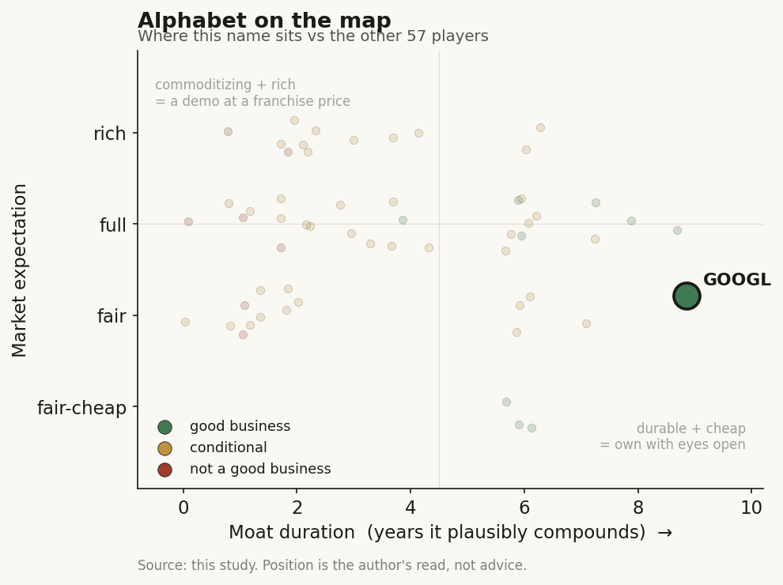

# Alphabet (GOOGL)

> **The read.** A genuinely good, durable L0 platform business at a fair-to-undemanding expectation (~27x, roughly a market multiple), mid-transition from capital-light to capital-hungry as capex doubles to ~$180bn - and the healthcare-AI content is free optionality, not a thesis.

**Snapshot**

| | |
|---|---|
| Listing | NASDAQ: GOOGL/GOOG |
| Region | US |
| Value-chain layer | L0 (compute + model + platform rails) |
| Archetype | infra (archetype-06 infrastructure toll - the L0 spine every layer above pays) |
| Size | ~$4.36tn market cap (~$359/sh, Jul 2026) |
| Revenue (latest) | $402.8bn FY25 (first year over $400bn); Q1'26 $109.9bn, +22% YoY |
| Moat verdict | durable at the L0 core (decade+); healthcare bets commoditizing/conditional |
| Expectation | fair |
| Evidence quality | high |

## What it is
A ~$4.4tn global compute-and-advertising platform (Search, YouTube, Android, Google Cloud, DeepMind) whose healthcare relevance is that it **owns or backs** the AI-drug-discovery and life-science bets - DeepMind/AlphaFold (the model that seeded the whole techbio structure-prediction field), Isomorphic Labs (the flagship AI-drug-discovery asset-owner), and Verily (health-data/precision-health) - none of which is a reported segment. The equity is an ad + cloud + AI-infra toll; the healthcare optionality is a rounding error inside it. It is included in the healthcare-AI study **not** as a healthcare name but as the parent/backer of three healthcare bets that are each immaterial to the consolidated P&L.

## Business model - how it makes money
An ad-and-cloud toll: a capital-LIGHT core turning capital-HUNGRY on AI-capex. Revenue **$402.8bn FY25** [disclosed], **first year over $400bn**; **Q1'26 revenue $109.9bn, +22% YoY** [disclosed] (vs $90.2bn Q1'25). Three engines: **Google advertising ~$77.3bn Q1'26** (Search +19%), **Google Cloud $20.0bn Q1'26, +63% YoY** (FY25 Cloud $58.7bn, exiting >$70bn run-rate) [disclosed], and Other Bets ($1.5bn FY25 revenue - the healthcare/Waymo bucket).

Growth quality is two-tier:
- **Core ad + cloud is genuinely capital-LIGHT and high-return** at the operating line: consolidated **operating margin 31.6% FY25** [disclosed]; **FY25 net income $132.2bn, +32% YoY** [disclosed]; **Q1'26 net income $62.6bn** (vs $34.5bn) [disclosed] - though that quarter is flattered by a large non-operating mark on equity investments, so read operating income **$39.7bn Q1'26** as the clean line.
- **Cloud is the incremental-ROIC story turning positive:** Cloud op margin **17.8% Q1'25 -> 32.9% Q1'26**, op income tripled to **$6.6bn** [disclosed]; **backlog $462bn**, ~doubled sequentially [disclosed] - a genuine capacity-constrained toll.
- **The capital intensity is the whole debate:** **capex $91.4bn FY25**, guided **$175-185bn FY26** [disclosed] - i.e. capex roughly **DOUBLING** to ~45% of revenue. Cash conversion is still strong (huge FCF, ~$95bn+ cash/marketable securities [estimate]), but the archetype is mid-transition from a capital-light software toll toward a capital-hungry silicon/datacenter toll - depreciation and the ROIC on $180bn/yr of AI capex become the swing variables, exactly the Ch4 warning that the infra toll durability "splits inside itself" between the API layer (light) and the silicon layer (heavy).

## Financial summary

| Metric | FY25 | Q1'25 | Q1'26 |
|---|---|---|---|
| Revenue | $402.8bn (first >$400bn) | $90.2bn | $109.9bn (+22% YoY) |
| Google advertising | - | - | ~$77.3bn (Search +19%) |
| Google Cloud | $58.7bn (>$70bn exit run-rate) | - | $20.0bn (+63% YoY) |
| Other Bets revenue | $1.5bn | - | - |
| Operating margin | 31.6% | - | - |
| Operating income | - | - | $39.7bn (clean line) |
| Net income | $132.2bn (+32% YoY) | $34.5bn | $62.6bn |
| Cloud op margin | - | 17.8% | 32.9% |
| Cloud op income | - | - | $6.6bn (tripled) |
| Cloud backlog | - | - | $462bn (~doubled seq.) |
| Capex | $91.4bn | - | guided $175-185bn FY26 (~45% of revenue) |

All figures [disclosed] except cash/marketable securities ~$95bn+ [estimate].

## Value-chain position and competition
The **L0 spine**: owns compute (TPU silicon + datacenters), the frontier model (Gemini/DeepMind), and the distribution platform (Search/Android/Chrome/Cloud). Per Ch4, this is the archetype-06 infra toll that **every layer above pays** - usage-gated, reimbursement-INDEPENDENT. What flows OUT to the healthcare-AI universe specifically: (i) **AlphaFold** (DeepMind) - the structure-prediction model that became the field's shared input and, per Ch5, the thing that then COMMODITIZED (open clones matched AF3 in ~1yr at >1000x lower cost); (ii) **Isomorphic Labs** - the owned-asset drug-discovery entity DeepMind spun out rather than licensing AlphaFold, the deliberate "own the asset, not the model" move; (iii) **Cloud/TPU compute** rented to every techbio and health system as picks-and-shovels; (iv) **Verily** - health-data/RWE and precision-health tooling. Value in Alphabet accrues at L0 (compute + platform), **not** at the healthcare application layers where the named-patient liability and reimbursement gates sit.

At L0 Alphabet competes with **Microsoft/Azure+OpenAI, Amazon/AWS, NVIDIA (silicon), and Meta** - a capex arms race where the edge is owned TPU silicon (vertical integration below the CUDA/TSMC layer) + Search/YouTube data + global distribution. It is a co-leader, not a monopolist, and the binding contest is compute supply, not demand (backlog > capacity). In **healthcare specifically the bets are subscale against focused pure-plays:** Isomorphic vs the techbio cohort (Recursion, Insilico/ISM, Absci, Schrödinger) and legacy pharma on the same targets; Verily vs Tempus/Flatiron/Truveta on RWE - Alphabet's edge there is a relationship/access + compute asset, **not** a clinical or reimbursement franchise.

On the healthcare-application front Alphabet is also pushing the **model layer directly into clinics**, which sharpens the competitive read: **MedGemma 1.5** (open 4B multimodal medical model, released Jan 2026 [reported], adding CT/MRI/whole-slide pathology support) and **AMIE** (the diagnostic-conversation research system, extended to long-term disease management in a 2026 Nature paper [reported]) are given away free for research and commercial use. That is the same commoditize-the-model-to-monetize-the-platform pattern seen with AlphaFold: Alphabet does not try to own the clinical-AI application economics; it seeds the field so the inference runs on Google Cloud/TPU. The competitive threat this poses is to the paid clinical-copilot vendors (ambient-scribe and diagnostic-assistant startups), not to Alphabet's own P&L - MedGemma/AMIE are not reported revenue and are not a reimbursement-gated franchise.

## Moat
Ch5: the L0 platform is CONFIRMED durable; the healthcare bets carry the REFUTED/CONDITIONAL moats.
- **The L0 core (compute + platform + Search distribution) is a genuine, durable moat** - the surviving "own a scarce input the platform above cannot replicate" test, applied at the platform level itself: owned silicon (TPU), the ad/search distribution rail, and the Cloud capacity backlog. Duration: **decade-plus** for the platform position (subject to antitrust as the real erosion risk, not competition).
- **AlphaFold / the model (Moat: the model)** - **REFUTED as a moat, ~1yr** (Ch5): open MIT/Apache clones (Boltz-1/2, Chai-1, Protenix, OpenFold-3) caught the frontier within ~1 year at >1000x lower cost. The model is the door, not the moat - which is precisely WHY DeepMind built Isomorphic as a separate asset-owning entity rather than licensing the model.
- **Isomorphic (Moat 3: own-pipeline vs risk-bearing pharma)** - **CONDITIONAL** (Ch5): binary optionality, NOT compounding, gated by the **~40% Phase-II efficacy wall unchanged ~30 years**; first Phase I only ~end-2026, zero human efficacy data today; upfronts are cheap staged real options (1.2-3.0% of headline biobucks). A ~2-3yr binary watch sized for asymmetry, not a durable moat.
- **Verily / data (Moat 4: data flywheel)** - the data-LICENSING form CAN survive, but Verily is not a disclosed Tempus-style RWE annuity and is immaterial to the equity.
- **Net for the study:** the durable moat is the **L0 ad+cloud platform** (decade+); the healthcare pieces inherit the framework's WEAK verdicts (model ~1yr; Isomorphic a ~2-3yr binary) and are too small to move the equity either way.

## Core variables
1. **AI-capex ROIC - the master variable.** Capex ~doubling to **$175-185bn FY26** [disclosed]. Does the Cloud/AI toll (backlog $462bn, Cloud margin 17.8%->32.9%) earn a return ABOVE the rising depreciation, or does $180bn/yr of silicon compress consolidated margins and free cash flow? This one line decides whether the infra toll stays high-return or dilutes into a capital-hungry utility.
2. **Search/ad durability vs AI-answer disruption.** ~$77bn/qtr of ad revenue at ~30%+ margins funds the entire capex program AND every moonshot. The variable is whether generative-answer search (Gemini and rivals) erodes the query-monetization engine before Cloud is large enough to carry the company.
3. **Regulatory/antitrust overhang.** The real erosion risk to the L0 moat is not competition but the US ad-tech and Search remedies (and EU action) - a structural, not cyclical, variable that can force divestiture or change default-distribution economics.

*(Second-order, held below the line: Isomorphic Phase-I/readout timing; Verily; Waymo; Other Bets loss (~$5bn+/yr drag); the quarterly equity-investment marks that swing GAAP net income - ignore those as noise.)*

## Bear case / key risks
A capital-light toll is voluntarily becoming a capital-hungry one, into antitrust.
1. **Capex doubling to ~$180bn** is an unhedged bet that AI-compute demand and pricing hold; if utilization or Cloud pricing softens, the company has converted a ~31% operating-margin, capital-LIGHT franchise into a depreciation-heavy utility with far lower incremental ROIC - the exact Ch4 "infra toll splits inside itself" risk, live.
2. **Search is the single point of failure:** the ad engine funds everything, and it faces the first credible substitution risk in two decades from generative answers.
3. **Antitrust is a standing structural threat** to the distribution moat that no operating result offsets.
4. **The healthcare bets are optionality, not value:** AlphaFold's moat is refuted (commoditized ~1yr), Isomorphic hits the same ~40% Phase-II wall as legacy pharma with zero human efficacy data, and both are rounding errors - a reader buying GOOGL for healthcare-AI exposure is mispricing an ad+cloud toll as a biotech.

**Falsification / what breaks the bear:** Cloud sustains >30% margins AND >40% growth against the capex (proving the toll out-earns its silicon), Search ad revenue holds double-digit growth through the AI-answer transition, and antitrust remedies land benign - at which point the capex doubling reads as a moat-widening capacity land-grab, not a margin trap.

## The expectation read
What a ~$4.4tn cap / ~27x earnings implies. Market cap **~$4.36tn** at **~$359/sh (Jul 2026)**, **P/E ~27x** on ~$132bn FY25 net income [reported]. For a ~$400bn-revenue mega-cap growing revenue ~22% with 31.6% operating margins, ~27x earnings is **roughly a market multiple - the market is NOT paying an aggressive AI premium here.** Decomposed, the multiple implies the market believes: (i) core ad + cloud keeps compounding at ~20% with margins intact; (ii) the **$175-185bn capex earns an acceptable ROIC** (i.e. Cloud's toll out-earns its depreciation); and (iii) Search survives the AI-answer transition. **It assigns ~zero value to the healthcare bets** - Isomorphic (~$2.6bn total raised, latest $2.1bn Series B May 2026 at undisclosed valuation; >$1.7bn Lilly biobucks headline [reported]), Verily, and AlphaFold are inside the strategic footprint but outside the P&L, so any drug-discovery success is unpriced free optionality. **Where the belief looks soft:** the capex-ROIC assumption is the load-bearing one and is unproven at $180bn scale; a market multiple already prices "capex works," so the asymmetry is to the downside if depreciation outruns the toll. The antitrust tail is real and unpriced at 27x. Conversely, the softest BULLISH gap is that the healthcare optionality (Isomorphic + AlphaFold platform) is in the equity for free.

## Recent developments (2025-2026)
None of these move the ~$4.4tn equity; they are read as free-optionality progress markers on the three immaterial healthcare bets, plus one directional confirm on the master capex variable.

- **Isomorphic Series B: $2.1bn, closed 12 May 2026, led by Thrive Capital** [reported] (with Alphabet, GV, CapitalG, MGX, Temasek and a UK sovereign AI fund) - total raised now **~$2.6bn** (follows a **$600m Series A, Mar 2025**, also Thrive-led [reported]). Valuation still **undisclosed**. This is the largest single raise the AI-drug-discovery field has seen [reported] and is consistent with the "own the asset, not the model" thesis already in this profile - it does not change the moat verdict.
- **Isomorphic first-in-human timeline slipped to end-2026** [reported]. Management (Hassabis, WEF Jan 2026) now guides the **first internal candidate into Phase I by end of 2026**, versus the earlier 2025 aim. **Zero human efficacy data still exists today** - the CONDITIONAL/binary read in the Moat and Core-variables sections stands, and the watch-window is now ~end-2026 into 2027. Reported pipeline: ~17 programs across oncology/immunology/cardiovascular [reported]; partnered programs with **Eli Lilly (up to ~$1.7bn biobucks) and Novartis** remain the headline external deals, with a J&J program also cited [reported].
- **Verily became "Verily Health Inc.", raised $300m, and Alphabet dropped to minority owner (19 Mar 2026)** [reported]. Round led by Series X Capital, with Alphabet participating; Verily converted from an LLC to a corporation and **Alphabet no longer holds a controlling stake**. This deconsolidates the RWE/precision-health bet further from the parent and reinforces that Verily is immaterial to - and now less controlled by - the GOOGL equity.
- **Model-layer healthcare pushes shipped (2026)** [reported]: **MedGemma 1.5** (open medical multimodal model, Jan 2026) and the **AI co-clinician** research program (Apr 2026), plus the **AMIE** disease-management work in Nature. All are free/open research or platform-seeding moves, not revenue lines - they extend the "commoditize the model to sell the compute" pattern rather than creating a healthcare franchise.
- **Master variable confirmed as live: FY26 capex guide RAISED to $180-190bn** at Q1'26 (from the $175-185bn already in this profile), with 2027 capex guided to **"significantly increase"** again [disclosed]. The capital-LIGHT to capital-HUNGRY transition is accelerating, not stabilizing - the AI-capex-ROIC swing variable remains the whole debate and is getting larger, exactly as flagged in Core variables and the Bear case.

## Verdict
A genuinely good, durable L0 business (decade+ platform moat, 31.6% margins, a capacity-constrained Cloud toll) at a fair-to-undemanding expectation (~27x, roughly a market multiple) - but mid-transition from capital-LIGHT to capital-HUNGRY as capex doubles to ~$180bn, and the healthcare-AI content is free optionality, not a thesis. Good business? Yes at the L0 core - the surviving Ch5 moat type (own-the-platform) in its purest form. Fair expectation? Yes on the ad+cloud toll IF the capex earns its return; the market is not overpaying, but it IS assuming the $180bn capex-ROIC works and that antitrust lands benign. **Confidence: HIGH on the core financials and moat** (all [disclosed]); **LOWER on the two unresolved swing variables** - AI-capex ROIC at doubled scale and the antitrust remedy path - neither of which the framework can call. For the healthcare study specifically: **do not treat GOOGL as a healthcare-AI holding** - it is an ad+cloud toll that happens to back three immaterial healthcare bets.
