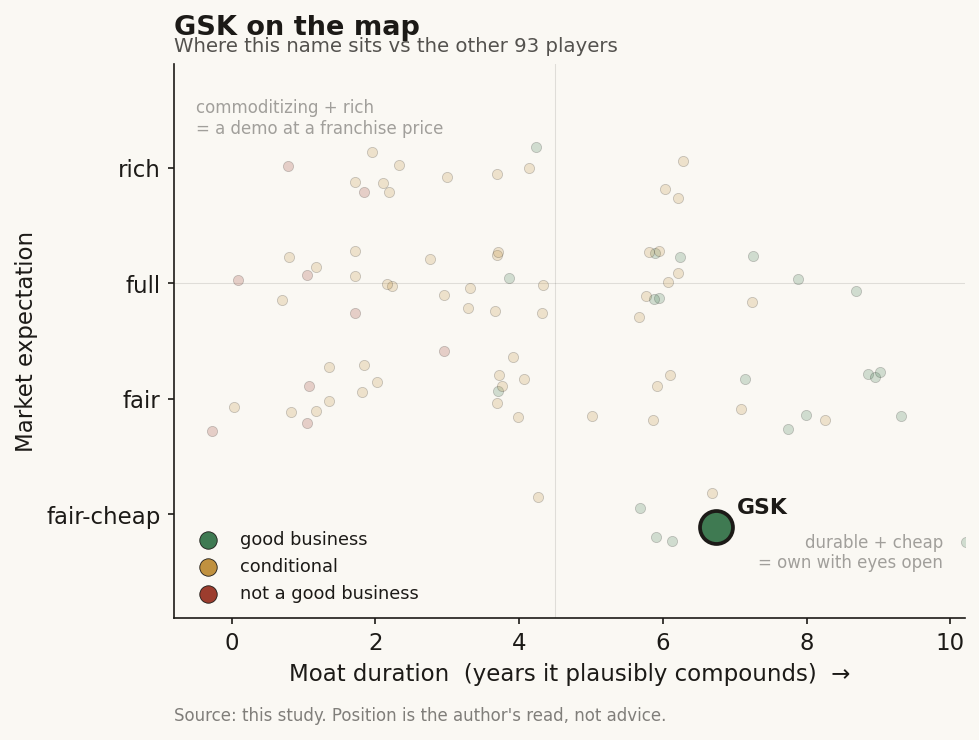

# GSK (GSK / NYSE (UK))

> **The read.** A cash-rich pharma incumbent that made one of the earliest AI-in-discovery bets in the industry (23andMe genetics from 2018, Cerebras wafer-scale compute from 2022) and has now moved to renting AI as a subscription (Noetik virtual cells, Jan-2026). Same archetype as the other incumbents: it funds the AI, structures the deals as cheap staged options, and keeps the drugs. But AI is immaterial to a ~32.7bn-pound-revenue company whose real problem is a late-decade HIV patent cliff. This is a pipeline-and-cliff bet with an AI efficiency call attached, not an AI story.

**Snapshot**

| | |
|---|---|
| Listing | GSK / NYSE (ADR); GSK / London (primary) |
| Region | UK / EU |
| Value-chain role | pharma incumbent - the funder / value-keeper of the drug-discovery AI chain |
| Archetype | diversified big-pharma; buys AI as tool + cheap option, owns the assets |
| Size | ~$106-107bn market cap (Jul-26); ADR ~$53-54 [reported] |
| Revenue (latest) | FY25 turnover 32.7bn pounds, +4% AER [disclosed] |
| AI relevance | small to the P&L today; strategic optionality + internal efficiency; early mover on genetics |
| Moat verdict | moderate - the moat is franchise/scale/distribution, not AI; capped by a late-decade cliff |
| Expectation | fair-to-cheap - priced for the cliff, not for AI |
| Evidence quality | high |

## What it is
A UK-headquartered diversified pharmaceutical and vaccines company, and one of the first big-pharma incumbents to wire AI and human genetics into its discovery engine. Its actual business is specialty medicines (HIV, oncology, respiratory/immunology), vaccines (Shingrix, Arexvy), and general medicines. AI matters to this study not because it moves the P&L - it does not, yet - but because GSK is an early, concrete instance of the archetype the whole case study turns on: the incumbent that licensed the genetic dataset, rented the compute, signed the AI-lab deals, and keeps the finished drugs, the trials, and the distribution for itself. New CEO Luke Miels took over 1-Jan-2026 [reported], inheriting a pipeline built partly to answer a 2028-29 HIV patent cliff.

## Business model - how it makes money
GSK sells patented medicines and vaccines it discovers, develops through its own clinical trials, manufactures, and distributes through its own global commercial machine. It captures value at every layer a pure-play AI lab does not touch: the ~40% Phase II efficacy wall (it runs the trials), regulatory approval, manufacturing scale-up, payer contracting, and a worldwide salesforce.

That is the key point of the case study. When GSK signs an AI-discovery deal, it structures it so the AI partner bears the discovery risk and gets paid in options or subscription fees, while GSK keeps the asset:

- **AI as a tool, not a product.** GSK does not sell AI. It uses AI and genetics to raise the odds a target is real, aiming (in its own framing) to roughly double discovery success rates by starting from human-genetic evidence.
- **The subscription turn (2026).** The newest deals are not "molecule for milestone" - they rent the platform. Noetik (Jan-2026) is a 5-year, $50m-upfront subscription-plus-fees arrangement for access to virtual-cell models, not an asset purchase. GSK becomes a *tenant* of the AI, paying like enterprise software [disclosed].
- **Capital-heavy where it counts.** The spend is trials, manufacturing, and commercial - plus large bolt-on M&A to backfill the cliff (IDRx ~$1bn Feb-2025; Boston Pharmaceuticals asset ~$1.2bn May-2025; Nuvalent ~$10.6bn) - not compute. Even the biggest AI commitment is small next to that.

## Financial summary
Top-line scale, with the AI/deal figures kept in proportion so the reader sees how small they are. GSK reports in pounds; conversions are approximate.

| Item | Figure |
|---|---|
| FY25 turnover | 32.7bn pounds, +4% AER (+7% CER) [disclosed] |
| - Specialty Medicines | 13.5bn pounds, +17% (Oncology +43%, HIV +11%) [disclosed] |
| - Vaccines | 9.2bn pounds, +2% [disclosed] |
| - General Medicines | 10.0bn pounds, -1% [disclosed] |
| FY25 core operating profit | 9.8bn pounds, +11% [disclosed] |
| FY25 core EPS | 172.0p, +12% [disclosed] |
| FY25 R&D spend | ~5.8-6bn pounds (increased YoY on oncology/vaccines) [reported] |
| FY25 free cash flow | ~4.0bn pounds [disclosed] |
| 2031 sales ambition | more than 40bn pounds [disclosed] |
| Market cap | ~$106-107bn (Jul-26) [reported] |
| **AI deal / capex figures (kept in scale)** | |
| 23andMe genetics | data-licensing collaboration from 2018; de-identified summary-level genetic + phenotypic data; extended over multiple years [disclosed] |
| Cerebras wafer-scale | epigenomic/gene-regulation model work from 2022 on a CS-1 (400,000-core wafer engine); trained EBERT in ~2.5 days vs an estimated 24 on a 16-node GPU cluster [disclosed] |
| Noetik (virtual cell) | 5-year, $50m upfront + milestones + annual subscription; non-exclusive OCTO-VC access for NSCLC + colorectal (Jan-2026) [disclosed] |
| Helix / GenoSphere | multi-year genomic + longitudinal data access for precision-medicine R&D (Jan-2026) [disclosed] |
| Tempus | one of 70+ multimodal-data customers signed in 2025 [reported] |

Scale check: the Noetik upfront ($50m, ~40m pounds) is ~0.1% of one year's turnover. Even a decade of stacked AI/data deals is a rounding error against ~5.8bn pounds of annual R&D and ~10bn pounds of core operating profit. AI is a strategic bet financed out of pocket change; the cliff-backfill M&A (Nuvalent ~$10.6bn alone) is ~100x the size of every AI deal combined.

## Value-chain position and competition
GSK sits near the top of the drug-discovery chain as a **funder and value-keeper**, and it got there early. Map the flows:

- **Money flows out** to genetic-data owners (23andMe, Helix), compute vendors (Cerebras, NVIDIA-class GPU), and AI platforms (Noetik) as data-licensing fees, subscriptions, small upfronts, and contingent milestones.
- **AI capacity flows in** three ways: (1) **licensed data** - human genetics from 23andMe and Helix to prioritise targets with genetic support; (2) **rented platforms** - Noetik's virtual-cell foundation models and multimodal data (Tempus), consumed like enterprise software; (3) **compute** - wafer-scale (Cerebras) and GPU for internal genomics/epigenomics models.
- **Finished drugs, trials, manufacturing, and distribution stay inside GSK.**

Competition for the *AI-funder* role is the other cash-rich incumbents doing the identical thing - Lilly, Novartis, and J&J signed Isomorphic; the same names fund Insilico, Recursion, Xaira, Noetik, and peers. The competitive fights that actually decide GSK's value are drug markets, not AI: HIV long-acting injectables against ViiV rivals and generics after the dolutegravir cliff, respiratory/immunology against biologics peers, and vaccines (Shingrix, RSV) against Pfizer/Merck. AI is a shared industry tool; the moat is the franchise.

## Moat
GSK's moat is real but narrower than the mega-cap incumbents' - and it is **not** an AI moat, which is the whole point.
- **Franchise + scale + distribution - MODERATE (~5-10 yr, cliff-capped).** Entrenched HIV (ViiV), vaccines (Shingrix), and a growing oncology/RI&I book, with the balance sheet to run any trial and buy any bolt-on. But a large share of HIV revenue faces loss of exclusivity around 2028-29, which caps the durable-compounding window unless the pipeline and M&A backfill land.
- **AI / genetics as a moat - WEAK, but the earliest-mover claim is genuine.** GSK's genetics-first thesis (start from human genetic causality, double the hit rate) is a real, differentiated *process* bet, and the 2018 23andMe deal and 2022 Cerebras work predate most peers. But the discovery models are commoditising (open clones caught the frontier within ~a year), the 23andMe dataset is licensed not owned (and 23andMe itself has been distressed), and the edge - to the extent it exists - is proprietary trial data plus the ability to run trials AI cannot, i.e. incumbency, not algorithms.

Net: a moderate, cliff-capped franchise moat; AI/genetics widens the funnel and may lift the hit rate but does not itself compound value. The real moat is the part of the chain the AI labs cannot reach.

## Core variables
1. **[CORE] The 2028-29 patent cliff vs pipeline + M&A backfill.** This is ~everything. Dolutegravir/HIV loses core exclusivity around 2028 (US) / 2029 (EU); the 40bn-pound 2031 ambition depends on long-acting HIV, oncology (Blenrep return, Nuvalent, ADCs), and RI&I filling the hole. AI does not move this needle in the forecast window.
2. **[CORE] R&D productivity - does genetics + AI actually lower cost-per-approved-drug?** The whole incumbent-AI thesis, and GSK's specific "double the success rate" claim. Watch whether genetically-supported and AI-sourced targets convert into real INDs and Phase progress, and whether the Noetik/virtual-cell approach measurably cuts Phase II attrition. Today this is unproven at the P&L level [unverified].
3. **[CORE] Deal conversion, not headline access.** The Noetik subscription and the genetics licences buy *capability*, not assets. What matters is whether that capability produces molecules that advance - and, because GSK keeps the asset and can stop paying, the downside is capped either way.

Below the line as noise: which specific AI lab or dataset "wins," GPU/wafer counts, and the AI-narrative framing generally. For a ~32.7bn-pound company, these are strategy line-items, not valuation drivers.

## Bear case / key risks
The bear case has almost nothing to do with AI. It is the cliff and the pipeline: a company whose HIV franchise - a large slice of profit - faces loss of exclusivity around 2028-29, betting that oncology (post-Blenrep-withdrawal-and-return, Nuvalent at ~$10.6bn), long-acting HIV, and vaccines refill the gap before generics bite. Add vaccine demand softness (Arexvy/RSV volatility, US policy on immunisation), US drug-pricing pressure, litigation overhang (Zantac historically), and integration risk on serial M&A. Any of these dwarfs anything AI could add or subtract.

On AI specifically the risk is the opposite of the pure-plays': not that GSK's AI fails, but that the early-mover genetics thesis - now ~8 years old - has still not visibly *lowered cost-per-approved-drug*, so the spend reads as narrative rather than productivity; or that a licensed/AI-sourced molecule hits the same ~40% Phase II wall everyone hits, in which case GSK simply stops paying and loses only a small subscription or upfront. The AI spend is not where a GSK investor loses money.

Falsification watch: (1) the 2028-29 cliff arrives faster/deeper than pipeline + M&A can offset and the 40bn-pound 2031 target slips - the actual thesis breaks here, AI irrelevant; (2) a genetically-supported or AI-sourced GSK molecule reaches pivotal success and materially de-risks a franchise - the one path where the decade-old genetics bet stops being a rounding error; (3) the virtual-cell/subscription model demonstrably cuts Phase II attrition - the only AI-specific efficiency worth watching.

## The expectation read
At ~$53-54 (ADR) and ~$106-107bn (Jul-26), GSK trades at a modest large-cap-pharma multiple - a discount to the mega-cap incumbents, reflecting the market's focus on the late-decade cliff and slower growth, not on AI. **Essentially none of that price is AI.** The genetics licences, the compute deals, and the Noetik subscription together commit well under 0.5% of annual revenue; they are financed out of free cash flow and structured so GSK's downside is a handful of small upfronts and cancellable subscriptions. The expectation embedded in the stock is that the pipeline and bolt-on M&A can hold the line through 2028-29 and reach 40bn pounds by 2031 - not that AI discovers the next blockbuster.

So the AI read is asymmetric and cheap: GSK pays option premiums and subscription fees, keeps every asset that works, and owes little if they do not. Whether AI/genetics "moves" a ~32.7bn-pound company: not in the numbers today, despite one of the industry's earliest bets. If it ever does, it shows up as *lower cost-per-approved-drug* and *lower Phase II attrition* over a decade - a slow margin tailwind that would also be the single best defence against the cliff - not a re-rating.

## Verdict
Good business, moderate moat - but the moat is the franchise, scale, and distribution, and it is capped by a 2028-29 HIV cliff, not by AI. GSK is a useful early-mover illustration of the case study's thesis: the incumbent licensed the genetics (2018), rented the wafer-scale compute (2022), signed the virtual-cell subscription (2026), and keeps the drugs, the trials, and the value. AI/genetics is a sensible, low-cost efficiency-and-optionality bet that is immaterial to the P&L and to the ~$106bn valuation today - and, uniquely for GSK, the one bet that could most directly cushion the cliff if the "double the hit rate" claim ever shows up in approvals. Confidence: HIGH on the facts (turnover, segments, deal terms, cliff timing all disclosed/reported and current); HIGH on the framing (AI is a tool/option here, the cliff-and-pipeline is the story); the genuinely open questions are variables 1 and 2 - whether the pipeline beats the cliff, and whether an 8-year-old genetics bet ever measurably lowers cost-per-approved-drug, both unobservable for years.
