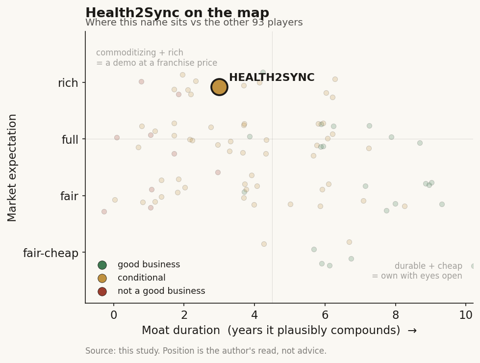

# Health2Sync (慧康生活科技, 7851 TT)

> **The read.** A real, differentiated business - the only listed TW chronic-disease DTx/data-platform, with genuine software margins and a growing Japan-export line - but pre-profit, softly/richly priced on 興櫃, and hinging on a single unproven 2026 NHI vote; the "1.6M-user data moat" is a scale story, not a defensibility story.

**Snapshot**

| | |
|---|---|
| Listing | 7851 TT · 興櫃 (TPEx Emerging Stock Board), 慧康生技*-KY, 登錄興櫃 2025-11-19 |
| Region | Taiwan (Cayman -KY structure) |
| Value-chain layer | L5-L6 - chronic-disease monitoring / RPM data-platform (L5 AI/analytics) + clinical-workflow DTx (L6 patient app + clinician dashboard) |
| Archetype | workflow-software / data-platform (B2B2C), with a nascent reimbursed-DTx leg |
| Size | ~NT$17.7-21.8bn (~US$0.55-0.68bn) - soft, thinly-traded print; ~67.69m shares outstanding |
| Revenue (latest) | FY2024 NT$128.5m; management guides +~50% in 2026 |
| Moat verdict | conditional - LOW-to-MODERATE; pharma/Japan-enterprise relationships are the only leg with real stickiness |
| Expectation | full/rich - ~140-170x trailing sales on a soft, low-float print |
| Evidence quality | low-to-med |

## What it is
慧康生活科技 (Health2Sync / H2 Inc. -KY) runs 智抗糖, Asia's largest diabetes-management app (~1.6-1.7M global users, ~180m health-data points since 2013/14) [reported], plus a cloud care platform and 易速胰 Insultrate - Taiwan's first TFDA-cleared Class-II digital-therapeutic (insulin-dose-adjustment SaMD, 2023) [disclosed]. It is a chronic-disease data platform that monetizes B2B2C - the patient uses the app free, someone else (pharma, employer, government) pays for the data/service layer around them.

## Business model - how it makes money
B2B2C - the diabetic patient never pays at scale; the payers are three institutional buyers [disclosed, H1'25 revenue mix]:
1. **Pharma partnerships ~40.4%** - Sanofi, Novo Nordisk, Abbott: app/device integration (e.g. Sanofi SoloSmart), co-developed SaMD, adherence/RWE programs. The largest and most durable line.
2. **NHI / government projects ~35%** - Taiwan NHI chronic-care programs + government wellness (e.g. Singapore DigiCoach w/ Abbott). Note: this is **project revenue today, NOT a standing per-use NHI payment code.**
3. **Medical-device / hardware sales ~22.1%** - glucose-data hardware, CGM integration.

**Japan 企業健保 (Kenpo)** is the breakout second-largest line - corporate-employee health programs (Hitachi, NTT, Mitsubishi Heavy wins; Sompo led an earlier round), doubling two years running [reported]. This is the one line growing OUTSIDE the TW NHI envelope.

The gross-margin profile is genuine software (~68.8%, below); the problem is not gross margin but operating scale vs opex. The load-bearing NHI dependence is prospective, not current: Insultrate's economics only step up if it wins a **standing NHI reimbursement code**, which management is pursuing **jointly with Sanofi, targeted 2026** [reported]. Today H2 earns NHI *project* money, not an NHI *DTx-service point value* - and under Ch6 no software-service code exists in Taiwan (rule 3), only 特材 point values; a pure-software DTx must clear the "diagnosis PLUS intervention that saves the NHI money" RCT gate (rule 2). Insultrate (dose adjustment → a downstream intervention) is better-positioned for that gate than a pure triage app, but the code does not exist yet.

## Financial summary
Public name, but disclosure is thin (興櫃 micro-cap). Real numbers only, tagged.

| Metric | FY2024 | Notes |
|---|---|---|
| Revenue | NT$128.5m | [disclosed via 財報/gbimonthly] |
| Pre-tax net loss | ~NT$146.8m | [disclosed] |
| EPS | ~-NT$12.21 | pre-listing low share count inflates the per-share loss; recent-4Q ~-NT$2.3 to -3.0 post-listing basis [reported] |
| Gross margin | ~68.8% | genuine software margin [reported] |
| Accumulated losses | >50% of paid-in capital | [disclosed] |

- **Market cap ~NT$17.7-21.8bn** (~US$0.55-0.68bn) - the figure swings across quote dates because 興櫃 is thinly traded and price is volatile (NT$26.60 on 2026-03-02 → NT$32.15 on 2026-07-03) [reported]. Treat the market cap as soft. **~67.69m shares outstanding** [reported].
- Company guides revenue **+~50% in 2026** and a targeted swing toward profit **"by end-2026"** [reported - management guidance, not a result].
- The ~68.8% gross margin is the structural contrast with Ever Fortune's ~12% (which carries a low-margin cloud-service leg).
- **Hospital AI centres** are not a Health2Sync financial line - the MOHW 3-centre program and hospitals are the evidence/adoption environment for the Insultrate NHI push, not a segment. H2 is the vendor. [framework]
- FY25 full-year figures are now disclosed (audited, Board-approved 2026-04-10) - see "Recent developments" below; segment margins remain [unverified] and the Japan-Kenpo revenue magnitude is [reported] without a hard number.

## Value-chain position and competition
Placed **L5-L6**: L5 = the AI/analytics layer on aggregated glucose/BP/diet/medication data (food-recognition, dose algorithms); L6 = the clinical-workflow / RPM surface (patient app + clinician dashboard + care-team loop). What flows: patient-generated + device (CGM/BGM) data → cleaned longitudinal chronic-disease dataset → (a) adherence/RWE + co-developed SaMD sold to pharma, (b) risk-stratified care programs sold to NHI/government/Japanese employers, (c) a reimbursed dose-adjustment DTx (Insultrate) if the NHI code lands. By product, the registration filing splits FY24 revenue into just two booked lines: the **智抗糖 app + platform/service layer = NT$93.1m (72.5%)** and **glucose hardware (meters, strips, CGM, insulin pens) = NT$35.4m (27.5%)** [disclosed, TPEx registration]; the cloud care-platform and Insultrate carry **no standalone revenue line yet** (both shown as "-"), so the DTx leg is pre-monetization on the tape, not just pre-code. Unlike the TW diagnostics-SaMD cohort (Ever Fortune, Acer Medical, Amcad) which sits L1-L4 upstream of any reimbursed dollar, H2 sits at the **workflow/data layer where the US L6 scribe/RPM archetype lives** - but in Taiwan that archetype is the structurally *disadvantaged* one (Ch6: no software-service code).

Competition:
- **vs TW pure-plays**: not a like-for-like competitor to the diagnostics-SaMD names (Ever Fortune 6841, aetherAI 7803, Acer Medical 6857, Amcad 4188) - those are imaging/pathology detect-and-refer; H2 is chronic-disease RPM/DTx. H2's nearest listed-cohort peer by *archetype* (workflow/data-platform) is thin; it is closer to a consumer-health-app-plus-B2B model than to a SaMD-license accumulator.
- **vs US players selling into TW**: the real competitive set is the global diabetes-DTx / RPM field - Livongo (absorbed into Teladoc), Omada, Welldoc (BlueStar, an FDA-cleared DTx), Dexcom/Abbott first-party apps. H2's defense against them in Asia is a large *local* installed base + local-language food/diet models + pharma relationships routed through Asia. A US DTx selling into TW hits the identical NHI gate H2 does, so H2's edge is distribution/localization, not a payment monopoly.
- **The Livongo precedent is the cautionary comp**: a scaled diabetes-RPM data platform can still fail to convert engagement into durable per-member economics (Teladoc's Livongo write-down). Scale of users ≠ scale of profit in this archetype.

## Moat
Ch5 applied, honestly:
- **User-data / installed-base = REAL scale, WEAK defensibility.** ~1.6-1.7M users / ~180m data points is the largest chronic-disease app dataset in Asia [reported] and gives a genuine cold-start advantage in local food/dose models. But a data-*scale* moat only compounds if it feeds an outcome-labeled flywheel a rival cannot replicate. Consumer glucose logging is **not proprietary the way a sequencing lab's clinico-genomic set is** - CGM makers (Dexcom/Abbott) own the richer first-party stream, and users multi-home. Real input advantage, thin durability.
- **NHI relationship = ABSENT as a moat today** - H2 earns NHI *project* revenue, not a standing DTx payment code; no HeartFlow/Edwards-style code lock-in exists. The Sanofi-partnered 2026 reimbursement bid, if it lands, would be the FIRST such code and a discrete re-rate - but it is unproven and, per Ch6, the TW savings-RCT gate is deliberately high.
- **TFDA Class-II clearance = table stakes, not a moat** (Ch5/Ch6 rule 6: TFDA lacks statutory PCCP; the clearance is a cost and a "first" bragging right, not a barrier).
- **Pharma relationships = the most defensible asset, but not ownable** - Sanofi/Novo/Abbott co-development and the Japan Kenpo enterprise contracts are real switching-cost-bearing relationships (integration depth, multi-year programs). This is closer to a genuine moat than the data claim, but it is a *commercial-relationship* moat (re-competable at renewal), not a structural one.
- **Honest TW pattern (same as the SaMD cohort):** the data moat is **real-but-not-investable at the equity line** - the richest chronic-disease data in TW is state-adjacent (NHI) and now opt-out-encumbered (Ch6 rule 5), and H2's own set is consumer-grade and multi-homed. **Estimated durable moat: LOW-to-MODERATE - the pharma/Japan-enterprise relationships are the only leg with real stickiness; the "1.6M-user data moat" is a scale story, not a defensibility story.**

## Core variables
The 2-3 that decide the thesis (noise excluded):
1. **The Insultrate NHI reimbursement decision (with Sanofi), targeted 2026 - the single binary re-rate.** Per Ch6, one 共同擬訂會議 vote is covered-nationwide or effectively unsellable at scale; H2 must clear the savings-RCT gate. A "yes" converts Insultrate from a bragging-rights clearance into a payment annuity and validates the whole DTx thesis; a "no"/delay leaves H2 a B2B data-services business. Watch the NHI 共同擬訂會議 agenda + any 特材/暫時性支付 vehicle.
2. **Japan Kenpo (企業健保) revenue trajectory - the export escape hatch from the ~7%-of-GDP NHI cap.** This is the one line growing outside the capped TW envelope, doubling two years, with Hitachi/NTT anchor logos and a Sompo tie. Whether it durably becomes the #1 line (and at what margin) is the growth case that does NOT depend on the TW NHI vote. Track Japan revenue share and contract count.
3. **Path to the guided 2026 profit swing / cash runway.** FY24 lost ~NT$146.8m on ~NT$128.5m revenue with accumulated losses >50% of capital; the +50% 2026 revenue guide and end-2026 profit target are unproven. The variable is whether the ~69% gross margin scales over opex before the Series-C cash is consumed. Track quarterly opex vs revenue and the cash balance.

Noise (excluded): individual pharma-integration announcements; the 2026 supplement/consumer-product line (a distraction from the DTx/data thesis, not the equity driver); single-market app-download milestones.

## Bear case / key risks
Strip the "Asia's largest diabetes app / first TFDA DTx" labels and FY24 is a **NT$128.5m-revenue business losing more than it earns (~NT$147m pre-tax loss), with accumulated losses past half its capital**, freshly parked on the thinly-traded 興櫃 where a NT$17.7-21.8bn "market cap" (~140-170x trailing sales) is a soft, low-float print, not a liquid valuation. The headline moat - 1.6M users - is a *scale* claim in an archetype (consumer chronic-disease RPM) where Livongo already proved scale doesn't equal durable per-member profit, and where CGM makers own the richer first-party data and users multi-home. The reimbursement thesis rests on a **single, unproven, deliberately-high-gated NHI vote in 2026** that must clear a savings-RCT and for which no TW software-service payment vehicle even exists (Ch6 rules 2-3) - and even a win is one code, inside a zero-sum global budget. The genuinely growing line (Japan Kenpo) is real but early, relationship-based, and re-competable. Falsification of the bull: (a) the Insultrate NHI code lands AND is priced at scale, AND (b) Japan revenue durably compounds past the TW base AND the ~69% gross margin drops through to an operating profit before cash runs - none of which is yet in the disclosed numbers.

## The expectation read
At ~NT$17.7-21.8bn on ~NT$128.5m trailing revenue, the tape is carrying H2 at roughly **140-170x trailing sales** - a full-to-rich multiple that only makes sense if the market is pricing (a) the Insultrate NHI reimbursement code landing and being priced at scale, and (b) the Japan Kenpo line compounding into the #1 revenue driver with the ~69% gross margin dropping through to operating profit. Both are prospective and unproven; neither is in the disclosed numbers. The softest part of that belief is the reimbursement leg - it is a single, deliberately-high-gated 2026 vote against a payment vehicle that does not yet exist - while the multiple itself is a thin, low-float 興櫃 print rather than a liquid valuation, so the "market belief" it encodes is itself soft.

## Recent developments (2025-2026)
The 興櫃 listing (2025-11-19) forced disclosure, so several items previously tagged [unverified] are now hard numbers. Coverage is still thin - the only regular public data is a monthly consolidated-revenue line plus the annual report - but the FY25 audited set and the 2026 monthly tape change the read at the margin.

- **FY2025 audited results are out (Board-approved 2026-04-10) [disclosed].** Revenue **NT$178.6m**, up **~39%** from FY24's NT$128.5m - the fastest growth year on record, though short of the "+~50%" management guide. Gross margin **~64.2%** (NT$114.7m gross profit) - still genuine software-grade, a touch below FY24's ~68.9%. Operating loss **NT$145.2m**; pre-tax loss **NT$119.6m**; net loss **NT$119.7m**, the loss **narrowing ~18-19%** vs FY24's ~NT$146.9m. Basic **EPS -NT$2.52** (vs -NT$12.21 FY24; the per-share loss shrinks mostly on the higher post-raise share count, not a profit inflection). **No dividend** declared.
- **The balance sheet flipped positive at listing [disclosed].** FY25 period-end equity attributable to the parent is **+NT$257.9m** (total assets NT$319.7m, total liabilities NT$61.9m), versus the pre-listing filing's **negative** equity (accumulated deficit past capital, debt ratio ~237%). The swing is mechanical - pre-IPO preferred/convertible instruments that IFRS parked in liabilities converted to equity on listing - not an operational turnaround, but it removes the "negative-net-worth" optics the older financials carried.
- **Market-cap reconciliation (correction) [estimate].** At **~67.69m shares x ~NT$31-32** the market cap is **~NT$2.1-2.2bn (~US$0.07bn)**, not the NT$17.7-21.8bn carried in the snapshot above (that figure looks like a ~10x units artifact). On the audited FY25 revenue that is roughly **~12x trailing sales**; on FY24 revenue ~17x - full for a loss-maker but an order of magnitude below the "140-170x" implied by the stale cap. On book it is **~8x P/B** (BVPS ~NT$3.81). Treat the earlier cap/sales-multiple lines as superseded by this reconciliation; the *direction* of the call (richly priced, thin float) stands, the *magnitude* does not.
- **The 2026 monthly tape is running BELOW the growth story [disclosed].** Consolidated revenue is lumpy and project-timed: Jan -22.1%, Feb +28.9%, Mar -67.3%, Apr -42.5%, May +6.7% YoY; **Jan-May 2026 cumulative NT$46.5m is -38.6% vs the NT$75.7m prior-year period.** The prior-year base was inflated by a large Q1'25 project (Mar'25 alone was NT$35.4m), so the YoY collapse overstates deterioration - but a first-five-months run-rate down ~39% is hard to reconcile with a "+50% FY26" guide without a heavy H2 back-load. This is now the single most watchable disclosed series.
- **Japan (Kenpo) is being funded and named [reported].** The Japanese subsidiary SYNCHEALTH LTD. approved a cash capital increase (2026-02-26, up to ~JPY 306.8m) to fund the corporate-health-insurance push. Named enterprise/municipal wins now include **Osaka City, Yokohama City, Mitsubishi Heavy, and Kirin Group** alongside the earlier Hitachi/NTT logos - concrete, but still no disclosed Japan revenue figure.
- **Reach and the RWE case [reported].** User base cited at **~1.7m members / ~180m data points** across Taiwan, Japan, Singapore and Australia. Management's headline clinical proof point for the NHI bid: 智抗糖 users reach a **66% HbA1c control rate vs a ~44% national average** - the "saves the payer money" evidence the Taiwan savings-RCT gate demands. National Development Fund (國發基金) is disclosed as a backer that helped the Japan entry.
- **Insultrate NHI reimbursement: still pending, still the binary [reported].** No 2026 vote or payment vehicle has landed as of this writing; management continues to frame the Sanofi-partnered bid as targeting per-use NHI payment (論件計酬) and still guides a possible profit swing "as soon as H2 2026." Nothing in the disclosed FY25 numbers or the 2026 monthly tape yet reflects a reimbursement dollar - the re-rate remains prospective.
- **Pipeline/product markets are widening [reported].** Beyond Taiwan/Japan the company has pushed 智抗糖 into Korea (as SugarGenie), the Middle East (Arabic support, a Sanofi-led Egypt program), and launched an **8-week CGM weight-loss program (2025)** aimed at the pre-diabetic / "sub-healthy" population - a deliberate move up the funnel from diagnosed diabetics toward a larger addressable base. These are distribution milestones, not yet revenue lines.

Net: the listing-forced disclosure is mildly reassuring on growth (FY25 +39%, loss narrowing, positive equity) and clarifies that the valuation is ~12x sales, not triple-digit. But it also exposes a soft 2026 start (-38.6% cumulative through May) that sits awkwardly against the +50% guide, and confirms the DTx/reimbursement leg is still pre-revenue and pre-code. Coverage remains thin - a monthly revenue print and one annual report - so the thinness itself stays part of the finding.

## Verdict
**Good business, conditionally** - real and differentiated (the only listed TW chronic-disease DTx/data-platform, genuine ~69% software margins, a real Japan-export growth line), but pre-profit, richly/softly priced on 興櫃, and hinging on a single unproven 2026 NHI vote; the "1.6M-user data moat" is a scale story, not a defensibility story. The pharma + Japan-enterprise relationships are the only leg with real stickiness; the NHI-reimbursement re-rate is a binary catalyst, not a base case. **Data confidence: LOW-to-MEDIUM.** Listing date, FY24 revenue/loss, gross margin, the H1'25 revenue mix, users/data scale, backers, and the Sanofi-NHI-2026 plan are cross-checked across 財報/gbimonthly/INSIDE/Digitimes; but market cap is a soft thinly-traded print, FY25 full-year figures and segment margins are [unverified], and the Japan-Kenpo revenue magnitude is [reported] without a hard number - coverage on this 興櫃 micro-cap is genuinely thin, and that thinness is itself the finding.
