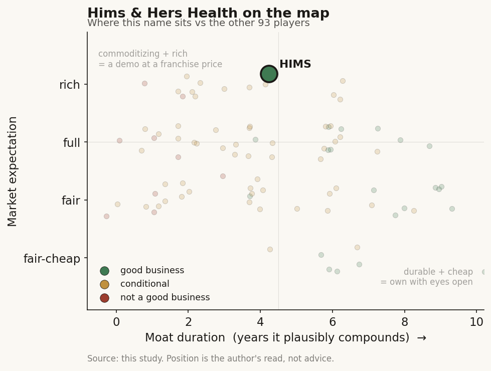

# Hims & Hers Health (HIMS / NYSE)

> **The read.** A genuinely good consumer business - a profitable, cash-generating subscription brand - wearing an AI-and-data-flywheel story that is still mostly narrative. The subscriber engine is real; MedMatch is a plausible retention aid, not yet a proven, defensible data moat. Priced for both to be true.

**Snapshot**

| | |
|---|---|
| Listing | HIMS / NYSE |
| Region | US |
| Value-chain layer | consumer-facing - DTC telehealth + pharmacy fulfillment |
| Archetype | subscription brand (recurring consumer-health membership) with an AI-personalization layer bolted on |
| Size | ~$8.5bn market cap (2-Jul-26) [reported] |
| Revenue (latest) | Q1'26 $608.1m, +4% YoY; FY26 guide $2.8-3.0bn [disclosed] |
| Moat verdict | conditional - real brand/subscription moat; data-flywheel unproven |
| Expectation | full-to-rich |
| Evidence quality | high on financials, medium on the AI claims |

## What it is
A direct-to-consumer telehealth and pharmacy brand. A customer answers an online intake, a licensed provider on the platform issues a prescription where appropriate, and a fulfillment/pharmacy operation ships the treatment on a recurring subscription. The original wedge was stigmatized, cash-pay men's categories (hair loss, ED); it has since expanded into women's health, dermatology, mental health, and - the swing factor of the last two years - weight loss / GLP-1s. It sits at the consumer-facing layer of the chain: it owns the customer relationship and the fulfillment, and buys the actual drugs and APIs from upstream manufacturers.

## Business model - how it makes money
One engine: recurring subscriptions.

- **Subscription revenue.** ~2.58m subscribers (Q1'26, +9% YoY), at ~$80 monthly online revenue per subscriber (down from $85) [disclosed]. Cash-pay, no insurance-reimbursement gate - the customer pays directly, which is why gross margins can look software-like (65% in Q1'26) even though a physical drug ships every month.
- **Growth is marketing-fed.** The model runs on paid acquisition: Q1'26 marketing spend was $222.0m, roughly 37% of revenue [disclosed]. Retention is therefore the whole game - a subscriber has to stay long enough to earn back that acquisition cost. This is exactly where MedMatch is pointed.
- **The GLP-1 swing.** Weight loss went from a growth rocket to a margin and revenue-recognition problem inside twelve months. The compounded-semaglutide loophole (legal only during an FDA shortage) closed when the FDA declared the shortage resolved in Feb-2025; the model then had to pivot to branded, manufacturer-supplied GLP-1s at far lower gross margin. That mix shift is the main reason gross margin fell from 73% (Q1'25) to 65% (Q1'26) and why Q1'26 swung to a $92.1m net loss despite $128.4m FY25 net income [disclosed].

**Cash quality.** Genuinely good, and this is the strongest part of the story. FY25 net income $128.4m, adjusted EBITDA $318m, and the company generates free cash flow ($53.0m in Q1'26 even through the loss quarter) [disclosed]. It is not a cash-burning platform pretending to be a business - it is a real business absorbing a one-off category reset.

## Financial summary

| | FY25 | Q1'26 | FY26 guide |
|---|---|---|---|
| Revenue | $2.35bn | $608.1m | $2.8-3.0bn |
| Revenue growth | +59% | +4% YoY | ~19-28% |
| Subscribers | 2.51m | 2.58m (+9% YoY) | - |
| Monthly rev / subscriber | $83 | $80 | - |
| Gross margin | ~73% (early-25 run-rate) | 65% | - |
| Adjusted EBITDA | $318m | $44.3m | $275-350m |
| GAAP net income | $128.4m | -$92.1m | - |
| Marketing spend | - | $222.0m (~37% of rev) | - |
| Cash + short-term investments | - | ~$751m | - |

Figures as of Q1'26 report; price/market cap 2-Jul-2026 [reported/disclosed].

## Value-chain position and competition
HIMS owns the consumer-facing layer - demand generation, the intake/telehealth workflow, the subscription relationship, and fulfillment - and rents everything upstream. It does not discover, manufacture, or (for branded GLP-1s) even meaningfully mark up the molecule; the drug economics belong to the manufacturer. Its asset is the customer list, the brand, and the behavioral/clinical data those customers generate.

Competition is intensifying from every direction at once:
- **Telehealth peers:** Ro, LifeMD, Teladoc - all now co-branded GLP-1 channels for Novo Nordisk and/or Lilly, i.e. HIMS's differentiation on weight loss is being commoditized by the same manufacturer deals it now depends on.
- **Retail/platform entrants:** Amazon One Medical and Amazon Pharmacy, Costco via Sesame, WeightWatchers via Amazon Pharmacy - distribution giants with lower customer-acquisition cost.
- **The manufacturers themselves:** Novo's own NovoCare and Lilly's LillyDirect sell direct, disintermediating the telehealth middle layer entirely.

The Novo saga is the tell on power in the chain: an April-2025 partnership, a June-2025 termination with Novo publicly accusing HIMS of "illegal mass compounding," a patent suit, then a March-2026 settlement/new deal under which HIMS sells branded Wegovy/Ozempic and largely stops marketing compounded versions. HIMS ended up a licensed reseller, not a peer.

## Moat
Two very different moats, and only one is proven:

- **Brand + subscription + fulfillment - REAL (~3-5 yr, eroding at the edges).** HIMS has genuine consumer brand equity, a low-friction recurring purchase, and scaled fulfillment. That is why it is profitable and cash-generative. But it is a marketing-and-execution moat, not a structural one - it must be re-bought every quarter with $200m+ of paid acquisition, and it does not stop Amazon or the manufacturers from underpricing it.
- **The data flywheel (MedMatch) - PLAUSIBLE, NOT YET PROVEN (~0-3 yr of demonstrated edge).** The claim: AI/ML trained on millions of anonymized visits (demographics, treatment types, outcomes) recommends better-matched treatments, cutting wait times and lifting retention. If true and compounding, it is the one thing that could turn a marketing moat into a data moat - lower churn means each acquired subscriber is worth more, which funds more acquisition, which grows the dataset. The problem: the disclosed benefits (cited retention/wait-time lifts) are company figures from a beta, not audited or independently reproduced; there is no FDA-cleared algorithm; and the underlying data (self-reported intakes for largely lifestyle/cash-pay conditions) is thinner and less outcome-anchored than, say, a genomics or imaging dataset. It is a real capability under construction, not yet a demonstrated barrier.

Net: the durable moat today is brand/subscription economics. The data-network moat is the bull thesis, and it is still a hypothesis.

## Core variables
1. **Retention / churn (does the flywheel actually turn?).** With ~37%-of-revenue acquisition spend, lifetime value is set by how long subscribers stay. This is the single number that decides whether MedMatch is a real moat or a nice feature. Watch monthly-revenue-per-subscriber (fell $85 to $80), subscriber growth (decelerating to +9%), and any hard, sustained, independently-visible retention improvement attributable to personalization.
2. **GLP-1 mix and margin normalization.** Can HIMS re-grow weight loss on branded, lower-margin supply while getting gross margin back up (65% and falling)? The FY26 guide implies a recovery; the bear says branded GLP-1s are a low-margin, undifferentiated reseller business that the manufacturers can reclaim.
3. **The AI investment actually converting.** An ex-Cruise AI CTO (Mo Elshenawy) and a large slug of the ~$870m 0% convertible (due 2030) earmarked for "AI in healthcare" and global expansion. The variable is whether that capital produces a defensible capability (a proprietary personalization/diagnostics engine that measurably lowers churn or CAC) versus funding headcount and an AI narrative. So far it is spend and hiring, not yet disclosed return.

Below the line as noise: individual category launches, celebrity-marketing headlines, and the quarter-to-quarter "AI" language on calls.

## Bear case / key risks
A high-multiple consumer marketing business whose best growth story (weight loss) has been simultaneously commoditized and margin-compressed, dressed in a data-moat narrative that is not yet demonstrated. Growth collapsed to +4% YoY in Q1'26 and the quarter was loss-making; gross margin is down 8 points; the company is now a licensed reseller of the manufacturers' GLP-1s, competing head-to-head with Ro, LifeMD, Amazon, and the manufacturers' own direct channels on price and convenience. Customer acquisition cost is structurally high and rising as entrants pile in. MedMatch's cited benefits are unaudited beta figures; there is no FDA-cleared algorithm and no independent evidence the data flywheel lowers churn enough to matter. The convertible adds leverage/dilution to fund an AI bet whose payoff is unproven.

Falsification watch: (1) subscriber growth keeps decelerating and rev-per-subscriber keeps falling - the flywheel is not turning; (2) gross margin fails to recover off the branded-GLP-1 reset - the mix is permanently dilutive; (3) a manufacturer or Amazon underprices HIMS on GLP-1s and take rate erodes - the consumer moat was rented all along.

## The expectation read
Shares ~$36.80, market cap ~$8.5bn on ~231m shares (2-Jul-26) [reported]. That is roughly 3x FY26E sales - not a screaming software multiple, but a full one for a marketing-driven consumer-health reseller growing ~4% in the latest quarter with a compressing margin. The multiple embeds a recovery: that FY26 growth reaccelerates toward the ~19-28% guide, that gross margin normalizes off the GLP-1 reset, and - the real premium - that the AI/data personalization layer converts a rented brand moat into a structural data moat that durably lowers churn.

Where the belief looks soft: the near-term numbers (deceleration, margin compression, loss quarter) point the other way, and the load-bearing AI thesis rests on company beta figures rather than proven, independently-visible retention economics. The market is paying today for a data flywheel HIMS has described but not yet demonstrated.

## Verdict
Good business, real (but rented) moat - a profitable, cash-generative subscription brand, which is more than many AI-story names can claim. But the AI/data-flywheel that justifies the premium is still marketing more than proven capability: MedMatch is a plausible, under-construction personalization engine, not an FDA-cleared algorithm or a demonstrated churn-lowering moat, and the disclosed benefits are unaudited beta numbers. So the expectation is demanding: fair if the flywheel turns and margins normalize, rich if either fails. Confidence: HIGH on the financials and competitive facts (all disclosed/current); MEDIUM on the verdict, which hinges on retention data that is not yet public and an AI payoff that is spend-today, prove-later.
