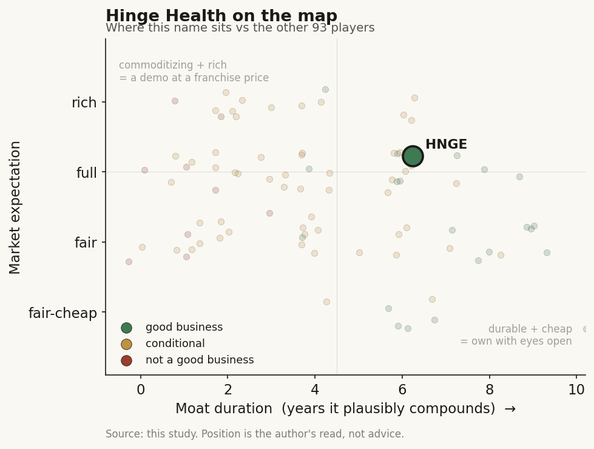

# Hinge Health (HNGE / NYSE)

> **The read.** A genuinely good business - 85% gross margin, self-funding, real cash flow - wearing a "computer-vision AI" story that is mostly a labor-arbitrage automation engine, not a defensible algorithm. The moat is the enterprise distribution and the 3,000-client contract book, not the motion tracking. Priced for durable 25-35% compounding, which the numbers currently support but competition and engagement yield can erode.

**Snapshot**

| | |
|---|---|
| Listing | HNGE / NYSE |
| Region | US |
| Value-chain layer | Application - digital MSK care delivery (employer/health-plan channel) |
| Archetype | care-delivery platform (software + wearable + human care team, sold per engaged member) |
| Size | ~$6.9bn market cap (6-Jul-26) |
| Revenue (latest) | Q1'26 $182m, +47% YoY; FY26 guide $798-804m (~36%) |
| Moat verdict | conditional - distribution + data moat real, motion-AI is a feature not a barrier |
| Expectation | full |
| Evidence quality | high |

## What it is
A digital clinic for musculoskeletal (MSK) pain - back, knee, joint, and now migraine. A member does guided exercise-therapy at home through an app; a camera-based system watches the movement and coaches form; a wearable nerve-stimulation device (Enso) delivers drug-free pain relief; a remote human care team (physical therapists, health coaches) supervises. The pitch to the buyer is simple: replace expensive in-person PT and unnecessary surgery with a cheaper, scalable, at-home program, and only get paid when a member actually engages. It is an Application-layer care-delivery business, not a diagnostics or drug-discovery play.

## Business model - how it makes money
One engine, sold through an unusual channel:

- **Who pays.** Employers and health plans, not patients. The majority of clients are reached *through* health plans (Blue Cross entities, Elevance, Aetna), so Hinge's fee is embedded in medical spend rather than a discretionary HR budget - better collections, stickier billing.
- **How it is priced.** Roughly 80% of contracted lives are on **engagement-based pricing**: the client pays for *engaged* members, not all covered lives, with a portion of fees **at-risk** against outcome guarantees (ROI, surgery avoidance). This is the honest version of value-based care - it aligns Hinge with the buyer but caps revenue at the participation rate.
- **The yield problem is the whole model.** Of ~20m+ contracted lives, only ~4% engage in a given year ("yield slightly north of 4%" for 2026). Management targets a long-run 9-15%. Revenue = contracted lives x yield x price. Growth therefore comes two ways, and management says the 2026 raise was "approximately half yield improvements, half lives growth." Every point of yield is leverage; every point of churn is drag.

**Growth quality.** Q1'26 revenue +47%, FY26 guide ~36% - decelerating from the 50%+ IPO-year print but still fast. LTM calculated billings $770m (+52%) run ahead of revenue, which is a genuine forward-demand signal, not an accounting flatter. ~3,000 clients, 60+ health plans/PBMs/TPAs. This is real enterprise traction, not a promo cohort.

**Incremental economics - the surprise.** Unlike most digital-health names, this one already converts. Q1'26 non-GAAP operating income $46m (25% margin), free cash flow $42m (23% margin), gross margin 85% (up from 81%). FY25 free cash flow $179.6m. The business self-funds and is buying back stock ($105m in Q1'26, 2.5m shares) - unusual for a company one year post-IPO. The GAAP loss is the only ugly line, and it is IPO mechanics, not operations (see below).

## Financial summary

| | FY24 | FY25 | Q1'26 | FY26 guide |
|---|---|---|---|---|
| Revenue | $390.4m | $587.9m | $182m | $798-804m |
| Revenue growth | +33% | +51% | +47% YoY | ~36% |
| GAAP gross margin | 77% | 80% | 85% | - |
| Non-GAAP operating income | -$26.1m | $119.5m | $46m | $205-215m |
| GAAP net income (loss) | - | -$528.3m | +$32.1m (Q4'25) / positive | - |
| Free cash flow | - | $179.6m | $42m | - |
| Cash and investments | - | $478.8m | $407m | - |
| Calculated billings (LTM) | $468m | $671.4m | $770m | - |
| Diluted shares | - | - | 82.4m | 82-84m |

Prices/figures as of the Q1'26 (May-2026) report and 6-Jul-2026 quote unless tagged. The FY25 GAAP net loss of -$528.3m is dominated by one-time IPO-triggered stock-based compensation, not cash burn - the same year produced +$179.6m of free cash flow and Q4'25 GAAP net income of +$32.1m.

## Value-chain position and competition
Hinge sits at the **care-delivery Application layer**: it does not make the sensors, the phones, or the models it runs on - it assembles a camera (the member's own phone), a commodity nerve-stim wearable, a software wrapper, and a human care team into a packaged clinical service, then sells it through the payer channel. The value it captures is the *bundling and the distribution*, not any single upstream component.

Competition:
- **Sword Health (private, the direct twin):** same digital-MSK model, similar payer channel, arguably better AI positioning - Sword's "Predict" engine mines claims data to flag surgery risk *before* a consult. The head-to-head is real and Sword is well-funded; this is the clearest "the profitable model is not unique" threat.
- **Omada Health (also 2025 IPO), Kaia, Vori, RecoveryOne:** peer-reviewed comparisons put several of these in the same effectiveness band, which is exactly the replicability worry.
- **The buyer itself:** payers and large providers can build or white-label a competing program; the S-1 flags the risk that the offering could be "copied with ease" leading to margin compression.

Edge: the enterprise contract book (~3,000 clients, embedded in medical spend, multi-year), the Enso hardware/FDA differentiation, and a data asset from ~25m+ annual guided sessions. That distribution and data loop is the moat - not the motion tracking.

## Moat
Two candidate moats; only one holds.

- **Distribution + embedded-contract moat - REAL (~5-8 yr).** 3,000 clients, 60+ health-plan/PBM relationships, fees embedded in medical spend, multi-year terms, 40-100 day implementations. Switching a member population between MSK vendors is disruptive and slow. This is the durable barrier. Caveat: contracts are terminable "for convenience," and revenue concentrates (2024: three payers were 17% / 14% / 12% of revenue), so the moat is wide but not locked.
- **Motion-AI / computer-vision moat - REFUTED as a barrier (~0 yr).** The "TrueMotion" computer-vision motion tracking (from the 2021 wrnch acquisition) is a genuine capability, but its function is **labor arbitrage, not defensibility**: it lets ~438 care-team staff supervise ~57,750 sessions each per year versus ~2,640 for a human PT - "reduces care-team hours ~95%." That is a cost-structure advantage that shows up in the 85% gross margin, and it is valuable. But phone-camera pose estimation is not proprietary at the frontier - competitors have their own, and off-the-shelf models close the gap. It is a feature that funds the margin, not a wall that stops entry.

Net: the durable moat is the payer distribution and the data/contract book; the motion AI is the margin engine, not the barrier. Estimated durable-compounding duration ~5-8 years, contingent on yield rising toward the 9-15% target faster than competition compresses price.

## Core variables
1. **Engagement yield trajectory.** The single most important number. ~4% today, 9-15% long-run target. Revenue = lives x yield x price, and roughly half of the 2026 raise came from yield. If yield stalls near 4-5%, the growth story caps out well below the bull case; if it climbs, the same contract book compounds without new sales.
2. **Competitive price/margin durability.** 85% gross margin and 25% operating margin are the crown jewels. Sword, Omada, and payer-built alternatives all pressure both price and yield. The bear thesis is margin compression as the category commoditizes - watch gross margin and net revenue retention for the first crack.
3. **Category/program expansion (Enso migraine, new MSK-adjacent conditions).** FDA 510(k) for Enso in migraine, 125+ clients / 2m+ eligible lives adopted within weeks, revenue "meaningful in 2027." This is the optionality that justifies a premium multiple - but it is a promise, not yet revenue.

Below the line as noise: lifetime-member vanity counts (1.5m+); the "agentic AI / true-SaaS" framing on calls; Hinge Select provider-location count; quarterly buyback mechanics.

## Bear case / key risks
A very good business at a price that already assumes the good case continues. Growth is decelerating (50%+ to ~36% guide) and rests on a 4% engagement yield that must roughly double-to-triple to hit the long-run target - an unproven behavioral outcome, not a contracted one. The differentiator marketed as an AI moat (computer-vision motion tracking) is a cost-saving feature that rivals also have, so the real barrier is distribution, and distribution can be attacked by a well-funded direct twin (Sword), by IPO peers (Omada), and by the payers themselves, whose contracts are terminable for convenience and concentrated in a handful of names. Peer-reviewed work puts several competitors in the same effectiveness band, feeding the "copied with ease" risk the company's own S-1 flags. If yield stalls or price compresses, the 85% gross margin and 25% operating margin - the entire reason for the multiple - come down together.

Falsification watch: (1) engagement yield flatlines near 4-5% over 2026-27 - the compounding story breaks; (2) gross margin or net revenue retention rolls over as competition bites; (3) a marquee payer contract (17%-of-revenue class) terminates for convenience; (4) Enso migraine and new-condition expansion fail to convert eligible lives into 2027 revenue.

## The expectation read
Shares ~$89, market cap ~$6.9bn (6-Jul-26), against ~$800m of FY26 revenue - roughly 8-9x forward sales, near a 52-week high (range $30-90). At ~25% forward operating margin, that is a full price that assumes: yield keeps climbing toward the 9-15% band, the 85% gross margin holds against Sword/Omada/payer competition, and program expansion (migraine, adjacent conditions) opens the next leg of growth. In its favor - and unlike most of this cohort - the cash economics are already real: positive free cash flow, self-funding, buying back stock. The market is not paying for a promise of profitability; it is paying for durability of a profitability that already exists.

Where the belief looks soft: the "AI moat" doing narrative work is really an efficiency feature, so the defensibility case rests on distribution that a funded competitor is actively contesting; and the growth math depends on an engagement yield that has to more than double on member behavior the company does not fully control.

## Verdict
Good business, real moat - but the moat is the payer distribution and the contract/data book, **not** the computer-vision motion tracking that carries the AI story. The motion AI is a genuine capability deployed as labor arbitrage (it is why gross margin is 85%), not a defensible algorithm a rival cannot build. Priced full: the market is paying for durable 25-35% compounding of an already-profitable, cash-generative franchise, which the current numbers support but which competition (Sword, Omada, payer build) and an unproven engagement-yield ramp can erode. Confidence: HIGH on the facts (revenue, margins, cash flow, yield, guidance all disclosed and current); MEDIUM on the verdict, which turns on two unproven rate-of-change variables - yield trajectory and margin durability under competition.
