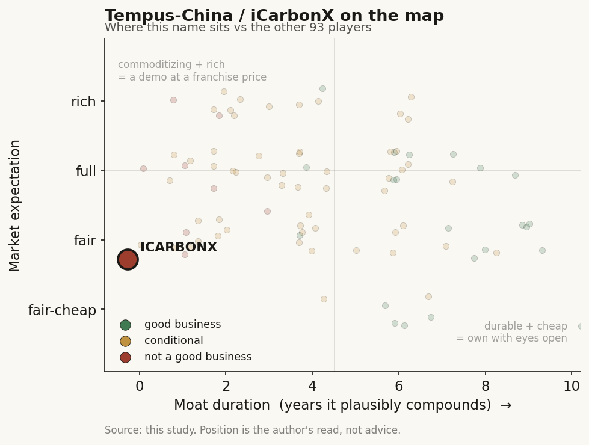

# Tempus-China / iCarbonX (private (China))

> **The read.** The China data-platform analogue to Tempus by ambition, but the opposite by outcome - a 2016-vintage multi-omics "digital life" unicorn whose $1bn-plus mark has never been re-tested, whose consumer data engine never converted to revenue, and which cut ~40% of staff by 2019 with the founder reportedly mortgaging his home for payroll. The thesis (own the person's full biological data, sell the platform) is the same as Tempus's data leg; the execution and the disclosure are both far thinner. Not investable as a value-capturer today - a stale mark on a paused platform.

**Snapshot**

| | |
|---|---|
| Listing | private (no traded stub; China-domiciled, never IPO'd) |
| Region | China (ex-US, ex-Taiwan) |
| Value-chain layer | L5 - AI multi-omics / health-data platform (consumer-facing "digital life" version of the diagnostics-plus-data node) |
| Archetype | data-platform (aspired): own each user's multi-omics profile, sell platform access to pharma / hospitals / providers |
| Size | ~$1bn+ valuation at 2016 Series A [reported]; NEVER re-marked publicly since - treat as stale, not current |
| Revenue (latest) | negligible / undisclosed; consumer self-test revenue reported under RMB200k, <1,000 paying users [reported] |
| Moat verdict | commoditizing / unproven - the data flywheel never reached escape velocity |
| Expectation | unknowable (no clean market price; the last mark is ~a decade stale) |
| Evidence quality | low (private China name, no filings, no recent primary disclosure; latest hard reporting is 2019-2020) |

## What it is
A Shenzhen multi-omics and AI health-data company founded October 2015 by Jun Wang (王俊), the former CEO of BGI (Beijing Genomics Institute) [disclosed]. The stated vision is "digital life" (数字生命): fuse each person's genome, metabolites, gut/skin microbiome, proteins, phenotype, behavior, and lifestyle into one continuously-updated digital model of the individual, then use AI over that data to manage health, predict disease, and feed drug discovery [disclosed]. It is the consumer-front, whole-person version of the same L5 idea Tempus runs from the clinical-lab side - collect deep biological data on a population, then sell the platform on top. Backed by Tencent as lead Series-A investor [disclosed]. It reached "unicorn" status roughly six months after founding - one of the fastest $1bn marks in Chinese healthcare at the time [reported].

## Business model - how it makes money
The intended model was a data-platform annuity: (a) sell consumers a paid multi-omics test-and-tracking package (the "觅我 / Meum" app, tiered from ~1m to ~10bn data points per user) to bootstrap a proprietary, longitudinal, multi-omics population dataset; then (b) monetize that dataset by selling platform access and insights to pharma, hospitals, insurers, and providers, plus a partner network (the "Digital Life Alliance," launched January 2017 with SomaLogic, PatientsLikeMe, AOBiome, HealthTell, GALT, Imagu, Robustnique) [disclosed]. In archetype terms this is the same "sell the data, let the buyer bear the risk" logic as Tempus's Data & Applications leg.

The problem is that leg (a) never produced enough clean data to power leg (b). By the 2019-2020 reporting: only ~6,000 tests were ever completed, of which <1,000 users paid; consumer self-test revenue was under RMB200k; the genetic panel covered only ~96 loci versus rivals' 10,000-plus [reported]. A 2017 management misjudgment reportedly had the company manufacture ~100,000 test kits (plus preservative) at a multi-million-RMB cost - the kits expired unsold [reported]. So the business is [unverified] as a going revenue engine: capital-light in aspiration (a data platform), but it never crossed from a cash-burning consumer-testing project into a monetizable data annuity. Capital-HUNGRY in practice, with no disclosed self-funding.

> Flag: there is no recent primary revenue disclosure. Every operating number here is 2019-2020-vintage press [reported], not a company filing. Treat the entire P&L as [unverified] for any date after 2020.

## Financial summary
Private, no filings; profiled on funding and the last available reporting, all provenance-tagged.

| Item | Detail | Tag |
|---|---|---|
| Founded | October 2015, Shenzhen; founder/CEO Jun Wang (ex-BGI CEO) | [disclosed] |
| Series A | ~$155m round led by Tencent (2016); total raised >$600m, with Tencent + Zhongyuan Union (中源协和) putting in ~$200m | [reported] |
| Valuation | ~$1bn+ at 2016 Series A - one of three Chinese healthcare unicorns then; NEVER publicly re-marked since | [reported] / [unverified now] |
| Consumer test revenue | under RMB200k; <1,000 paying users of ~6,000 total | [reported, 2019-20] |
| Tests completed | ~6,000 total; panel ~96 gene loci vs rivals' 10,000+ | [reported] |
| Failed inventory | ~100,000 test kits produced 2017, expired unsold (multi-million RMB) | [reported] |
| Layoffs | ~40% cut in 2019; headcount ~500+ -> ~300; later reported ~100 | [reported] |
| Founder payroll | Jun Wang reportedly mortgaged his home; ~RMB30m borrowed, ~1-2 months of payroll | [reported] |
| PatientsLikeMe | ~$100m majority stake (Jan 2017); CFIUS FORCED divestiture 2019; sold to UnitedHealth Jun 2019 | [disclosed] |
| Revenue/valuation, 2021-2026 | NO reliable public data | [unverified] |

## Value-chain position and competition
Same L5 seat as Tempus - the node where a health-data platform becomes picks-and-shovels for drug discovery and care - but approached from the consumer/whole-person side rather than the reimbursed clinical lab. Flow (as designed): consumer buys a multi-omics package -> genome + metabolome + microbiome + phenotype + behavior collected -> fused into a per-person "digital life" model -> the population dataset sold to pharma/hospitals/insurers, and improved by each new user. The break is at the first arrow: without a large, high-quality, longitudinal dataset, the downstream sale never happens, and the flywheel never spins.

Competition and reference points:
- **The US analogue it is measured against - Tempus (TEM) / Caris.** Both built the L5 data annuity off a *reimbursed clinical lab* (payers fund the data collection), which is exactly the funding mechanism iCarbonX lacked - it tried to fund data collection off consumer self-pay, which did not scale.
- **China genomics / testing rivals.** BGI / MGI (Jun Wang's own alma mater), Berry Genomics, WuXi's diagnostics arms, and consumer-DTC names - most of which run far deeper panels (10,000+ loci) than iCarbonX's ~96 [reported].
- **Global RWE / data platforms.** Flatiron, Komodo, Truveta, Owkin - the same "sell the health data" layer, funded and disclosed very differently.

Edge (as claimed): breadth - not one omic but many fused per person, plus the founder's BGI genomics pedigree and Tencent's data/AI backing. The realized edge is [unverified]: the dataset that would have been the moat was never built at the quality or scale the thesis required.

## Moat
- **Multi-omics data flywheel - UNPROVEN / never reached escape velocity (~0 yr realized).** The whole thesis is a data-network moat: more users -> richer per-person model -> better predictions -> more valuable platform. It requires a large, clean, longitudinal dataset to start turning. With ~6,000 tests, a ~96-loci panel, and <1,000 paying users [reported], the flywheel never got the fuel to spin. This is the same moat Tempus's data leg has partially confirmed - but Tempus funds its data collection through a reimbursed lab, and iCarbonX did not.
- **Founder / pedigree - REAL but not a moat.** Jun Wang's BGI provenance and Tencent's backing are genuine and scarce, and they explain the fast 2016 unicorn mark. Pedigree opens the door; it does not, by itself, defend recurring revenue - the same "the model is the door, not the moat" pattern seen across the AI-native names.
- **Cross-border data access - REVOKED by regulation.** The PatientsLikeMe majority stake would have given a US patient-data footprint; CFIUS forced its divestiture in 2019 on foreign-access-to-health-data grounds [disclosed]. Any moat that depended on pooling US and China health data was structurally closed off.

Net: no durable, demonstrated moat. The data-network annuity that justified the 2016 mark was never built to the scale it needed, and the one cross-border optionality was regulated away. Estimated durable-compounding duration: not demonstrable on the available evidence.

## Core variables
1. **[CORE] Is there a live, monetizing platform in 2026 at all?** The single most load-bearing unknown. All hard reporting is 2019-2020; there is no recent primary revenue, headcount, or funding disclosure. Whether iCarbonX today is (a) a quietly-operating research/data shop, (b) a pivot into large-model / AI-health tooling, or (c) effectively dormant is [unverified]. Everything downstream depends on this.
2. **[CORE] Data asset quality and scale.** The thesis lives or dies on owning a large, clean, longitudinal multi-omics dataset. The last hard read (~6,000 tests, ~96 loci) says the asset was thin. Any re-rate requires evidence the dataset was subsequently built out - which is not publicly available [unverified].
3. **[CORE] Funding / solvency path since 2020.** The 2019-2020 reporting describes a cash crisis (founder mortgaging his home for ~1-2 months of payroll). Whether a subsequent raise, pivot, or partnership stabilized the company is undisclosed. The stale ~$1bn mark cannot be trusted as a current value without it.

Below the line as noise: the 2017 Digital Life Alliance logo list; the "digital avatar / digital you" marketing framing; the Israel R&D center (Imagu, 2016); any single historical partnership announcement.

## Bear case / key risks
A ~decade-stale unicorn mark on a platform that never converted. The bull memory is "China's Tempus, backed by Tencent, run by BGI's ex-CEO." The evidence is a consumer data engine that produced ~6,000 tests, <1,000 paying users, under RMB200k of self-test revenue, a ~96-loci panel that competitors beat 100-fold, ~100,000 expired unsold test kits, a ~40% workforce cut in 2019, and a founder reportedly mortgaging his home to make payroll [reported]. The one cross-border asset (PatientsLikeMe) was force-divested by CFIUS in 2019 [disclosed]. The ~$1bn+ valuation is a 2016 private mark that has never been re-tested publicly and should not be cited as current. The deepest risk for an outside reader is not a bad multiple - it is that there is no recent primary disclosure at all, so any current-value claim is guesswork.

Falsification watch (what would change the read): (1) a disclosed post-2020 funding round or revenue figure showing the platform is live and monetizing - would flip this from "stale/paused" toward a real, if small, business; (2) evidence of a materially larger, higher-quality multi-omics dataset than the 2019 numbers - would revive the flywheel thesis; (3) a clean current valuation from a new round - would replace the stale 2016 mark. Absent all three, the prior is: aspirational L5 data-platform that did not clear the funding-mechanism problem Tempus solved with a reimbursed lab.

## The expectation read
There is no clean market price. The only number in circulation is the ~$1bn+ 2016 Series-A mark [reported], which is ~a decade old and has never been publicly re-tested - so it prices nothing about the company today; it prices the 2016 belief that "own each person's full multi-omics profile" would compound into a Tencent-scale data platform. That belief looks refuted by the realized data: the consumer engine that was supposed to fuel the flywheel produced almost no clean, paid, longitudinal data, the cross-border leg was regulated away, and the company hit a solvency crisis by 2019-2020. Where a US peer's expectation read weighs a live multiple against disclosed fundamentals, here the honest read is that the fundamentals needed to have an expectation are not disclosed. Any current mark is [unverified]; the useful conclusion is directional, not numerical - the price the 2016 round paid assumed an outcome the subsequent evidence did not deliver. (No buy/sell view; there is no tradable stub and no current disclosure to underwrite one.)

## Verdict
The China multi-omics data-platform analogue to Tempus in ambition - own the whole person's biological data, sell the platform - but the opposite in outcome and disclosure: the flywheel never got its data fuel, the consumer engine barely earned revenue, the cross-border asset was CFIUS-divested, the company cut ~40% of staff amid a 2019-2020 cash crisis, and the ~$1bn+ valuation is a decade-stale private mark that has never been re-tested. Included as the instructive counter-example to TEM/Caris: same L5 seat, but without a reimbursed-lab funding mechanism the data platform did not compound. Not a demonstrable value-capturer on the available evidence. Confidence: LOW on anything current (no filings, no recent primary disclosure, latest hard reporting is 2019-2020), MEDIUM-HIGH only on the historical arc (founding, Tencent backing, 2016 unicorn mark, PatientsLikeMe/CFIUS divestiture, and the 2019-2020 layoffs/data-quality reporting are consistently sourced). The load-bearing gap is the 2021-2026 blank - treat every current-state claim as unverified until a new primary source appears.
