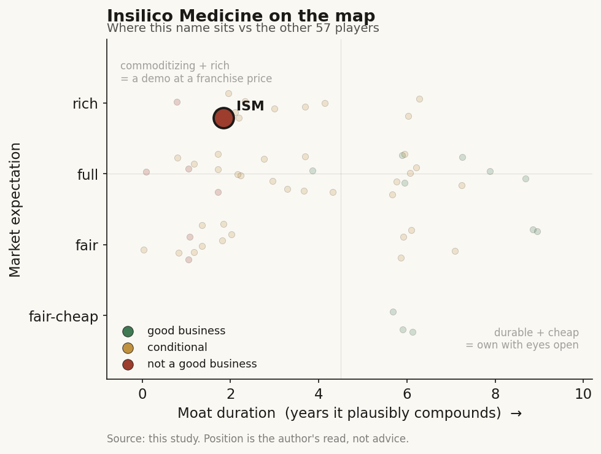

# Insilico Medicine (HK: 3696)

> **The read.** A commoditizing AI drug-discovery platform wrapped around one genuinely differentiated binary asset (rentosertib) - real human proof-of-concept, but priced at a rich pipeline-optionality expectation (~50x shrinking sales), not a fair one for a pre-approval, deal-lumpy drug-owner.

**Snapshot**

| | |
|---|---|
| Listing | HK: 3696 (HKEX; Cayman TopCo) |
| Region | HK |
| Value-chain layer | L9a-L9c (AI drug-discovery spine: target-ID / structure-generation / candidate-selection) |
| Archetype | drug-owner / milestone+royalty (04), with small licensing-software (03) and fee-for-work services attach |
| Size | ~HK$22.7bn (~US$2.9bn) market cap |
| Revenue (latest) | US$56.24m in 2025, -34.5% YoY |
| Moat verdict | commoditizing platform (no durable moat); owned asset is a conditional binary option |
| Expectation | rich |
| Evidence quality | high |

## What it is
End-to-end generative-AI drug-discovery company (Pharma.AI: PandaOmics target-ID, Chemistry42 molecule design, inVivo42/clinical) that both **sells the platform** and **owns a pipeline** - most notably rentosertib (ISM001-055), a TNIK inhibitor for IPF and the first AI-designed drug with a published human Phase-IIa readout [disclosed: Nature Medicine, Jun 2025]. Listed on HKEX 30 Dec 2025, HK$2.28bn (~US$293m) raised, 2025's largest HK biotech IPO [reported]. It is unusual in its cohort for having pushed an owned asset to a *published* Phase-IIa human proof-of-concept - so it lives partly at the value-bearing selection/asset layer, not purely at the commoditizing tool layer.

## Business model - how it makes money
Three engines, all small, none an annuity - plus one accounting artifact that dominates the reported bottom line. Revenue **US$56.24m in 2025, -34.5% YoY** [disclosed]. The multi-year line is the tell - $30.2m (2022) → $51.2m (2023) → $85.8m (2024) → $56.2m (2025) [reported]: **not organic compounding, a lumpy deal-driven sawtooth.** Four lines:

- **Pipeline-development income $23.89m, -68.8%** [disclosed] - upfronts/milestones on out-licensed assets; upfronts collapsed to $15.30m from $58.00m in 2024. This is the milestone (04) biobuck line, and the swing factor for the whole top line.
- **Drug-discovery service fees $24.95m, up from $3.14m** [disclosed] - fee-for-work AI screens for pharma. Grew ~8x but is **the lowest-margin line** and a services archetype (bill hours, no annuity).
- **Software (Pharma.AI subscriptions) $4.91m, +23.8%**; subscriber base +18.3% YoY [disclosed]. The only recurring, capital-light (03/02-shaped) line - and it is <9% of revenue.
- **Other discovery $2.49m, +16.8%** [disclosed].

**Growth quality:** gross profit **$45.85m, -40.9%; GM 81.5% (2024: 90.4%)** [disclosed] - headline GM is high but *falling*, because the mix shifted toward low-margin services as the high-margin milestone line dried up. GM here is a proxy, not cash: below it sits a heavy R&D burn (annualized ~US$150-170m+ run-rate off ~$82-87m/half [reported]). **Incremental ROIC is undefined pre-product** - apply the biotech rule: look at **cash and burn, not margins.** Cash conversion is negative and dilution/deal-funded - the profile of every drug-owner (04) name.

## Financial summary

| Line | 2022 | 2023 | 2024 | 2025 |
|---|---|---|---|---|
| Revenue | $30.2m | $51.2m | $85.8m | $56.24m (-34.5%) |
| Gross margin | - | - | 90.4% | 81.5% |
| Gross profit | - | - | ~$77.6m | $45.85m (-40.9%) |
| Net loss | - | - | $17.1m | $352.3m |
| Cash (YE) | - | - | $125.9m | $393.3m |

2025 revenue split [disclosed]: pipeline-development income $23.89m (-68.8%; upfronts $15.30m vs $58.00m in 2024), drug-discovery service fees $24.95m (from $3.14m), software $4.91m (+23.8%), other discovery $2.49m (+16.8%). The **net loss $352.3m** is an **accounting artifact, not operations**: ~$296.7m is a one-off non-cash fair-value loss on redeemable convertible preferred shares converting at listing [disclosed]; the 2024 $17.1m was flattered by the *reverse* swing. Cash **US$393.3m at YE25 (from $125.9m)** was lifted by the IPO [disclosed] - roughly 2-3 years of runway at current burn [estimate].

## Value-chain position and competition
Sits ON the AI drug-discovery spine: **L9a target-ID (PandaOmics), L9b structure/generation (Chemistry42), L9c candidate selection.** What flows out: (i) designed candidates and IND-ready assets to pharma (milestone+royalty), (ii) fee-for-work screens (services), (iii) platform seats (software). Per the framework, **L9a/L9b are the commoditizing "picks" layers that carry no NPV**; value forms one layer down, in the **owned clinical asset** the platform enables (rentosertib et al.).

Competes against **techbio peers** (Recursion/RXRX - largest flywheel, worst clinical output; Isomorphic, private, Alphabet-backed with Lilly/Novartis/J&J access; Absci; Xaira; Schrödinger on the software side) and, for any owned asset, **against legacy pharma on the same target.** Edge claimed = the end-to-end platform + the ~10-program clinical pipeline (2025: 6 new preclinical candidates, 28 cumulative; 10 clinical-stage; Pharma.AI serves 13 of top-20 pharma; ~$1.3bn new BD signed 2025, ~$4.6bn cumulative) [disclosed]. The honest read: **the platform is not the edge** - open clones (Boltz/Chai/Protenix) matched the structure frontier in ~1yr at >1000x lower cost, so the software/services lines commoditize. The only real differentiator is **rentosertib's human POC** - a cohort-first datapoint (60mg QD FVC +98.4mL vs -20.3mL placebo, n=71, China-only Phase-IIa) [disclosed], Phase-III planned 2H26 [reported].

## Moat
No durable moat under the framework's definition (duration of compounding):
- **Data-flywheel (Moat 4):** REFUTED for drug discovery. Insilico is explicitly named in the refuted cohort - "more data → better model → better drug" is broken (public clones caught the frontier; the biggest flywheel, Recursion, has the worst output). ~0-1yr duration on the platform.
- **Owned-asset vs risk-bearing pharma (Moat 3):** CONDITIONAL - binary optionality, **not compounding**, gated by the **~40% Phase-II efficacy wall unchanged for ~30 years.** Rentosertib's n=71 POC "refutes *nothing works* without validating *AI raises the base rate*." Duration = a ~2-3yr binary watch, sized for asymmetry, not a durable moat.
- **Software (subscriptions):** the only line with any 02/03-shaped durability, but at <9% of revenue and <$5m it is immaterial to the equity thesis.

**Net duration:** ~1yr on the platform; a single-asset ~2-3yr binary option on the pipeline.

## Core variables
1. **Rentosertib Phase-III readout (the master variable).** Does the n=71 signal replicate at pivotal scale in a global trial? One binary event re-rates the whole name - everything else is second-order.
2. **Cash runway vs the next value-inflection.** ~$393m against a ~$150m+ annual burn = ~2-3yr [estimate]; the variable is whether Phase-III funding comes from a partner (non-dilutive) or the market (dilutive) before readout. This is the drug-owner (04) survival variable.
3. **BD-deal cadence / upfront quality.** The top line IS the deal flow - pipeline income swung -68.8% on a single soft upfront year. Watch upfront-as-%-of-biobuck (the cohort runs 1.2-3.0%) and whether the ~$4.6bn cumulative "value" converts to *cash*, not headline biobucks.

*(Held below the line as second-order: software subscriber growth; drug-discovery-services margin drag; preclinical-candidate count; the non-cash preferred-share fair-value noise - ignore it entirely.)*

## Bear case / key risks
1. **The platform commoditizes:** open-source models match the frontier in ~1yr, so software + services are low-durability, and services already *dragged GM from 90.4% to 81.5%*.
2. **Revenue is deal-lumpy, not recurring** - $86m→$56m in one year on a single weak upfront season; there is no ARR to underwrite.
3. **The owned pipeline hits the same ~40% Phase-II wall as legacy pharma** - the n=71 China-only POC is encouraging but is one small readout, not proof AI raises the base rate; zero AI-discovered drugs are approved as of 2026.
4. **Burn + binary funding:** a single Phase-III miss can strand the lead asset AND close the financing window at once - the drug-owner death spiral.
5. The reported $352m loss will confuse retail (it is accounting), but the *real* signal - negative operating cash, deal-dependent revenue - is unflattering.

**Falsification / what breaks the bear:** a global Phase-III win for rentosertib clearing efficacy *above* the ~40% base, OR software crossing into a real recurring double-digit-% revenue share - either would move it from "one shot on goal" toward a franchise.

## The expectation read
Market cap **~HK$22.7bn (~US$2.9bn)** at ~HK$38 (Jul 2026), down from an ~HK$81 post-IPO high; 52-wk range HK$30-81; sell-side avg target ~HK$77 [reported]. On **$56m revenue that's ~50x sales on a *shrinking*, deal-lumpy top line** - a multiple that only makes sense as an **option on the pipeline**, not on the platform business. Decomposed: strip the <$5m software annuity and the fee-for-work services (worth low single-digit revenue multiples at best), and **the residual ~$2.5bn+ is the market pricing rentosertib (and the pipeline optionality) as if Phase-III success is meaningfully probable.**

Where the belief looks soft: (i) it capitalizes a platform the framework says commoditizes in ~1yr; (ii) it treats a lumpy milestone line as if it compounds; (iii) it prices a *single* n=71 POC as de-risked when the ~40% Phase-II wall is unmoved and Phase-III is the real test. The gap between the ~HK$77 targets and the ~HK$38 tape is itself the market disagreeing with itself on how much of the asset optionality to pay for.

## Verdict
A commoditizing platform wrapped around one genuinely differentiated binary asset - real POC, but priced at a rich pipeline-optionality expectation (~50x shrinking sales), not a fair one for a pre-approval, deal-lumpy drug-owner. **Good business?** No - no durable moat (platform ~1yr; asset a ~2-3yr binary); it is optionality, not a franchise. **At a fair or rich expectation?** Rich - the multiple demands Phase-III success the ~40% wall has not yet granted. **Confidence: MEDIUM-HIGH on the structure** (financials, GM, cash, POC all [disclosed]/[reported]); **LOWER on the outcome** - the entire equity rests on a single unresolved Phase-III readout no framework can call.
