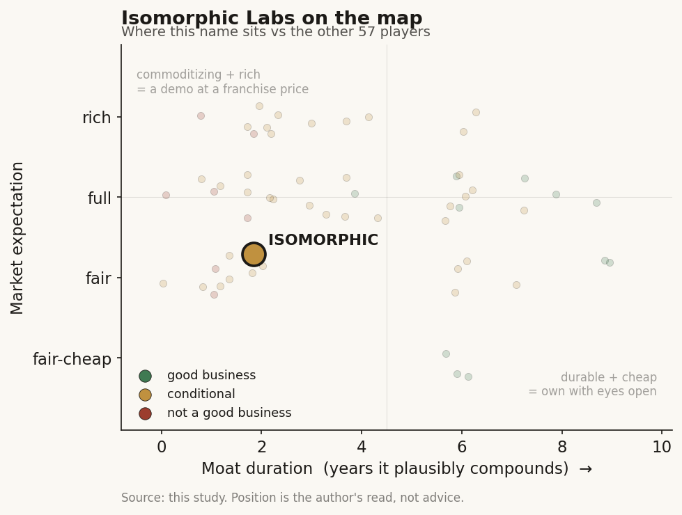

# Isomorphic Labs (private)

> **The read.** A demo-plus frontier drug lab with a real, scarce access asset (Alphabet provenance + three top-pharma partners, no pharma equity), but the only credible moat is binary, unproven, and gated on a ~40% Phase II wall no AI lab has yet moved - size for optionality, not conviction.

**Snapshot**

| | |
|---|---|
| Listing | private (no traded stub; exposure via private rounds or Alphabet) |
| Region | US (London-based, Alphabet-owned) |
| Value-chain layer | L9b-L9e (structure/generation through owned clinical development) |
| Archetype | drug-owner / frontier-lab (Archetype 04 - milestone + royalty) |
| Size | valuation undisclosed; best trade estimate ~$10-12B implied |
| Revenue (latest) | pre-revenue in the owned-asset sense; partnered-discovery deals booked |
| Moat verdict | conditional (Ch5 Moat 3 - surviving layer is capped) |
| Expectation | full |
| Evidence quality | med |

## What it is
London AI drug-discovery company, a DeepMind spin-out owned by Alphabet and sister to Google DeepMind, with which it co-developed AlphaFold 3 (released 8 May 2024) [disclosed]. Founder and CEO Demis Hassabis. It runs partnered discovery for pharma alongside its own internal oncology/immunology pipeline, with no traded stub - exposure only via private rounds or Alphabet.

## Business model - how it makes money
Archetype 04 (milestone + royalty), run as a straddle: (a) **partnered discovery** - a paid research engine to pharma (upfront + milestones + royalties), gives up no equity, runs none of the partner's trials; (b) **own internal pipeline** - oncology + immunology programs it intends to take into the clinic itself [disclosed]. Management treats each drug as "an individual business" and has **not decided** whether it sells assets, out-licenses, or becomes a full drug company [reported]. Capital-**light** while it is a compute-and-deals engine; turns capital-**hungry** the moment owned assets hit the clinic (trials, not molecules, are the spend). Pre-revenue in the owned-asset sense - value today is a probability-weighted string of forward readouts, not a P&L.

> Flag: the repeated "17 internal programs incl. cardiovascular" is [unverified] - primaries say oncology + immunology, no disclosed count.

## Financial summary
Private; funding, valuation, and backers table (real numbers only, tagged).

| Item | Detail |
|---|---|
| Series B | **$2.1B**, led by **Thrive Capital**, announced **12 May 2026** - investors: Alphabet, GV, MGX, Temasek, CapitalG, UK Sovereign AI Fund [disclosed]. One of the largest biotech raises ever; **no pharma corporate-venture equity**, preserving M&A / out-license optionality |
| Prior round | first external round **$600M** (Thrive-led), announced **31 Mar 2025** [disclosed] |
| Total external capital | **≈ $2.7B** [disclosed components] (some outlets round to $2.6B; excludes an earlier ~£182M Alphabet stock issuance) |
| Valuation | **NOT disclosed** [disclosed - company: undisclosed]. Best trade estimate **~$10-12B implied** [estimate - IntuitionLabs]. The circulated **"$15-20B" is unattributed chatter - do not cite as a range** |
| Headcount | ~350-400 [estimate] |
| Burn / runway | ~$300-500M/yr → ~4-6yr runway [estimate - single trade source] |
| Partner biobucks | Lilly up to $1.7B; Novartis up to $1.2B; J&J terms undisclosed - combined headline "nearly $3B" [disclosed] |
| Committed cash to date | disclosed committed upfronts ~$82.5M (2.6-3.0% of the Lilly+Novartis headline) [disclosed] |

## Value-chain position and competition
Spans **L9b (structure/generation)** through candidate work toward **L9c (selection) / L9e (owned clinical development)**. Two tech layers: AlphaFold 3 (diffusion structure prediction of full biomolecular complexes) and the proprietary **Isomorphic Drug Design Engine (IsoDDE)** on top (generation + affinity/property prediction, small molecules + biologics). What flows in: structures/sequences, partner targets, Alphabet compute. What flows out: designed candidates + optionality sold to pharma, and, prospectively, owned assets carried into the clinic. Value forms one layer down from the model - in the owned asset the model enables ("the model is the door, not the moat").

The frontier-lab cohort splits by disclosed model: **drug-owners** (Isomorphic - the hybrid - Xaira, Generate:Biomedicines, Genesis, Recursion, Retro) vs **tool vendors** (Chai Discovery, EvolutionaryScale/ESM3, NVIDIA BioNeMo, Latent Labs). Crowding is at the antibody/binder-**generation** frontier and the model-vendor layer - the step that carries no NPV - not at selection/clinical translation, where value sits. Its edge is the only techbio pairing Alphabet/AlphaFold provenance with three top-pharma partners (Lilly, Novartis, J&J) and no pharma equity on the cap table - a genuine access/optionality asset most peers lack. The one honest technical claim is IsoDDE's out-of-distribution generalization (50% vs AlphaFold3's 23.3% on <20%-similarity protein-ligand cases) - **[estimate - vendor-reported, un-replicated];** treat as vendor-reported until a third party benchmarks it.

## Moat
**Ch5 Moat 3 applies: CONDITIONAL** - and even the surviving layer is capped. Adversarial test of three candidate moats:
- **Structure-prediction quality - REFUTED (~1yr).** Open MIT/Apache clones (Boltz-1/2, Chai-1 Apache-2.0, Protenix, OpenFold-3) matched AF3 on geometry *and* affinity within ~a year at >1000x lower cost [disclosed]. Survives only on the un-replicated OOD edge, which is "table stakes" even if real.
- **Data flywheel - MIXED / WEAK.** Public data repeatedly caught the frontier; the biggest flywheel owner (Recursion) has the worst clinical record.
- **Pharma distribution + owned pipeline - THE ONLY CREDIBLE MOAT, but capped.** What Isomorphic actually holds is pharma *relationships/optionality* (cheap staged real options the landlord-partner can envelop) plus a pre-revenue owned pipeline. This lets it own *more shots on goal*; it does **not** change the odds per shot - the opposite of compounding. Is the moat real for a private at this stage? No - not yet as a durable-compounding moat. The relationship/access is real and scarce; the *moat* is unproven because it is gated on the ~40% Phase II wall, unobservable before ~2028-29.

## Core variables
CORE (the noise discarded):
1. **[CORE] Realized Phase II PoS for AI-discovered molecules** - the master variable. Today ~40% (historic) [estimate]. Thesis breaks if it moves durably above ~45-50% on a real sample - the only proof AI de-risked *biology*, not just chemistry.
2. **[CORE] Own-pipeline progression** - first Phase 1 entry targeted **end-2026** (already slipped a year from end-2025), first Phase II efficacy readout ~2028-29. Zero human efficacy data exists; the entire valuation is forward.
3. **[CORE] Milestone conversion, not headline biobucks** - cash actually paid on the Lilly/Novartis/J&J books vs the ~$3B headline. Null hypothesis: Recursion/Roche paid ~$7M on up-to-$12B.

Second-order: open-model OOD catch-up (Boltz-3/Protenix/OpenFold-3 closing the novel-target gap); FDA AI-council guidance on AI-selection/digital-twin control arms.

## Bear case / key risks
Zero AI-discovered drugs are approved as of 2026; the AI edge is real in Phase I (~80-90% clearance vs ~52% historic) and **vanishes exactly at Phase II efficacy** (~40%, unchanged in 30 years), where ~90% of failure and ~93% of clinical spend live [estimate]. The two most-hyped pure-plays failed as independents and merged (BenevolentAI cut ~30% after BEN-2293 missed; Exscientia killed DSP-1181 and was absorbed by Recursion, ~$630M, Nov 2024) [disclosed]. Pharma is buying cheap staged options, not conviction - disclosed committed cash is ~$82.5M of upfronts (2.6-3.0% of the Lilly+Novartis headline). The model edge is commoditizing in real time; the only defensible layer is owned assets that hit the same wall as everyone else. The undisclosed ~$10-12B [estimate] valuation prices "AI solved drug discovery" when the data says AI solved the cheap half. The lone genuine human POC (Insilico rentosertib, n=71, China-only Phase 2a) refutes "nothing works" without validating "AI raises the base rate."

## The expectation read
The undisclosed ~$10-12B [estimate] mark prices in "AI solved drug discovery," but the data says AI solved the cheap half - Phase I clearance (~80-90% vs ~52% historic) - while the ~40% Phase II efficacy wall that carries ~90% of failure and ~93% of spend is unchanged in 30 years. The belief looks soft precisely where the valuation leans hardest: on a per-shot de-risking of biology that has zero human efficacy evidence and no observable proof before ~2028-29. Committed pharma cash (~$82.5M upfronts, 2.6-3.0% of headline) signals the partners themselves are buying cheap options, not conviction.

## Verdict
**Demo-plus, not yet a durable value-capturer - the only credible moat (owned assets vs risk-bearing pharma) is real but binary and unproven, gated on a ~40% Phase II wall no frontier lab has moved; size for optionality/asymmetry, not conviction. Confidence: HIGH on the framing (model commoditizes, value is in selection/owned assets), MEDIUM on the ~$10-12B mark (undisclosed), LOW on any efficacy read before ~2028-29.**
