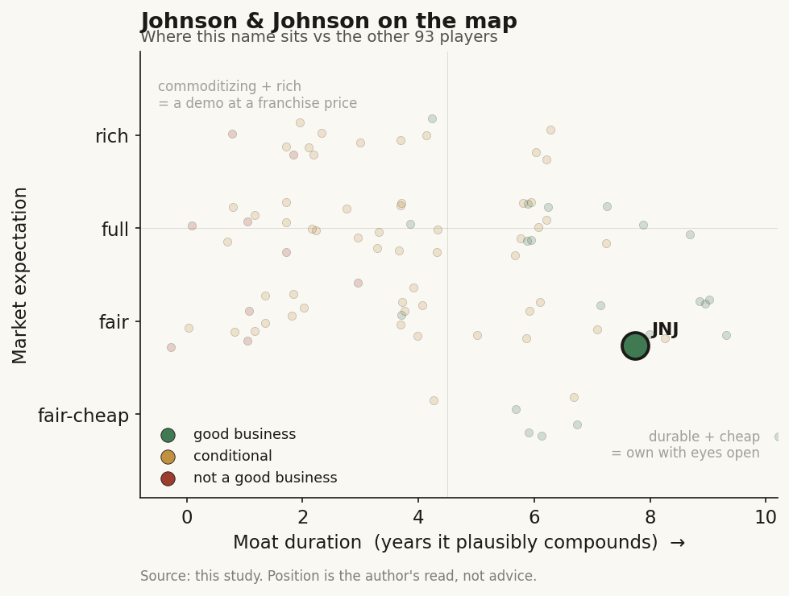

# Johnson & Johnson (JNJ / NYSE)

> **The read.** The diversified incumbent that funds the AI - in both the drug-discovery chain AND the surgical-robotics chain - and keeps the value. AI is a real efficiency lever and a cheap option-buy on two fronts, but at ~$633bn it is a rounding error against a $94bn revenue base driven by branded drugs and medical devices. The stock is a pharma-plus-MedTech franchise bet with two AI call options attached, not an AI story.

**Snapshot**

| | |
|---|---|
| Listing | JNJ / NYSE |
| Region | US |
| Value-chain role | pharma + MedTech incumbent - funder / value-keeper of BOTH the drug-discovery and surgical-AI chains |
| Archetype | diversified healthcare giant; buys AI as tool + cheap option, owns the assets and the operating room |
| Size | ~$633bn market cap (Jul-26) [reported] |
| Revenue (latest) | FY25 $94.2bn, +6.0% YoY [disclosed] |
| AI relevance | small to the P&L today; strategic optionality + internal efficiency on two chains |
| Moat verdict | strong, but the moat is franchise/scale/distribution and the surgical installed base - not AI |
| Expectation | full - priced on drugs + devices, not on AI |
| Evidence quality | high |

## What it is
One of the largest healthcare companies in the world, split into two segments: Innovative Medicine (branded pharma - oncology, immunology, neuroscience) and MedTech (surgery, orthopaedics, cardiovascular, vision). It is the only incumbent in this case study that sits at the top of BOTH AI chains the study tracks: the drug-discovery chain (it funds an AI lab, keeps the molecules) and the surgical-AI chain (it is building the operating-room data platform and a robot to run on it). AI matters here not because it moves the P&L - it does not, yet - but because JNJ is a clean second illustration of the study's thesis on two fronts at once: the incumbent writes the checks, licenses the platforms, builds the ecosystem, and keeps the finished drugs, the trials, the devices, and the surgical data for itself.

## Business model - how it makes money
Two engines, both value-captured end to end:

- **Innovative Medicine (~64% of revenue).** Patented small molecules and biologics JNJ discovers, runs through its own trials, manufactures, and sells through its own commercial machine. FY25 $60.4bn, +6.0% [disclosed]. Captures value at every layer a pure-play AI lab never touches: the ~40% Phase II efficacy wall (it runs the trials), approval, manufacturing, payer contracting, distribution.
- **MedTech (~36% of revenue).** Devices and, increasingly, the software and data around them. FY25 $33.8bn, +6.1% [disclosed]. The value here is the installed base - the surgical robots, the disposables that feed them, and the data the operating room generates. This is the leg that makes JNJ different from a pure-pharma incumbent: it owns the surgery, not just the drug.

That dual position is the point of the study. When JNJ signs an AI-discovery deal it structures it as **milestone + royalty** - small upfront, large payments only if a molecule advances, JNJ owns the rights to whatever comes out. When it builds surgical AI it does so as a **platform owner** - the AI runs on JNJ's robots, over JNJ's data, inside JNJ's operating-room ecosystem. On both chains the AI partner (or the AI itself) bears the risk and gets paid in options or in tool licences; JNJ keeps the asset. The incumbent funds the AI and keeps the value.

- **AI as a tool, not a product.** JNJ does not sell AI as a standalone. It uses AI to make discovery cheaper and surgery smarter, and buys external AI capacity as staged options or as edge-compute plumbing.
- **Capital-heavy where it counts.** The spend is trials, manufacturing, device R&D, and the robotics build-out - not compute. Even the largest AI commitments are small next to that.

## Financial summary
Top-line scale, with the AI/deal figures kept in proportion so the reader sees how small they are.

| Item | Figure |
|---|---|
| FY25 revenue | $94.2bn, +6.0% YoY (from $88.8bn) [disclosed] |
| - Innovative Medicine | $60.4bn, +6.0% [disclosed] |
| - MedTech | $33.8bn, +6.1% [disclosed] |
| FY25 R&D spend | $14.7bn, ~15.6% of revenue [disclosed] |
| - Innovative Medicine R&D | $11.8bn [disclosed] |
| - MedTech R&D | $2.8bn [disclosed] |
| FY25 net earnings (GAAP) | ~$26.8bn [disclosed] |
| Market cap | ~$633bn (Jul-26) [reported] |
| US investment plan | >$55bn over four years (manufacturing, R&D, technology; +25% vs prior four years) [disclosed] |
| **AI deal / capex figures (kept in scale)** | |
| Isomorphic Labs | research collaboration, cross-modality, multi-target (announced Jan-2026); terms undisclosed; part of Isomorphic's "nearly $3bn" combined biobucks headline with Lilly + Novartis [disclosed] |
| NVIDIA MedTech tie-up | integrates NVIDIA IGX + Holoscan edge-AI platforms into surgical devices (compute plumbing, not a licence fee) [disclosed] |
| Polyphonic AI Fund for Surgery | launched Jun-2025 with NVIDIA + AWS to seed surgical-AI apps; fund size undisclosed [disclosed] |
| Internal drug-discovery AI | in-house generative-AI agent that designs novel compounds for specific targets [reported] |

Scale check: the entire US investment plan (>$55bn over four years, ~$14bn/yr across manufacturing/R&D/tech) dwarfs anything AI-specific. The Isomorphic upfront is undisclosed but, by peer read-across (Lilly paid $45m upfront on a $1.7bn ceiling; Novartis $37.5m on ~$1.2bn), JNJ's committed cash is almost certainly a low-tens-of-millions figure - well under 0.1% of revenue. AI on both chains is a strategic bet financed out of pocket change.

## Value-chain position and competition
JNJ sits at the top of two chains as the **funder and value-keeper**. Map the flows:

- **Drug-discovery chain.** Money flows out to Isomorphic Labs as a small upfront + large contingent milestones; AI capacity (Isomorphic's AlphaFold-3-lineage engine, plus JNJ's own internal generative-AI compound designer) flows in; finished molecules, trials, manufacturing, and distribution stay inside JNJ. Identical structure to Lilly and Novartis - the same three incumbents fund the same lab.
- **Surgical-AI chain.** Here JNJ is not just a funder, it is the **platform owner**. The Polyphonic digital ecosystem is meant to be the open-but-JNJ-controlled operating-room layer that connects robots (Ottava for soft-tissue, Monarch for bronchoscopy), instruments, and surgical software, with AI running from pre-op planning through intra-op navigation to post-op analytics. NVIDIA supplies the edge compute (IGX/Holoscan); AWS supplies cloud; the Polyphonic AI Fund seeds third-party apps - but the data and the installed base are JNJ's. Ottava itself was submitted to the FDA for de novo clearance in Jan-2026 [disclosed] and is not yet cleared or selling.

Competition splits by chain. For the AI-funder role in drugs: the other cash-rich incumbents doing the identical thing - Lilly and Novartis (co-signers of Isomorphic), plus everyone funding Insilico, Recursion, Xaira. For the surgical-AI platform: the real fight is Intuitive Surgical, whose da Vinci installed base and disposables annuity are the entrenched incumbent JNJ is trying to displace; Medtronic (Hugo) is the other challenger. AI is a shared industry tool in drugs and a contested platform in surgery; JNJ's value rests on the franchise and the installed base, not on the algorithms.

## Moat
JNJ's moat is real and wide - but it is **not** an AI moat, and that distinction is the whole point.

- **Pharma franchise + scale + distribution - STRONG (~7-10 yr, patent-cliff-exposed).** Diversified branded portfolio, global commercial reach, and the balance sheet to fund any trial. Narrower than Lilly's because JNJ faces near-term loss of exclusivity on major drugs (Stelara biosimilars already, others to follow), so the durable window is shorter.
- **Surgical installed base + disposables annuity - STRONG where it exists, but JNJ is the challenger.** In robotic soft-tissue surgery the moat belongs to Intuitive today; JNJ's Ottava/Polyphonic bet is an attempt to build one, not a moat it already holds. Monarch (bronchoscopy) is a real cleared franchise; Ottava is pre-clearance.
- **AI as a moat - WEAK / not the point.** Discovery models are commoditizing (open clones caught the AlphaFold frontier within ~a year). JNJ's AI edge, to the extent it has one, is proprietary trial/surgical data + the ability to run the trials and own the operating room - i.e. incumbency, not algorithms. Polyphonic's surgical-data network is the most defensible AI-specific asset, and it is unproven and years from scale.

Net: a durable but patent-cliff-exposed franchise moat, plus a contested surgical-platform bet. AI widens both funnels and buys cheap options but does not itself compound value. The moat is the part of both chains the AI cannot reach.

## Core variables
1. **[CORE] Pharma franchise trajectory through the patent cliff.** Can new launches and the pipeline offset Stelara/other losses of exclusivity? This is most of the revenue line and AI barely moves it in the forecast window.
2. **[CORE] Ottava/Polyphonic surgical execution vs Intuitive.** The one place JNJ is trying to convert AI + robotics into a NEW moat rather than defend an old one. Watch FDA clearance timing, the disposables attach rate, and whether Polyphonic actually becomes the operating-room data layer or stalls as a demo. Today unproven [unverified].
3. **[CORE] R&D productivity + milestone conversion.** Does AI (Isomorphic + internal) lower cost-per-approved-drug, and do the "up-to" biobucks convert into real INDs? Either way JNJ's downside is capped - it stops paying milestones if a molecule hits the Phase II wall and loses only a small upfront.

Below the line as noise: GPU counts, exaflops, which specific AI lab "wins," and the AI-narrative framing generally. For a $94bn-revenue company these are strategy line-items, not valuation drivers.

## Bear case / key risks
The bear case has little to do with AI. It is (1) the pharma patent cliff - major losses of exclusivity that the pipeline must outrun; (2) talc litigation overhang, a JNJ-specific legal/liability tail; and (3) the surgical-platform bet failing - Ottava arriving late, under-differentiated, or into an operating room Intuitive already owns, stranding years of robotics R&D. Any of these dwarfs anything AI could add or subtract.

On AI specifically the risk is the opposite of the pure-plays': not that JNJ's AI fails, but that a licensed molecule hits the same ~40% Phase II wall everyone hits (in which case JNJ simply stops paying milestones), or that Polyphonic over-invests in a platform surgeons do not adopt. The discovery-AI spend is not where a JNJ investor loses money; the surgical-platform spend could be, but as execution risk, not AI risk.

Falsification watch: (1) pipeline fails to offset the patent cliff - the thesis breaks here, AI irrelevant; (2) Ottava clears, attaches disposables, and Polyphonic compounds into a real surgical-data network Intuitive cannot copy - the one path where AI+robotics becomes a genuine new moat; (3) an AI-sourced JNJ molecule reaches pivotal-stage success and de-risks a franchise - the path where discovery AI stops being a rounding error.

## The expectation read
At ~$633bn (Jul-26), the market is pricing a diversified, defensive healthcare compounder - a premium-quality multiple on a slow-growth (~6%) but durable pharma-plus-MedTech base, with the patent cliff and talc tail already partly discounted. **Essentially none of that price is AI.** The Isomorphic deal, the NVIDIA/AWS surgical plumbing, and the Polyphonic fund together commit a trivial fraction of revenue; they are financed out of free cash flow and structured so JNJ's downside on the drug side is a handful of small upfronts. The embedded expectation is that the pipeline outruns the patent cliff and MedTech keeps growing mid-single-digits - not that AI discovers the next blockbuster or that Ottava dethrones Intuitive.

So the AI read is asymmetric and cheap on the drug side (pay option premiums, keep every asset that works, owe nothing if they do not) and a genuine but small bet on the surgical side (real capital, real execution risk, potential new moat). Whether AI "moves" a $633bn company: not in the numbers today, and not in the price. If it ever does, it shows up as lower cost-per-approved-drug over a decade and/or a surgical-data annuity that compounds - both slow tailwinds, not a re-rating.

## Verdict
Good business, wide moat - but the moat is the pharma franchise, scale, distribution, and the (contested) surgical installed base, not AI. JNJ is the case study's cleanest dual illustration of the thesis: the incumbent funds the drug-discovery AI as cheap staged options AND builds the surgical-AI platform on its own robots and data, keeping the value on both chains. AI is a sensible, low-cost efficiency-and-optionality bet that is immaterial to the P&L and to the ~$633bn valuation today. Confidence: HIGH on the facts (revenue, R&D, segment splits, deal structures, Ottava status all disclosed and current); HIGH on the framing (AI is a tool/option here; drugs and devices are the story); the open questions are the patent-cliff offset and whether Ottava/Polyphonic converts into a new moat - both of which are about execution, not algorithms.
