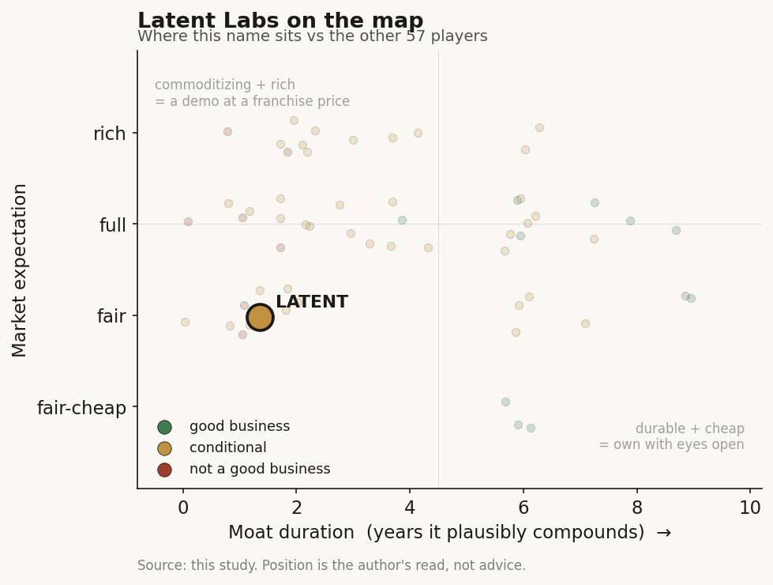

# Latent Labs (private)

> **The read.** A credible AlphaFold-alumni team with a real lab-validated benchmark, sitting on the one value-chain layer Ch5 refutes as a moat (L9b model IP, ~12-month half-life) - right picks-and-shovels positioning, but monetisation unproven and the only durable moat unbuilt; watch, don't own.

**Snapshot**

| | |
|---|---|
| Listing | private |
| Region | US / UK (London + San Francisco) |
| Value-chain layer | L9b - structure / generation |
| Archetype | picks-and-shovels / infra-toll (06, by intent; pre-revenue today) |
| Size | ~$50m total raised; post-money low-to-mid hundreds of millions [estimate] |
| Revenue (latest) | pre-revenue - no priced API, no disclosed revenue |
| Moat verdict | commoditizing (current asset) / unbuilt (potential moat) |
| Expectation | fair (no public market price) |
| Evidence quality | med (valuation undisclosed, revenue nil, benchmark self-reported) |

## What it is
A generative-AI protein-design lab spun up by ex-DeepMind AlphaFold alumni, selling a web/no-code model (Latent-X) that designs novel protein binders in the browser rather than predicting existing structures. It intends to be the tool other biotechs run - picks-and-shovels - not an owned-drug developer.

## Business model - how it makes money
Archetype: picks-and-shovels / infra-toll (06) by intent - but pre-revenue today. Kohl is explicit: Latent **licenses the model to organisations that "can't build their own AI models"**, and does **not** develop proprietary medicines [reported]. This is the deliberate opposite of the Isomorphic own-pipeline (Archetype 04) route.

Monetisation, staged: Latent-X launched **21 Jul 2025 as a free web tool** (free tier, daily renewing credits, commercial use permitted under beta terms). **Paid tier + API "in the future"**; Kohl says they "intend to eventually charge for advanced features" [disclosed]. So there is a product in users' hands but **no disclosed revenue and no priced API yet**.

Capital profile: mixed, not pure-light. The *software* leg is capital-light (browser model, usage-metered). But it runs its **own wet lab** to generate the experimental validation data that is its selling point - a real, ongoing cash cost. Call it capital-light-plus, not SaaS-clean.

## Financial summary
Private - no income statement. Profiled on funding / valuation / backers.

| | |
|---|---|
| Total raised | $50m (out of stealth 13 Feb 2025) [reported/disclosed] |
| Series A | $40m, co-led by Radical Ventures and Sofinnova Partners [reported] |
| Prior/seed | $10m in prior/seed capital [reported] |
| Other investors | Flying Fish, Isomer, and existing backers 8VC, Kindred Capital, Pillar VC [reported] |
| Angels | Jeff Dean (Google chief scientist), Aidan Gomez (Cohere), Mati Staniszewski (ElevenLabs) [reported] |
| Valuation | not disclosed [unverified]; $50m at Series A for a ~2024-vintage techbio implies post-money in the low-to-mid hundreds of millions [estimate] - small vs the Isomorphic/Xaira tier |
| Founder | Simon Kohl, former co-lead of DeepMind's protein-design team and AlphaFold2 senior scientist; runs its own wet lab for validation [reported] |

## Value-chain position and competition
**L9b = structure / generation** - the "design the WHAT-to-make" step. Latent-X takes a target and **generates novel binders (mini-binders, macrocycles, antibodies, enzymes)** as atomically precise structures. What flows OUT is a designed candidate + a predicted/validated binding hit; what flows IN is a target spec and the wet-lab feedback loop. This is the layer Ch5 names as the commoditising picks layer. Value in the drug-discovery chain forms one layer DOWN - at L9c selection and the owned L9e clinical asset - precisely where Latent has chosen **not** to play. It sells the door, not the room behind it.

Crowded L9b/design cohort: Generate Biomedicines (Chroma), EvolutionaryScale (ESM3), Chai Discovery, Cradle Bio ($73m Series B), Bioptimus ($76m), plus academic-origin frontiers RFdiffusion / AlphaProteo (DeepMind) and the open-weights wave (Boltz, Chai-1 Apache-2.0) [reported].

Latent's edge is two-fold and real-but-narrow: (i) **founder pedigree** (AlphaFold2 core team) as a talent/recruiting and credibility asset; (ii) **a genuine lab-validated benchmark** - Latent-X reports **10-64% mini-binder hit rates to picomolar affinity** and **91-100% macrocycle hit rates to single-digit-micromolar**, across **7 therapeutic targets**, generation **>10x faster / within seconds**, claimed state-of-the-art vs prior generative tools [disclosed]. The distribution edge (no-code, in-browser) is a real go-to-market wedge - it lowers adoption friction for biotechs without ML teams, exactly the buyer Kohl names.

## Moat
Governing verdict: Ch5 Moat 1 / Moat 4 refutation of the MODEL as a moat. Model IP is a **~12-month moat at best** - open MIT/Apache clones (Boltz-1/2, Chai-1, Protenix, OpenFold-3) matched the AlphaFold3 frontier on geometry AND affinity within ~1 year at >1000x lower cost [disclosed, Ch5]. Latent-X's benchmark lead is measured against *today's* prior state-of-the-art; the base rate is that lead is caught inside a year.

The one thing that could survive is Ch5's surviving mechanism - **workflow OWNERSHIP of a scarce input the platform above cannot cheaply replicate.** For Latent that would have to be the **proprietary wet-lab validation dataset + the design-test-learn loop** (data-attach, Archetype-03 flavour), not the model weights. That is the only durable candidate here, and it is **unproven at this scale** - Ch5/Ch4 already show the drug-discovery data flywheel is empirically **broken** (the largest flywheel owner, Recursion, has the worst clinical output; public data reproduced the frontier).

Is the moat real for a private at this stage? No - not yet. What is real: a strong team, a credible benchmark, and a clean picks-and-shovels *positioning* that sidesteps the ~40% Phase-II wall by design. What is NOT yet real is a *durable* moat: no priced product, no lock-in, no owned scarce input proven to compound, and the model layer commoditises in ~1 year. **Durable vs commoditising: the current asset (the model) is commoditising; the potential moat (validated-data loop + workflow ownership) is unbuilt.**

## Core variables
1. **Monetisation conversion - does the free web tool become a priced API/franchise?** The entire infra-toll thesis rests on turning free users into paying, metered, sticky accounts before a free open-weights clone resets the anchor price to zero. This is the master variable.
2. **Durability of the benchmark edge vs the open-weights clone curve.** Ch5's base rate says ~12 months. If Latent-X's lab-hit-rate lead holds >18-24 months on a real, independent benchmark, that partially refutes the model-commoditisation prior; if a Boltz-class open clone matches the hit rates, the edge is gone.
3. **Does a proprietary, compounding wet-lab data asset actually form?** The only path from "good demo" to "moat" is an owned design-test-learn loop the buyer can't replicate - the Ch5 survivor. Watch whether the lab generates a data-attach product, not just validation slides.

*(Second-order, below the line: partnership signings and their terms; API pricing when disclosed; cash runway vs the ~$50m raise; team retention; regulatory-agnostic - L9b carries no reimbursement gate, so no CPT/coverage variable applies.)*

## Bear case / key risks
Latent sits on the **commoditising picks layer (L9b)** that Ch5 refutes as a moat: the model is a ~12-month asset, open clones matched the AlphaFold3 frontier in ~1yr at >1000x lower cost, and its headline benchmark is struck against a state-of-the-art that moves every quarter. It has chosen the capital-light, no-efficacy-risk side (good - it avoids the ~40% Phase-II wall), but that same choice means it **captures none of the value that forms downstream at L9c/L9e** - it hands the design to a customer who owns the drug. Monetisation is **unproven**: the product is free, the API doesn't exist, revenue is undisclosed, and the moment it tries to charge, a free open-weights competitor sits one click away. The $50m round is small relative to the compute + wet-lab burn a frontier-model + lab operation demands, so a **capital-raise / partner-dependency** overhang is live. The precedent is Exscientia/BenevolentAI (Ch4 failure case): priced on a design-layer demo, killed when the layer commoditised and no owned downstream value existed. **Falsification of the bear:** a priced API with disclosed net-revenue-retention >110% at price, OR a durable independent-benchmark lead held past ~2 years, OR a marquee franchise deal on non-trivial economics.

## The expectation read
With no public listing there is no market multiple to fade. What the $50m Series A into a low-to-mid-hundreds-of-millions post-money [estimate] implies is that the round priced the *team and the benchmark* - the AlphaFold2 pedigree plus a lab-validated hit-rate demo - not a monetised franchise. Where that belief looks soft: it capitalises the L9b model layer that Ch5 dates at ~12 months, against a state-of-the-art that resets every quarter and an open-weights clone that has already reproduced the frontier at >1000x lower cost. The valuation is therefore an option premium on the *unbuilt* piece - a priced API and a compounding, proprietary validation-data loop - neither of which yet exists. Fair as a venture bet on optionality; the softness is that the priced-in asset is the one the framework says commoditises.

## Verdict
**DEMO / FEATURE with option value - NOT yet a durable value-capturer.** A credible team and a real lab-validated benchmark sitting on the one layer (L9b model IP) Ch5 refutes as a ~12-month moat; picks-and-shovels *positioning* is right, but monetisation is unproven and the only survivable moat (an owned, compounding validation-data loop) is unbuilt. **Grade: C+ (watch, don't own - even if it were listed). Confidence: high on the framing, moderate on the numbers** (valuation undisclosed, revenue nil, benchmark self-reported).
