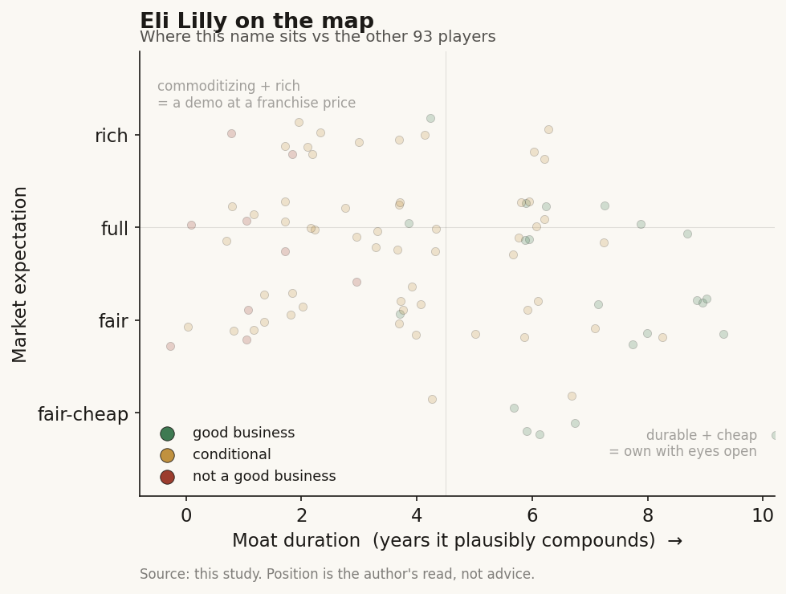

# Eli Lilly (LLY / NYSE)

> **The read.** The mega-cap incumbent that funds the AI-drug-discovery ecosystem and keeps the value. AI is a real efficiency lever and a smart option-buy, but at ~$1.15tn it is a rounding error against a $65bn revenue base driven by two GLP-1 drugs. The stock is a metabolic-franchise bet with an AI call option attached, not an AI story.

**Snapshot**

| | |
|---|---|
| Listing | LLY / NYSE |
| Region | US |
| Value-chain role | pharma incumbent - the funder / value-keeper of the drug-discovery AI chain |
| Archetype | diversified big-pharma; buys AI as tool + cheap option, owns the assets |
| Size | ~$1.15tn market cap (3-Jul-26); stock ~$1,205 [reported] |
| Revenue (latest) | FY25 $65.2bn, +45% YoY [disclosed] |
| AI relevance | small to the P&L today; strategic optionality + internal efficiency |
| Moat verdict | strong, but the moat is franchise/scale/distribution - not AI |
| Expectation | full - priced on GLP-1, not on AI |
| Evidence quality | high |

## What it is
The largest pharmaceutical company in the world by market value, and the single biggest funder of AI drug discovery among the incumbents. Its actual business is metabolic health: Mounjaro (diabetes) and Zepbound (obesity), both GLP-1 receptor agonists, drove a 45% revenue jump in 2025 [disclosed]. AI matters to this study not because it moves the P&L - it does not, yet - but because Lilly is the archetype the whole case study turns on: the incumbent that writes the checks to the AI labs, licenses the platforms, builds the internal compute, and keeps the finished drugs, the trials, and the distribution for itself.

## Business model - how it makes money
Lilly sells patented small molecules and biologics it discovers, develops through its own clinical trials, manufactures, and distributes through its own commercial machine. It captures value at every layer a pure-play AI lab does not touch: the ~40% Phase II efficacy wall (it runs the trials), regulatory approval, manufacturing scale-up, payer contracting, and a global salesforce.

That is the key point of the case study. When Lilly signs an AI-discovery deal, it structures it as **milestone + royalty**: a small upfront, large payments only if a molecule actually advances, and Lilly owns the global rights to whatever comes out. The AI partner bears the discovery risk and gets paid in options; Lilly keeps the asset. The incumbent funds the AI and keeps the value.

- **AI as a tool, not a product.** Lilly does not sell AI. It uses AI to make its own discovery cheaper and faster, and buys external AI capacity as staged options.
- **Capital-heavy where it counts.** The spend is trials, manufacturing (multi-billion-dollar plant build-out for GLP-1 supply), and commercial - not compute. Even the largest AI commitments are small next to that.

## Financial summary
Top-line scale, with the AI/deal figures kept in proportion so the reader sees how small they are.

| Item | Figure |
|---|---|
| FY25 revenue | $65.2bn, +45% YoY (from $45.0bn in 2024) [disclosed] |
| FY25 R&D spend | $13.3bn, ~20.5% of revenue, +21% YoY [disclosed] |
| FY25 net income (GAAP) | $20.6bn, +95% [disclosed] |
| Market cap | ~$1.15tn (3-Jul-26) [reported] |
| Growth driver | Mounjaro + Zepbound (GLP-1) - the whole story [disclosed] |
| **AI deal / capex figures (kept in scale)** | |
| Isomorphic Labs | $45m upfront, up to $1.7bn milestones + royalties (Jan-2024; Isomorphic's first pharma partner) [disclosed] |
| Insilico Medicine | $115m upfront, up to $2.75bn milestones + royalties (Mar-2026) [disclosed] |
| TuneLab platform | built on >$1bn of accumulated R&D data/models; ~18 models; free to selected biotechs [disclosed] |
| NVIDIA co-innovation lab | up to $1bn over 5 years (talent + infra + compute) [disclosed] |
| Lilly-owned AI supercomputer | 1,016 Blackwell Ultra GPUs, >9 exaflops - "pharma's most powerful" [disclosed] |

Scale check: the entire Isomorphic milestone ceiling ($1.7bn, most of it contingent and years away) is ~2.6% of one year's revenue. The upfront cash actually committed ($45m) is ~0.07%. The NVIDIA lab ($1bn over five years, ~$200m/yr) is ~0.3% of revenue and ~1.5% of R&D. AI is a strategic bet financed out of pocket change.

## Value-chain position and competition
Lilly sits at the top of the drug-discovery chain as the **funder and value-keeper**. Map the flows:

- **Money flows out** to AI labs (Isomorphic, Insilico, and others) as small upfronts + large contingent milestones.
- **AI capacity flows in** three ways: (1) **licensed platforms** - it rents Isomorphic's AlphaFold-lineage engine and Insilico's Pharma.AI for target/molecule discovery; (2) **its own platform, TuneLab** - it packages a decade of proprietary ADMET/safety data into ~18 models and gives biotechs federated access (they train on their own data, send back model updates, Lilly's models improve) - Lilly becomes an AI *landlord*, not just a tenant; (3) **owned compute** - the NVIDIA co-innovation lab plus a Lilly-owned 1,016-GPU Blackwell Ultra supercomputer for internal foundation models.
- **Finished drugs, trials, manufacturing, and distribution stay inside Lilly.**

Competition for the *AI-funder* role is the other cash-rich incumbents doing the identical thing: Novartis and J&J also signed Isomorphic (the "nearly $3bn" combined headline), and the same names fund Insilico, Recursion, Xaira, and peers. The competitive fight that actually decides Lilly's value, though, is not AI - it is the GLP-1 obesity market against Novo Nordisk (and a wave of next-gen oral and combo entrants). AI is a shared industry tool; the moat is the franchise.

## Moat
Lilly's moat is real and wide - but it is **not** an AI moat, and that distinction is the whole point.
- **Franchise + scale + distribution - STRONG (~10-15 yr).** Patent-protected GLP-1 leadership, manufacturing capacity rivals cannot quickly match, entrenched payer and prescriber relationships, and the balance sheet to fund any trial. This is what a $1.15tn valuation rests on.
- **AI as a moat - WEAK / not the point.** The discovery models Lilly licenses are commoditizing (open clones caught the AlphaFold frontier within ~a year at far lower cost). Lilly's AI edge, to the extent it has one, is **proprietary data + owned compute + the ability to run the trials AI cannot** - i.e. incumbency, not algorithms. TuneLab's federated data network is the most defensible AI-specific asset, and even it is a productivity aid, not a profit engine.

Net: durable, ~10-15-year franchise moat; AI widens the funnel and buys cheap options but does not itself compound value. The incumbent's real moat is the part of the chain the AI labs cannot reach.

## Core variables
1. **[CORE] GLP-1 franchise trajectory (Mounjaro/Zepbound vs Novo + orals).** This is ~everything. Volume, pricing, oral-formulation success, and share against Novo Nordisk set the revenue line. AI does not move this needle in the forecast window.
2. **[CORE] R&D productivity - does AI actually lower cost-per-approved-drug?** The whole incumbent-AI thesis. Watch whether AI-sourced molecules (Isomorphic/Insilico) convert milestones into real INDs and Phase progress, and whether internal AI + TuneLab measurably shorten discovery. Today this is unproven at the P&L level [unverified].
3. **[CORE] Milestone conversion, not headline biobucks.** The "up to $1.7bn / $2.75bn" numbers are option ceilings. What matters is cash actually paid as molecules advance - and, for Lilly the payer, whether that cash buys approved assets or lapses cheaply. Either way the downside is capped and the assets are Lilly's.

Below the line as noise: which specific AI lab "wins," GPU counts, exaflops, and the AI-narrative framing generally. For a $65bn-revenue company, these are strategy line-items, not valuation drivers.

## Bear case / key risks
The bear case has almost nothing to do with AI. It is GLP-1 concentration: a company priced near $1.15tn on two drugs in one therapeutic area faces Novo Nordisk competition, next-gen oral and combination entrants, pricing and reimbursement pressure (US drug-pricing politics, Medicare negotiation), patent-cliff timing, and manufacturing/supply execution. Any GLP-1 disappointment dwarfs anything AI could add or subtract.

On AI specifically the risk is the opposite of the pure-plays': not that Lilly's AI fails, but that it *over-invests in a commoditizing tool for narrative reasons* - or that a licensed molecule hits the same ~40% Phase II wall everyone hits, in which case Lilly simply stops paying milestones and loses only a small upfront. The AI spend is not where a Lilly investor loses money.

Falsification watch: (1) GLP-1 share erosion or an oral/obesity setback - the actual thesis breaks here, AI irrelevant; (2) an AI-sourced Lilly molecule reaches pivotal-stage success and materially de-risks a franchise - the one path where AI stops being a rounding error; (3) TuneLab's federated network compounds into a genuine data advantage rivals cannot copy - the only AI-specific moat worth watching.

## The expectation read
At ~$1,205 and ~$1.15tn (3-Jul-26), the market is pricing a durable, high-margin GLP-1 franchise compounding for years - roughly a premium large-cap-pharma multiple on top of hyper-growth metabolic revenue. **Essentially none of that price is AI.** The AI deals, the NVIDIA lab, and the supercomputer together commit well under 1% of annual revenue; they are financed out of free cash flow and structured so Lilly's downside is a handful of small upfronts. The expectation embedded in the stock is that obesity/diabetes keeps compounding and margins hold - not that AI discovers the next blockbuster.

So the AI read is asymmetric and cheap: Lilly pays option premiums, keeps every asset that works, and owes nothing if they do not. Whether AI "moves" a $700bn+ (now $1.15tn) company: not in the numbers today, and not in the price. If it ever does, it shows up as *lower cost-per-approved-drug* over a decade - a slow margin tailwind, not a re-rating.

## Verdict
Good business, wide moat - but the moat is the metabolic franchise, scale, and distribution, not AI. Lilly is the case study's cleanest illustration of the thesis: the incumbent funds the AI, structures the deals as cheap staged options, builds owned compute and a data platform, and keeps the drugs, the trials, and the value. AI is a sensible, low-cost efficiency-and-optionality bet that is immaterial to the P&L and to the ~$1.15tn valuation today. Confidence: HIGH on the facts (revenue, R&D, deal terms, compute all disclosed and current); HIGH on the framing (AI is a tool/option here, GLP-1 is the story); the only genuinely open question is variable 2 - whether AI ever measurably lowers cost-per-approved-drug, which is unobservable for years.
