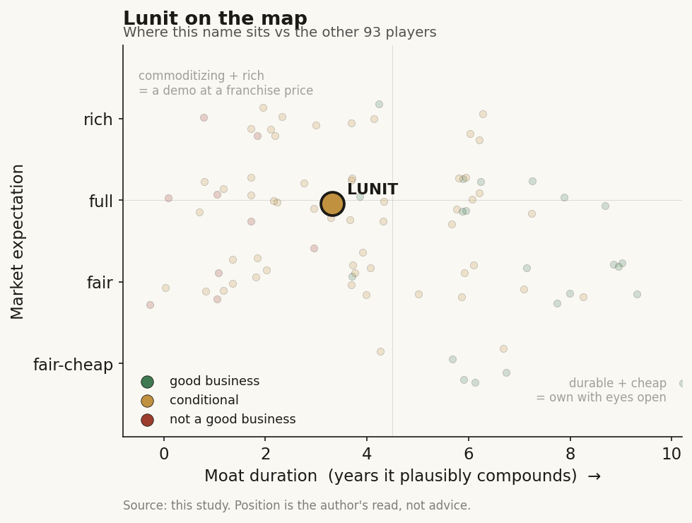

# Lunit (328130 / KOSDAQ (Korea))

> **The read.** Korea's AI-imaging champion has real global distribution and a rare profitable-adjacent path (2027 breakeven target), but the moat is thinner than the story - the cash today comes from a bought-in breast-density SaaS (Volpara), the crowded screening-AI market has no pricing power, and the high-margin pharma-biomarker leg (Scope) is still small. Priced for the champion narrative to convert into durable software economics that the segment mix has not yet proven.

**Snapshot**

| | |
|---|---|
| Listing | 328130 / KOSDAQ (Korea) |
| Region | Korea |
| Value-chain layer | L4-L6 - AI diagnostic-imaging + biomarker anchor |
| Archetype | AI-software vendor (per-seat/per-study screening SaaS + pharma-biomarker licensing) |
| Size | ~827bn KRW market cap (~$600m), 74.4m shares (6-Jul-26) [disclosed] |
| Revenue (latest) | FY25 83.1bn KRW, +53% YoY; overseas 92% [disclosed] |
| Moat verdict | conditional - real distribution + regulatory lead, weak pricing power |
| Expectation | full |
| Evidence quality | med - Korean-filer, thinner English disclosure than US peers |

## What it is
A Korean AI company that reads cancer images. Two product families: **Lunit INSIGHT** (AI that flags suspected cancer on chest X-rays, 2D/3D mammograms and screening scans - a radiologist's second reader) and **Lunit SCOPE** (AI that reads digital-pathology slides to score immuno-oncology biomarkers like PD-L1, sold to pharma and labs). In May 2024 it bought New Zealand-listed Volpara Health for $193m [disclosed], a breast-density and screening-workflow SaaS with a large US installed base - now "Lunit International," and the single biggest revenue line. It sits at L4-L6: the AI layer that turns a scan or a slide into a structured, billable read.

## Business model - how it makes money
Three engines, very different economics:

- **Volpara / Lunit International (the cash core, ~44% of revenue).** US-heavy breast-imaging SaaS: density assessment, risk, screening-workflow analytics, sold per-facility/per-study on recurring contracts. Q3'25 cumulative revenue 36.6bn KRW, +17% YoY [disclosed]. This is the recurring, sticky, US-distribution asset - and it was **bought, not built**.
- **Lunit INSIGHT (screening AI).** Chest X-ray + mammography detection, FDA-cleared, deployed across 4,500+ sites in 55+ countries [reported]. Q3'25 cumulative ~16.1bn KRW [disclosed]. Sold per-study/per-seat through OEM and distributor channels. Real volume, but a crowded market with limited standalone pricing power.
- **Lunit SCOPE (pharma biomarker, the margin leg).** Digital-pathology AI scoring PD-L1 and IO biomarkers, licensed to pharma (AstraZeneca collaboration) and diagnostics (Guardant, Leica Biosystems/Indica Labs) [disclosed]. FY25 SCOPE revenue crossed 10bn KRW, oncology +159% YoY [disclosed] - the fastest grower and the highest-value seam, but off a small base.

**Growth quality.** Headline +53% FY25 is partly the first full year of Volpara consolidation (only ~8 months in 2024) [disclosed]. Overseas is 92% of revenue [disclosed] - genuinely global, not a Korea-domestic story. But the mix tells the honest tale: the biggest, stickiest leg is acquired SaaS; the fastest, highest-margin leg (SCOPE) is still ~12% of revenue.

**Cash conversion.** Still loss-making. FY25 net loss ~ -47.4bn KRW, improved ~43% YoY [disclosed]; operating loss ratio fell from ~1.25x to ~1.0x of revenue [disclosed]. Management flagged a first month of positive operating cash flow (EBITDA) in Dec-2025 and guides to full-year breakeven by **2027** [disclosed]. Profitability is a trajectory, not a fact.

## Financial summary

| | FY24 | FY25 | Note |
|---|---|---|---|
| Revenue | 54.2bn KRW | 83.1bn KRW | +53% YoY [disclosed] |
| Overseas share | - | 92% (76.8bn KRW, +61%) | [disclosed] |
| Volpara / Intl | - | ~36.6bn (Q3 cum) | +17% YoY [disclosed] |
| INSIGHT | - | ~16.1bn (Q3 cum) | [disclosed] |
| SCOPE | - | >10bn FY | oncology +159% [disclosed] |
| Operating loss | - | ~ -63bn (Q3 cum) | ratio ~1.0x rev [disclosed] |
| Net loss | ~ -82.7bn | ~ -47.4bn | improved ~43% [disclosed] |
| Cash EBITDA | - | positive Dec-25 (monthly) | breakeven target 2027 [disclosed] |

Prices/figures as of FY25 results + 6-Jul-2026 unless tagged. Segment lines are Q3'25 cumulative (cleanest disclosed split); FY totals where stated.

## Value-chain position and competition
L4-L6: the AI layer sitting on top of imaging hardware (L1-L3 GE/Siemens/Hologic scanners, PACS) and feeding two downstream chains - screening/diagnosis (radiology) and drug-development/companion-diagnostics (pharma via SCOPE). Flow: image or slide in -> AI read out -> sold as a per-study screening aid (INSIGHT/Volpara) OR a biomarker score to pharma (SCOPE). The SCOPE leg is the one seam where an imaging-AI vendor becomes picks-and-shovels for oncology drug development - the same structural bridge TEM/Caris occupy from the genomics side, but Lunit reaches it from pixels rather than sequence.

Competition:
- **Screening AI (INSIGHT/Volpara turf):** ScreenPoint (Transpara), iCAD (now tied to Google Health, 20-yr deal), Densitas, Aidoc (broader triage). The breast-imaging AI market (~$4.7bn imaging market, 2025) is explicitly "crowded, no clear leader" [reported] - the tell that pricing power is weak.
- **Digital pathology / biomarker (SCOPE turf):** PathAI, Paige, Owkin, plus in-house pharma tooling. Fewer players, higher value, but longer sales cycles and reimbursement not yet settled.
- **Regional AI-imaging peers:** Airdoc (China retinal), AmCad / EverFortune / AILabs (Taiwan) - Lunit is the best-distributed of the ex-US/ex-China cohort, with a genuine US foothold via Volpara.

Edge: FDA-cleared breadth + a real US installed base (Volpara) + a differentiated pharma-biomarker product (SCOPE) most imaging-AI peers lack. That combination - global regulatory clearances, US distribution, AND a drug-development bridge - is scarce among non-US AI-imaging names.

## Moat
Two candidate moats, and they split:
- **Distribution + regulatory clearances - REAL but SHALLOW (~2-4 yr lead, not a monopoly).** 4,500+ sites, 55+ countries, FDA/CE breadth, plus Volpara's US base. This is a genuine head start and switching friction inside deployed workflows. But screening AI is crowded with clinically comparable rivals; clearances gate the shelf, not the price. Erosion tell: the market has "no clear leader" and reimbursement/pricing is contested - a lead, not a lock.
- **Pharma-biomarker data/relationships (SCOPE) - THE ONLY DURABLE-COMPOUNDING CANDIDATE, still unproven.** If SCOPE becomes the standard AI scorer embedded in pharma companion-diagnostic workflows (AZ, Guardant, Leica/Indica), that is a sticky, high-margin annuity where the buyer bears efficacy risk. But it is ~12% of revenue, US FDA clearance for SCOPE PD-L1 is not yet secured (CE only) [reported], and pharma deals are lumpy.

Net: the durable moat, if it exists, is SCOPE - and it is early. The cash today rests on a bought SaaS (Volpara) and a crowded screening product. Estimated durable-compounding duration ~3-5 years, contingent on SCOPE scaling past the pilot/lumpy-contract stage and on Volpara retention holding.

## Core variables
1. **[CORE] SCOPE scale and pharma conversion.** Does the high-margin biomarker leg grow from ~12% toward a third of revenue on recurring pharma/CDx contracts (not one-off pilots)? US FDA clearance for SCOPE PD-L1 is the gating catalyst. This is where any software-multiple re-rate has to come from.
2. **[CORE] Volpara retention + cross-sell.** The acquired US SaaS is the cash core (~44%). Does net retention hold and does Lunit successfully cross-sell INSIGHT (DBT/3D) into that base - the whole M&A thesis - or does +17% decelerate as integration synergies exhaust?
3. **[CORE] Path to 2027 breakeven vs cash burn.** Loss ratio fell to ~1.0x and Dec-25 hit monthly positive EBITDA; guidance is FY breakeven 2027 with ~20% opex reduction in 2026 [disclosed]. Does operating leverage arrive before the balance sheet forces a raise?

Below the line as noise: individual national-screening tender wins (Korea MOHW AI-imaging budget); prototype auto-reporting demos; quarterly INSIGHT site-count milestones.

## Bear case / key risks
A crowded-market screening vendor whose growth and cash core were largely acquired. The biggest, stickiest revenue line (Volpara, ~44%) was bought for $193m, not organically built, and grows only ~17%. The organic screening product (INSIGHT) competes in a market with "no clear leader" and thin pricing power - clearances are table stakes, not a moat. The one leg that could justify a software re-rate (SCOPE) is ~12% of revenue, lacks US FDA clearance, and depends on lumpy pharma contracts. Profitability is a 2027 promise resting on continued opex cuts, and the company is still loss-making with a shrinking (but non-trivial) cash runway. Disclosure is thinner than US peers - segment splits are Korean-filing cumulative figures, not clean quarterly software metrics (NRR, ARR, gross margin by segment are not cleanly reported).

Falsification watch: (1) SCOPE stalls sub-15bn KRW or a marquee pharma collaboration lapses - the re-rate thesis breaks; (2) Volpara retention/growth rolls over, proving the M&A was a one-time revenue step not a compounding base; (3) 2027 breakeven slips and a dilutive raise arrives first.

## The expectation read
Market cap ~827bn KRW (~$600m), down ~42% over the year, on 74.4m shares (6-Jul-26) [disclosed] - roughly ~10x FY25 sales, a rich multiple for a still-loss-making vendor whose fastest-growing organic leg is ~12% of revenue. The valuation implies the champion narrative converts: that SCOPE scales into a high-margin pharma annuity, that Volpara retention compounds rather than plateaus, and that 2027 breakeven arrives on schedule. Where the belief looks soft: the cash core is acquired SaaS in a crowded category with weak pricing power; the high-value leg is small, lumpy, and not yet US-cleared; and clean software KPIs (NRR, segment margins) are not disclosed to verify the "SaaS re-rate" story. The premium pays for a mix-shift that the current segment split has not yet demonstrated.

## Verdict
Real business with genuine global distribution and a rare, credible path to breakeven - but the moat is a 2-4 year distribution/regulatory lead in a crowded, low-pricing-power screening market plus a still-small, unproven pharma-biomarker option (SCOPE), not a durable data-network lock. Priced full for the champion story to convert into software economics the mix has not yet proven. Confidence: MEDIUM-HIGH on the trajectory facts (revenue, overseas share, loss narrowing, breakeven target all disclosed); MEDIUM on the verdict, gated on SCOPE scaling and US clearance; evidence quality capped at MEDIUM by thinner English disclosure for a Korean filer (no clean NRR/segment-margin/ARR).
