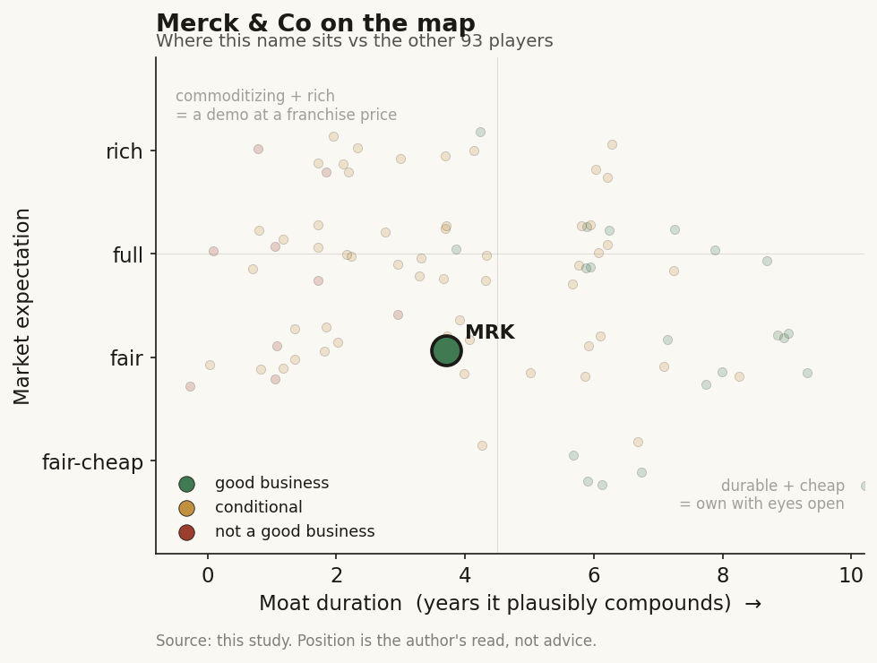

# Merck & Co (MRK / NYSE)

> **The read.** A ~$313bn diversified pharma incumbent whose whole role in this study is the study's key point in one company - the incumbent FUNDS the AI and KEEPS the value. AI-for-discovery is a cost-side efficiency bet and a hedge against the 2028 Keytruda cliff, not a revenue line; the equity is a Keytruda-succession question, and the AI content is a rounding error inside it. Good business, but the expectation reads full because the cliff is priced as more solved than it is.

**Snapshot**

| | |
|---|---|
| Listing | MRK / NYSE |
| Region | US |
| Value-chain layer | L9 incumbent (owns targets, trials, approval, distribution - buys AI-discovery as an input) |
| Archetype | pharma-incumbent (the risk-bearing drug owner every AI-discovery lab sells INTO) |
| Size | ~$313bn market cap (~$126.78/sh, 6-Jul-26) |
| Revenue (latest) | FY25 $65.0bn (+1%); TTM $65.8bn; Keytruda $31.7bn (~49% of total) |
| Moat verdict | durable at the franchise/regulatory level (patent-and-distribution moat); AI is not the moat |
| Expectation | full |
| Evidence quality | high |

## What it is
A global research-driven pharmaceutical company (human health + animal health), best known for Keytruda (pembrolizumab), the world's top-selling drug. In this study it is not a healthcare-AI name - it is the INCUMBENT that AI-drug-discovery labs sell into. It owns the expensive, value-capturing end of the chain: it picks the targets, runs the trials, wins the approvals, and controls distribution and pricing. AI-for-discovery is a supplier input and an internal efficiency tool sitting upstream of all of that. The single reason MRK matters to a healthcare-AI reader is that it is the clearest live example of the study's frame: the party that funds the AI is the party that keeps the value.

## Business model - how it makes money
A patent-protected drug franchise: spend heavily up front on R&D, win a molecule to approval, then earn a multi-year monopoly rent behind composition-of-matter patents and regulatory exclusivity before biosimilars erode it. Capital is spent in discovery/trials; value is captured at the branded-monopoly stage. Two structural facts frame everything:

- **Extreme concentration.** Keytruda alone was $31.7bn in FY25 [disclosed], ~49% of total revenue - one asset carrying roughly half the company.
- **The 2028 cliff.** Keytruda's US composition-of-matter patent begins to expire in 2028 [reported]; $25bn+ of annual revenue then faces biosimilar competition, with erosion that could approach ~80% absent mitigation [estimate]. Merck's defenses: a subcutaneous reformulation (Keytruda Qlex, US approval Sep-2025 [disclosed]) to extend exclusivity, indication expansion, and heavy business-development buying of the pipeline.

Where AI fits: on the COST side, not the revenue side. AI-for-discovery is meant to raise the hit-rate and speed of early research so the post-Keytruda pipeline arrives sooner and cheaper. It does not change the archetype - MRK still bears the ~40% Phase-II efficacy risk that no AI lab has yet moved, and still pays the trial bill. That is exactly why the incumbent keeps the value: it takes the risk the AI vendor does not.

## Financial summary
Top-line scale, kept tight - the AI/deal figures are immaterial next to it.

| Metric | Figure |
|---|---|
| Market cap | ~$313bn (~$126.78/sh, 6-Jul-26) [disclosed] |
| FY25 revenue | $65.0bn, +1% YoY [disclosed] |
| TTM revenue | ~$65.8bn [disclosed] |
| Keytruda FY25 | $31.7bn, +7% (~49% of total) [disclosed] |
| FY25 R&D expense | $15.8bn, -12% YoY (Merck Research Labs portion $10.8bn) [disclosed] |
| TTM net income | ~$8.9bn [disclosed] |
| Shares outstanding | ~2.47bn [disclosed] |

AI-discovery deal figures, for scale contrast:
- **Variational AI** (announced Sep-2025): generative-AI ("Enki" platform) design of small molecules against two Merck-designated targets; undisclosed upfront + milestones up to $349m biobucks [disclosed]. Committed cash is a fraction of that headline and is not separately disclosed.
- **Mayo Clinic** (announced Feb-2026): R&D collaboration pairing Merck's internal AI "virtual cell" technologies with Mayo's de-identified multimodal clinical/genomic data (Platform_Orchestrate); initial focus inflammatory bowel disease, atopic dermatitis, multiple sclerosis [disclosed]. No headline deal value disclosed.
- **Internal generative AI** (e.g. an internal GPT-style R&D assistant, "GPTeal") for lab, molecular-design, and regulatory-writing workflows [reported].

Read the contrast directly: R&D is $15.8bn/yr; the largest single external AI deal is up to $349m of MILESTONES (cash paid far less). AI is a rounding error on this P&L - which is the point.

> Flag: the context "Isomorphic-class deals, Cellarity, Variational" - Variational (Sep-2025) and Mayo Clinic (Feb-2026) are confirmed Merck & Co deals. A Merck & Co-Cellarity deal is [unverified]; Cellarity's disclosed large pharma partner is Novo Nordisk, and the AI-discovery deals with Exscientia/BenevolentAI belong to the separate, unrelated Merck KGaA (Darmstadt) - a common name-collision. "Isomorphic-class" here means the archetype (a frontier AI-discovery lab selling into a pharma incumbent), not a literal MRK-Isomorphic contract.

## Value-chain position and competition
MRK sits at the far downstream L9 incumbent node: it owns targets, trials, approvals, manufacturing, and global distribution/pricing. AI-discovery labs (Isomorphic, Recursion, Xaira, Variational, Iambic, and the tool vendors) sit upstream at L9b-L9c (structure/generation/selection) and sell candidates and optionality INTO firms like MRK. The value in a drug forms one layer down from the model - in the owned, de-risked, approved asset the incumbent carries through the clinic and sells behind a patent. That is where MRK lives.

What flows in: designed candidates, target hypotheses, and licensed molecules from AI vendors and biotech. What flows out: approved branded drugs, priced and distributed globally. The AI vendor captures a milestone; MRK captures the franchise.

Competition is at two very different levels:
- **As a pharma incumbent:** the other large-caps facing the same patent-cliff arithmetic - Pfizer, Bristol-Myers Squibb, AbbVie, J&J, AstraZeneca, Novartis - all buying AI-discovery inputs and all bidding for the same late-stage assets. This is the real competitive set for the equity.
- **As an AI-discovery buyer:** MRK is a customer, not a competitor, to the AI labs. Its "edge" over them is structural and permanent - it holds the capital, the regulatory relationships, the trial machine, and the distribution the labs will never build cheaply.

## Moat
Two moats, and only one is real for the equity:
- **Franchise + patent + distribution - DURABLE, but asset-specific and DECAYING on a clock.** The moat is Keytruda's patent-and-label monopoly plus Merck's global commercial and regulatory machine. It is genuinely strong - and genuinely dated: the core moat expires in 2028. Post-cliff durability depends entirely on whether the pipeline (much of it bought) replaces the lost rent. So the durable-compounding duration is a succession question, not a franchise-forever one - call it conditional, gated on 2028-2032 pipeline delivery.
- **AI-for-discovery - NOT A MOAT.** The AI tools and vendor deals are commoditizing inputs available to every large-cap buyer; being an early adopter is table stakes, not an edge. Where MRK does have a durable advantage over the AI labs is the opposite of AI - it is the willingness and capital to bear clinical risk and own distribution. The incumbent's moat is precisely the thing AI does not touch.

Net: the moat is real but it is the old pharma moat (patent + trials + distribution), on a countdown to 2028; AI does not extend it, it just tries to refill the pipeline behind it.

## Core variables
1. **[CORE] Keytruda cliff mitigation (subcutaneous conversion + indication defense).** How much of the $31.7bn base survives 2028 - Qlex subQ uptake, formulation/method-of-use exclusivity, and biosimilar timing. This one variable dominates the equity; AI is downstream noise beside it.
2. **[CORE] Post-Keytruda pipeline delivery (bought + discovered).** Does the acquired and internally discovered pipeline (oncology, cardiometabolic, immunology, animal health) generate enough new franchises to replace the rent by 2028-2032? This is where AI-for-discovery COULD matter - but only if it measurably raises hit-rate/speed, which is unproven at the P&L level.
3. **[CORE] Capital allocation / business-development discipline.** With $15.8bn/yr R&D and an active $1bn-$15bn deal appetite, does MRK overpay to fill the gap? The cliff creates a forced-buyer risk - the classic incumbent trap.

Below the line as noise for the equity: any single AI-discovery deal headline (Variational $349m, Mayo, internal GenAI); early-stage discovery-AI "productivity" claims with no approved-drug proof; animal-health quarter-to-quarter.

## Bear case / key risks
A one-drug company facing a 2028 wall it may not have refilled in time. ~49% of revenue is a single asset whose core US patent starts expiring in 2028, with erosion that could approach ~80% on the exposed base [estimate]; the subcutaneous switch and indication defense soften but do not eliminate it. The replacement pipeline is heavily BOUGHT, which means execution and overpayment risk, not just science risk - and the AI-for-discovery narrative that is supposed to help sits far upstream of any approved revenue and has produced zero approved drugs industry-wide as of 2026. If Qlex conversion disappoints AND the bought pipeline underdelivers, the ~$313bn cap is defending a shrinking franchise.

Falsification watch: (1) Qlex subcutaneous conversion runs well below plan / biosimilars arrive on-schedule and steep - the cliff is worse than priced; (2) a marquee acquired late-stage asset fails a pivotal trial - the refill thesis breaks; (3) AI-discovery deals stay immaterial to approvals for years - confirming AI is a cost tool, not a growth lever, and never rescues the top line.

## The expectation read
At ~$126.78 (6-Jul-26), ~$313bn cap on ~$65.8bn TTM revenue and ~$8.9bn TTM net income, MRK trades near a below-market earnings multiple - the tape is explicitly pricing the Keytruda cliff, not ignoring it. The question is whether it is priced as MORE solved than it is. The price appears to assume the subcutaneous conversion holds a large slice of the franchise AND that the bought-and-discovered pipeline refills the rent on schedule. What the market is NOT paying for - correctly - is AI-for-discovery: none of the AI content is in the multiple, and none should be, because it is upstream of revenue and unproven at the approval line. That is the study's point priced in reverse: the incumbent's value rests on the risk it bears (trials, distribution, the cliff), and none of it rests on the AI it funds.

Where the belief looks soft: the mitigation-plus-refill path has two independent execution legs (subQ conversion AND pipeline delivery) that both have to work by 2028-2032, and the forced-buyer dynamic raises the odds of overpaying to close the gap.

## Verdict
A good, durable pharma franchise whose entire equity thesis is Keytruda-cliff succession, not AI - the expectation reads full because the price assumes both the subcutaneous defense and the bought pipeline land on time. For this study MRK is the cleanest incumbent example of the core claim: it funds the AI (Variational, Mayo, internal GenAI) and keeps the value, because it - not the AI vendor - bears the clinical risk and owns distribution. AI is a cost-side efficiency hedge here, never the moat and never the growth line. Confidence: HIGH on the facts (revenue, Keytruda concentration, R&D, cliff timing, deal terms all disclosed/current); MEDIUM on the verdict, which hinges on two unresolved execution variables (subcutaneous conversion and pipeline refill) that resolve 2028-2032.
