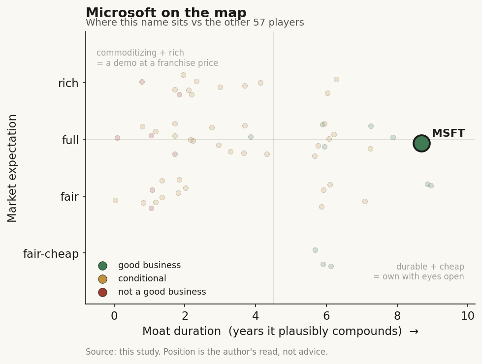

# Microsoft (MSFT)

> **The read.** A good business at a roughly fair-to-full expectation - but NOT a healthcare-AI expression: Dragon Copilot is a durable infra-toll fragment inside an AI-capex bet, immaterial to the multiple.

**Snapshot**

| | |
|---|---|
| Listing | MSFT / Nasdaq |
| Region | US |
| Value-chain layer | L0 (Azure/EHR-adjacent cloud rail) + L6 (ambient clinical-workflow app) |
| Archetype | infra toll (with a small SaaS app riding on top) |
| Size | ~$2.9tn cap |
| Revenue (latest) | $281.7bn FY2025, +15% |
| Moat verdict | durable at the platform layer (5-10+ yr); commoditizing at the app layer (~1-3yr) |
| Expectation | fair-to-full |
| Evidence quality | high (structural read + corporate financials); med (Dragon Copilot specifics) |

## What it is
A ~$282bn-revenue diversified software/cloud platform whose healthcare-AI exposure is **Dragon Copilot** - the Nuance ambient-scribe/clinical-documentation franchise (Dragon Medical One + DAX + PowerScribe), acquired for $19.7bn all-cash in Mar 2022 and rebranded onto Azure in Mar 2025. The point of this profile: Dragon Copilot is the ambient-scribe cohort's one listed name, and it is **immaterial to MSFT** - the read is structural, not a P&L line.

## Business model - how it makes money
- **Corporate (the actual business).** FY2025 (ended Jun 2025): revenue **$281.7bn, +15%**; operating income **$128.5bn, +17%** (~46% op margin); net income **$101.8bn** (~36% net margin). Microsoft Cloud gross margin **~69%**, down ~1-2pt as AI-infra depreciation/energy flow through COGS faster than mix offsets. Azure crossed **$75bn, +34%**.
- **Revenue archetype:** classic infra toll - Azure consumption + per-seat licensing; usage-gated, reimbursement-INDEPENDENT (no CPT code, no payer adjudication between the work and the dollar). Dragon Copilot itself is per-provider-per-month SaaS (reseller lists ~$369-600/provider/mo) plus the Azure inference it consumes.
- **Growth quality:** capital-hungry at the corporate level but on the *right* side - MSFT is the toll-COLLECTOR building the AI-infra base that the entire healthcare-AI app cohort rents. Cash conversion is elite (FY25 operating cash flow well over $130bn scale, self-funding a ~$80-90bn/yr capex build). Incremental ROIC on the software franchise is very high; the marginal AI-capex dollar is the open question, not the healthcare piece.

## Financial summary
| Metric (FY2025, ended Jun 2025) | Figure |
|---|---|
| Revenue | $281.7bn, +15% |
| Operating income | $128.5bn, +17% (~46% op margin) |
| Net income | $101.8bn (~36% net margin) |
| Microsoft Cloud gross margin | ~69% (down ~1-2pt) |
| Azure | $75bn, +34% |
| Operating cash flow | well over $130bn scale |
| Capex build | ~$80-90bn/yr |
| Nuance acquisition | $19.7bn all-cash, Mar 2022 |

## Value-chain position and competition
Dual position. **L0:** Azure is the compute/EHR-adjacent rail every scribe and model layer above it pays; MSFT owns the scarce input (the cloud + the enterprise security stack + the Epic/Oracle-adjacent distribution surface). **L6:** Dragon Copilot drafts the note from the encounter back into the EHR - the same clinical-workflow slot Abridge/Ambience occupy. What flows: patient audio -> ASR/LLM draft -> structured note; and underneath, Azure consumption + per-seat fees -> MSFT. Nuance's distinction is that it **migrated UP** from a rented L6 app into an L0-anchored toll - the one ambient player that stopped being a pure app.

In the scribe slot Dragon Copilot competes with **Abridge (~30% share, $5.3bn mark), Ambience (~13%, $1.25bn mark), Suki, Nabla, Commure, Amazon HealthScribe**. Its edge is **distribution, not transcription quality**: the legacy Dragon Medical One / Nuance install base (Nuance served ~77% of US hospitals pre-deal, 600+ systems on DAX) + Azure bundling + enterprise security/compliance. The transcription-to-note function itself commoditizes toward the underlying LLM - MSFT's advantage is that it *owns* the LLM (OpenAI-partnered) and the cloud it runs on, so it captures the inference COGS others pay. **The shared threat:** Epic's native AI Charting (launched 4 Feb 2026, ~$80/provider/mo, 42% acute-EHR share) envelops the standalone scribes - but Epic's tool runs largely on cloud MSFT still tolls, softening the blow for MSFT specifically vs the pure-plays.

## Moat
Two different verdicts stacked:
- **The Dragon Copilot app (L6):** workflow embedding = CONDITIONAL/REFUTED for a rented slot. As an app it owns neither the model below nor Epic's distribution beside it; a standalone scribe moat here is ~1-3yr and enveloping.
- **The MSFT/Azure toll (L0):** "become the platform" survives - decade-plus. This is the Ch5 through-line exactly: *the durable position was to BECOME the platform, not rent a slot.* Nuance did that (Dragon Copilot on Azure), so MSFT holds an **infra toll**, not a scribe. Duration: **durable (5-10+ yr) at the platform layer; ~1-3yr commoditizing at the app layer.** Verdict class: **code-ownership/embedding survives ONLY because it became infrastructure** - not a clearance or model moat.

## Core variables
1. **AI-infra capex-to-return at the Azure level** - the ~$80-90bn/yr build and whether Cloud GM (~69%) stabilizes or keeps compressing as GPU/silicon depreciation flows through COGS. This is the whole MSFT story; healthcare is a rounding error inside it.
2. **Azure consumption growth (+34%)** - the toll base; healthcare-AI inference (scribes, models, EHR AI) is one incremental driver of it, MSFT captures it regardless of which app wins.
3. **Dragon Copilot share trend inside the enveloped scribe war** - does MSFT hold/grow the clinical-documentation slot as Epic enters, or does it become an arms-dealer collecting Azure tolls while the app share bleeds? Either outcome is fine for MSFT; it's the *tell* on whether "become the platform" is working.

(Noise, excluded: Dragon Copilot pricing/seat counts as a P&L driver - immaterial; near-term Nuance revenue disclosure - MSFT does not break it out.)

## Bear case / key risks
For the **healthcare thesis specifically**: Dragon Copilot is a feature inside a $282bn company, and the ambient-scribe sub-sector it anchors is being enveloped by Epic - so there is **no clean public healthcare-AI long here**; buying MSFT for Dragon Copilot is a category error. For **MSFT overall** (the real bear): the ~$80-90bn/yr AI-capex build is being depreciated against Cloud GM that already slipped to ~69%; if AI-workload monetization lags the depreciation schedule, the toll's incremental ROIC compresses and the stock's premium - priced on durable ~30%+ Azure growth - de-rates. The healthcare piece neither adds to nor defends against that; it is exposure to the *right side* of the AI-infra trade, at a size that cannot move the needle.

## The expectation read
MSFT trades ~**$384/share, ~$2.9tn cap, forward P/E ~20x, trailing ~23x** (Jul 2026). At ~20x forward on ~36% net margins, the multiple implies the market believes: (a) Azure sustains ~30%+ growth and the AI-capex cycle earns its cost of capital, and (b) Cloud GM stabilizes near ~69% rather than compressing further. **Where the belief looks soft:** the multiple is an *infra-AI* bet, not a healthcare-AI bet - Dragon Copilot contributes ~nothing to the expectation embedded in the price, so any investor holding MSFT "for healthcare AI" is mispricing what they own. The soft spot is capex-vs-monetization timing at the Azure layer (the ~1-2pt GM slip is the early tell), **not** anything in the clinical-documentation franchise. No buy/sell view expressed.

## Verdict
**Good business, at a roughly fair-to-full expectation - but NOT a healthcare-AI expression: Dragon Copilot is a durable infra-toll fragment inside an AI-capex bet, immaterial to the multiple.** Confidence: **HIGH** on the structural read (platform-vs-app, immateriality, moat class) and MSFT corporate financials; **MEDIUM** on the Dragon Copilot share/pricing specifics (MSFT does not break out the segment).
