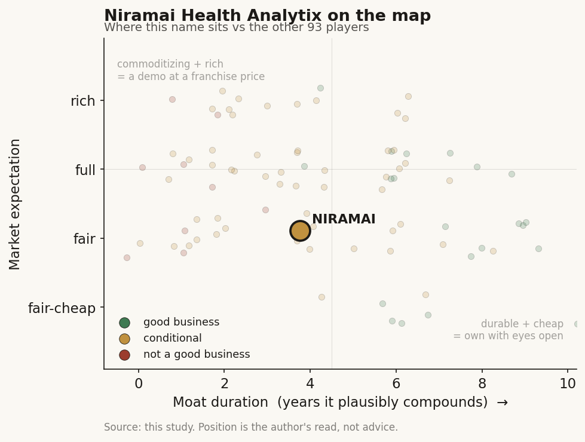

# Niramai (private (India))

> **The read.** A clinically validated, radiation-free AI breast-screening tool built for the exact market mammography cannot reach (low-resource, dense-breast, no-radiologist) - a real product with a real regulatory footprint, but a ~$9m-total-funding, ~74-person company selling a low-ASP screening test into price-sensitive public-health channels, so the question is not whether it works but whether it can ever scale into a business. Size for mission-fit optionality, not for a venture return you can underwrite from the outside.

**Snapshot**

| | |
|---|---|
| Listing | private (India); no traded stub, exposure only via private rounds |
| Region | India (Bengaluru-based; deployed across Asia/Africa/Europe) |
| Value-chain layer | L6-L7 - AI diagnostic-imaging application (screening triage) |
| Archetype | dx-application / per-scan screening tool + hardware-plus-cloud |
| Size | ~$8.63m total disclosed funding [disclosed]; ~74 employees (2026) [disclosed] |
| Revenue (latest) | INR 10-50 Cr band (~$1.2-6m) FY25 [disclosed - statutory band] |
| Moat verdict | conditional - real clinical + regulatory asset, weak pricing power |
| Expectation | no clean market price (private, illiquid) |
| Evidence quality | med - product/clinical well-documented, financials thin/redacted |

## What it is
An Indian deep-tech company (founded 2016 by Geetha Manjunath and Nidhi Mathur) whose product, Thermalytix, is a radiation-free, no-touch, no-compression breast-cancer screening test. A high-resolution thermal sensor placed ~3 feet from the patient captures a heat map of the chest; a cloud AI reads ~400,000 temperature points per scan (claimed 0.02 C sensitivity vs ~1 C for conventional thermography [disclosed - company]) and outputs a quantitative breast-health score plus a triage flag, reviewed by a radiologist. It sits at the L6-L7 AI diagnostic-imaging application layer - a screening/triage tool, not a diagnosis, and not a therapeutic.

## Business model - how it makes money
Hardware-plus-cloud, sold B2B into three channels:

- **Device sales + service contracts.** A compact clinic unit or a low-cost handheld device, sold to hospitals, diagnostic chains, and independent practitioners, with recurring maintenance/service and a per-scan cloud-analysis fee [reported].
- **Screening programs / camps.** Per-woman-screened contracts with public-health bodies, NGOs, and grant funders for large population campaigns (a state program in Punjab screened ~15,069 women over 18 months [disclosed]).
- **Corporate wellness.** Employer-paid preventive screening.

The economics are the whole problem. This is a **low-ASP screening test aimed at a market that cannot pay Western prices** - the entire point is to be cheaper and more accessible than mammography. Reported partners include Apollo, HCG, and Medanta-type hospital groups, and 200+ hospitals across 30+ cities [reported]. Capital-light on the software, but the revenue is grant- and campaign-dependent, lumpy, and gated on public-health budgets rather than recurring commercial demand. Statutory filings put FY25 revenue in the INR 10-50 Cr band (~$1.2-6m) [disclosed - band]; note that third-party aggregators circulating a "~$35m revenue / ~$39m funding" figure are unverified estimates that conflict with both the statutory band and the ~$8.63m disclosed-funding total - **do not cite them** [unverified].

## Financial summary
Private; disclosed figures only, tagged.

| Item | Detail |
|---|---|
| Total disclosed funding | **~$8.63m** across ~9 rounds, ~27 investors [disclosed - aggregator] |
| Largest round | **~$7m Series A**, Nov 2018, led by **pi Ventures** [disclosed] |
| Later round | undisclosed amount, led by pi Ventures w/ Binny Bansal (Flipkart co-founder), reported 2023-24 [reported - amount undisclosed] |
| Key investors | pi Ventures, Ankur Capital, Axilor Ventures, Dream Incubator, BeeNext, 500 Global [disclosed] |
| Grant funding | Bill & Melinda Gates Foundation research support; SAMRIDH recoverable grant (50,000-women screening program); CDC/UK-linked support [reported] |
| FY25 revenue | INR 10-50 Cr (~$1.2-6m) [disclosed - statutory band] |
| Headcount | ~74 (2026) [disclosed] |
| Valuation | NOT disclosed (redacted in filings) [disclosed - undisclosed] |

## Value-chain position and competition
Occupies the L6-L7 AI diagnostic-imaging application seam: proprietary thermal hardware (L4-ish) feeding a cloud AI screening layer (L6-L7), output is a triage score, not a diagnosis (biopsy/mammography confirm downstream). Flow: patient -> thermal scan -> cloud AI score + radiologist review -> recall/no-recall. Value is captured one step down from the sensor, in the algorithm's ability to triage accurately at near-zero marginal cost per additional scan.

Competition splits three ways:
- **The incumbent modality it must displace: mammography** (GE HealthCare, Hologic, Siemens) - the reimbursed, guideline-endorsed standard. Thermalytix does not beat it head-to-head; it wins only where mammography is absent, unaffordable, or fails (dense breasts, no radiologist, radiation aversion).
- **AI mammography-reading peers** (Lunit, iCAD, and other CAD vendors) - these ride on top of the mammogram rather than replacing it, so they inherit its reimbursement and installed base; different, better-monetized game.
- **Other low-resource / thermography AI screeners** - a thin, fragmented field; Niramai's edge here is the peer-reviewed clinical trail and the US-FDA-cleared hardware, which most thermography players lack.

Edge: the only clear one is being purpose-built and clinically validated for the un-served segment - dense breasts, no radiation, no radiologist, low cost - not for the reimbursed core market.

## Moat
Two candidate moats; they split.

- **Clinical validation + regulatory footprint - CONFIRMED but narrow (~3-5 yr lead).** Peer-reviewed studies (JCO Global Oncology, BMJ Open, Frontiers) report Thermalytix sensitivity ~88-95% / specificity ~83-89% across cohorts, non-inferior to mammography overall and claimed better in dense breasts [disclosed]. Regulatory: US FDA 510(k) clearance (K212965, Mar 2022) for the SMILE-100 hardware for **adjunctive** thermal imaging, CE Mark for Thermalytix, CDSCO (India), ISO 13485/27001, MDSAP [disclosed]. This is a genuine, hard-to-replicate asset - a solo thermography startup with a published trail and an FDA-cleared device is rare. But it is a lead, not a monopoly: the FDA clearance is adjunctive (supplements, does not replace), and Thermalytix itself is not US-FDA-cleared as a standalone screen.
- **Data flywheel - WEAK.** More scans should sharpen the model, but the training corpus is not a structural lock; a funded competitor with access to thermal + outcome data could close it, and thermography as a modality carries decades of clinical skepticism that no single company's data fully erases.

Net: the durable moat is the clinical-plus-regulatory package aimed at an un-served niche, capped by low pricing power and the adjunctive regulatory status. Estimated durable-lead ~3-5 years, contingent on staying ahead on validation and on the niche not being addressed more cheaply by a phone-camera or ultrasound-AI approach.

## Core variables
1. **[CORE] Unit economics of a low-resource screen.** Can a test priced for public-health India/Africa clear device cost + cloud cost + radiologist review and still fund the company off recurring demand rather than grants? The entire business rests here, and the statutory revenue band says it is not yet proven at scale.
2. **[CORE] Channel conversion - grant/pilot to recurring commercial.** Population campaigns (Punjab ~15k women, SAMRIDH 50k) prove the tech works at scale; they do not prove a repeatable paying customer. The variable is whether pilots convert to standing contracts (public-health line items, insurer coverage, standing hospital use) or reset to zero when the grant ends.
3. **[CORE] Regulatory upgrade path.** Moving from adjunctive to a standalone-screening indication - especially a US/EU standalone clearance for Thermalytix, not just the SMILE-100 hardware - is what would unlock developed-market reimbursement and a real ASP. Absence of that clearance caps the addressable pool.

Below the line as noise: headline "22 countries" deployment counts; individual camp totals; the exact undisclosed round size.

## Bear case / key risks
A validated tool is not yet a business. Revenue sits in a ~$1-6m statutory band after a decade and only ~$9m raised; headcount is ~74; the later funding round's size was not disclosed, which for a growth-stage medtech usually signals a flat or difficult raise. The product is deliberately aimed at the least-monetizable market on earth - low-resource, price-sensitive, grant-funded - so even total clinical success may not produce venture-scale returns. Thermography as a modality carries a long tail of clinical skepticism and a mixed regulatory history; the FDA clearance is adjunctive hardware only, not a standalone-screening endorsement, so it cannot displace mammography in reimbursed markets. And the un-served niche it owns could be attacked more cheaply by handset-based AI or portable-ultrasound AI, collapsing the one place it has pricing power.

Falsification watch: (1) revenue stays in single-digit-$m for another cycle - the model does not scale off grants; (2) a marquee population program lapses without a recurring successor - pilots are not customers; (3) a competing low-cost modality (ultrasound-AI, phone-camera) reaches non-inferiority in the same niche - the moat's one advantage is commoditized.

## The expectation read
No clean market price - private, illiquid, valuation redacted, no traded stub. What can be said: the company has spent a decade and ~$9m to build a clinically credible, FDA-touched, CE-marked screening tool that demonstrably detects small tumors in exactly the population mammography fails, and has translated that into large public-health screening programs - a real accomplishment on the clinical and mission axes. What the (undisclosed) private mark would have to assume is the part the evidence does not yet support: that a sub-$6m-revenue, grant-and-campaign-dependent tool converts into a self-funding commercial business with pricing power, and/or secures the standalone regulatory upgrade that would open reimbursed developed markets. On the outside data, that is a hope, not a demonstrated trajectory.

## Verdict
**Real, validated, mission-fit product - not yet a demonstrated business; the clinical + regulatory asset is genuine and scarce, but a ~$9m-funded, ~74-person company selling a low-ASP screen into grant-funded public-health channels has to prove it can convert validation into recurring, priced demand, and there is no outside evidence it has. Treat as high-conviction on the science and the social value, low-conviction on the financial return, and unpriceable from the outside (private, redacted). Confidence: HIGH on the clinical/regulatory facts (published trials, FDA 510(k) K212965, CE, headcount all disclosed); LOW on any financial or valuation read (revenue is a statutory band, funding partly undisclosed, aggregator figures unreliable).**
