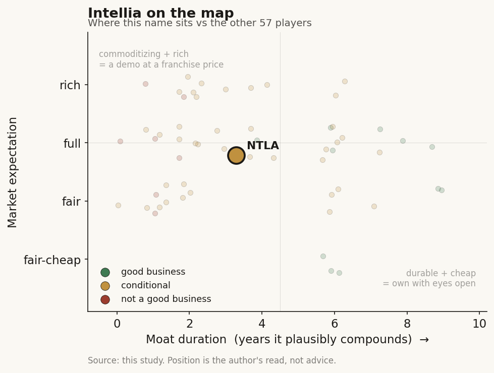

# Intellia (NTLA)

> **The read.** The cohort's clearest clinical winner - a genuinely de-risked in-vivo editing platform - but priced at a full expectation that has already banked the lonvo-z approval and pays up-front for a commercial ramp and ATTR share that both face real, unpriced friction.

**Snapshot**

| | |
|---|---|
| Listing | NTLA / Nasdaq |
| Region | US |
| Value-chain layer | L9c-L9e (selection / owned-asset / clinical development) |
| Archetype | drug-owner (milestone-and-royalty own-pipeline biotech) |
| Size | ~$2.45B market cap |
| Revenue (latest) | Q1'26 collaboration revenue $15.0M (partner economics, not a product ramp) |
| Moat verdict | conditional |
| Expectation | full |
| Evidence quality | high |

## What it is
An in-vivo CRISPR/Cas9 therapeutics company that turns a target genomic edit into a one-time systemic medicine delivered by LNP to the liver. It is the cohort's de-risking leader: lonvo-z posted the field's first in-vivo-editing Phase 3 win.

## Business model - how it makes money
- **Revenue archetype:** near-zero product revenue today. Q1'26 collaboration revenue $15.0M - R&D-service/partner economics, NOT a product ramp. Value is a probability-weighted string of clinical readouts, then a one-time-cure durable-cash annuity for approved assets.
- **Growth quality: not organic compounding.** Growth here is discrete re-ratings on binary data events, funded by dilution + partner biobucks. There is no revenue growth rate, gross margin, incremental ROIC, or cash-conversion line to decompose - the 3-statement is dominated by R&D opex and a burn line. The biotech rule applies: look only at cash and burn; the path matters more than any single product.
- **Capital intensity:** capital-HUNGRY and cash-negative by construction. ~$115M/qtr gross opex, ~$100M/qtr net cash burn; the recurring April equity raise is the dilution tell.

## Financial summary

| Metric | FY25 | Q1'26 |
|---|---|---|
| Net loss | $95.8M (-25.6% YoY) | $96.2M ($0.81/sh; beat consensus ~$0.93 loss by ~13%) |
| R&D expense | -24.1% YoY post-restructuring, ~$88.7M/qtr-scale run-rate | $80.7M |
| G&A expense | - | $34.8M |
| Gross opex | - | ~$115M/qtr |
| Net cash burn | - | ~$100M/qtr |
| Collaboration revenue | - | $15.0M |
| Cash + marketable securities | - | $517.2M (31-Mar-26) |
| Post-raise runway | - | +~$207M gross (April 2026 raise) → funded "at least into 2028" |

Figures tagged: Q1'26 net loss, R&D, G&A, cash, collaboration revenue and runway are company-disclosed; the consensus beat and FY25/restructuring run-rate are reported; the ~$115M gross opex / ~$100M net burn are derived.

## Value-chain position and competition
- A **vertically-integrated therapeutic developer sitting ON the editing modality**, not a tool/reagent vendor. It occupies **L9c (selection - which edit)**, **L9d/L9e (the owned clinical asset + development)**. The Cas9 enzyme itself is the commoditizing input (the "model is the door, not the moat" structure); value forms one layer down in the owned asset the edit enables.
- **What flows:** a defined corrective edit → LNP cargo → liver hepatocytes → durable knockdown/correction from a single dose. The choke point is **NOT the edit and NOT liver efficacy - it is DELIVERY.** NTLA is entirely on the paved road (LNP-to-liver): lonvo-z (KLKB1 knockdown for HAE) and nex-z (TTR knockdown for ATTR). It has **no extra-hepatic (CNS/lung/muscle) program of value** - the same delivery wall that caps the whole cohort.
- **Within the modality (same liver targets):** CRSP (Casgevy commercial + in-vivo CTX310/320/460), BEAM (base editing, BEAM-302 AATD human POC), PRME (prime editing, distressed tail). NTLA leads the cohort on de-risking - lonvo-z is the field's first in-vivo pivotal WIN; the race is decided by human data + delivery execution, not editor elegance.
- **Within the DISEASE (the harder competition):** a one-time cure competes against entrenched chronic franchises. In HAE (lonvo-z, first indication): Takeda's Takhzyro, CSL's Andembry/Haegarda, BioCryst's Orladeyo - repeat-dosing incumbents a cure would displace. In ATTR (nex-z): a crowded, fast-growing market NTLA enters LAST - Pfizer tafamidis (Vyndaqel/Vyndamax, entrenched), BridgeBio Attruby ($180.6M Q1'26 sales), Alnylam Amvuttra/vutrisiran ($889.9M Q1'26, +187% YoY). nex-z's pitch is "one dose vs chronic" but it must beat a $3.5bn+ run-rate of approved, safe, oral/quarterly options - with a differentiation-vs-adoption burden, not a clean field.
- **Edge:** first-mover in-vivo pivotal validation + LNP-to-liver delivery execution. **Lack:** the editor is not a moat; delivery beyond liver is unsolved; ATTR is a latecomer's fight against established sales.

## Moat
- **Applies the pharma-distribution / own-pipeline moat (owned asset vs a risk-bearing counterparty) - verdict CONDITIONAL**, and it is the OWNED ASSET, not the editor, that carries value. The Cas9/editing IP is the commoditizing input; the only defensible layer is the owned clinical asset with a granted approval and (for HAE) a cure-durability lock-in.
- **Durable vs commoditizing:** the science (base/prime/nuclease editing) diffuses - academic labs seeded the whole toolbox - so **NOT a compounding moat in the durable sense**. It is **binary optionality**: an approved lonvo-z creates a real, defensible franchise (regulatory + manufacturing + one-time-cure switching cost); everything pre-approval is a shot on goal at unchanged odds.
- **Estimated duration:** ~2-3yr structural watch until approval crystallizes value; post-approval a lonvo-z franchise could compound ~5-10yr on cure-durability + limited direct one-shot rivals - but capped by the cure-economics paradox (no refill revenue; slow, access-throttled ramp - cf. Casgevy $116M FY25 despite years of hype).

## Core variables
1. **Lonvo-z HAE approval + launch execution (the master de-risking-to-cash variable).** Ph3 HIT: 87% mean monthly attack reduction vs placebo; **62% of recipients attack-AND-therapy-free (wks 5-28) vs 11% placebo**; rolling BLA, filing 2H26, **US launch guided 1H27**. This is the first realizable product cash and the whole near-term re-rate.
2. **nex-z ATTR safety + competitive traction (the swing risk).** FDA imposed clinical holds Oct-2025 after a Grade-4 liver-transaminase/bilirubin event; **holds lifted Jan/Mar-2026** with enhanced LFT monitoring + steroid mitigation, screening resumed in MAGNITUDE (ATTR-CM) / MAGNITUDE-2 (ATTRv-PN). Both the safety tail AND whether a one-shot can take share from Amvuttra/Attruby/tafamidis matter.
3. **Cash runway vs next inflection.** Into 2028 on ~$100M/qtr burn after the April raise - adequate to lonvo-z launch, but the serial-dilution pattern is the pre-product survival variable.

*(Second-order, held below the line: editor safety/precision differentiation; Cas9 IP overhang (Broad vs Berkeley); cure-vs-refill economics; pipeline breadth ex-liver.)*

## Bear case / key risks
- **The edit being selectable does not make the biology or the business work.** lonvo-z is de-risked, but nex-z carries a gene-editing-specific safety tail (the Oct-2025 Grade-4 LFT hold was real, and a permanent edit cannot be dose-reduced or withdrawn).
- **ATTR is a latecomer's fight, not a green field.** nex-z arrives behind three approved, growing franchises (Amvuttra $890M/qtr and climbing); "one dose" must overcome physician/patient preference for reversible, well-tolerated chronic dosing - the cure-durability argument cuts both ways.
- **Cure-economics paradox.** A successful one-time edit is an annuity with NO refills; Casgevy's slow ramp ($116M FY25) shows manufacturing/conditioning/access friction throttles cure revenue for years - so even a lonvo-z approval may under-deliver vs the re-rate the tape implies.
- **Capital intensity + binary funding.** ~$100M/qtr burn, serial dilution (April 2026 raise), and a business whose value is a string of binaries where one bad readout can strand a program AND close the financing window simultaneously.
- **Refuting evidence that breaks the bear:** a clean lonvo-z launch converting to real, durable HAE revenue AND nex-z posting differentiated ATTR data with no further safety signal - proof the platform ships product, not just readouts.

## The expectation read
- ~$17.65 × ~115.8M sh = **~$2.45B market cap**; ~$0.7B cash → **~$1.9B enterprise value** on essentially zero product revenue. There is no earnings or sales multiple - the entire EV is a probability-weighted NPV of the pipeline.
- **What the market believes:** the ~$1.9B EV prices lonvo-z as an approvable, launchable HAE franchise (a de-risked one-time cure) PLUS meaningful nex-z ATTR optionality - i.e. the tape has largely absorbed the Ph3 win and is now paying for a successful commercial launch and for nex-z carving ATTR share.
- **Where the belief looks soft:** (a) **cure-ramp realism** - the EV implicitly assumes a lonvo-z ramp faster than the Casgevy precedent suggests one-time cures achieve; (b) **nex-z ATTR is priced as upside but faces the market's toughest competition** (Amvuttra's ~$890M/qtr momentum) with a fresh safety-hold memory; (c) **dilution is under-weighted** - into-2028 runway means at least one more raise before lonvo-z self-funds, so per-share NPV faces known share creep. The soft spot is not "does the science work" (lonvo-z answered that) but "does the CASH show up at the size and speed the multiple assumes."

## Verdict
A genuinely de-risked platform - the cohort's clearest clinical winner - priced at a FULL expectation: the tape has banked the lonvo-z approval and is paying up-front for a commercial ramp and nex-z ATTR share that both face real, unpriced friction (cure-economics drag, latecomer ATTR competition, further dilution). Good asset, demanding expectation. *Confidence: medium-high on the clinical/cash facts (all Q1'26 / IR); medium on the expectation read - pre-revenue NPV is model-sensitive and the ATTR commercial outcome is genuinely uncertain.*
