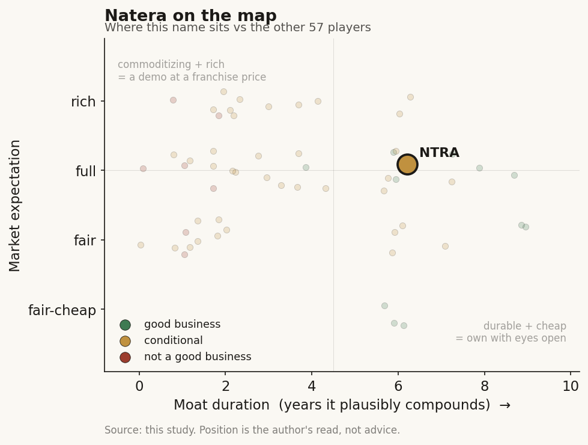

# Natera (NTRA)

> **The read.** A genuinely good business - category-leading tumor-informed MRD, a structurally rising ~65% gross margin, and a cash inflection landed without heavy dilution - but priced at a full expectation that already assumes the uncontracted Signatera ASP climb to $2,000 and durable payer coverage both come in.

**Snapshot**

| | |
|---|---|
| Listing | NTRA / NASDAQ |
| Region | US |
| Value-chain layer | L3-L5 (assay design + CLIA lab + AI-bioinformatics interpretive call) |
| Archetype | Per-test / per-scan fee (Ch4 Archetype 01), with a data-attach optionality tail |
| Size | ~$40bn market cap, ~$34bn EV |
| Revenue (latest) | Q1'26 $696.6m, +38.8% YoY; FY25 $2,306m, +35.9% |
| Moat verdict | Conditional - coverage/evidence flywheel, ~5-8yr, capped by CMS repricing |
| Expectation | Full |
| Evidence quality | High (business/figures); moderate (expectation read) |

## What it is
A CLIA/CAP molecular-diagnostics lab built on a proprietary cell-free-DNA / SNP platform, selling per-test genetic assays across women's health (Panorama NIPT, Horizon carrier, Fetal Focus), oncology (Signatera tumor-informed MRD, the crown asset), and organ health (Prospera transplant rejection). It is the category leader in tumor-informed MRD - a single-tumor test built per patient from the resected tumor, then tracked in blood.

## Business model - how it makes money
Natera bills payers (Medicare/MolDX + commercial) per accessioned test in the classic three-way diagnostics split: payer pays, clinician orders, patient benefits - reimbursement-gated. Revenue = units x ASP; the whole model is a units-ramp x coverage-and-ASP story.

Scale and growth are running hard. Q1'26 revenue was $696.6m, +38.8% YoY; FY25 was $2,306m, +35.9% (FY24 $1,696.9m). The FY26 guide has been raised twice to $2.74-2.82bn (~+21% at midpoint). Natera ran ~1,013,600 tests in Q1'26 - its first-ever 1m-unit quarter; oncology reached 249,000 clinical units, +55% YoY (+24k QoQ, the biggest sequential jump ever), and core women's health added +63,000 units QoQ.

Margin quality is the standout. Gross margin was 64.7% in Q1'26 (63.1% Q1'25); FY25 GM was 64.7% vs 60.3% FY24 - a genuine ~440bp/yr structural climb driven by ASP, not just volume. The FY26 GM guide was raised to ~65% midpoint (64-66%). This is the high end of the per-test band (Ch4: ~40-62%): Natera earns a premium GM inside a capital-hungry archetype because it owns the assay IP and drives COGS/unit down as volume scales.

On incremental economics, the model is capital-hungry per unit (wet lab, reagents, sequencing toll paid upstream to L1/L2), but incremental ASP dollars drop through at high margin - the ASP lever, not new capex, is what turns the model self-funding.

## Financial summary
Real numbers only. Provenance: [disclosed] company/primary · [reported] press/secondary · [estimate] derived.

| Metric | FY24 | FY25 | Q1'26 |
|---|---|---|---|
| Revenue | $1,696.9m | $2,306m [disclosed] | $696.6m [disclosed] |
| Revenue growth | - | +35.9% | +38.8% YoY |
| Gross margin | 60.3% | 64.7% | 64.7% |
| Net loss (GAAP) | - | -$208.2m (-$1.52/sh) [disclosed] | - |
| R&D | - | $624.1m (+54%) [disclosed] | - |
| SG&A | - | $1.18bn (+40%) [disclosed] | - |
| Operating cash inflow | - | +$107.6m [disclosed] | - |
| Liquidity (cash+ST+restricted) | - | ~$1,076m at 12/31/25 [disclosed] | - |

FY26 guide: revenue $2.74-2.82bn (~+21% midpoint), GM ~65% (64-66%), net cash inflow positive again [disclosed]. Note the cash inflection has already landed (FY25 +$107.6m) despite a Q1 DSO step-up (a CMS bundled-price reload delayed some Signatera collections - a timing artifact, not demand), and it funds the business without the serial convertible dilution the Tempus case carries.

## Value-chain position and competition
Natera sits at L3 assay design + L4 the CLIA lab (sample -> sequencing -> call), integrated up to L5, the AI-bioinformatics interpretive layer where a tumor-informed variant panel is built per patient and a binary MRD call is returned. Inputs (reagents, sequencers) flow in from L1/L2; the product flowing out is a clinical decision (recurrence risk / treat-or-watch) plus a growing de-identified oncology dataset that could seed an L7 pharma-RWE attach (early, not yet a Tempus-scale annuity). Named-patient interpretive liability concentrates here at L5 - exactly where durable per-test franchises form.

Competition, by node:
- **MRD (the value node):** Signatera is the runaway leader - >90% tumor-informed MRD share, >$1bn annualized, growing >70% YoY [reported: sell-side, Jun'26]. Challengers: Guardant Reveal (tumor-naive, no tissue needed - faster/cheaper but historically less sensitive), Tempus xM, Foundation, Personalis, NeoGenomics/Inivata. The tumor-informed-vs-naive axis is the battleground.
- **Women's health (NIPT/carrier):** mature, price-competitive vs Labcorp/Quest/Myriad; Natera's Fetal Focus (single-gene NIPT, ~200k annualized order run-rate) is a differentiation push.

Its edge is a compounding evidence + coverage + volume flywheel - the largest MRD clinical-trial book (CRC, bladder, breast, lung, etc.), Medicare/MolDX coverage won tumor-type by tumor-type, and a per-unit COGS advantage from scale. The edge is real per-test category leadership plus a coverage lead - not a reimbursement monopoly and not a bare clearance.

## Moat
Natera is named in Ch5 under Moat 1 (regulatory clearance) - REFUTED: a bare 510(k)/LDT clears the shelf, not the revenue; 1,451 cleared AI devices make clearance table stakes. The clearance certificate is not the moat. What actually protects Natera is the Ch5 survivor mechanism - REIMBURSEMENT-CODE + COVERAGE OWNERSHIP plus the evidence/volume flywheel: years of sunk prospective trials, tumor-type-by-tumor-type Medicare coverage, and a per-unit cost lead that a new entrant cannot cheaply replicate. This is workflow ownership of a scarce input (the payer coverage + the clinical-evidence base), which Ch5 grades ~5-8 years durable.

Durable vs commoditizing: MRD leadership is durable while the coverage/evidence lead holds; the assay chemistry itself commoditizes (tumor-naive rivals lower the tissue barrier), and - the binding caveat - a permanent code can be repriced DOWN under CMS budget-neutrality (Ch5: LumineticsCore CPT eroded -14% over two years). Estimated duration: ~5-8 years, conditional on coverage holding and price not being crushed.

## Core variables
Noise excluded (women's-health seasonality, Fetal Focus ramp, weather/one-offs, R&D pull-forward, Japan/international, transplant (Prospera) mix, quarterly DSO wobble). The three that decide the thesis:
1. **Signatera ASP path (rate-of-change).** ~$1,250 now, guided to exit 2026 at ~$1,275, long-term target $2,000 - worth ~+$750m revenue AND gross profit at today's volume [disclosed]. This single lever, not volume, drives the margin and self-funding story.
2. **MRD volume ramp + coverage expansion.** 249k oncology units +55% YoY; MolDX pan-cancer + ~7 additional histologies in submission = the units-x-coverage compounding engine. Watch new-tumor coverage decisions.
3. **Cash-flow durability vs GAAP loss.** Does net-cash-inflow-positive hold (FY25 +$107.6m; 2026 guided positive) while GAAP stays negative on heavy R&D/SG&A - i.e. is the crossover real and dilution-free, or does opex creep reabsorb it.

## Bear case / key risks
A capital-hungry, reimbursement-gated lab wearing a ~15x-sales software-style multiple, whose whole re-rating rests on one ASP lever that CMS can reprice down. Three-quarters+ of value sits in Signatera, whose ASP path from $1,250 to $2,000 is assumed, not contracted - and the Ch5 precedent (autonomous-DR CPT -14% over two years) shows a permanent code can move the wrong way. Tumor-naive rivals (Guardant Reveal) attack the tissue-dependency barrier and could commoditize the category on convenience. GAAP is still deeply lossmaking (-$208m FY25) on ~$1.8bn combined R&D+SG&A; the "cash positive" print is early and thin (+$107.6m) and a Q1 DSO step-up shows collections are lumpy and reimbursement-mechanics-dependent.

Falsification watch: (1) a CMS/MolDX coverage or pricing step-down on any major tumor type; (2) Signatera ASP stalls below the $1,275 exit; (3) a tumor-naive competitor posts sensitivity parity and takes visible share; (4) cash inflow flips back negative as R&D pull-forwards land.

## The expectation read
At ~$279/sh, ~$40bn market cap, ~$34bn EV, ~15x P/S / ~12-14x EV/FY26-sales [reported, Jul'26], the market is pricing Natera not as a 65%-GM per-test lab but as a durable data-and-coverage compounder - i.e. it is capitalizing (a) MRD leadership holding >90% share, (b) the ASP climb to ~$2,000 substantially landing, and (c) the FY25 cash inflection widening into real FCF. The multiple implies the market treats the coverage/evidence flywheel as a 5-8yr+ durable moat, essentially the Ch5 survivor case, and gives little weight to the Ch5 caveat that the code can be repriced down.

Where the belief looks soft: the $2,000 ASP (~+$750m of pure gross profit) is the largest single brick in the valuation and is the least contracted - it depends on private-payer behavior and tumor-by-tumor Medicare decisions the company does not control. A premium multiple on a reimbursement-gated lab prices continued coverage tailwinds as a base case, when the sector base rate (CMS budget-neutrality) is that mature codes drift down. The re-rating is real but rests on the one variable most exposed to a payer's pen.

## Verdict
Genuinely good business (real category-leading MRD franchise, structurally rising GM, cash inflection landed without heavy dilution) - but priced at a full expectation that assumes the uncontracted ASP-to-$2,000 climb and durable coverage both come in; the moat is coverage/evidence (Ch5 survivor, ~5-8yr), NOT the clearance, and it is capped by CMS repricing risk. Confidence: high on the business quality and the Q1'26/FY25 figures (company-disclosed), moderate on the expectation read - the ASP-runway and coverage-durability assumptions embedded in ~15x sales are the soft joint, and valuation snapshots move.
