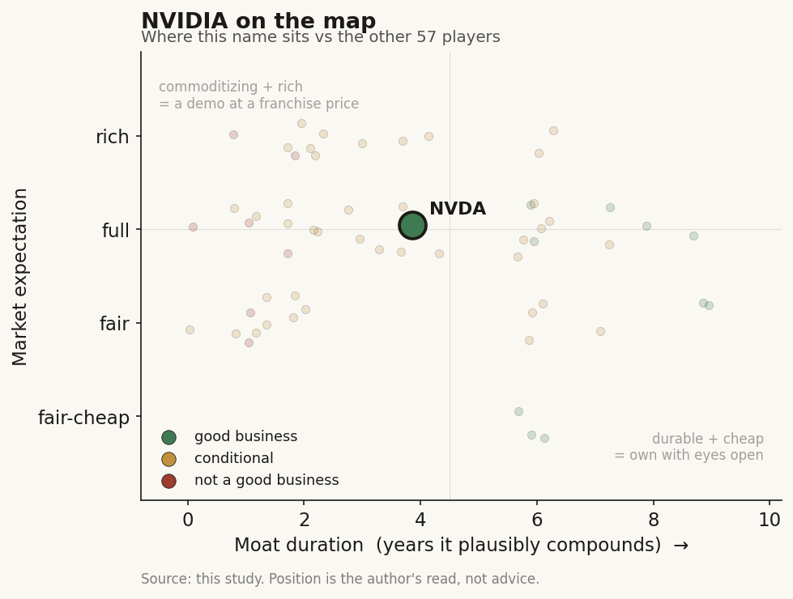

# NVIDIA (NVDA)

> **The read.** Exceptional Archetype-06 toll (~75% gross margin, ~45% FCF margin, CUDA moat) at a fair-to-full expectation; the ~30x trailing multiple is reasonable only if margins and the capex cycle hold - own it as the semis/AI-infra toll, never as a healthcare-AI name.

**Snapshot**

| | |
|---|---|
| Listing | NVDA / NASDAQ |
| Region | US |
| Value-chain layer | L9x / L0 - compute spine (GPU + CUDA + networking) |
| Archetype | infra (picks-and-shovels toll) |
| Size | ~$4.72tn market cap [reported, ~Jul 1 2026] |
| Revenue (latest) | $81.6bn, +85% YoY [Q1 FY2027] |
| Moat verdict | durable at CUDA/system level; commoditizing at chip + model-microservice level |
| Expectation | fair-to-full |
| Evidence quality | high (business/value-chain); med (expectation read) |

## What it is
The compute layer under every AI-in-healthcare story: GPUs, CUDA, and networking, with Clara (a healthcare application/SDK suite spanning imaging, genomics, and medical devices) and BioNeMo (an open drug-discovery platform for protein-structure, de-novo design, docking, and virtual screening) as the healthcare-branded on-ramps that pull life-sciences workloads onto NVIDIA silicon. Clara and BioNeMo are distribution funnels, not a reported segment.

## Business model - how it makes money
NVIDIA sells accelerated-compute systems (GPU + networking + software). Every layer above - techbio, diagnostics AI, ambient scribes, hospital imaging - pays this toll, and payment is usage-gated and reimbursement-independent (the defining trait of the infrastructure-toll archetype). Clara and BioNeMo monetize indirectly: they convert pharma/biotech R&D compute into DGX/cloud-GPU demand, and BioNeMo NIM microservices add a thin software/licensing layer on top of the silicon.

Growth quality is the picks-and-shovels version of the archetype, not the API version: ~75% gross margin at $80bn+/qtr is bimodal-high on the silicon side, and the incremental unit is capital-light for NVIDIA (fabless - TSMC carries the capex). Incremental ROIC is extreme - ~60% operating margins on a fabless base with negative-ish working-capital dynamics on prepayments; cash conversion is near-textbook (FCF ~$96.7bn on $215.9bn revenue ≈ 45% FCF margin FY26). The one asterisk is the supply chain, not NVIDIA's own books: it prepays foundry/HBM/CoWoS capacity, so inventory plus purchase commitments swing the working-capital line. The healthcare slice is immaterial to the P&L - Clara/BioNeMo revenue is not broken out and is a rounding error against $75bn/qtr Data Center, so the healthcare read is about option value and demand pull-through, not a segment number.

## Financial summary
Real numbers only. [disclosed] = company/primary; [reported] = press/secondary; [estimate] = derived.

| Metric | Q1 FY2027 [disclosed] | FY2026 (full year) [disclosed] |
|---|---|---|
| Revenue | $81.6bn, +85% YoY | $215.9bn, +65% |
| Data Center revenue | $75.2bn, +92% (Compute $60.4bn / Networking $14.8bn) | - |
| Gross margin | ~75% (GAAP/non-GAAP) | - |
| Operating income | $53.5bn GAAP (~66% op margin) | $130.4bn GAAP (~60% op margin) |
| Operating cash flow | $50.3bn | - |
| Free cash flow | $48.6bn | $96.7bn |
| Cash + marketable securities | - | $62.6bn |

Q2 FY27 guide: ~$91bn ±2% at ~75% gross margin [disclosed].

## Value-chain position and competition
NVIDIA is the L9x/L0 compute spine that sits under the entire healthcare-AI map. It is the toll every other layer pays: L9a-e drug-discovery labs (Isomorphic, Recursion, the gene-editing cohort), L5 diagnostics AI, L6 scribes, and L3/L4 sequencing all consume NVIDIA compute. What flows up: GPU cycles, CUDA libraries, BioNeMo model weights/NIMs, Clara imaging/genomics pipelines. What flows down to NVIDIA: the dollar from every training run and inference call, independent of whether the customer above ever gets a reimbursement code or clears Phase II. Value migrates upstream to the toll, and NVIDIA is the toll.

Competition splits three ways. Direct silicon: AMD (MI300/MI350 Instinct) is the only credible merchant-GPU rival but trails on software/ecosystem; Intel (Gaudi) is marginal. Vertical/custom (the real long-term threat): hyperscaler in-house ASICs - Google TPU, Amazon Trainium/Inferentia, Microsoft Maia, Meta MTIA - attack the most predictable inference workloads where CUDA lock-in matters least, with Broadcom/Marvell enabling these. The edge is CUDA plus the developer install base plus the full-rack system (GPU + NVLink + networking, now ~18% of revenue and growing 199% YoY). In healthcare specifically, BioNeMo's edge is that the open ecosystem (Chai Discovery, Boltz, Basecamp) and pharma co-labs (the NVIDIA-Lilly AI co-innovation lab [reported, 2026]) standardize the discovery stack on NVIDIA before a competitor's toolchain can. Its weakness: BioNeMo the software is exposed to the same commoditization the model layer faces - open-weights structure models (Boltz/Chai) run anywhere; the durable capture is the silicon underneath, not the model microservice.

## Moat
The toll splits inside itself - model IP commoditizes in ~1 year, while CUDA plus TSMC access does not. Mapping the four moat audits:
- **Data-flywheel: does NOT apply** - NVIDIA doesn't own the discovery data; its customers do.
- **Model IP (BioNeMo weights): REFUTED / ~1yr** - open clones (Boltz-1/2, Chai-1) match frontier structure/affinity at >1000x lower cost. Do not pay for BioNeMo as model IP.
- **The durable moat is code-ownership + ecosystem lock-in (CUDA) + scarce-input access (leading-edge TSMC/CoWoS/HBM allocation)** - the one form that compounds ~5-10yr. This is workflow ownership of a scarce input the layers above cannot cheaply replicate, wearing the "developer platform + supply allocation" costume.

Durable at the CUDA/system level; commoditizing at the discrete-chip and model-microservice level (custom-ASIC substitution is the clock). Estimated duration of the pricing-power form of the moat: ~3-5 years [estimate] before ASIC substitution plus AMD parity meaningfully compress the ~75% gross margin. The CUDA ecosystem lock lasts longer than the margin does.

## Core variables
Most inputs are noise for a healthcare-lens read (quarterly Data Center beat, China export policy, Blackwell/Rubin ramp cadence, HBM/CoWoS supply, hyperscaler capex, gross-margin trajectory, Clara/BioNeMo adoption). The core, with noise discarded:
1. **Gross-margin durability vs custom-ASIC substitution.** The whole thesis is ~75% gross margin at hyperscaler scale. The one variable that ends it is buyers routing predictable inference to in-house ASICs plus AMD reaching software parity. Watch the gross-margin guide and the Networking/system mix (the rack sell-through is the stickier, higher-moat cut).
2. **Hyperscaler + sovereign AI capex cycle (the demand denominator).** ~$75bn/qtr Data Center rests on a handful of buyers' capex plans; NVIDIA's growth is derivative of their willingness to keep spending. This is the AI-capex/GDP question, not a healthcare one.
3. **BioNeMo/Clara pull-through as demand-durability insurance** (healthcare-specific, second-order but declared) - not a revenue line, but whether pharma R&D compute becomes a structural, recurring NVIDIA workload (co-labs, autonomous-lab infra with Thermo Fisher [reported]) diversifies the buyer base away from pure hyperscaler concentration.

## Bear case / key risks
NVIDIA's healthcare exposure is demand pull-through with no reimbursement anchor and no healthcare-specific moat - Clara/BioNeMo are marketing funnels on top of general-purpose silicon. Pay a healthcare-AI multiple for a model layer whose real toll accrues to silicon and you have mispriced semis as healthcare-AI. On the core business, the bear is concentration plus substitution: (i) revenue leans on a handful of hyperscaler buyers whose capex is cyclical and who are simultaneously building the ASICs meant to replace NVIDIA on their own inference; (ii) ~75% gross margin is a peak that custom silicon plus AMD parity mechanically compress; (iii) the AI-capex cycle is the denominator - a spending pause de-rates a name priced for perpetual ~+60-90% Data Center growth; (iv) China export policy is a standing, non-modelable tail. BioNeMo the software carries the same ~1-year model-commoditization clock as every other structure-prediction tool.

## The expectation read
[reported, ~Jul 1 2026] market cap ~$4.72tn, price ~$197.58, trailing P/E ~30x. That is the tell: after the FY26/Q1-FY27 earnings surge, NVIDIA trades at only ~30x trailing - a GARP-looking multiple on a hyperscale-growth business, because earnings compounded faster than the price (1-yr +28.9%, but -11.9% in the trailing month [reported]). The market is not pricing a fragile story-stock premium; it is pricing durable-but-decelerating - it believes the ~75% gross margin and Data Center dominance hold long enough to grow into the multiple. Where the belief looks soft: ~30x embeds the assumption that margins and hyperscaler capex persist. The soft seam is (a) custom-ASIC substitution compressing gross margin faster than consensus, and (b) buyer-concentration risk in the capex denominator - if either bites, the "cheap on trailing" multiple is cheap on a peak-earnings base, which is the classic semis trap. The healthcare/Clara/BioNeMo leg contributes ~zero of the valuation and should be read as free option value, not a reason to own it.

## Verdict
Exceptional business (infrastructure-toll archetype, ~75% gross margin, ~45% FCF margin, CUDA moat) at a fair-to-full expectation - the ~30x trailing multiple is reasonable if ~75% gross margin and the capex cycle hold, and that "if" (ASIC substitution plus hyperscaler-capex concentration) is the whole debate, not the healthcare angle. Confidence: HIGH on the business-quality and value-chain read (numbers are [disclosed] primary); MEDIUM on the expectation read (multiple hinges on unforecastable margin-durability and capex-cycle calls). The Clara/BioNeMo healthcare exposure is real demand pull-through but immaterial to the P&L and carries no healthcare-specific moat - own NVDA as the semis/AI-infra toll, never as a healthcare-AI name.
