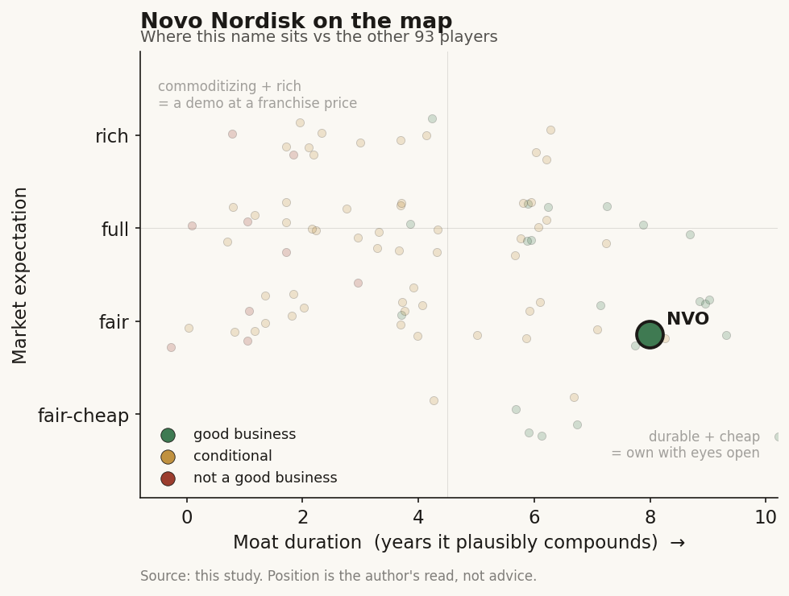

# Novo Nordisk (NVO / NYSE (Denmark))

> **The read.** The other GLP-1 mega-cap, and a textbook incumbent-funds-the-AI story: a ~DKK 309bn revenue base built on Ozempic and Wegovy pays for AI-discovery deals, an Nvidia supercomputer it does not even own, and internal AI - all of it small change against the drug franchise. The stock is a metabolic-franchise bet that has already broken (down ~75% from its 2024 peak), with AI as a cheap efficiency option bolted on, not an AI story.

**Snapshot**

| | |
|---|---|
| Listing | NVO / NYSE (ADR); B-shares on Nasdaq Copenhagen |
| Region | EU (Denmark) |
| Value-chain role | pharma incumbent - the funder / value-keeper of the drug-discovery AI chain |
| Archetype | diversified big-pharma; buys AI as tool + cheap option, owns the assets |
| Size | ~$155-160bn market cap (mid-2026) [reported]; DKK B-share value ~DKK 1,038bn at 30-Dec-25 [disclosed] |
| Revenue (latest) | FY25 DKK 309.1bn, +6% DKK / +10% CER [disclosed] |
| AI relevance | small to the P&L today; strategic optionality + internal efficiency |
| Moat verdict | strong, but the moat is franchise/scale/distribution - not AI |
| Expectation | reset - priced on a fading GLP-1 lead, not on AI |
| Evidence quality | high |

## What it is
A Danish pharmaceutical company, historically Europe's most valuable, whose actual business is metabolic health: Ozempic (GLP-1 for diabetes) and Wegovy (GLP-1 for obesity). It invented the GLP-1 obesity category and was first to market; in 2025 that franchise still drove DKK 309.1bn of sales [disclosed]. AI matters to this study not because it moves the P&L - it does not, yet - but because Novo is a clean second example of the archetype the whole case study turns on: the cash-rich incumbent that writes checks to AI labs, rents an AI supercomputer, builds internal AI, and keeps the finished drugs, the trials, and the distribution for itself. It is also the incumbent whose franchise is visibly under pressure, which sharpens the point - even a company losing share funds the AI and keeps the value.

## Business model - how it makes money
Novo sells patented injectable and oral peptides (semaglutide and successors) that it discovers, develops through its own clinical trials, manufactures at enormous scale, and distributes through its own global commercial machine. It captures value at every layer a pure-play AI lab never touches: the ~40% Phase II efficacy wall (it runs the trials), regulatory approval, the multi-year manufacturing scale-up that is the real constraint on GLP-1 supply, payer contracting, and a worldwide salesforce.

That is the key point of the case study. When Novo signs an AI-discovery deal, it structures it as **upfront + milestone + royalty**: a modest upfront, large payments only if a molecule actually advances, and Novo owns the rights to whatever comes out. The AI partner bears discovery risk and gets paid in options; Novo keeps the asset. The incumbent funds the AI and keeps the value.

- **AI as a tool, not a product.** Novo does not sell AI. It uses AI to make its own discovery and development cheaper and faster, and buys external AI capacity as staged options.
- **It does not even own its supercomputer.** Novo *rents* time on Gefion, an Nvidia DGX SuperPOD funded by the Novo Nordisk Foundation (a separate entity), not by Novo Nordisk the operating company [disclosed]. The AI infra sits off Novo's own balance sheet.
- **Capital-heavy where it counts.** The spend is trials, manufacturing (tens of billions of DKK in new plants across Denmark, the US, France, China and Brazil to meet GLP-1 demand), and commercial - not compute [disclosed].

## Financial summary
Top-line scale, with the AI/deal figures kept in proportion so the reader sees how small they are.

| Item | Figure |
|---|---|
| FY25 revenue | DKK 309.1bn, +6% DKK / +10% CER [disclosed] |
| FY25 R&D spend | DKK 52.0bn, ~16.8% of sales, +8% DKK / +10% CER [disclosed] |
| FY25 operating profit | DKK 127.7bn (-1% DKK, +6% CER) [disclosed] |
| FY25 net profit | DKK 102.4bn, +1% [disclosed] |
| FY25 gross margin | 81.0% (down from 84.7% in 2024) [disclosed] |
| Ozempic FY25 sales | DKK 127.1bn, +6% DKK / +10% CER [disclosed] |
| Obesity Care segment FY25 | DKK 82.3bn, +26% DKK / +31% CER [disclosed] |
| Growth driver | Ozempic + Wegovy (GLP-1) - the whole story [disclosed] |
| **AI deal / capex figures (kept in scale)** | |
| Valo Health collaboration | expanded Jan-2025 to up to ~$4.6bn+ across up to 20 obesity / T2D / CV programs (mostly contingent milestones) [disclosed] |
| Gefion AI supercomputer | 1,528 Nvidia H100 GPUs; multiyear access agreement (Jun-2025); Novo is a *customer*, not the owner [disclosed] |
| Gefion funding (Foundation, not Novo) | Novo Nordisk *Foundation* committed ~DKK 600m to the centre; EIFO added DKK 100m for a 15% stake in operator DCAI [disclosed] |
| Internal AI stack | AI platform on Microsoft Azure with Microsoft Research; OpenAI enterprise partnership across discovery-to-supply-chain [disclosed] |

Scale check: FY25 R&D alone (DKK 52.0bn, roughly $7.5bn+) dwarfs everything on the AI line. The Valo headline (up to ~$4.6bn) is an option ceiling spread across 20 programs over years - most of it contingent and never paid unless drugs advance; the upfront cash actually committed is a small fraction [unverified precise split]. Gefion is *rented* compute, and the machine itself was paid for by the Foundation, not the company. AI here is a strategic bet financed out of pocket change relative to the trial-and-plant budget.

## Value-chain position and competition
Novo sits at the top of the drug-discovery chain as the **funder and value-keeper**. Map the flows:

- **Money flows out** to AI labs (Valo Health, and a widening bench of platform partners) as modest upfronts + large contingent milestones + royalties.
- **AI capacity flows in** three ways: (1) **licensed platforms** - it rents Valo's Opal computational platform and real-world patient data for cardiometabolic discovery and development; (2) **rented frontier compute** - a multiyear agreement to run drug-discovery workloads (protein engineering, single-cell response models, generative molecule design, biomedical LLMs) on Gefion using Nvidia BioNeMo; (3) **internal AI** - an Azure/Microsoft Research platform for research, regulatory and trial-design use cases, plus an OpenAI enterprise partnership.
- **Finished drugs, trials, manufacturing, and distribution stay inside Novo.**

Competition for the *AI-funder* role is the other cash-rich incumbents doing the identical thing - Lilly (Isomorphic, Insilico, an owned Blackwell supercomputer, the TuneLab data platform), Novartis and J&J (both Isomorphic), and the rest. Novo is a follower here, not a leader: it rents a shared national supercomputer rather than owning one, and it has no equivalent of Lilly's proprietary TuneLab data network. The competitive fight that actually decides Novo's value, though, is not AI - it is the GLP-1 obesity market against Eli Lilly. Combined Mounjaro + Zepbound sales (~$36bn in 2025) overtook Ozempic + Wegovy, and Novo's obesity share has slipped to roughly 40% versus Lilly's ~60% [reported]. AI is a shared industry tool; the moat is the franchise, and the franchise is losing ground.

## Moat
Novo's moat is real - but it is **not** an AI moat, and it is narrower today than it was in 2024.
- **Franchise + scale + distribution - STRONG but ERODING (~5-10 yr).** Deep GLP-1 patent estate, peptide-manufacturing capacity rivals took years to match, entrenched payer/prescriber relationships, and the cash flow to fund any trial. This is what the valuation rests on - but Lilly's tirzepatide now wins on efficacy, compounded copies pressure US pricing, and share is going the wrong way. The moat is holding, not widening.
- **AI as a moat - WEAK / not the point.** The discovery models Novo licenses and runs on Gefion are commoditizing (open clones caught the AlphaFold frontier within ~a year at far lower cost). Novo's AI edge, to the extent it has one, is proprietary trial and real-world data plus the ability to run the trials AI cannot - i.e. incumbency, not algorithms. And even that is thinner than Lilly's, because the compute is rented and the flagship data platform belongs to a peer.

Net: a durable-but-eroding ~5-10-year franchise moat; AI widens the discovery funnel and buys cheap options but does not itself compound value. The incumbent's real moat is the part of the chain the AI labs cannot reach - and that part is now contested by a stronger incumbent.

## Core variables
1. **[CORE] GLP-1 franchise trajectory (Ozempic/Wegovy + CagriSema vs Lilly + orals).** This is ~everything. Volume, US pricing versus compounders, next-gen readouts (CagriSema delivered ~23% weight loss vs tirzepatide's ~25.5% in the head-to-head, a disappointment), and share against Lilly set the revenue line. Analysts model FY26 sales ~8% below FY25 [reported]. AI does not move this needle in the forecast window.
2. **[CORE] R&D productivity - does AI actually lower cost-per-approved-drug?** The whole incumbent-AI thesis. Watch whether AI-sourced molecules (Valo and others) convert milestones into real INDs and Phase progress, and whether internal AI + Gefion measurably shorten discovery. Today this is unproven at the P&L level [unverified].
3. **[CORE] Milestone conversion, not headline biobucks.** The "up to ~$4.6bn" Valo number is an option ceiling across 20 programs. What matters is cash actually paid as molecules advance - and, for Novo the payer, whether that cash buys approved assets or lapses cheaply. Either way the downside is capped and the assets are Novo's.

Below the line as noise: which specific AI lab "wins," GPU counts (Gefion's 1,528 H100s), which foundation model runs where, and the AI-narrative framing generally. For a DKK 309bn-revenue company, these are strategy line-items, not valuation drivers.

## Bear case / key risks
The bear case has almost nothing to do with AI - it has already played out in the franchise. A company that lost ~75% of its market value from the June-2024 peak did so on GLP-1 concerns, not AI: efficacy defeat to Lilly's tirzepatide, share erosion to ~40%, US pricing pressure from compounding pharmacies and drug-pricing politics, a weak CagriSema readout, and a 2026 sales line analysts expect to shrink. Any GLP-1 disappointment dwarfs anything AI could add or subtract.

On AI specifically the risk is the opposite of the pure-plays': not that Novo's AI fails, but that it *leans on a commoditizing, mostly-rented tool for narrative cover* while the real problem (a stronger competitor's better molecule) is untouched by any model - or that a licensed molecule hits the same ~40% Phase II wall everyone hits, in which case Novo simply stops paying milestones and loses only a small upfront. The AI spend is not where a Novo investor loses money.

Falsification watch: (1) further GLP-1 share erosion, a pricing shock, or a next-gen (CagriSema / oral / amycretin) setback - the actual thesis breaks here, AI irrelevant; (2) an AI-sourced Novo molecule reaches pivotal-stage success and materially re-arms the pipeline - the one path where AI stops being a rounding error; (3) Novo builds a proprietary data/compute asset rivals cannot copy (it has none today) - the only AI-specific moat worth watching, and it is currently behind Lilly's.

## The expectation read
After a ~75% drawdown to roughly $155-160bn (mid-2026), the market is no longer pricing hyper-growth - it is pricing a still-large but *decelerating* GLP-1 franchise defending share against a stronger rival, with a fading premium multiple. **Essentially none of that price is AI.** The Valo milestones, the Gefion access agreement, and the internal AI stack together commit well under 1% of annual revenue; they are financed out of free cash flow and structured so Novo's downside is a handful of small upfronts. The expectation embedded in the stock is about obesity/diabetes volume, pricing and next-gen efficacy versus Lilly - not about AI discovering the next blockbuster.

So the AI read is asymmetric and cheap, exactly as it is for Lilly: Novo pays option premiums, keeps every asset that works, and owes little if they do not. Whether AI "moves" a company this size: not in the numbers today, and not in the price. If it ever does, it shows up as *lower cost-per-approved-drug* over a decade - a slow margin tailwind, not a re-rating - and even then it does not fix the thing actually hurting the stock, which is a competitor's better drug.

## Verdict
Good business, real moat - but the moat is the metabolic franchise, scale and distribution, not AI, and that franchise is visibly eroding against Lilly. Novo is the case study's second clean illustration of the thesis, with a twist: it funds the AI (Valo milestones), rents the compute (Gefion, owned by its Foundation not itself), builds internal AI, and keeps the drugs, the trials and the value - yet it does all this from a *weaker* incumbent position than Lilly, with rented infra and no proprietary data platform. AI is a sensible, low-cost efficiency-and-optionality bet that is immaterial to the P&L and to the valuation today; the stock lives and dies on GLP-1. Confidence: HIGH on the facts (revenue, R&D, margins, Gefion terms, Valo scope, share loss all disclosed/current); HIGH on the framing (AI is a tool/option here, GLP-1 is the story); the only genuinely open question is variable 2 - whether AI ever measurably lowers cost-per-approved-drug, which is unobservable for years.
