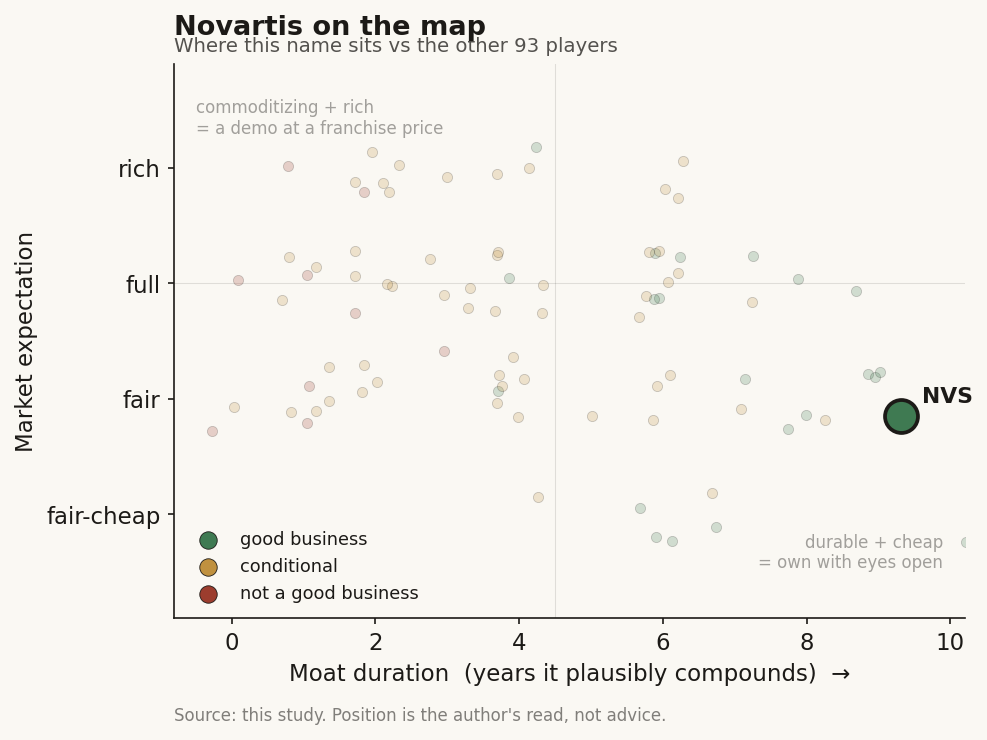

# Novartis (NVS / NYSE (Switzerland))

> **The read.** One of the deepest AI adopters among the big-pharma incumbents - four external AI-discovery deals plus a large internal data platform - and the cleanest European illustration of the study's rule: the incumbent funds the AI, structures it as cheap staged options, and keeps the drugs, the trials, and the value. At ~$293bn on ~$54.5bn of sales, AI is immaterial to the P&L. The stock is a patent-cliff-versus-pipeline bet with an AI efficiency call attached, not an AI story.

**Snapshot**

| | |
|---|---|
| Listing | NVS / NYSE (ADR); ordinary shares on SIX Swiss Exchange |
| Region | EU (Switzerland; Basel HQ) |
| Value-chain role | pharma incumbent - funder / value-keeper of the drug-discovery AI chain |
| Archetype | diversified big-pharma; buys AI as tool + cheap option, owns the assets |
| Size | ~$293bn market cap (Jun-26); ADR ~$154 (1-Jul-26) [reported] |
| Revenue (latest) | FY25 net sales $54.5bn, +8% cc [disclosed] |
| AI relevance | small to the P&L today; strategic optionality + internal R&D efficiency |
| Moat verdict | strong, but the moat is franchise / scale / distribution - not AI |
| Expectation | full - priced on the pipeline replacing the patent cliff, not on AI |
| Evidence quality | high |

## What it is
A Swiss diversified pharmaceutical company, one of the largest in the world by sales, now run as a pure-play innovative-medicines business after spinning off Sandoz (generics, 2023) and the Alcon eye-care unit (2019). Its actual business is patented small molecules and biologics across oncology, cardiovascular, immunology, and neuroscience, plus a growing radioligand-therapy franchise (Pluvicto, Lutathera). AI matters to this study not because it moves the P&L - it does not, yet - but because Novartis is among the most active incumbents signing AI-discovery deals and has built one of the deepest internal data platforms in pharma. It is a textbook version of the archetype the case study turns on: the incumbent that writes the checks to the AI labs, licenses the platforms, builds the internal capability, and keeps the finished drugs, the trials, and the distribution for itself.

## Business model - how it makes money
Novartis sells patented medicines it discovers, develops through its own clinical trials, manufactures, and distributes through its own global commercial machine. It captures value at every layer a pure-play AI lab does not touch: the ~40% Phase II efficacy wall (it runs the trials), regulatory approval, manufacturing scale-up (including the specialist supply chain for radioligand therapy), payer contracting, and a worldwide salesforce.

That is the key point of the case study. When Novartis signs an AI-discovery deal, it structures it as **milestone + royalty**: a small upfront, large payments only if a molecule actually advances, tiered royalties on sales, and Novartis owns the global rights to whatever comes out. The AI partner bears the discovery risk and gets paid in options; Novartis keeps the asset. The incumbent funds the AI and keeps the value.

- **AI as a tool, not a product.** Novartis does not sell AI. It uses AI to make its own discovery cheaper and faster, and buys external AI capacity as staged options.
- **Capital-heavy where it counts.** The spend is trials, manufacturing, business development (Avidity, Tourmaline, Myricx acquisitions in 2025-26), and commercial - not compute. Even the largest AI commitments are small next to that.

## Financial summary
Top-line scale, with the AI / deal figures kept in proportion so the reader sees how small they are.

| Item | Figure |
|---|---|
| FY25 net sales | $54.5bn, +8% cc [disclosed] |
| FY25 R&D spend | $10.02bn, ~19.9% of net sales [disclosed] |
| FY25 core operating margin | 40.1% (first time above 40%) [disclosed] |
| Market cap | ~$293bn (Jun-26); ADR ~$154 (1-Jul-26) [reported] |
| 2026 setup | first core-operating-profit decline in a decade guided; largest patent cliff in company history (Entresto ~14% of prior-year sales) [reported] |
| Growth brands | Kisqali, Kesimpta, Pluvicto, Leqvio, Scemblix - collectively +35% in 2025 [disclosed] |
| **AI deal / capex figures (kept in scale)** | |
| Isomorphic Labs | $37.5m upfront, up to $1.2bn milestones + tiered royalties, three undisclosed small-molecule targets (Jan-2024) [disclosed] |
| Generate:Biomedicines | $65m upfront (incl. $15m equity), >$1bn milestones + royalties, multi-target protein therapeutics (Sep-2024) [disclosed] |
| Schrodinger | $150m upfront, up to ~$2.3bn milestones + royalties + expanded software licence (Nov-2024) [disclosed] |
| Microsoft AI alliance | 5-year strategic partnership (from 2019), AI Innovation Lab; terms undisclosed [disclosed] |
| data42 | internal R&D data platform - 30+ years of clinical/preclinical studies, ~2m patient-years, 2,000+ studies onto one platform [disclosed] |

Scale check: the three external AI-deal milestone ceilings combined (~$4.5bn, nearly all contingent and years away) are ~8% of one year's sales - but the **cash actually committed** across those upfronts is ~$250m, under 0.5% of annual sales and ~2.5% of R&D. AI is a strategic bet financed out of pocket change, not a line item that moves the company.

## Value-chain position and competition
Novartis sits at the top of the drug-discovery chain as the **funder and value-keeper**. Map the flows:

- **Money flows out** to AI labs (Isomorphic, Generate:Biomedicines, Schrodinger) as small upfronts + large contingent milestones.
- **AI capacity flows in** two ways: (1) **licensed / partnered platforms** - it rents Isomorphic's AlphaFold-lineage engine for structure-based small-molecule design, Generate's generative-protein platform for de novo biologics, and Schrodinger's physics-based computational chemistry plus enterprise software; (2) **owned internal capability** - the Microsoft-anchored AI Innovation Lab and, most distinctively, **data42**, an in-house data lake that harmonizes 30+ years of Novartis clinical, preclinical, omics, and imaging data (~2m patient-years) so its own scientists can query safety signals and hunt indications at scale. data42 is the asset that makes Novartis a data *owner*, not just a platform tenant.
- **Finished drugs, trials, manufacturing, and distribution stay inside Novartis.**

Competition for the *AI-funder* role is the other cash-rich incumbents doing the identical thing: Lilly and J&J also signed Isomorphic (the "nearly $3bn" combined headline was Lilly + Novartis), and the same names fund Insilico, Recursion, Xaira, and peers. The competitive fight that actually decides Novartis's value, though, is not AI - it is whether the five growth brands and the pipeline (Avidity's xRNA neuromuscular assets, Pluvicto/radioligand expansion, Kisqali in early breast cancer) can outrun the 2026-28 patent cliff. AI is a shared industry tool; the moat is the franchise.

## Moat
Novartis's moat is real and wide - but it is **not** an AI moat, and that distinction is the whole point.
- **Franchise + scale + distribution - STRONG (~7-12 yr, cliff-sensitive).** Patent-protected leaders in oncology (Kisqali, Scemblix), immunology (Kesimpta), and a genuinely differentiated radioligand-therapy franchise (Pluvicto, Lutathera) whose specialist manufacturing and isotope supply chain rivals cannot quickly copy. This is what a ~$293bn valuation rests on - but its duration is shorter than Lilly's because Novartis is entering its largest patent cliff, so the moat has to be continuously re-earned through the pipeline.
- **AI as a moat - WEAK / not the point.** The discovery models Novartis licenses are commoditizing (open clones caught the AlphaFold frontier within ~a year at far lower cost). Its AI edge, to the extent it has one, is **proprietary data + owned compute + the ability to run the trials AI cannot** - i.e. incumbency, not algorithms. data42 is the most defensible AI-specific asset, and even it is a productivity aid, not a profit engine.

Net: durable-but-cliff-sensitive ~7-12-year franchise moat; AI widens the funnel and buys cheap options but does not itself compound value. The incumbent's real moat is the part of the chain the AI labs cannot reach.

## Core variables
1. **[CORE] Pipeline-versus-patent-cliff (Entresto/Promacta/Tasigna loss of exclusivity vs the five growth brands + BD).** This is ~everything. Whether Kisqali, Pluvicto, Kesimpta, Leqvio, Scemblix and the newly acquired assets can offset a ~$4bn 2026 generic hit sets the revenue line and the multiple. AI does not move this needle in the forecast window.
2. **[CORE] R&D productivity - does AI actually lower cost-per-approved-drug?** The whole incumbent-AI thesis. Watch whether AI-sourced molecules (Isomorphic/Generate/Schrodinger) convert milestones into real INDs and Phase progress, and whether data42 + the Microsoft lab measurably shorten internal discovery and de-risk trials. Today this is unproven at the P&L level [unverified].
3. **[CORE] Milestone conversion, not headline biobucks.** The "up to $1.2bn / >$1bn / $2.3bn" numbers are option ceilings. What matters is cash actually paid as molecules advance - and, for Novartis the payer, whether that cash buys approved assets or lapses cheaply. Either way the downside is capped and the assets are Novartis's.

Below the line as noise: which specific AI lab "wins," the number of external AI deals signed, and the AI-narrative framing generally. For a ~$54.5bn-sales company, these are strategy line-items, not valuation drivers.

## Bear case / key risks
The bear case has almost nothing to do with AI. It is the patent cliff: Novartis is navigating the most severe period of expiries in its history, led by Entresto (~14% of the prior year's sales), with Q1'26 already showing Entresto -42%, Promacta -66%, and Tasigna -59%, and management guiding the first core-operating-profit decline in a decade for 2026. The thesis breaks if the growth brands and the acquired pipeline fail to fill the ~$4bn hole - if a key oncology asset stumbles, if radioligand supply constrains Pluvicto, or if US drug-pricing politics (IRA Medicare negotiation) compresses the franchise. Any of those dwarfs anything AI could add or subtract.

On AI specifically the risk is the opposite of the pure-plays': not that Novartis's AI fails, but that it *over-invests in a commoditizing tool for narrative reasons* - or that a licensed molecule hits the same ~40% Phase II wall everyone hits, in which case Novartis simply stops paying milestones and loses only a small upfront. The AI spend is not where a Novartis investor loses money.

Falsification watch: (1) growth-brand or radioligand setback that widens rather than fills the patent-cliff gap - the actual thesis breaks here, AI irrelevant; (2) an AI-sourced Novartis molecule reaches pivotal-stage success and materially de-risks a franchise - the one path where AI stops being a rounding error; (3) data42 compounds into a genuine proprietary-data advantage rivals cannot copy - the only AI-specific moat worth watching.

## The expectation read
At ~$154 and ~$293bn (Jun-26; ~21x trailing earnings), the market is pricing a durable, high-margin innovative-medicines franchise that successfully **replaces its patent cliff with pipeline** - roughly a premium large-cap-pharma multiple, but with the 2026 profit dip and generic erosion already visible in guidance. **Essentially none of that price is AI.** The external AI deals commit under 0.5% of annual sales in real cash; they are financed out of free cash flow and structured so Novartis's downside is a handful of small upfronts. The expectation embedded in the stock is that the five growth brands and BD-sourced assets keep sales growing through the cliff and that the 40% core margin holds - not that AI discovers the next blockbuster.

So the AI read is asymmetric and cheap: Novartis pays option premiums, keeps every asset that works, and owes little if they do not. Whether AI "moves" a ~$293bn company: not in the numbers today, and not in the price. If it ever does, it shows up as *lower cost-per-approved-drug* and faster pipeline turns over a decade - a slow margin/replacement-rate tailwind that would help exactly the variable that matters (out-running the cliff), not a re-rating.

## Verdict
Good business, wide-but-cliff-sensitive moat - but the moat is the medicines franchise, scale, and distribution, not AI. Novartis is one of the case study's clearest illustrations of the thesis, and its European anchor: the incumbent funds the AI across four external relationships plus a deep internal data platform, structures the deals as cheap staged options, and keeps the drugs, the trials, and the value. AI is a sensible, low-cost efficiency-and-optionality bet that is immaterial to the P&L and to the ~$293bn valuation today. Confidence: HIGH on the facts (sales, R&D, margin, deal terms all disclosed and current); HIGH on the framing (AI is a tool/option here, the patent-cliff-versus-pipeline race is the story); the only genuinely open question is variable 2 - whether AI ever measurably lowers cost-per-approved-drug, which is unobservable for years.
