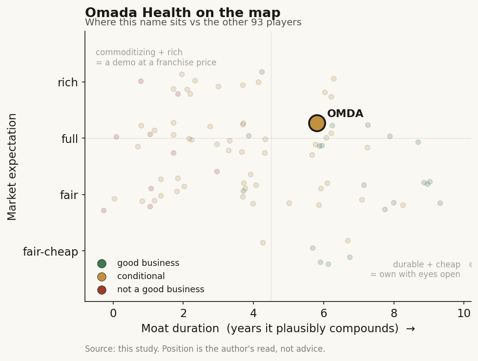

# Omada Health (OMDA / NASDAQ)

> **The read.** A real, evidence-backed chronic-care business with a genuine enterprise-distribution moat and a nine-year clinical track record - but the AI is mostly coaching-support tooling and marketing, not a cleared algorithm, so the story lives or dies on human-led behavior-change outcomes and employer contract retention, not on a model. Priced ~4x forward sales for ~25% growth that only just turned adjusted-EBITDA-positive.

**Snapshot**

| | |
|---|---|
| Listing | OMDA / Nasdaq |
| Region | US |
| Value-chain layer | consumer-telehealth - employer/payer-paid virtual chronic-care provider |
| Archetype | B2B2C care-delivery platform (behavior-change coaching + connected devices, sold to employers/plans/PBMs) |
| Size | ~$1.36bn market cap (2-Jul-26); EV ~$1.14bn |
| Revenue (latest) | Q1'26 $78m, +42% YoY; FY26 guide $322-330m (~25% midpoint) |
| Moat verdict | conditional - real distribution + evidence moat, weak product-level lock-in |
| Expectation | full |
| Evidence quality | high |

## What it is
A virtual "between-visit" healthcare provider for cardiometabolic chronic conditions - obesity/weight, prediabetes, type 2 diabetes, hypertension, high cholesterol, and (via a 2022 acquisition) musculoskeletal. Members get connected devices (scales, glucometers, BP cuffs), an app, and a human health coach or care team; the newest wrapper is a GLP-1 companion program that supports members on weight-loss drugs. Omada does not sell to consumers directly at scale - it sells the program to employers, health plans, and PBMs, who pay for their people to use it. One node, two things bolted together: a licensed-in behavior-change curriculum (its diabetes-prevention program is CDC-recognized [disclosed]) plus an enterprise-benefits distribution machine.

## Business model - how it makes money
- **Who pays.** Employers (direct or through a channel partner such as a health plan or PBM), fully-insured commercial health plans that bake Omada in as a covered benefit, PBMs routing specific therapeutic programs, and some health systems taking risk on their patients [disclosed, S-1]. The member almost never pays - this is B2B2C.
- **How it bills.** A mix of per-participant-per-month enrollment fees and performance/outcome-linked fees. Revenue scales with enrolled members, so the two levers are (1) new employer/PBM logos and (2) enrollment rate inside each existing contract. Q1'26 total members 1.02m, +51% YoY [disclosed].
- **Unit economics.** GAAP gross margin 62% in Q1'26, up from 58% a year earlier [disclosed] - device + coaching-labor cost sits in COGS, so margin expands as the coach-to-member ratio improves and hardware is amortized. Not software-grade margin; this is a services business with a tech layer.
- **Growth quality.** +42% headline in Q1'26 is flattered by the GLP-1 wave - anti-obesity-drug demand is pulling members into weight programs. Steady-state guide is ~25% (FY26 $322-330m). Adjusted EBITDA just crossed zero: +$1m in Q1'26 vs -$4m a year earlier; FY26 guide $14-20m [disclosed]. Net loss still negative (-$3m Q1'26) but narrowing.

## Financial summary

| | FY24 | FY25 | Q1'26 | FY26 guide |
|---|---|---|---|---|
| Revenue | $169.8m | $260.2m | $78m | $322-330m |
| Revenue growth | +38% | +53% | +42% YoY | ~25% midpoint |
| GAAP gross margin | - | - | 62% (vs 58% Q1'25) | - |
| Adjusted EBITDA | - | ~$5-7m [estimate] | +$1m | $14-20m |
| GAAP net loss | -$47.1m | ~-$6m TTM | -$3m | - |
| Members | - | - | 1.02m (+51%) | - |
| Cash & equivalents | - | - | $212m | - |
| Shares outstanding | - | - | 59.2m | - |

IPO 6-Jun-2025 at $19/share, ~7.9m shares, ~$150m gross, ~$1.1bn implied [reported]. Figures as of Q1'26 report + 2-Jul-2026 price ($22.85) unless tagged.

## Value-chain position and competition
Omada sits in the employer/payer-paid consumer-telehealth layer - a benefits vendor that intermediates between the self-insured employer (who wants lower medical spend) and the member (who wants to lose weight or manage a condition). It back-integrates lightly into hardware (connected devices, largely commodity/sourced) and forward into the clinical evidence + ROI reporting an employer's benefits consultant needs to justify the line item. The GLP-1 companion program is the current growth seam: it rides the anti-obesity-drug boom without taking drug-pricing risk, positioning Omada as the behavior-change layer that makes an expensive prescription "stick" and preserve lean muscle [reported: "1.8x weight loss vs control over 12 weeks" per company].

Competition:
- **Scale incumbent, Teladoc/Livongo:** the original device-plus-coaching diabetes play, now inside a much larger (and struggling) telehealth parent - broadest reach, weakest recent momentum.
- **Condition specialists, Hinge Health and Sword Health:** MSK-focused, both public, both competing for the same employer benefits wallet and RFP slot.
- **Weight/metabolic rivals, Noom, Virta, WeightWatchers Clinic, Lark:** overlap on obesity/diabetes; Noom is more consumer-direct, Virta more diabetes-reversal-clinical.
- **The GLP-1 disruptors, Hims & Hers, Ro, LifeMD, Costco/telehealth prescribers:** sell the drug plus light coaching direct-to-consumer - a different distribution model that could commoditize the "companion" layer if employers decide the pharmacy benefit already covers it.

Edge: the deepest clinical-evidence file in the category (multiple peer-reviewed studies, CDC full recognition on the DPP), 2,000+ enterprise customers, and a stated 90%+ three-year customer retention [reported] - i.e. the moat is in distribution and proof, not in a unique product a rival cannot rebuild.

## Moat
Two moats apply, and they split:
- **Enterprise distribution + evidence - REAL but narrow (~5-8 yr).** Landing 2,000+ employers/plans/PBMs and clearing their procurement, plus a decade of peer-reviewed outcomes and CDC recognition, is genuinely hard to replicate and shows up as 90%+ customer retention [reported]. Switching costs are at the buyer (employer) level - contracts, integrations, benefits-cycle inertia - not at the member level. This is the durable part.
- **Product / AI lock-in - WEAK (~0-2 yr).** The member-facing product (app + devices + coach) is replicable; connected hardware is commodity; and the AI is not a defensible cleared algorithm - it is coaching-efficiency tooling (see below). Members do not stay because leaving is costly; they stay while the employer keeps paying and while behavior-change works.

Net: the moat is being the trusted, proven benefits vendor with the distribution to reach millions - real, but it is a services-and-evidence moat, capped by RFP competition and by the risk that PBMs/pharmacies bundle the same job into the drug benefit.

## Real AI vs marketing
Mostly marketing veneer over genuine-but-modest tooling. What is actually deployed today is statistical machine learning and rules-based heuristics that segment members, score/rank intervention suggestions, and surface them to human coaches in an inbox - the coach can and does override [company-disclosed]. The 2025 "Nutritional Intelligence"/"OmadaSpark"/"Meal Map" launches add a GenAI/LLM nutrition-education agent, which is real product but is assistive content generation, not a clinical decision engine. Crucially: no FDA-cleared algorithm, no diagnostic model, no image-recognition-in-production claim that gates revenue. Omada itself frames generative AI and deep learning as things it "plans to" leverage to support "human-led care teams," and its own outcome data credits human coaches (coaching delivers ~2x the weight loss of automation alone). So AI here is an efficiency/margin lever on a labor-heavy coaching business, not the product and not the moat. Treat "AI-enabled chronic care" as accurate-but-generous framing, closer to CRM-with-ML than to a cleared medical algorithm.

## Core variables
1. **Employer/PBM contract growth AND net retention.** The whole model is logos x enrollment. Watch member growth decomposition (how much is GLP-1 pull vs core), the 90%+ retention holding, and whether large PBM channels (e.g. the Optum Rx weight portfolio tie-up) turn into durable enrolled-member flow rather than one-time announcements.
2. **GLP-1 companion attach vs disintermediation.** The drug wave is the growth engine now. The bull case: Omada becomes the behavior-change layer every GLP-1 script needs. The bear: pharmacies/PBMs and direct-to-consumer prescribers (Hims, Ro) absorb the coaching into the drug benefit and Omada's "companion" becomes a commoditized add-on. This variable could swing growth either way within 12-24 months.
3. **Path to real profit vs coaching-labor cost.** Gross margin (62%) and adjusted EBITDA (just +$1m) are inflecting, but this is a services business - scaling members scales coaches. Does AI tooling actually lift coach productivity enough to reach durable GAAP profit, or does labor cost cap the margin? FY26 adj-EBITDA guide $14-20m is the test.

Below the line as noise: individual product launches (Meal Map etc.); quarter-to-quarter member adds; the "AI platform" framing.

## Bear case / key risks
A profitable-adjacent services company being valued as a tech platform. Gross margin is 62% (services + hardware), not software; the business only just crossed adjusted-EBITDA breakeven and is still GAAP-loss-making; and the headline growth is being pulled by a GLP-1 drug cycle that Omada does not control and that its own channel partners (PBMs, pharmacies) could bundle away. The AI is efficiency tooling, not a cleared, defensible algorithm - so there is no model-based moat to fall back on if enterprise competition (Hinge, Sword, Teladoc, Noom, Virta) compresses pricing in the annual benefits RFP. Member-level switching cost is low; the moat is at the employer contract, which is exactly where budget-conscious benefits buyers negotiate hardest in a soft economy. Concentration and re-contracting risk in a few large PBM/plan channels can turn a growth quarter into a guide-down.

Falsification watch: (1) customer retention slips below ~90% or a marquee PBM channel underdelivers enrolled members - the distribution moat cracks; (2) GLP-1 prescribers/PBMs absorb the coaching layer and companion-program growth stalls; (3) adjusted EBITDA fails to march toward the $14-20m guide because coaching labor scales with members - proving this is a margin-capped services business, not a platform.

## The expectation read
Shares $22.85, market cap ~$1.36bn, EV ~$1.14bn, 59.2m shares (2-Jul-26). That is ~4x EV / FY26E sales ($322-330m) for ~25% guided growth and thin (just-positive) adjusted EBITDA - below the ~6x post-IPO froth and below software comps, but not cheap for a 62%-gross-margin services model. The multiple implies the market is paying for (a) durable ~25% growth carried by the GLP-1 wave, (b) the distribution-and-evidence moat holding retention above 90%, and (c) the adjusted-EBITDA inflection continuing toward real profit. It is NOT paying a big premium for an AI moat - and correctly so, because there is not one to pay for.

Where the belief looks soft: growth leans on a drug cycle Omada does not own, the coaching-labor cost structure caps margin, and the same channel partners driving today's growth are the parties most able to disintermediate the companion program tomorrow. The valuation is fair-to-full rather than cheap: reasonable if you believe Omada is the proven, sticky benefits vendor of record; demanding if the GLP-1 companion turns out to be a commoditized feature.

## Verdict
Good business, conditional. Real evidence, real CDC-recognized clinical track record, real enterprise distribution, and a genuine (if early) profitability inflection - but the moat is services-and-distribution, not product or AI, and the growth is riding a GLP-1 drug wave its own channel partners could bundle away. Priced full-not-cheap at ~4x forward sales. The honest line on AI: it is a coaching-efficiency tool and a marketing frame, not a cleared algorithm or a moat - so underwrite the human-led outcomes and the employer contracts, not the model. Confidence: HIGH on the facts (revenue, margin, members, cash, valuation, IPO all disclosed/current); MEDIUM on the verdict, which hinges on two unresolved rate-of-change variables - GLP-1 companion durability and the coaching-labor margin ceiling - that could break either way.
